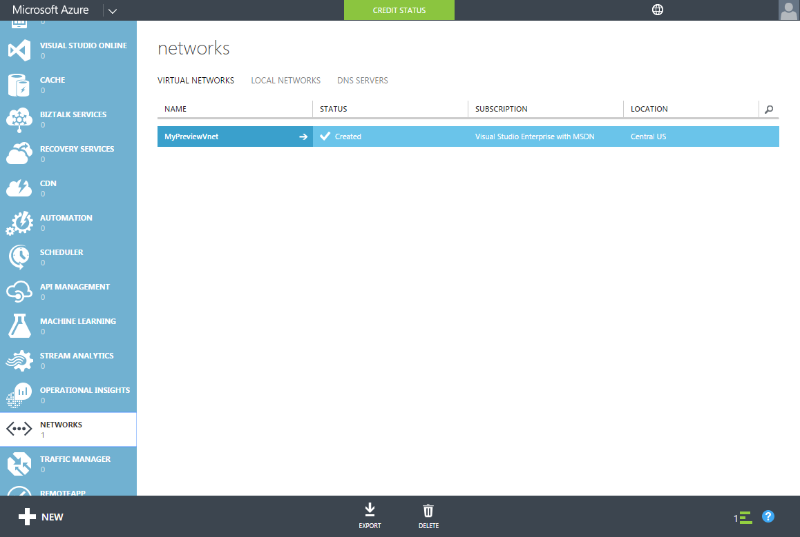
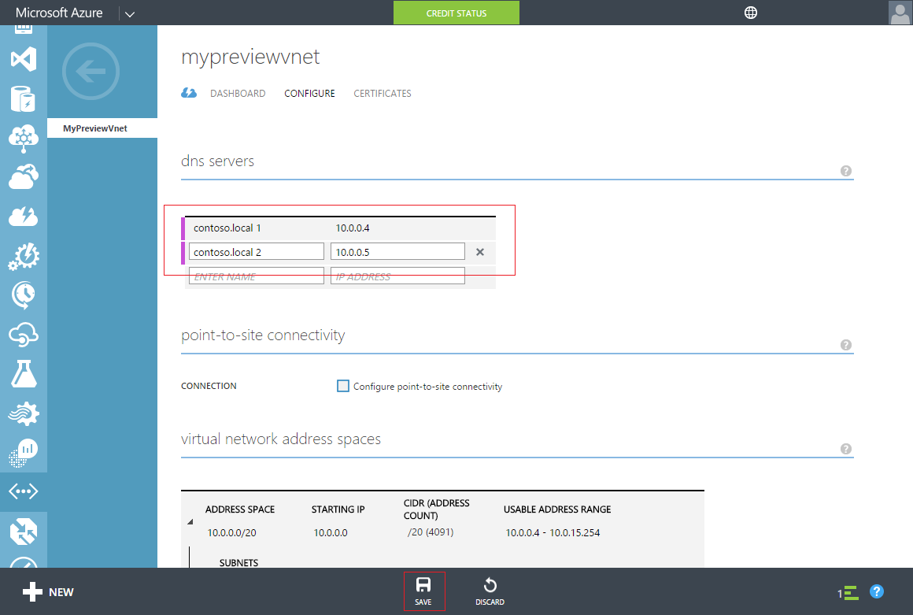

<properties
    pageTitle="Azure AD Domain Services: DNS-instellingen bijwerken voor het virtuele Azure-netwerk | Microsoft Azure"
    description="Aan de slag met Azure Active Directory Domain Services (Preview)"
    services="active-directory-ds"
    documentationCenter=""
    authors="mahesh-unnikrishnan"
    manager="stevenpo"
    editor="curtand"/>

<tags
    ms.service="active-directory-ds"
    ms.workload="identity"
    ms.tgt_pltfrm="na"
    ms.devlang="na"
    ms.topic="get-started-article"
    ms.date="07/06/2016"
    ms.author="maheshu"/>

# Azure AD Domain Services *(Preview)*: DNS-instellingen bijwerken voor het virtuele Azure-netwerk

## Taak 4: DNS-instellingen bijwerken voor het virtuele Azure-netwerk
Nu u Azure AD Domain Services hebt ingeschakeld voor uw directory, moet u er nog voor zorgen dat computers in het virtuele netwerk verbinding kunnen maken met deze services en deze kunnen gebruiken. Hiervoor moet u de DNS-serverinstellingen voor het virtuele netwerk zo bijwerken dat deze verwijzen naar de IP-adressen waarop Azure AD Domain Services beschikbaar is op het virtuele netwerk.

> [AZURE.NOTE] Noteer de IP-adressen voor Azure AD Domain Services die worden weergegeven op het tabblad **Configureren** van uw directory nadat u Azure AD Domain Services hebt ingeschakeld voor de directory.

Voer de volgende configuratiestappen uit om de DNS-serverinstellingen bij te werken voor het virtuele netwerk waarin u Azure AD Domain Services hebt ingeschakeld.

1. Ga naar de **klassieke Azure-portal** ([https://manage.windowsazure.com](https://manage.windowsazure.com)).

2. Selecteer het knooppunt **Netwerken** in het linkerdeelvenster.

    

3. Selecteer op het tabblad **Virtuele netwerken** het virtuele netwerk waarin u Azure AD Domain Services hebt ingeschakeld om de eigenschappen te bekijken.

4. Klik op het tabblad **Configureren**.

    

5. Geef in de sectie **DNS-servers** de IP-adressen van Azure AD Domain Services op.

6. Zorg ervoor dat u beide IP-adressen opgeeft die werden weergegeven in de sectie **Domeinservices** op het tabblad **Configureren** van uw directory.

7. Klik op **Opslaan** in het taakvenster onder aan de pagina om de DNS-serverinstellingen voor dit virtuele netwerk op te slaan.

   

> [AZURE.NOTE] Wanneer u de DNS-serverinstellingen voor het virtuele netwerk hebt bijgewerkt, kan het enige tijd duren voordat de bijgewerkte DNS-configuratie is doorgevoerd in de virtuele machines in het netwerk. Als een virtuele machine geen verbinding kan maken met het domein, kunt u de DNS-cache leegmaken (bijvoorbeeld ipconfig/flushdns) op de virtuele machine om het vernieuwen van de DNS-instellingen op de virtuele machine af te dwingen.

## Taak 5: wachtwoordsynchronisatie inschakelen voor Azure AD Domain Services
Voor de volgende configuratietaak moet u [wachtwoordsynchronisatie inschakelen voor Azure AD Domain Services](active-directory-ds-getting-started-password-sync.md).

<!--HONumber=ago16_HO4-->

