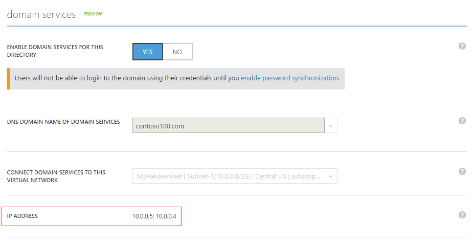

<properties
    pageTitle="Azure Active Directory Domain Services preview: Getting Started | Microsoft Azure"
    description="Getting started with Azure Active Directory Domain Services"
    services="active-directory-ds"
    documentationCenter=""
    authors="mahesh-unnikrishnan"
    manager="udayh"
    editor="inhenk"/>

<tags
    ms.service="active-directory-ds"
    ms.workload="identity"
    ms.tgt_pltfrm="na"
    ms.devlang="na"
    ms.topic="article"
    ms.date="10/16/2015"
    ms.author="maheshu"/>

# Azure AD Domain Services *(Preview)* - Getting started

## Step 3: Enable Azure AD Domain Services
In this step you can enable Azure AD Domain Services for your directory. Perform the following configuration steps in order to enable Azure AD Domain Services for your directory.

1. Navigate to the **Azure management portal** ([https://manage.windowsazure.com](https://manage.windowsazure.com)).
2. Select the **Active Directory** node on the left pane.
3. Select the Azure AD tenant (directory) for which you would like to enable Azure AD Domain Services.

    

4. Click on the **Configure** tab.

    

5. Scroll down to a section titled **domain services**.

    

6. Toggle the option titled **Enable domain services for this directory** to **YES**. You will notice a few more configuration options for Azure AD Domain services appear on the page.

    

    > [AZURE.NOTE] When you enable Azure AD Domain Services for your tenant, Azure AD will generate and store the Kerberos and NTLM credential hashes that are required for authenticating users.

7. Specify the **DNS domain name of domain services**.
   - The default domain name of the directory (i.e. ending with the **.onmicrosoft.com** domain suffix) will be selected by default.
   - The list contains all domains that have been configured for your Azure AD directory – including verified as well as unverified domains that you configure in the ‘Domains’ tab.
   - Additionally, you can also add a custom domain name to this list by typing it in.

     > [AZURE.WARNING] Ensure that the domain prefix of the domain name you specify (eg. 'contoso' in the 'contoso.local' domain name) is less than 15 characters. You cannot create an Azure AD Domain Services domain with a domain prefix longer than 15 characters.

8. The next step is to select a virtual network in which you'd like Azure AD Domain Services to be available. Select the virtual network you just created in the drop-down titled **Connect domain services to this virtual network**.
   - Ensure that the virtual network you have specified belongs to an Azure region supported by Azure AD Domain Services.
   - Refer to the [regions page](active-directory-ds-regions.md) to see the list of supported Azure regions.

9. When you are done selecting the above options, click **Save** from the task pane at the bottom of the page to enable Azure AD Domain Services.
10. The page will display a ‘Pending …’ state, while Azure AD Domain Services is being enabled for your directory.

    

    > [AZURE.NOTE] Azure AD Domain Services provides high availability for your managed domain. When you first enable Azure AD Domain Services for your domain, you will notice the IP addresses at which Domain Services are available on the virtual network show up one by one. The second IP address will be displayed shortly, as soon the service enables high availability for your domain. When high availability is configured and active for your domain, you should see two IP addresses in the **domain services** section of the **Configure** tab.

11. After about 20-30 minutes, you will see the first IP address at which Domain Services is available on your virtual network in the **IP address** field on the **Configure** page.

    

12. When high availability is operational for your domain, you will see two IP addresses displayed on the page. These are the IP addresses at which Azure AD Domain Services will be available on your selected virtual network. Note down these IP addresses so you can update the DNS settings for your virtual network. This step enables virtual machines on the virtual network to connect to the domain for operations such as domain join.

    

> [AZURE.NOTE] Depending on the size of your Azure AD directory (number of users, groups etc.), it will take a while for the contents of the directory to be available in Azure AD Domain Services. This synchronization process happens in the background. For large directories with tens of thousands of objects, it may take a day or two for all users, group memberships and credentials to be synchronized and available in Azure AD Domain Services.

---
[**Next step - Update DNS settings for the Azure virtual network.**](active-directory-ds-getting-started-dns.md)

