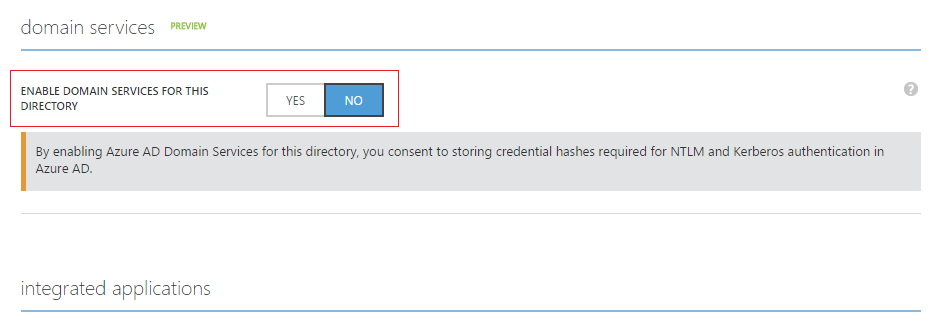
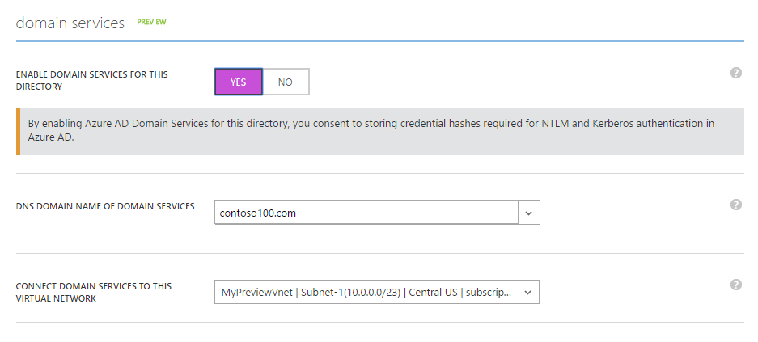
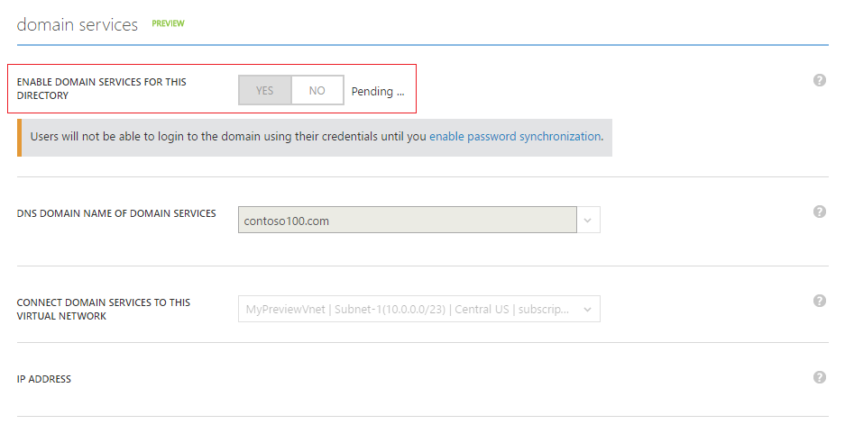

<properties
    pageTitle="Azure AD Domain Services: Azure AD Domain Services inschakelen | Microsoft Azure"
    description="Aan de slag met Azure Active Directory Domain Services (Preview)"
    services="active-directory-ds"
    documentationCenter=""
    authors="mahesh-unnikrishnan"
    manager="stevenpo"
    editor="curtand"/>

<tags
    ms.service="active-directory-ds"
    ms.workload="identity"
    ms.tgt_pltfrm="na"
    ms.devlang="na"
    ms.topic="get-started-article"
    ms.date="07/06/2016"
    ms.author="maheshu"/>

# Azure AD Domain Services *(Preview)* - Azure AD Domain Services inschakelen

## Taak 3: Azure AD Domain Services inschakelen
In deze taak schakelt u Azure AD Domain Services in voor uw directory. Voer de volgende configuratiestappen uit om Azure AD Domain Services in te schakelen voor uw directory.

1. Ga naar de **klassieke Azure-portal** ([https://manage.windowsazure.com](https://manage.windowsazure.com)).

2. Selecteer het knooppunt **Active Directory** in het linkerdeelvenster.

3. Selecteer de Azure AD-tenant (directory) waarvoor u Azure AD Domain Services wilt inschakelen.

    

4. Klik op het tabblad **Configureren**.

    

5. Blader omlaag naar de sectie **Domeinservices**.

    

6. Stel de optie **Domeinservices inschakelen voor deze directory** in op **Ja**. Er verschijnen nu nog een paar configuratieopties voor Azure AD Domain Services op de pagina.

    

    > [AZURE.NOTE] Wanneer u Azure AD Domain Services inschakelt voor uw tenant, worden de referentie-hashes van Kerberos en NTLM die nodig zijn voor de verificatie van gebruikers, gegenereerd en opgeslagen door Azure AD.

7. Geef de **DNS-domeinnaam van domeinservices** op.

   - De standaarddomeinnaam van de directory (die eindigt met het domeinachtervoegsel **. onmicrosoft.com**) wordt standaard geselecteerd.

   - De lijst bevat alle domeinen die zijn geconfigureerd voor uw Azure AD-directory, inclusief de geverifieerde en niet-geverifieerde domeinen die u configureert op het tabblad Domeinen.

   - Daarnaast kunt u een aangepaste domeinnaam aan deze lijst toevoegen door deze te typen. In dit voorbeeld hebben we de aangepaste domeinnaam contoso100.com getypt

     > [AZURE.WARNING] Zorg ervoor dat het domeinvoorvoegsel van de domeinnaam die u opgeeft (bijvoorbeeld contoso100 in de domeinnaam contoso100.com) minder is dan 15 tekens. U kunt geen Azure AD Domain Services-domein maken met een domeinvoorvoegsel dat langer is dan 15 tekens.

8. De volgende stap bestaat uit het selecteren van een virtueel netwerk waarin Azure AD Domain Services beschikbaar moet zijn. Selecteer het virtuele netwerk dat u net hebt gemaakt in de vervolgkeuzelijst **Domeinservices verbinden met dit virtuele netwerk**.

   - Controleer of het virtuele netwerk dat u hebt opgegeven, deel uitmaakt van een Azure-regio die wordt ondersteund door Azure AD Domain Services.

   - Raadpleeg de pagina [Azure-services per regio](https://azure.microsoft.com/regions/#services/) pagina om te bekijken in welke Azure-regio's Azure AD Domain Services beschikbaar zijn.

   - Virtuele netwerken die bij een regio horen waarin Azure AD Domain Services niet wordt ondersteund, worden niet weergegeven in de vervolgkeuzelijst.

   - Virtuele netwerken die zijn gemaakt met Azure Resource Manager (virtuele netwerken op basis van ARM), worden ook niet weergegeven in de vervolgkeuzelijst. Dit komt doordat virtuele netwerken op basis van ARM momenteel niet worden ondersteund door Azure AD Domain Services.

9. Controleer of de DNS-domeinnaam die u hebt gekozen voor het beheerde domein, nog niet bestaat in het virtuele netwerk. Dit kan gebeuren in een van de volgende scenario's:

   - Als het virtuele netwerk al een domein met dezelfde DNS-domeinnaam bevat.

   - Als het virtuele netwerk dat u hebt geselecteerd, een VPN-verbinding heeft met uw on-premises netwerk en u een domein met dezelfde DNS-domeinnaam hebt op uw on-premises netwerk.

   - Als het virtuele netwerk een bestaande cloudservice met deze naam bevat.

10. Wanneer u klaar bent met het selecteren van de bovenstaande opties, klikt u op **Opslaan** in het taakvenster onder aan deze pagina om Azure AD Domain Services in te schakelen.

11. Op de pagina wordt de status In behandeling... weergegeven, terwijl Azure AD Domain Services wordt ingeschakeld voor uw directory.

    

    > [AZURE.NOTE] Azure AD Domain Services zorgt voor maximale beschikbaarheid voor uw beheerde domein. Wanneer u Azure AD Domain Services voor het eerst inschakelt voor uw domein, ziet u dat de IP-adressen waarop Domain Services beschikbaar zijn, een voor een worden weergegeven in het virtuele netwerk. Het tweede IP-adres wordt kort weergegeven zodra maximale beschikbaarheid is ingeschakeld voor uw domein. Wanneer maximale beschikbaarheid is geconfigureerd en actief is voor uw domein, ziet u twee IP-adressen in de sectie **Domeinservices** van het tabblad **Configureren**.

12. Na ongeveer 20-30 minuten ziet u het eerste IP-adres waarop Domain Services beschikbaar is in het virtuele netwerk in het veld **IP-adres** op de pagina **Configureren**.

    

13. Wanneer maximale beschikbaarheid is ingeschakeld voor uw domein, ziet u twee IP-adressen op de pagina. Dit zijn de IP-adressen waarop Azure AD Domain Services beschikbaar zullen zijn in het geselecteerde virtuele netwerk. Noteer deze IP-adressen zodat u de DNS-instellingen voor het virtuele netwerk kunt bijwerken. In deze stap kunnen virtuele machines in het virtuele netwerk verbinding maken met het domein voor bewerkingen, zoals het koppelen van domeinen.

    

> [AZURE.NOTE] Afhankelijk van de grootte van uw Azure AD-directory (aantal gebruikers, groepen enzovoort), kan het enige tijd duren voordat de inhoud van de directory beschikbaar is in Azure AD Domain Services. Dit synchronisatieproces wordt op de achtergrond uitgevoerd. Bij grote mappen met tienduizenden objecten kan het een dag of twee duren voordat alle gebruikers, groepslidmaatschappen en referenties zijn gesynchroniseerd en beschikbaar zijn in Azure AD Domain Services.

 

## Taak 4: DNS-instellingen bijwerken voor het virtuele Azure-netwerk
De volgende configuratietaak bestaat uit het [bijwerken van de DNS-instellingen voor het virtuele netwerk van Azure](active-directory-ds-getting-started-dns.md).

<!--HONumber=ago16_HO4-->

