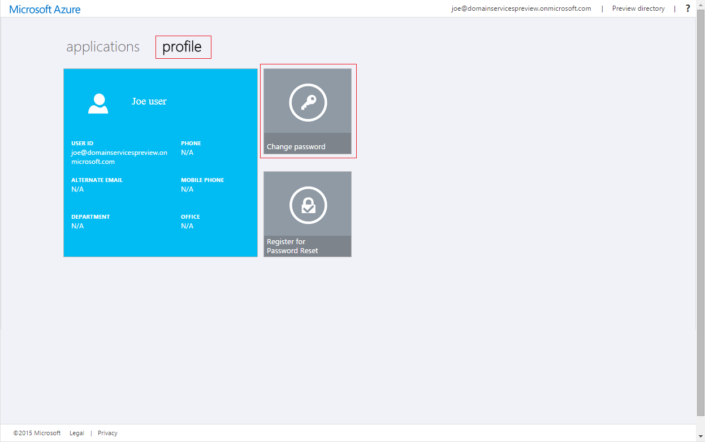
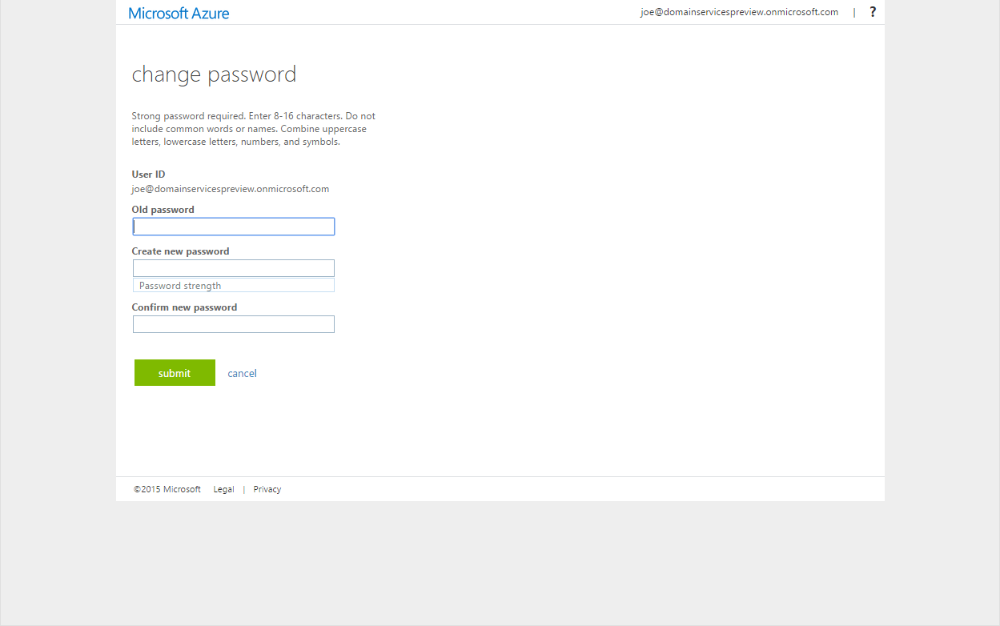

<properties
    pageTitle="Azure AD Domain Services: wachtwoordsynchronisatie inschakelen | Microsoft Azure"
    description="Aan de slag met Azure Active Directory Domain Services"
    services="active-directory-ds"
    documentationCenter=""
    authors="mahesh-unnikrishnan"
    manager="stevenpo"
    editor="curtand"/>

<tags
    ms.service="active-directory-ds"
    ms.workload="identity"
    ms.tgt_pltfrm="na"
    ms.devlang="na"
    ms.topic="get-started-article"
    ms.date="04/25/2016"
    ms.author="maheshu"/>

# Azure AD Domain Services *(Preview)* - wachtwoordsynchronisatie met Azure AD Domain Services inschakelen

## Taak 5: wachtwoordsynchronisatie met AAD Domain Services inschakelen voor een Azure AD-directory die zich alleen in de cloud bevindt
Wanneer u Azure AD Domain Services hebt ingeschakeld voor uw Azure AD-tenant, bestaat de volgende taak uit het inschakelen van referenties om te synchroniseren met Azure AD Domain Services. Hierdoor kunnen gebruikers zich aanmelden bij het beheerde domein met hun bedrijfsreferenties.

De vereiste stappen verschillen, afhankelijk van of uw organisatie een Azure AD-directory in de cloud heeft of kan synchroniseren met uw on-premises directory via Azure AD Connect.

 

> [AZURE.SELECTOR]
- [Azure AD-directory in de cloud](active-directory-ds-getting-started-password-sync.md)
- [Gesynchroniseerde Azure AD-directory](active-directory-ds-getting-started-password-sync-synced-tenant.md)

 

### NTLM en het genereren van hashes voor Kerberos-referenties inschakelen voor een Azure AD-directory in de cloud
Als uw organisatie een Azure AD-directory in de cloud heeft, moeten gebruikers die Azure AD Domain Services willen gebruiken, hun wachtwoord wijzigen. Door deze wachtwoordwijziging worden de referentie-hashes die door Azure AD Domain Services zijn vereist voor Kerberos- en NTLM-verificatie, gegenereerd in Azure AD. U kunt wachtwoorden laten verlopen voor alle gebruikers in de tenant die Azure AD Domain Services moeten gebruiken of aan deze gebruikers doorgeven dat ze hun wachtwoord moeten wijzigen.

Hier vindt u instructies over het wijzigen van het wachtwoord die u moet doorgeven aan eindgebruikers:

1. Ga naar de pagina Azure AD-toegangsvenster voor uw organisatie. Deze bevindt zich normaal gesproken op [http://myapps.microsoft.com](http://myapps.microsoft.com).

2. Selecteer het tabblad **Profiel** op deze pagina.

3. Klik op de tegel **Wachtwoord wijzigen** op deze pagina om een wachtwoordwijziging te initiëren.

    

4. Hierdoor wordt de pagina **Wachtwoord wijzigen** geopend. Gebruikers kunnen hun bestaande (oude) wachtwoord invoeren en doorgaan om hun wachtwoord te wijzigen.

    

Wanneer gebruikers hun wachtwoord hebben gewijzigd, kunnen ze al snel het nieuwe wachtwoord gebruiken in Azure AD-domein Services. Gebruikers kunnen zich na een paar minuten met hun gewijzigde wachtwoord aanmelden bij computers die zijn gekoppeld aan het beheerde domein.

 

## Gerelateerde inhoud

- [Wachtwoordsynchronisatie met AAD Domain Services inschakelen voor een gesynchroniseerde Azure AD-directory](active-directory-ds-getting-started-password-sync-synced-tenant.md)

- [Een beheerd domein van Azure AD Domain Services beheren](active-directory-ds-admin-guide-administer-domain.md)

- [Een virtuele Windows-computer toevoegen aan een beheerd domein van Azure AD Domain Services](active-directory-ds-admin-guide-join-windows-vm.md)

- [Een virtuele Red Hat Enterprise Linux-computer toevoegen aan een beheerd domein van Azure AD Domain Services](active-directory-ds-admin-guide-join-rhel-linux-vm.md)

<!--HONumber=Jun16_HO2-->

