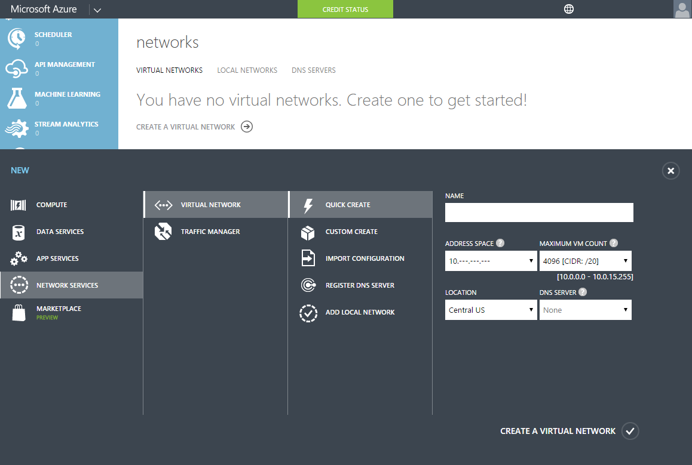
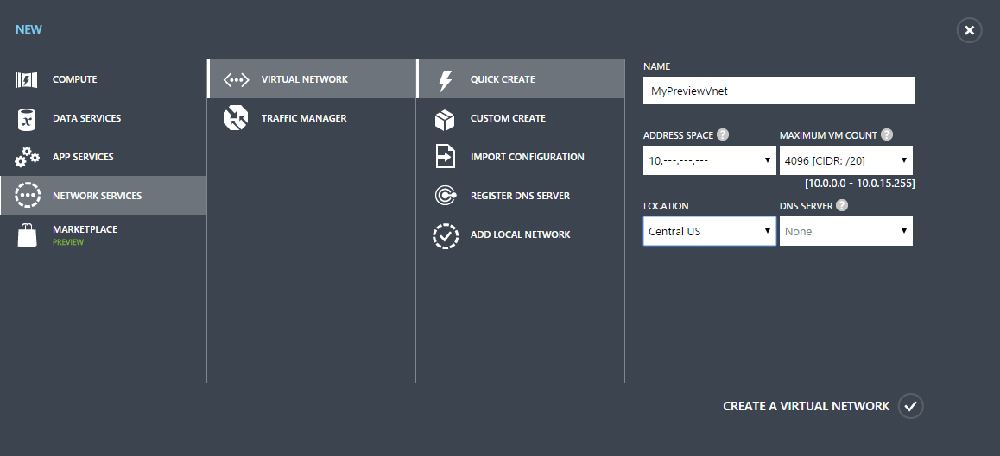

<properties
    pageTitle="Azure AD Domain Services: een virtueel netwerk maken of selecteren | Microsoft Azure"
    description="Aan de slag met Azure Active Directory Domain Services (Preview)"
    services="active-directory-ds"
    documentationCenter=""
    authors="mahesh-unnikrishnan"
    manager="stevenpo"
    editor="curtand"/>

<tags
    ms.service="active-directory-ds"
    ms.workload="identity"
    ms.tgt_pltfrm="na"
    ms.devlang="na"
    ms.topic="get-started-article"
    ms.date="07/06/2016"
    ms.author="maheshu"/>

# Azure AD Domain Services *(Preview)* - een virtueel netwerk maken of selecteren

## Richtlijnen voor het selecteren van een virtueel netwerk van Azure
Houd rekening met de volgende richtlijnen wanneer u een virtueel netwerk selecteert voor gebruik met Azure AD Domain Services:

- Selecteer een virtueel netwerk in een regio die wordt ondersteund door Azure AD Domain Services. Zie de pagina [Azure-services per regio](https://azure.microsoft.com/regions/#services/) pagina om te bekijken in welke Azure-regio's Azure AD Domain Services beschikbaar zijn.

- Als u een bestaand virtueel netwerk wilt gebruiken, controleert u of dit een regionaal virtueel netwerk is. Virtuele netwerken die gebruikmaken van de verouderde mechanisme met affiniteitsgroepen, kunnen niet worden gebruikt met Azure AD Domain Services. U moet [verouderde virtuele netwerken migreren naar regionale virtuele netwerken](../virtual-network/virtual-networks-migrate-to-regional-vnet.md).

- Als u een bestaand virtueel netwerk wilt gebruiken, controleert u of er geen aangepaste DNS-servers zijn geconfigureerd voor het virtuele netwerk. Azure AD Domain Services biedt geen ondersteuning voor aangepaste DNS-servers of BYO-servers (Bring Your Own).

- Als u een bestaand virtueel netwerk wilt gebruiken, zorgt u ervoor dat er geen bestaand domein met dezelfde domeinnaam beschikbaar is op dit virtuele netwerk. Het domein met de naam contoso.com is bijvoorbeeld al beschikbaar op het geselecteerde virtuele netwerk. Vervolgens wilt u een beheerd domein van Azure AD Domain Services inschakelen dat dezelfde domeinnaam (contoso.com) heeft in dit virtuele netwerk. Er treedt een fout op wanneer u Azure AD Domain Services wilt inschakelen. Dit komt door naamconflicten voor de domeinnaam op dit virtuele netwerk. In dit geval moet u een andere naam gebruiken om het beheerde domein van Azure AD Domain Services in te stellen. U kunt ook de inrichting van het bestaande domein ongedaan maken en doorgaan met het inschakelen van Azure AD Domain Services.

- Selecteer het virtuele netwerk dat momenteel fungeert als host of als host gaat fungeren voor virtuele machines die toegang nodig hebben tot Azure AD Domain Services. U kunt Domain Services niet meer naar een ander virtueel netwerk verplaatsen wanneer u de service hebt ingeschakeld.

- Azure AD Domain Services worden niet ondersteund door virtuele netwerken die zijn gemaakt met Azure Resource Manager. U kunt [een klassiek virtueel netwerk verbinden met een virtueel netwerk op basis van ARM](../vpn-gateway/virtual-networks-configure-vnet-to-vnet-connection.md) om Azure AD Domain Services te gebruiken in een virtueel netwerk dat is gemaakt met Azure Resource Manager.

## Taak 2: een virtueel netwerk van Azure maken
De volgende configuratietaak bestaat uit het maken van een virtueel Azure-netwerk waarin u Azure AD Domain Services wilt inschakelen. Als u al een bestaand virtueel netwerk hebt dat u wilt gebruiken, kunt u deze stap overslaan.

> [AZURE.NOTE] Controleer of het virtuele netwerk van Azure dat u maakt of wilt gebruiken met Azure AD Domain Services, deel uitmaakt van een Azure-regio die wordt ondersteund door Azure AD Domain Services. Zie de pagina [Azure-services per regio](https://azure.microsoft.com/regions/#services/) pagina om te bekijken in welke Azure-regio's Azure AD Domain Services beschikbaar zijn.

Noteer de naam van het virtuele netwerk, zodat u het juiste virtuele netwerk selecteert wanneer u Azure AD Domain Services inschakelt in een volgende configuratiestap.

Voer de volgende configuratiestappen uit om een Azure-netwerk te maken waarin u Azure AD Domain Services wilt inschakelen.

1. Navigeer naar de **klassieke Azure-portal** ([https://manage.windowsazure.com](https://manage.windowsazure.com)).

2. Selecteer het knooppunt **Netwerken** in het linkerdeelvenster.

3. Klik op **Nieuw** in het taakvenster onder aan de pagina.

    

4. Selecteer bij het knooppunt **Netwerkservices** de optie **Virtueel netwerk**.

5. Klik op **Snel maken** om een virtueel netwerk te maken.

    

6. Geef een **Naam** op voor het virtuele netwerk. U kunt ook de **Adresruimte** of het **Maximum aantal VM's** opgeven voor dit netwerk. U kunt de DNS-serverinstelling voorlopig op Geen laten staan. Deze instelling wordt bijgewerkt nadat u Azure AD Domain Services hebt ingeschakeld.

7. Zorg ervoor dat u een ondersteunde Azure-regio selecteert in de vervolgkeuzelijst **Locatie**. Zie de pagina [Azure-services per regio](https://azure.microsoft.com/regions/#services/) pagina om te bekijken in welke Azure-regio's Azure AD Domain Services beschikbaar zijn. Dit is een belangrijke stap. Als u een virtueel netwerk selecteert in een Azure-regio die niet wordt ondersteund door Azure AD Domain Services, kunt u de service niet inschakelen in dit virtuele netwerk.

8. Klik op de knop **Een virtueel netwerk maken** om het virtuele netwerk te maken.

    

 

## Taak 3: Azure AD Domain Services inschakelen
Bij de volgende configuratietaak gaat u [Azure AD Domain Services inschakelen](active-directory-ds-getting-started-enableaadds.md).

<!--HONumber=ago16_HO4-->

