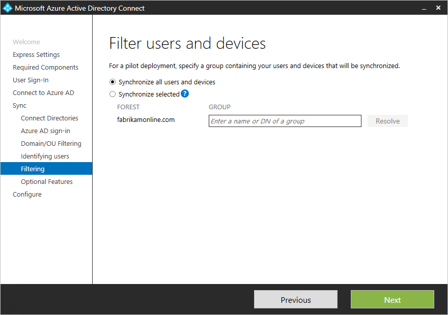
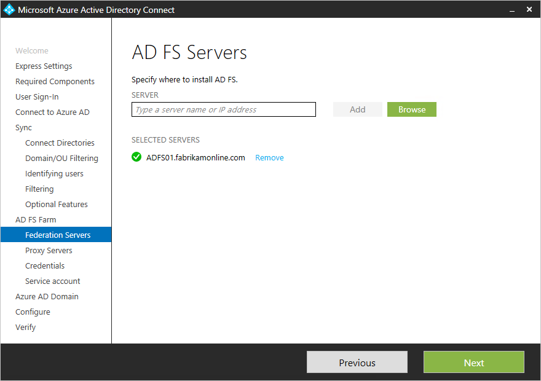
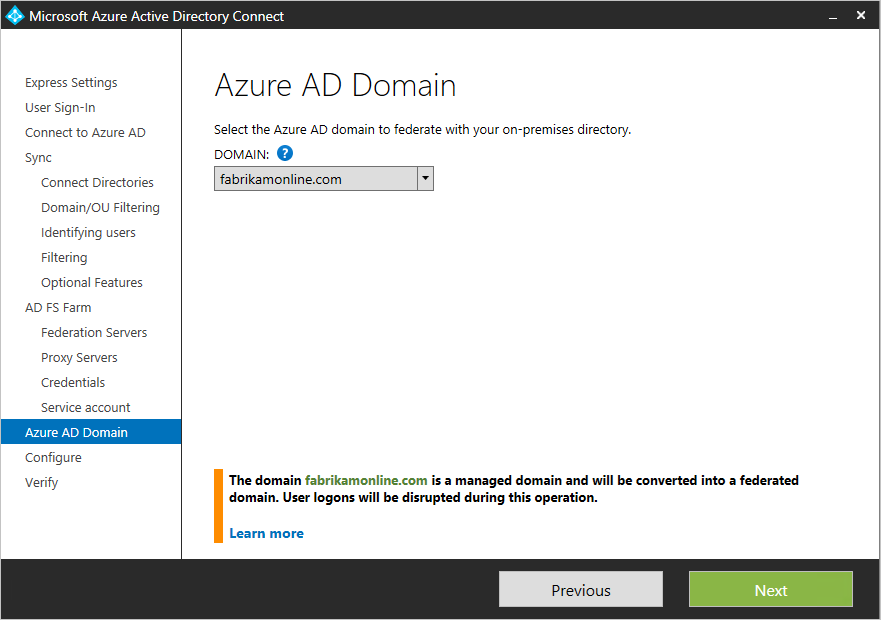

<properties 
	pageTitle="自訂 Azure AD Connect 安裝"
	description="這份文件詳述了 Azure AD Connect 的自訂安裝選項。"
	services="active-directory"
	documentationCenter=""
	authors="billmath"
	manager="stevenpo"
	editor="curtand"/>

<tags 
	ms.service="active-directory"
	ms.workload="identity"
	ms.tgt_pltfrm="na"
	ms.devlang="na"
	ms.topic="article"
	ms.date="08/24/2015"
	ms.author="billmath"/>

# 自訂 Azure AD Connect 安裝

以下文件提供有關使用 Azure AD Connect 自訂安裝選項的資訊。如果您有其他組態選項，或需要未涵蓋在快速安裝中的選用功能，就可以使用此選項。

如需快速安裝的資訊，請參閱[快速安裝](active-directory-aadconnect.md#getting-started-with-azure-ad-connect)。如需從 DirSync 升級至 Azure AD Connect 的資訊，請參閱[升級 DirSync 至 Azure Active Directory Connect](active-directory-aadconnect-dirsync-upgrade-get-started.md)。

## 安裝必要的元件

安裝同步處理服務時，您可以將選用組態區段保持未核取狀態，Azure AD Connect 會自動設定所有項目。這包括設定 SQL Server 2012 Express 執行個體，以及建立適當的群組與指派其權限。如果您想要變更預設值，則可以使用下表了解可用的選用組態選項。

選用組態 | 說明 
------------- | ------------- |
SQL Server 名稱 |可讓您指定 SQL Server 名稱和執行個體名稱。如果您已經有想要使用的 ad 資料庫伺服器，請選擇這個選項。
服務帳戶 |Azure AD Connect 預設會建立本機服務帳戶，以供同步處理服務使用。出現的問題是自動產生了密碼，但安裝 Azure AD Connect 的人員並不知情。在大多數情況下，這沒問題，但是，如果您想要進行一些進階設定 (例如，將範圍設為已同步處理的組織單位)，則需要建立帳戶，並自行選擇密碼。但如果您選擇遠端 SQL Server，則需要位於網域內的服務帳戶，並知道密碼為何。在這類情況下，請輸入要使用的服務帳戶。 |
權限 | Azure AD Connect 預設會在安裝同步處理服務時，建立四個伺服器的本機群組。這些群組如下：[系統管理員] 群組、[操作員] 群組、[瀏覽] 群組和 [密碼重設群組]。如果您想要指定自己的群組，則可以在這裡這麼做。

## 使用者登入
安裝必要的元件後，系統會要求您指定使用者要使用的單一登入方法。下表提供可用選項的簡短說明。

單一登入選項 | 說明 
------------- | ------------- |
密碼同步處理 |使用者將能夠使用與登入內部部署網路時所用的相同密碼登入 Microsoft 雲端服務 (如 Office 365、Dynamics CRM 和 Windows InTune)。使用者密碼會透過密碼雜湊同步至 Azure，並在雲端中進行驗證。
與 AD FS 同盟|使用者將能夠使用與登入內部部署網路時所用的相同密碼登入 Microsoft 雲端服務 (如 Office 365、Dynamics CRM 和 Windows InTune)。系統會將使用者重新導向至他們的內部部署 AD FS 執行個體以進行登入，並在內部部署中完成驗證。
請勿設定| 不會安裝和設定任何功能。如果您已經有協力廠商的同盟伺服器或另一個現有的適當方案，請選擇此選項。

## 連接至 Azure AD
在 [連接至 Azure AD] 畫面中，輸入全域系統管理員的帳戶和密碼。請確定此帳戶沒有啟用多因素驗證。這會導致驗證失敗。請注意，此帳戶只會用來在 Azure AD 中建立服務帳戶，而且在精靈完成後便不會使用。

### 連接您的目錄
若要連接到您的 Active Directory 網域服務，Azure AD Connect 需要具有足夠權限的帳戶認證。此帳戶可以是一般使用者帳戶，因為我們只需要預設的讀取權限。不過，視您的情況而定，可能會需要其他權限。如需詳細資訊，請參閱 [Azure AD Connect 帳戶摘要](active-directory-aadconnect-account-summary.md)

### 唯一識別您的使用者

跨樹系比對功能可讓您定義 AD DS 樹系中的使用者在 Azure AD 中的顯示方式。使用者可能會在整個樹系中只顯示一次，或是具有啟用和停用帳戶的組合。

設定 | 說明 
------------- | ------------- |
使用者在整個樹系中只會顯示一次| 在 Azure AD 中，所有使用者會都建立為個別物件。  在 Metaverse 中這些物件不會聯結。
郵件屬性 | 如果郵件屬性在不同樹系中具有相同的值，則此選項就會聯結使用者和連絡人。如果已透過 GALSync 建立了您的連絡人，則建議使用此選項。
ObjectSID 與 msExchangeMasterAccountSID|此選項會在帳戶樹系中聯結啟用的使用者，在 Exchange 資源樹系中聯結停用的使用者。這在 Exchange 中也稱為連結的信箱。
sAMAccountName 與 MailNickName|此選項會在預期可以找到使用者登入 ID 的屬性中聯結。
我自己的屬性|此選項可讓您選取您的屬性。**限制：**確定選擇的是已經存在於 Metaverse 中的屬性。如果您選擇自訂屬性，精靈將無法完成。

- **來源錨點**：屬性 sourceAnchor 是使用者物件存留期間都不會變更的屬性。它是連結內部部署使用者與 Azure AD 中使用者的主要金鑰。因為無法改變屬性，所以您必須規劃並使用好的屬性。objectGUID 就是不錯的選項。只要使用者帳戶沒有在樹系/網域之間移動，此屬性就不會改變。若在多樹系環境中，您會在樹系間移動帳戶時，就必須使用另一個屬性，例如 employeeID 屬性。要避免如果某人結婚或變更指派時會改變的屬性。因為不可以使用帶有 @ 符號的屬性，所以無法使用 email 和 userPrincipalName。屬性也有區分大小寫，因此在樹系間移動物件時，請務必保留大寫/小寫。對二進位屬性而言值是 Base64 編碼，但對其他屬性類型而言仍會保持其未編碼的狀態。在同盟情況以及部分 Azure AD 介面中，此屬性也稱為 immutableID。

- **UserPrincipalName**：屬性 userPrincipalName 是使用者登入 Azure AD 和 Office 365 時會使用的屬性。使用的網域 (也稱為 UPN 尾碼)，應該會在同步處理使用者前於 Azure AD 中進行驗證。強烈建議保留預設屬性 userPrincipalName。如果此屬性不可路由傳送且無法驗證，則可以選取另一個屬性，例如選取 email 做為保存登入 ID 的屬性。這就是所謂的**替代 ID**。替代 ID 屬性值必須遵循 RFC822 標準。替代 ID 可以搭配密碼 sso 和同盟 sso 做為登入方案使用。

>[AZURE.WARNING]使用替代 ID 會與所有 Office 365 工作負載不相容。如需詳細資訊，請參閱〈[設定替代登入 ID](https://technet.microsoft.com/library/dn659436.aspx.)〉。

### 根據群組進行同步處理篩選
篩選群組功能可讓您執行小型的試驗，試驗中應該只會在 Azure AD 和 Office 365 內建立一小群物件子集。若要使用這項功能，請在您的 Active Directory 中建立一個群組，並新增應該以直接成員的身分與 Azure AD 進行同步處理的使用者和群組。您稍後可以在此群組中新增和移除使用者，藉此維護應該要顯示在 Azure AD 中的物件清單。若要使用這項功能，您會在自訂路徑中看見此頁面：

### 選用功能

此畫面可讓您針對特定情況選取選用功能。以下是每項個別功能的簡短說明。

選用功能 | 說明
-------------------    | ------------- | 
Exchange 混合部署 |「Exchange 混合部署」功能透過將一組特定屬性從 Azure AD 同步處理回內部部署目錄，以允許 Exchange 信箱同時存在於內部部署和 Azure 中。
Azure AD 應用程式和屬性篩選|透過啟用 Azure AD 應用程式和屬性篩選，可將這組同步處理的屬性調整為精靈後續頁面上的特定一組屬性。這會在精靈中開啟兩個額外的組態頁面。  
密碼回寫|透過啟用密碼回寫，使用 Azure AD 所產生的密碼變更會回寫至內部部署目錄。
目錄擴充屬性同步處理|透過啟用目錄擴充屬性同步處理，指定的屬性將會同步處理至 Azure AD。這會在精靈中開啟一個額外的組態頁面。  

如需使用同步處理規則編輯器和宣告式佈建的額外組態選項 (例如，變更預設組態)，請參閱[管理 Azure AD Connect](active-directory-aadconnect-whats-next.md)

新增包含使用者和群組的群組名稱。只有此群組的成員才會同步處理至 Azure AD。

## 目錄擴充屬性同步處理
您可以使用目錄擴充，利用您組織新增的自訂屬性，或 Active Directory 中的其他屬性，在 Azure AD 中擴充結構描述。若要使用這項功能，請選取 [選用功能] 頁面上的 [目錄擴充屬性同步處理]。如此可讓您進入此頁面，並在其中選取其他屬性。

這裡只支援有單一值的屬性，且值不能超過 250 個字元。Metaverse 和 Azure AD 結構描述會使用選取的屬性來擴充。在 Azure AD 中，新的應用程式會和屬性一起新增。

現在可以透過圖形提供這些屬性：

## 群組回寫 (預覽功能)

> [AZURE.WARNING]如果您目前啟用 DirSync 或 Azure AD Sync，請不要在 Azure AD Connect 中啟動任何回寫功能

選用功能中的群組回寫選項可讓您將「Office 365 中的群組」回寫至安裝 Exchange 的樹系。這是永遠在雲端中受控制的新群組類型。您可以在 outlook.office365.com 或 myapps.microsoft.com 中找到此群組類型，如下所示：

此群組將會在內部部署 AD DS 中顯示為通訊群組。您的內部部署 Exchange 伺服器必須是 Exchange 2013 累積更新 8 (2015 年 3 月發行)，才能辨識這個新的群組類型。

**注意**

- 目前不會填入通訊錄屬性。最簡單的方法是從您組織中的另一個群組內找到通訊錄屬性，並在同步處理引擎外填入這些屬性。**若要這麼做，最簡單的方法是使用 PowerShell Cmdlet 的 update-recipient。**
- 只有使用 Exchange 結構描述的樹系才是群組的有效目標。如果沒有偵測到 Exchange，則會無法啟用群組回寫功能。
- 群組回寫功能目前無法處理安全性群組或通訊群組。

如需詳細資訊，請參閱[這裡](http://blogs.office.com/2014/09/25/delivering-first-chapter-groups-office-365/)。

## 裝置回寫 (預覽功能)

> [AZURE.WARNING]如果您目前啟用 DirSync 或 Azure AD Sync，請不要在 Azure AD Connect 中啟動任何回寫功能。

裝置回寫功能可讓您取得在雲端中 (例如在 Intune 中) 註冊的裝置，並將它納入 AD DS 中以供有條件的存取。若要啟用此功能，必須備妥 AD DS。如果您安裝 AD FS 與裝置註冊服務 (DRS)，則 DRS 會提供 PowerShell Cmdlet，讓您準備要用於裝置回寫的 AD。如果沒有安裝 DRS，可以企業系統管理員的身分執行 C:\\Program Files\\Microsoft Azure Active Directory Connect\\AdPrep\\AdSyncAdPrep.psm1。

在您可以執行 PowerShell Cmdlet 之前，必須先匯入它。

	Import-Module 'C:\Program Files\Microsoft Azure Active Directory Connect\AdPrep\AdSyncPrep.psm1'

若要執行這項操作，您必須將 Active Directory 和 MSOnline PowerShell 安裝在本機上。

## 預備模式
在預備模式中，可以同時設定新的同步處理伺服器與現有的伺服器。系統僅支援讓一部同步處理伺服器與雲端中的一個目錄連接。但如果想要從另一部伺服器移動，例如執行 DirSync 的伺服器，則可以啟用預備模式中的 Azure AD Connect。啟用後，同步處理引擎時會照常匯入並同步處理資料，但不會匯出任何項目至 Azure AD，且會關閉密碼同步處理和密碼回寫。

在預備模式中，可以對同步處理引擎進行所需的變更，並檢閱要匯出的項目。當此組態看起來設定良好時，請再次執行安裝精靈，並停用預備模式。這麼做可將資料匯出至 Azure AD。同時請務必停用其他伺服器，如此才能只讓一部伺服器主動匯出。

### 防止意外刪除
安裝 Azure AD Connect 時，就會依預設啟用防止意外刪除的功能，並設定為不允許超過 500 個刪除項目的匯出。500 是預設值，可加以變更。啟用這項功能後，如果有太多刪除項目，就不會繼續匯出，且您會收到一封電子郵件，內容看起來像這樣：

如果這是非預期的結果，請進行調查，並採取任何修正動作。

若要暫時停用此保護功能，並刪除這些項目，請執行：Disable-ADSyncExportDeletionThreshold

若要重新啟用此保護功能，或變更預設的臨界值設定，請執行：Enable-ADSyncExportDeletionThreshold

## 設定與 AD FS 同盟
只要簡單按幾下，即可使用 Azure AD Connect 設定 AD FS。以下是進行設定前的所需項目。

- 做為同盟伺服器的 Windows Server 2012 R2 伺服器，且已啟用遠端管理
- 做為 Web 應用程式 Proxy 伺服器的 Windows Server 2012 R2 伺服器，且已啟用遠端管理
- 您想要使用之 Federation Service 名稱 (例如 adfs.contoso.com) 的 SSL 憑證

### 建立新的 AD FS 伺服器陣列或使用現有的 AD FS 伺服器陣列
您可以使用現有的 AD FS 伺服器陣列，或選擇建立新的 AD FS 伺服器陣列。如果您選擇建立新的伺服器陣列，就必須提供 SSL 憑證。如果 SSL 憑證有密碼保護，則系統會提示您輸入密碼。

**注意：**如果選擇使用現有的 AD FS 伺服器陣列，會略過幾個頁面將您直接導向至一個畫面，以設定 AD FS 與 Azure AD 的之間的信任關係。

### 指定 AD FS 伺服器

您會在這裡輸入想要在其中安裝 AD FS 的特定伺服器。您可以根據容量規劃需求，加入一或多部伺服器。這些伺服器必須先全部加入 Active Directory 網域，才能執行這項設定。我們建議安裝一部用於測試和試驗部署的 AD FS 伺服器，並開啟 Azure AD Connect 以部署其他伺服器，然後將 AD FS 部署至其他伺服器以符合您的擴充需求。

> [AZURE.NOTE]請先確認所有伺服器均已加入 AD 網域，再執行這項設定。

 
### 指定 Web 應用程式 Proxy 伺服器
您會在這裡輸入您要做為 Web 應用程式 Proxy 伺服器的特定伺服器。Web 應用程式 Proxy 伺服器會部署在您的 DMZ (外部網路對應) 中，且支援來自外部網路的驗證要求。您可以根據容量規劃需求，加入一或多部伺服器。我們建議安裝一部用於測試和試驗部署的 Web 應用程式 Proxy 伺服器，並開啟 Azure AD Connect 以部署其他伺服器，然後將 Web 應用程式 Proxy 部署至其他伺服器。我們通常建議準備一部同樣數目的 Proxy 伺服器，以滿足來自內部網路的驗證需求。

> [AZURE.NOTE]<li>如果您用來安裝 Azure AD Connect 的帳戶不是 AD FS 伺服器上的本機系統管理員，則系統會提示您提供具有足夠的權限的帳戶認證。</li><li>設定此步驟前，請先確認 Azure AD Connect 伺服器與 Web 應用程式 Proxy 伺服器之間的 HTTP/HTTPS 連線能力。</li><li> 此外，亦請確認 Web 應用程式伺服器和 AD FS 伺服器之間的 HTTP/HTTPS 連線是否允許流入驗證要求。</li>

系統會提示您輸入認證，讓 Web 應用程式伺服器可以建立與 AD FS 伺服器的安全連線。這些認證必須是 AD FS 伺服器上的本機系統管理員。

 
### 指定 AD FS 服務的服務帳戶
AD FS 服務需要網域服務帳戶來驗證使用者，以及在 Active Directory 中查閱使用者資訊。它可支援 2 種類型的服務帳戶：

- **群組受管理服務帳戶**：這是 Active Directory 網域服務中隨著 Windows Server 2012 一起導入的服務帳戶類型。此類型的帳戶提供 AD FS 之類的服務，讓您可以使用單一帳戶，且不需要定期更新帳戶密碼。如果您在要納入 AD FS 伺服器的網域中已經有 Windows Server 2012 網域控制站，請使用此選項。
- **網域使用者帳戶**：此類型的帳戶會要求您提供密碼，並在密碼變更時定期更新密碼。如果您在要納入 AD FS 伺服器的網域中沒有 Windows Server 2012 網域控制站，才能使用此選項。

如果您以網域系統管理員的身分登入，Azure AD Connect 會自動建立群組受管理服務帳戶。
 

### 選取您想要建立同盟的 Azure AD 網域
此組態會用來設定 AD FS 與 Azure AD 之間的同盟關係。它會設定 AD FS 將安全性權杖簽發給 Azure AD，並將 Azure AD 設定為信任來自此特定 AD FS 執行個體的權杖。此頁面只會讓您在第一次使用時設定單一網域。您可以隨時再次開啟 Azure AD Connect，並執行這項工作，以設定其他網域。

 

 
### 執行其他工作來完成同盟組態
必須完成下列額外的工作才能完成同盟組態。

- 針對內部網路 (內部 DNS 伺服器) 和外部網路 (透過網域註冊機構註冊的公用 DNS)，設定 AD FS Federation Service 名稱 (例如 adfs.contoso.com) 的 DNS 記錄。請確認內部網路 DNS 記錄是使用 A 記錄而非 CNAME 記錄。因為必須如此，Windows 驗證才能在您加入網域的電腦上正常運作。
- 如果要部署多部 AD FS 伺服器或 Web 應用程式 Proxy 伺服器，請確定您已設定負載平衡器，以及指向負載平衡器之 AD FS Federation Service 名稱 (例如 adfs.contoso.com) 的 DNS 記錄。
- 如果要將 Windows 整合式驗證用於您內部網路中使用 Internet Explorer 的瀏覽器應用程式，請確認 AD FS Federation Service 名稱 (例如 adfs.contoso.com) 已加入至 IE 中的內部網路區域。這項作業可以透過群組原則加以控制，並部署到您所有加入網域的電腦中。 

### 驗證同盟組態

當您按一下 [驗證] 按鈕時，Azure AD Connect 會為您驗證 DNS 設定。

 
 
此外，請執行下列驗證步驟：

- 驗證來自內部網路中使用 Internet Explorer 之加入網域電腦的瀏覽器登入：連接到 https://myapps.microsoft.com，並使用您已登入的帳戶驗證登入。
- 驗證來自外部網路之裝置的瀏覽器登入：在家用電腦或行動裝置上，連接到 https://myapps.microsoft.com，並提供您的登入 ID 和密碼認證。
- 驗證豐富型用戶端登入：連接到 https://testconnectivity.microsoft.com，選擇 [Office 365] 索引標籤，然後選擇 [Office 365 單一登入測試]。

### AD FS 服務上的選用組態
您可以登入 AD FS，並使用 PSH 來進行設定，以自訂 AD FS 登入頁面的插圖和標誌影像。
	
	Set-AdfsWebTheme -TargetName default -Logo @{path="c:\Contoso\logo.png"} –Illustration @{path=”c:\Contoso\illustration.png”}

<!---HONumber=August15_HO9-->