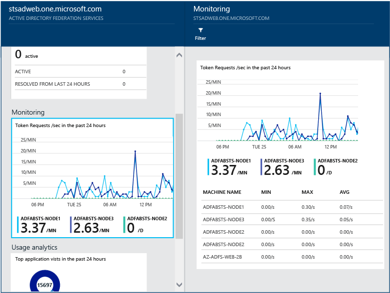
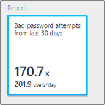
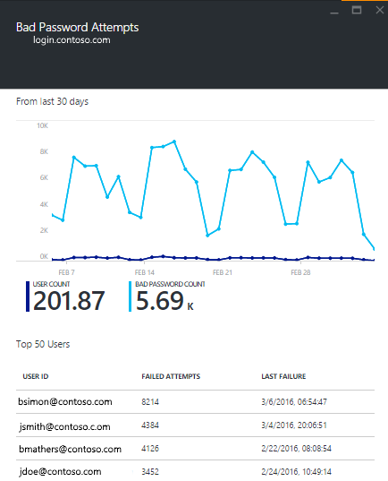

<properties
    pageTitle="Azure AD Connect Health gebruiken met AD FS | Microsoft Azure"
    description="Op deze Azure AD Connect Health-pagina vindt u informatie over het bewaken van uw on-premises AD FS-infrastructuur."
    services="active-directory"
    documentationCenter=""
    authors="karavar"
    manager="stevenpo"
    editor="karavar"/>

<tags
    ms.service="active-directory"
    ms.workload="identity"
    ms.tgt_pltfrm="na"
    ms.devlang="na"
    ms.topic="get-started-article"
    ms.date="03/21/2016"
    ms.author="vakarand"/>

# Azure AD Connect Health gebruiken met AD FS
De volgende documentatie is specifiek voor het bewaken van uw Azure AD FS-infrastructuur met Azure AD Connect Health.

## Waarschuwingen voor AD FS
In de sectie Waarschuwingen van Azure AD Connect Health vindt u een lijst met actieve waarschuwingen. Elke waarschuwing bevat relevante informatie, stappen voor het oplossen van het probleem en koppelingen naar gerelateerde documentatie. Als u een actieve of opgeloste waarschuwing selecteert, ziet u een nieuwe blade met aanvullende informatie. Ook ziet u stappen die u kunt nemen voor het oplossen van de waarschuwing en koppelingen naar aanvullende documentatie. Ook kunt u historische gegevens zien voor waarschuwingen die in het verleden zijn opgelost.

Als u een waarschuwing selecteert, ziet u aanvullende informatie. Ook ziet u stappen die u kunt nemen voor het oplossen van de waarschuwing en links naar aanvullende documentatie.

## Gebruiksanalyses voor AD FS
Gebruiksanalyse Azure AD Connect Health analyseert het verificatieverkeer van uw federatieve servers. Wanneer u het vakje voor gebruiksanalyses selecteert, wordt een blade met gebruiksanalyses geopend waarin u de gegevens en groeperingen kunt zien.

>[AZURE.NOTE] Om Gebruiksanalyses met AD FS te gebruiken, moet u AD FS-controle hebben ingeschakeld. Ga voor meer informatie naar [Controles voor AD FS inschakelen](active-directory-aadconnect-health-agent-install.md#enable-auditing-for-ad-fs).

Om aanvullende gegevens te selecteren geeft u een tijdsperiode op, of klik met de rechtermuisknop op de grafiek met gebruiksanalyses en selecteer Grafiek bewerken om de groepering te wijzigen. Vervolgens kunt u de tijdsperiode opgeven, gegevens bewerken of selecteren en de groepering wijzigen. U kunt de distributie van het verificatieverkeer op basis van verschillende "gegevens" weergeven en alle gegevens groeperen met behulp van de relevante 'groeperen op'-parameters die hieronder beschreven staan.

| Gegevens | Groeperen op | Wat houdt de groepering in en waarom heeft dit zin? |
| ------ | -------- | -------------------------------------------- |
| Totaal aantal verzoeken: het totale aantal verzoeken dat is verwerkt door de federatieve service. | Alle | Hiermee ziet u het totale aantal verzoeken zonder groepering. |
|  | Toepassing | Met deze optie worden alle verzoeken gegroepeerd op basis van de beoogde Relying Party. Dankzij deze groep krijgt u meer inzicht in de percentages van al het verkeer die worden verwerkt per toepassing. |
|  | Server | Met deze optie worden alle verzoeken gegroepeerd op basis van de server die dat verzoek heeft verwerkt. Met deze groepering kunt u zien hoe de belasting van al het verkeer is verdeeld. |
|  | Werkplek koppelen | Met deze optie worden alle verzoeken gegroepeerd op verzoeken die worden verzonden door apparaten die aan de werkplek gekoppeld (bekend) zijn of niet. Deze groepering is nuttig wanneer uw resources worden geopend met behulp van apparaten die niet bekend zijn in uw infrastructuur voor identiteiten. |
|  | Verificatiemethode | Met deze optie worden alle verzoeken gegroepeerd op basis van de gebruikte verificatiemethode. Deze groepering biedt meer inzicht in de veelgebruikte verificatiemethoden. Hier volgen enkele mogelijke verificatiemethoden <ol> <li>Geïntegreerde Windows-verificatie (Windows)</li> <li>Op formulieren gebaseerde verificatie (formulieren)</li> <li>Optie voor eenmalige aanmelding (SSO)</li> <li>Op X509-certificaat gebaseerde verificatie (certificaat)</li>  Onthoud dat een verzoek als SSO wordt gerekend als de federatieve server het verzoek ontvangt met een SSO-cookie. In zo’n geval, wanneer het cookie geldig is, wordt de gebruiker niet gevraagd om inloggegevens en krijgt deze naadloos toegang tot de toepassing. Dit gebeurt vaak wanneer u meerdere Relying Party’s hebt die worden beschermd door de federatieve servers. |
|  | Netwerklocatie | Met deze optie worden alle verzoeken gegroepeerd op basis van de netwerklocatie van de gebruiker. Dit kan intranet of extranet zijn. Met deze groepering kunt u zien welk percentage van het verkeer van het intranet komt, en welk percentage van het extranet. |
| Totaal aantal mislukte verzoeken: het totale aantal mislukte verzoeken dat is verwerkt door de federatieve service.   (Deze gegevens zijn alleen beschikbaar op AD FS voor Windows Server 2012 R2)| Fouttype | Hiermee wordt het aantal fouten op basis van vooraf gedefinieerde fouttypen weergegeven. Deze groepering is nuttig om meer inzicht te verkrijgen in de veelvoorkomende fouttypen. <ul><li>Onjuiste gebruikersnaam of wachtwoord: fouten als gevolg van onjuiste gebruikersnaam of wachtwoord.</li> <li>"Extranet Lockout": fouten omdat het verzoek werd ontvangen van een gebruiker die is uitgesloten van extranet </li><li> 'Wachtwoord verlopen': mislukt omdat de gebruiker zich heeft aangemeld met een verlopen wachtwoord.</li><li>"Account uitgeschakeld": mislukt omdat gebruikers zich aanmelden met een uitgeschakeld account.</li><li>"Apparaatverificatie": mislukt omdat gebruikers niet kunnen worden geverifieerd met behulp van Apparaatverificatie.</li><li>"Verificatie met gebruikerscertificaat": mislukt omdat gebruikers niet kunnen worden geverifieerd vanwege een ongeldig certificaat.</li><li>"MFA": mislukt omdat de gebruiker niet kan worden geverifieerd met behulp van Multi-Factor Authentication.</li><li>"Andere referentie": "Autorisatie uitgifte": mislukt vanwege autorisatiefouten.</li><li>"Overgedragen uitgifte": mislukt wegens fouten bij het delegeren van de uitgifte.</li><li>"Acceptatie token": mislukt omdat ADFS  het token van een externe id-provider weigert.</li><li>"Protocol": mislukt wegens protocolfouten.</li><li>'Onbekend': algemene melding. Andere fouten die niet in de gedefinieerde categorieën vallen.</li> |
|  | Server | Hiermee worden fouten gegroepeerd op basis van de server. Dit is handig om te begrijpen hoe de fouten zijn verdeeld over de servers. Een ongelijke verdeling kan wijzen op een server die in slechte staat is. |
|  | Netwerklocatie | Hiermee worden fouten gegroepeerd op basis van de netwerklocatie van de verzoeken (intranet vs. extranet). Zo kunt u beter zien wat voor type verzoeken het vaakst mislukt. |
|  | Toepassing | Hiermee worden fouten gegroepeerd op basis van de beoogde applicatie (Relying Party). Dit is handig om te begrijpen bij welke doeltoepassing de meeste fouten voorkomen. |
| Gebruikersaantal: gemiddeld aantal unieke gebruikers die actief zijn in het systeem | Alle | Hiermee ziet u het gemiddelde aantal gebruikers die gebruikmaken van de federatieve service in het geselecteerde tijdvak. De gebruikers zijn niet gegroepeerd.  Het gemiddelde is afhankelijk van de geselecteerde tijdsperiode. |
|  | Toepassing | Hiermee wordt het gemiddelde gebruikersaantal gegroepeerd op basis van de beoogde applicatie (Relying Party). Zo kunt u zien hoeveel gebruikers gebruikmaken van elke toepassing. |

## Prestatiebewaking voor AD FS
Prestatiebewaking voor Azure AD Connect Health biedt bewakingsinformatie over de gegevens. Door het vakje Bewaking te selecteren, wordt een blade geopend met gedetailleerde informatie over de gegevens.

Door de filteroptie bovenin de blade te selecteren, kunt u filteren op server om de gegevens van een individuele server te bekijken. Om gegevens te bewerken klikt u op de bewakingsgrafiek onder de bewakingsblade en selecteert u vervolgens Grafiek bewerken. In de nieuwe blade die wordt geopend kunt u nu aanvullende gegevens selecteren uit het vervolgkeuzemenu en een tijdsperiode opgeven om de prestatiegegevens te bekijken.

## Rapporten voor AD FS
Azure AD Connect Health biedt rapporten over de activiteit en prestaties van AD FS. Dankzij deze rapporten krijgen beheerders meer inzicht in de activiteiten op de AD FS-servers.

### Top 50 van gebruikers met mislukte aanmeldingen vanwege een verkeerde gebruikersnaam of verkeerd wachtwoord

Een veelvoorkomende reden voor een mislukt verificatieverzoek op een AD FS-server is een verzoek met ongeldige referenties, dat wil zeggen, een onjuiste gebruikersnaam of wachtwoord. Dit komt vaak door complexe wachtwoorden, vergeten wachtwoorden of typfouten.

Er zijn echter andere redenen die kunnen leiden tot een onverwacht aantal van dergelijke verzoeken die moeten worden verwerkt door uw AD FS-servers. Zoals een toepassing die de inloggegevens van een gebruiker opslaat in de cache waarbij de gegevens vervolgens verlopen, of een kwaadwillende gebruiker die probeert in te loggen op een gebruikersaccount door middel van een reeks bekende wachtwoorden.

Azure AD Connect Health voor AD FS biedt een rapport over top 50 van gebruikers met mislukte inlogpogingen vanwege een ongeldige gebruikersnaam of wachtwoord. Dit rapport komt tot stand door het verwerken van de controlegebeurtenissen die worden gegenereerd door de AD FS-servers in de farms

Met dit rapport hebt u een eenvoudig overzicht van de volgende informatie:

- Totaal aantal mislukte verzoeken met een onjuiste gebruikersnaam en wachtwoord in de afgelopen 30 dagen
- Gemiddeld aantal gebruikers per dag die zich proberen aan te melden met een onjuiste gebruikersnaam en wachtwoord.

Door hier te klikken gaat u naar de blade met het hoofdrapport waar u meer informatie kunt vinden. U ziet onder andere een grafiek met up-to-date informatie om een basislijn vast te stellen met betrekking tot verzoeken met een onjuiste gebruikersnaam of wachtwoord en de lijst met de top 50 van gebruikers die het vaakst een mislukte poging hebben gedaan.

Deze grafiek bevat de volgende informatie:

- Het totale aantal mislukte aanmeldingen vanwege een ongeldige gebruikersnaam en wachtwoord per dag.
- Het totale aantal unieke gebruikers met mislukte aanmeldingen per dag.

Het rapport bevat het volgende:

| Rapportitem | Beschrijving
| ------ | -------- |
|Gebruikers-ID| De gebruikers-ID die is gebruikt. Houd er rekening mee dat de waarde is wat de gebruiker heeft ingetypt. In sommige gevallen zult u zien dat een onjuiste gebruikers-ID wordt gebruikt.|
|Mislukte pogingen|Geeft het totale aantal mislukte pogingen voor die specifieke gebruikers-ID weer. De tabel is gesorteerd in aflopende volgorde, met het hoogste aantal mislukte pogingen bovenaan.|
|Laatste fout|Dit is het tijdstip waarop de laatste fout zich heeft voorgedaan.

>[AZURE.NOTE] Dit rapport wordt elke 2 uur automatisch bijgewerkt met de nieuwe informatie die in die tijd is verzameld. Als gevolg hiervan kunnen inlogpogingen van de laatste 2 uur niet worden opgenomen in het rapport.

## Verwante koppelingen

* [Azure AD Connect Health (Engelstalig)](active-directory-aadconnect-health.md)
* [Azure AD Connect Health Agent Installation (Engelstalig)](active-directory-aadconnect-health-agent-install.md)
* [Azure AD Connect Health Operations (Engelstalig)](active-directory-aadconnect-health-operations.md)
* [Using Azure AD Connect Health for sync (Engelstalig)](active-directory-aadconnect-health-sync.md)
* [Azure AD Connect Health FAQ (Engelstalig)](active-directory-aadconnect-health-faq.md)
* [Azure AD Connect Health Version History (Engelstalig)](active-directory-aadconnect-health-version-history.md)

<!--HONumber=Jun16_HO2-->

