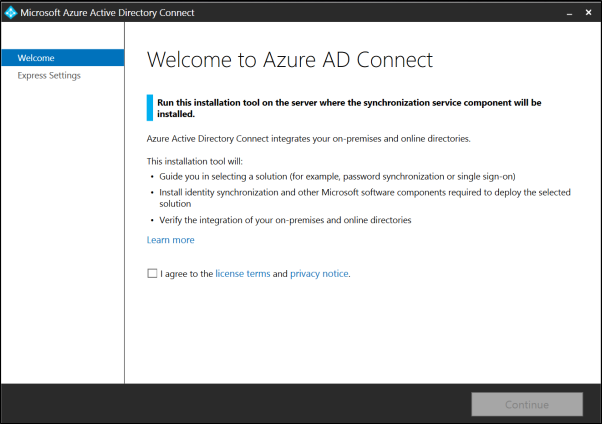
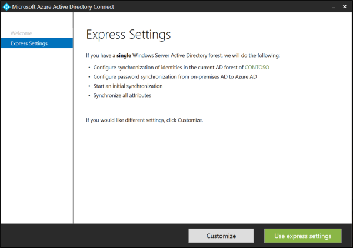
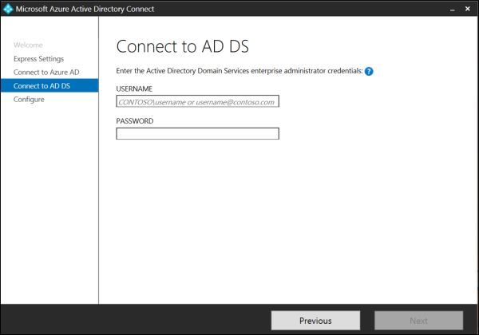
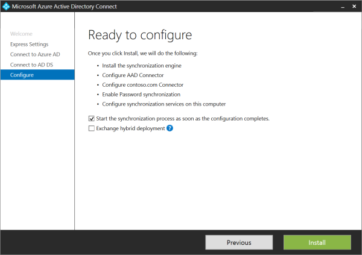
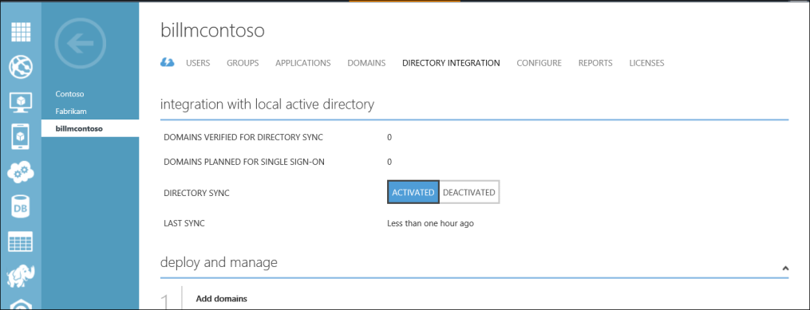
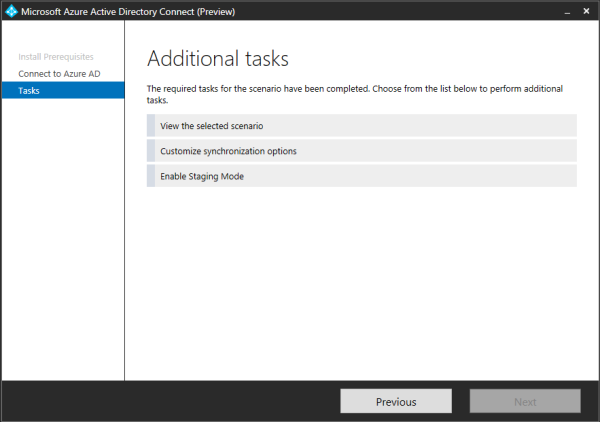

<properties 
	pageTitle="整合內部部署身分識別與 Azure Active Directory。"
	description="這就是 Azure AD Connect，說明它是什麼及使用的理由。"
	services="active-directory"
	documentationCenter=""
	authors="billmath"
	manager="stevenpo"
	editor="curtand"/>

<tags 
	ms.service="active-directory"
	ms.workload="identity"
	ms.tgt_pltfrm="na"
	ms.devlang="na"
	ms.topic="get-started-article"
	ms.date="08/24/2015"
	ms.author="billmath"/>

# bug fix after Compare_NewHO1 使用 Azure AD Connect 啟用目錄的混合式管理

現在，使用者希望在內部部署和雲端都能存取應用程式。他們希望能夠從任何裝置上這樣做，像是膝上型電腦、智慧型手機或平板電腦。為了實現這個理想，您和您的組織必須設法讓使用者存取這些應用程式，而完全轉向雲端不見得總是可行。

隨著 Azure Active Directory Connect 推出，存取這些應用程式和轉向雲端再簡單不過了。Azure AD Connect 提供下列優點：

- 您的使用者在雲端和內部部署都能使用一個通用身分識別登入。他們不需要記住多個密碼或帳戶，而系統管理員不必擔心多個帳戶可能帶來的額外負擔。
- 單一工具和引導式體驗，串連您的內部部署目錄與 Azure Active Directory。此精靈安裝後可部署及設定所有必要元件，讓您的目錄整合開始運作，包括同步服務、密碼同步或 AD FS，以及必要元件，例如 Azure AD PowerShell 模組。

## 使用 Azure AD Connect 的理由 

將內部部署目錄與 Azure AD 整合可提供一個通用身分識別來存取雲端和內部部署資源，讓使用者變得更有生產力。透過此整合，使用者和組織可以享受到下列好處：
	
* 組織可以運用 Windows Server Active Directory，然後連線到 Azure Active Directory，提供跨內部部署或雲端架構服務的通用混合式身分識別給使用者。 
* 系統管理員可以根據應用程式資源、裝置和使用者身分識別、網路位置及多因素驗證，提供條件式存取。
* 使用者可以透過 Azure AD 中的帳戶，將通用身分識別運用到 Office 365、Intune、SaaS 應用程式和協力廠商應用程式。  
* 開發人員可以利用通用身分識別模型來建置應用程式，將應用程式整合到 Active Directory 內部部署或 Azure，成為雲端架構應用程式

Azure AD Connect 可輕鬆達成這項整合，並簡化管理內部部署和雲端身分識別基礎結構。

----------------------------------------------------------------------------------------------------------
## 下載 Azure AD Connect

若要開始使用 Azure AD Connect，您可以使用下列連結下載最新版本：[下載 Azure AD Connect](http://go.microsoft.com/fwlink/?LinkId=615771)

----------------------------------------------------------------------------------------------------------

## Azure AD Connect 運作方式

Azure Active Directory Connect 由三個主要部分組成。它們是同步處理服務、選用性 Active Directory Federation Services 部分，以及使用 [Azure AD Connect Health](https://msdn.microsoft.com/library/azure/dn906722.aspx) 所執行的監控部分。

 

- 同步處理 - 此組件是由先前發行為 Dirsync 和 AAD Sync 的元件和功能所組成。這是負責建立使用者和群組的組件。它也會負責確保您內部部署環境中的使用者和群組資訊和雲端的符合。
- AD FS - 這是 Azure AD Connect 的選用性組件，而且可以用來使用內部部署 AD FS 基礎結構來設定混合環境。組織可以使用此組件來處理複雜部署，而複雜部署包括網域加入 SSO、AD 登入原則的強制執行以及智慧卡或協力廠商 MFA 這類項目。如需設定 SSO 的詳細資訊，請參閱[搭配單一登入的 DirSync](https://msdn.microsoft.com/library/azure/dn441213.aspx)。
- 狀況監控 - 對於使用 AD FS 的複雜部署，Azure AD Connect Health 可以提供同盟伺服器的健全監控，並在 Azure 入口網站中提供提供此活動的中央位置。如需詳細資訊，請參閱 [Azure Active Directory Connect Health](https://msdn.microsoft.com/library/azure/dn906722.aspx)。

### Azure AD Connect 支援元件

下列是每個必要條件和支援元件的清單，而 Azure AD Connect 將這些必要條件和支援元件安裝於在其上設定 Azure AD Connect 的伺服器。此清單適用於基本快速安裝。如果您選擇在 [安裝同步處理服務] 頁面上使用不同的 SQL Server，則不會安裝下面所列的 SQL Server 2012 元件。

- Azure AD Connect Azure AD 連接器
- Microsoft SQL Server 2012 命令列公用程式
- Microsoft SQL Server 2012 Native Client
- Microsoft SQL Server 2012 Express LocalDB
- Azure Active Directory Module for Windows PowerShell
- Microsoft Online Services Sign-In Assistant for IT Professionals
- Microsoft Visual C++ 2013 Redistribution Package

## 開始使用 Azure AD Connect

下列文件將協助您開始使用 Azure Active Directory Connect。本文件說明使用 Azure AD Connect 的快速安裝。如需自訂安裝的詳細資訊，請參閱 [Azure AD Connect 的自訂安裝](active-directory-aadconnect-get-started-custom.md)。如需從 DirSync 升級至 Azure AD Connect 的詳細資訊，請參閱[升級 DirSync 至 Azure Active Directory Connect](active-directory-aadconnect-dirsync-upgrade-get-started.md)。

### 安裝 Azure AD Connect 之前
在您快速設定安裝 Azure AD Connect 之前，您將需要一些項目。

 
- Azure 訂用帳戶或 [Azure 試用訂用帳戶](http://azure.microsoft.com/pricing/free-trial/) - 這僅需要用來存取 Azure 入口網站，而不會用於 Azure AD Connect。如果您正在使用 PowerShell 或 Office 365，則您不需要 Azure 訂用帳戶來使用 Azure AD Connect。
- 想要與其整合之 Azure AD 租用戶的 Azure AD 全域管理員帳戶
- Azure AD Connect 必須安裝於 Windows Server 2008 或更新版本上。此伺服器可能是網域控制站或成員伺服器。
- AD 結構描述版本與樹系層級必須是 Windows Server 2003 或更新版本。只要符合結構描述和樹系層級需求，網域控制站就能執行任何版本。
- 如果正在部署 Active Directory 同盟服務，則將安裝 AD FS 的伺服器必須是 Windows Server 2012 或更新版本。
- Azure AD Connect 需要 SQL Server 資料庫來儲存身分識別資料。預設會安裝 SQL Server 2012 Express LocalDB (輕量版的 SQL Server Express)，並且在本機電腦上建立服務的服務帳戶。SQL Server Express 有 10 GB 的大小限制，可讓您管理大約 100000 個物件。
- 如果您需要管理更多數量的目錄物件，則必須將安裝程序指向不同版本的 SQL Server。Azure AD Connect 支援從 SQL Server 2008 (含 SP4) 至 SQL Server 2014 的各種 Microsoft SQL Server。
- 本機 Active Directory 的企業系統管理員帳戶
- 如果您使用輸出 Proxy，則必須加入 **C:\\Windows\\Microsoft.NET\\Framework64\\v4.0.30319\\Config\\machine.config** 檔案中的下列設定，以便完成安裝。<code>
		
		<system.net>
    		<defaultProxy>
      		<proxy
        	usesystemdefault="true"
        	proxyaddress=http://<PROXYIP>:80"
        	bypassonlocal="true"
     		 />
    		</defaultProxy>
  		</system.net>
</code>必須在檔案底部輸入此文字。在此程式碼中，&lt;PROXYIP&gt; 代表實際的 Proxy IP 位址。

- 選用：測試使用者帳戶來驗證同步處理。

#### Azure AD Connect 的硬體需求
下表顯示 Azure AD Connect 電腦的最低需求。

| Active Directory 中的物件數目 | CPU | 記憶體 | 硬碟大小 |
| ------------------------------------- | --- | ------ | --------------- |
| 少於 10,000 個 | 1\.6 GHz | 4 GB | 70 GB |
| 10,000–50,000 個 | 1\.6 GHz | 4 GB | 70 GB |
| 50,000–100,000 個 | 1\.6 GHz | 16 GB | 100 GB |
| 若有 100,000 個以上的物件，則需要完整版本的 SQL Server| | | |
| 100,000–300,000 個 | 1\.6 GHz | 32 GB | 300 GB |
| 300,000–600,000 個 | 1\.6 GHz | 32 GB | 450 GB |
| 超過 600,000 個 | 1\.6 GHz | 32 GB | 500 GB |

對於多個樹系或同盟登入等「自訂選項」，請在[這裡](active-directory-aadconnect-get-started-custom.md)了解其他需求。

### 快速安裝 Azure AD Connect
選取 [快速設定] 是預設選項，而且是其中一個最常見的案例。這樣做時，Azure AD Connect 會使用密碼雜湊同步處理選項部署同步處理。這僅適用於單一樹系，而且可讓您的使用者使用其內部部署密碼來登入雲端。使用 [快速安裝] 會在完成安裝之後自動開始同步處理 (不過您可以選擇不開啟)。使用此選項，只要簡短地按幾下即可將內部部署目錄擴充至雲端。

#### 使用快速設定安裝 Azure AD Connect
--------------------------------------------------------------------------------------------

1. 以企業系統管理員身分登入您想要安裝 Azure AD Connect 的伺服器。這應該是您想要做為同步處理伺服器的伺服器。
2. 瀏覽並按兩下 AzureADConnect.msi
3. 在 [歡迎] 畫面上，選取同意授權條款的方塊，然後按一下 [繼續]。
4. 在 [快速設定] 畫面上，按一下 [使用快速設定]。

6. 在 [連接到 Azure AD] 畫面上，輸入您的 Azure AD 的 Azure 全域系統管理員使用者名稱和密碼。按 [下一步]。
8. 在 [連接到 AD DS] 畫面上輸入企業系統管理員帳戶的使用者名稱和密碼。按 [下一步]。

9. 在 [準備好設定] 畫面中，按一下 [安裝]。
	- 在 [準備好設定] 頁面上，您可以選擇取消核取 [設定一完成，即開始同步處理程序] 核取方塊。如果這麼做，精靈會設定同步處理但會停用該工作而不執行，直到您在 [工作排程器] 將它重新啟用。一旦啟用工作，每隔三小時就會執行同步處理。
	- 此外，您也可以選擇核取對應 [Exchange 混合式部署] 的核取方塊，以設定同步處理服務。如果您不打算在雲端和內部部署設定 Exchange 信箱，則不需要此設定。

8. 當安裝完成時，按一下 [結束]。

如需使用快速安裝的影片，請參閱下列內容：

[AZURE.VIDEO azure-active-directory-connect-express-settings]

### 驗證安裝

成功安裝 Azure AD Connect 之後，您可以登入 Azure 入口網站並檢查上次同步處理時間，以確認正在進行同步處理。

1.  登入 Azure 入口網站。
2.  選取左邊的 [Active Directory]。
3.  按兩下您剛才用來設定 Azure AD Connect 的目錄。
4.  在頂端，選取 [目錄整合]。注意上次同步處理時間。

## 管理 Azure AD Connect 

以下這些進階的選擇性主題可讓您自訂 Azure Active Directory Connect，以符合您組織的需要和需求。

### 指派授權給 Azure AD Premium 和 Enterprise Mobility 使用者

您的使用者現在已同步到雲端，您將需要指派授權給他們，才能繼續使用雲端應用程式 (例如 Office 365)。

#### 指派 Azure AD Premium 或 Enterprise Mobility Suite 授權
--------------------------------------------------------------------------------
1. 以系統管理員身分登入 Azure 入口網站。
2. 選取左邊的 [Active Directory]。
3. 在 [Active Directory] 頁面上，在有您要啟用的使用者之目錄上按兩下。
4. 在目錄頁面頂端，選取 [授權]。
5. 在 [授權] 頁面上，選取 [Active Directory Premium] 或 [Enterprise Mobility Suite]，然後按一下 [指派]。
6. 在對話方塊中，選取您要對其指派授權的使用者，然後按一下核取記號圖示，以儲存變更。

### 確認已排程的同步處理工作
如果想要查看同步處理的狀態，您可以在 Azure 入口網站查看。

#### 確認已排程的同步處理工作
--------------------------------------------------------------------------------

1. 以系統管理員身分登入 Azure 入口網站。
2. 選取左邊的 [Active Directory]。
3. 在 [Active Directory] 頁面上，在有您要啟用的使用者之目錄上按兩下。
4. 在 [目錄] 頁面的頂端，選取 [目錄整合]。
5. 請注意與本機 Active Directory 整合下方的上次同步處理時間。

### 啟動已排程的同步處理工作
如果您需要執行同步處理工作，可以再次執行「Azure AD Connect 精靈」。您需要提供 Azure AD 認證。在精靈中，選取 [自訂同步處理選項] 工作，並依精靈指示繼續按 [下一步]。在最後步驟中，確定已核取 [設定一完成，即開始同步處理程序] 方塊。

### Azure AD Connect 中可用的其他工作
在初始 Azure AD Connect 的安裝之後，您隨時可以從 Azure AD Connect 開始頁面或桌面捷徑啟動精靈。您會在再次執行精靈的過程中發現，一些新的選項以「其他工作」的形式提供。

下表提供這些工作的摘要和個別的簡短描述。

 

其他工作 | 說明 
------------- | ------------- |
檢視所選取的案例 |可讓您檢視目前的 Azure AD Connect 解決方案。這包括一般設定、同步處理的目錄、同步處理設定等等。
自訂同步處理選項 | 可讓您變更目前的組態，包括新增其他 Active Directory 樹系到組態或啟用同步處理選項，例如使用者、群組、裝置或密碼回寫。
啟用預備模式 | 這可讓您預備稍後將要同步處理的資訊，但不會將任何項目匯出到 Azure AD 或 Active Directory。這可讓您在同步處理發生之前先預覽。

 
### 其他文件
如需使用 Azure AD Connect 的其他文件請參閱下列文件：

- [Azure AD Connect 同步處理：自訂同步處理選項](active-directory-aadconnectsync-whatis.md) 
- [變更 Azure AD Connect 預設組態](active-directory-aadconnect-whats-next-change-default-config.md)
- [使用 Azure AD Connect 同步處理規則編輯器](active-directory-aadconnect-whats-next-synch-rules-editor.md)
- [使用宣告式佈建](active-directory-aadconnect-whats-next-declarative-prov.md)

此外，針對 Azure AD Sync 所建立的一些文件仍然有關，而且適用於 Azure AD Connect。雖然致力於將本文件帶到 Azure.com，但是這份文件有些部分還是保留在 MSDN 範圍文件庫中。如需其他文件，請參閱 [MSDN 上的 Azure AD Connect](active-directory-aadconnect.md) 和 [MSDN 上的 Azure AD Sync](https://msdn.microsoft.com/library/azure/dn790204.aspx)。

**其他資源**

關於擴充您的內部部署目錄至雲端的 Ignite 2015 簡報。

[AZURE.VIDEO microsoft-ignite-2015-extending-on-premises-directories-to-the-cloud-made-easy-with-azure-active-directory-connect]

[搭配單一登入的多樹系目錄同步作業實例](https://msdn.microsoft.com/library/azure/dn510976.aspx) - 整合多個目錄與 Azure AD。

[Azure AD Connect Health](active-directory-aadconnect-health.md) - 監控內部部署 AD FS 基礎結構的健全狀況。

[Azure AD Connect 常見問題集](active-directory-aadconnect-faq.md) - 關於 Azure AD Connect 的常見問題集。

 

<!---HONumber=August15_HO9-->
