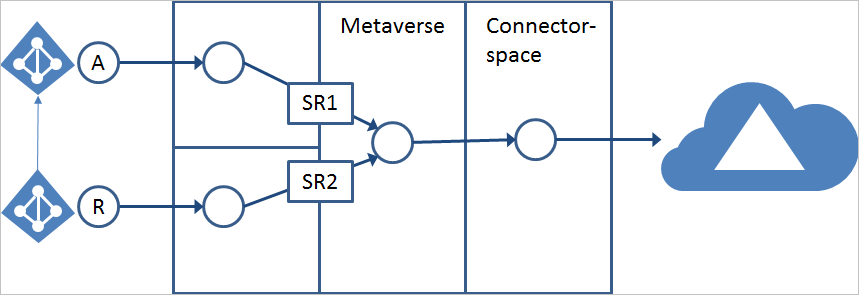
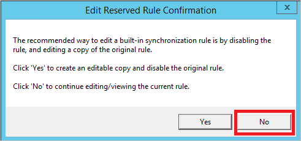
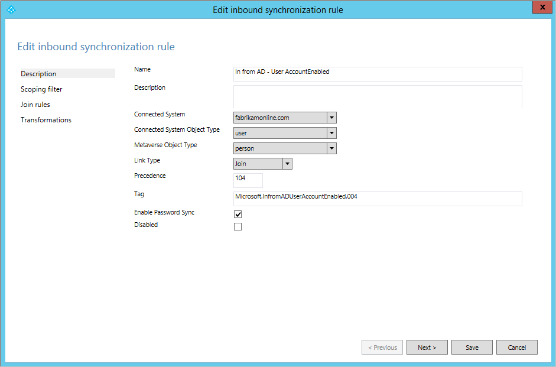
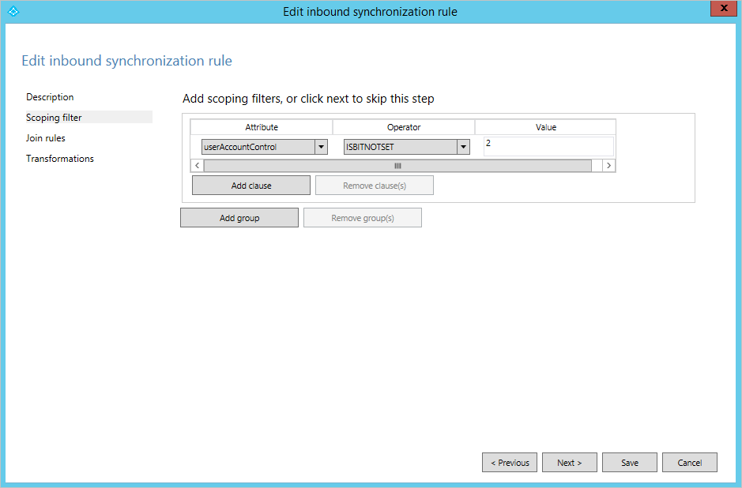
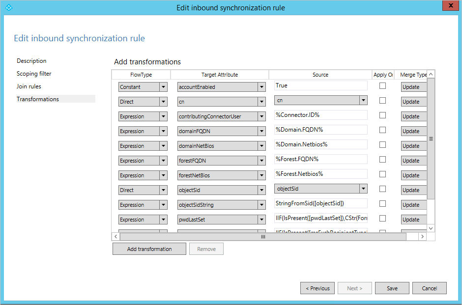

<properties
   pageTitle="Azure AD Connect sync: Understanding the default configuration | Microsoft Azure"
   description="This article describes the default configuration in Azure AD Connect sync."
   services="active-directory"
   documentationCenter=""
   authors="andkjell"
   manager="stevenpo"
   editor=""/>

<tags
   ms.service="active-directory"
   ms.workload="identity"
   ms.tgt_pltfrm="na"
   ms.devlang="na"
   ms.topic="article"
   ms.date="11/10/2015"
   ms.author="andkjell"/>

# Azure AD Connect sync: Understanding the default configuration

This article walks you through the default configuration of Azure AD Connect sync. The goal is that the reader will understand how the configuration model, named declarative provisioning, is working in a real-world example. This article assumes that you have already installed and configure Azure AD sync using the installation wizard.

## Scenario description

In this example we are using a deployment with one account forest (A), one resource forest (R), and one Azure AD directory.



In this configuration we assume to find an enabled account in the account forest and a disabled account in the resource forest with a linked mailbox.

Our goal with the default configuration is:

- Attribute information related to login will be synchronized from the forest with the enabled account.
- Attributes which can be found in the GAL (Global Address List) will be synchronized from the forest with the mailbox. If no mailbox can be found, any other forest will be used.
- If a linked mailbox is found, the linked enabled account must be found for the object to be exported to Azure AD.

## Synchronization Rule Editor

The configuration can be viewed and changed with the tool Synchronization Rules Editor (SRE) and a shortcut to it can be found in the start menu.


The SRE is a resource kit tool and it is installed with Azure AD Connect sync. To be able to start it you must be a member of the ADSyncAdmins group. When it starts, you will see something like this:


In this pane you will see all Synchronization Rules created for your configuration. Each line in the table is one Synchronization Rule. To the left under Rule Types the two different types are listed: Inbound and Outbound. Inbound and Outbound is from the view of the metaverse. We will mainly focus on the inbound rules in this overview.The actual list of Synchronization Rules will depend on the detected schema in AD. In the picture above the account forest (fabrikamonline.com) does not have any services, such as Exchange and Lync, and no Synchronization Rules have been created for these services. However, in the resource forest (res.fabrikamonline.com) we will find Synchronization Rules for these services. The content of the rules will be different depending on the version detected. For example in a deployment with Exchange 2013 we will have more attribute flows configured than in Exchange 2010 and Exchange 2007.

## Synchronization Rule

A Synchronization Rule is a configuration object with a set of attributes flowing when a condition is satisfied. It is also used to describe how an object in a connector space is related to an object in the metaverse, known as join or match. The Synchronization Rules have a precedence value indicating how they relate to each other. A Synchronization Rule with a lower numeric value in precedence has a higher precedence and in case of an attribute flow conflict, higher precedence will win the conflict resolution.

As an example we will look at the Synchronization Rule **In from AD – User AccountEnabled**. We will mark this line in the SRE and select **Edit**.

Since this is an out-of-box rule we will receive a warning when we open the rule. You should not make any [changes to out-of-box rules](active-directory-aadconnectsync-best-practices-changing-default-configuration.md) so you are being asked what your intentions are. In this case you only want to view the rule, so Select **No**.



A Synchronization Rule has four configuration sections: Description, Scoping filter, Join rules, and Transformations.

### Description

The first section provides basic information such as a name and description.



We also find information about which connected system this rule is related to, which object type in the connected system it applies to, and the metaverse object type. The metaverse object type is always person regardless if the source object type is a user, iNetOrgPerson, or contact. The metaverse object type should never change so it is created as a generic type. The Link Type can be set to Join, StickyJoin, or Provision. This setting works together with the Join Rules section and we will cover this later.

You can also see that this sync rule is used for password sync. If a user is in scope for this sync rule, the password will be synchronized from on-prem to cloud (assuming you have enabled the password sync feature).

### Scoping filter

The Scoping Filter section is used to configure when a Synchronization Rule should apply. Since the name of the Synchronization Rule we are looking at indicates it should only be applied for enabled users, the scope is configured so the AD attribute **userAccountControl** must not have the bit 2 set. When we find a user in AD we will apply this sync rule if **userAccountControl** is set to the decimal value 512 (enabled normal user) but it will not apply if the user we find has **userAccountControl** set to 514 (disabled normal user).



The scoping filter has Groups and Clauses which can be nested. All clauses inside a group must be satisfied for a Synchronization Rule to apply. When multiple groups are defined then at least one group must be satisfied for the rule to apply. I.e. a logical OR is evaluated between groups and a logical AND is evaluated inside a group. An example of this can be found in the outbound Synchronization Rule **Out to AAD – Group Join**, shown below. There are several synchronization filter groups, for example one for security groups (securityEnabled EQUAL True) and one for distribution groups (securityEnabled EQUAL False).


This rule is used to define which Groups should be provisioned to AAD. Distribution Groups must be mail enabled to be synchronized with AAD, but for security groups this is not required. As you can also see, a lot of additional attributes are evaluated as well.

### Join rules

The third section is used to configure how objects in the connector space relate to objects in the metaverse. The rule we have looked at earlier does not have any configuration for Join Rules, so instead we are going to look at **In from AD – User Join**.


The content of the join rules will depend on the matching option selected in the installation wizard. For an inbound rule the evaluation starts with an object in the source connector space and each group in join rules is evaluated in sequence. If a source object is evaluated to match exactly one object in the metaverse using one of the join rules, the objects are joined together. If all rules have been evaluated and there is no match, then the Link Type on the description page is used. If this setting is set to Provision then a new object is created in the target, the metaverse. To provision a new object to the metaverse is also known as to project an object to the metaverse.

The join rules are only evaluated once. When a connector space object and a metaverse object are joined together, they will remain joined as long as the scope of the Synchronization Rule is still satisfied.

When evaluating Synchronization Rules only one Synchronization Rule with join rules defined must be in scope. If multiple Synchronization Rules with join rules are found for one object, an error is thrown. For this reason the best practice is to have only one Synchronization Rule with join defined when multiple Synchronization Rules are in scope for an object. In the out-of-box configuration for Azure Active Directory Sync these rules can be found by looking at the name and find those with the word Join at the end of the name. A Synchronization Rule without any join rules defined will apply the attribute flows if another Synchronization Rule joined the objects together or provisioned a new object in the target.

If you look at the picture above, you can see that the rule is trying to join **objectSID** with **msExchMasterAccountSid** (Exchange) and **msRTCSIP-OriginatorSid** (Lync), which is what we expect in an account-resource forest topology. We will find the same rule on all forests, i.e. the assumption is that every forest could be either an account or resource forest. This will also work if you have accounts which live in a single forest and do not have to be joined.

### Transformations

The transformation section defines all attribute flows which will apply to the target object when the objects are joined and the scope filter is satisfied. Going back to our **In from AD – User AccountEnabled** Synchronization Rule we will find the following transformations:



To put this in context, in an Account-Resource forest deployment we expect to find an enabled account in the account forest and a disabled account in the resource forest with Exchange and Lync settings. The Synchronization Rule we are looking at contains the attributes required for login and we want these to flow from the forest where we found an enabled account. All these attribute flows are put together in one Synchronization Rule.

A transformation can have different types: Constant, Direct, and Expression.

- A constant flow will always flow a particular value, in the case above we will always set the value True in the metaverse attribute named accountEnabled.
- A Direct flow will flow the value of the attribute in the source to the target attribute.
- The third flow type is Expression and it allows for more advanced configurations.

The expression language is VBA (Visual Basic for Applications) so user with experience of Microsoft Office or VBScript will recognize the format. Attributes are enclosed in square brackets, [attributeName]. Attribute names and function names are case sensitive, but the Synchronization Rules Editor will evaluate the expressions and provide a warning if the expression is not valid. All expressions are expressed on a single line with nested functions. To show the power of the configuration language, here is the flow for pwdLastSet, but with additional comments inserted:

```
// If-then-else
IIF(
// (The evaluation for IIF) Is the attribute pwdLastSet present in AD?
IsPresent([pwdLastSet]),
// (The True part of IIF) If it is, then from right to left, convert the AD time format to a .Net datetime, change it to the time format used by AAD, and finally convert it to a string.
CStr(FormatDateTime(DateFromNum([pwdLastSet]),"yyyyMMddHHmmss.0Z")),
// (The False part of IIF) Nothing to contribute
NULL
)
```

The topic of transformation is large and it provides a large portion of the custom configuration possible with Azure AD Connect sync. More of this can be found in the other articles for Azure AD Connect sync.

## Precedence

We have now looked at some individual Synchronization Rules, but the rules work together in the configuration. In some cases an attribute value is contributed from multiple synchronization rules to the same target attribute. In this case attribute precedence is used to determine which attribute will win. As an example, let us look at the attribute sourceAnchor. This attribute is an important attribute to be able to login to Azure AD. We can find an attribute flow for this attribute in two different Synchronization Rules, **In from AD – User AccountEnabled** and **In from AD – User Common**. Due to Synchronization Rule precedence, the sourceAnchor attribute will be contributed from the forest with an enabled account first if there are several objects joined to the metaverse object. If there are no enabled accounts, then we will use the catch-all Synchronization Rule **In from AD – User Common**. This will ensure that even for accounts which are disabled we will still provide a sourceAnchor.


The precedence for Synchronization Rules is set in groups by the installation wizard. A group of rules all have the same name, but they are connected to different connected directories. The installation wizard will give the rule **In from AD – User Join** highest precedence and iterate over all connected AD directories. It will then continue with the next groups of rules in a predefined order. Inside a group the rules are added in the order the Connectors where added in the wizard. If another Connector is added through the wizard, the Synchronization Rules will be reordered and the new Connector’s rules will be inserted last in each group.

## Putting it all together

We now know enough about Synchronization Rules to be able to understand how the configuration works with the different Synchronization Rules. If we look at a user and the attributes which are contributed to the metaverse, the rules are applied in the following order:

| Name | Comment |
| :------------- | :------------- |
| In from AD – User Join | Rule for joining connector space objects with metaverse. |
| In from AD – UserAccount Enabled | Attributes required for login to Azure AD and Office 365. We want these attributes from the enabled account. |
| In from AD – User Common from Exchange | Attributes found in the Global Address List. We assume the data quality is best in the forest where we have found the user’s mailbox. |
| In from AD – User Common | Attributes found in the Global Address List. In case we didn’t find a mailbox, any other joined object can contribute the attribute value. |
| In from AD – User Exchange | Will only exist if Exchange has been detected. Will flow all infrastructure Exchange attributes. |
| In from AD – User Lync | Will only exist if Lync has been detected. Will flow all infrastructure Lync attributes. |

## Additional Resources

* [Azure AD Connect Sync: Customizing Synchronization options](active-directory-aadconnectsync-whatis.md)
* [Integrating your on-premises identities with Azure Active Directory](active-directory-aadconnect.md)

