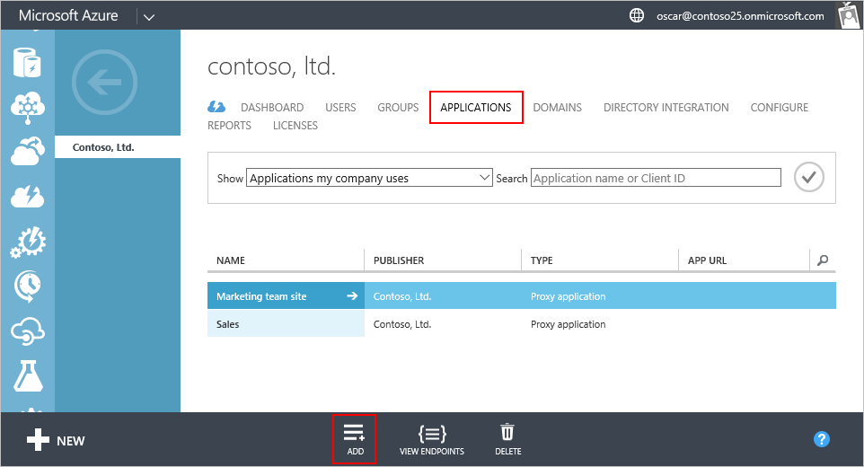
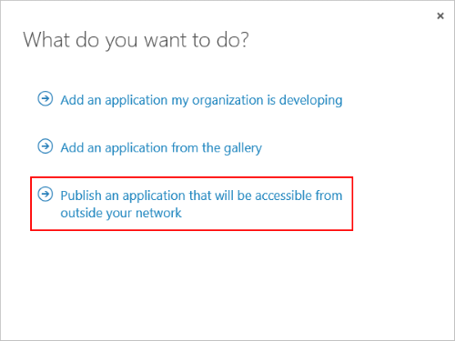
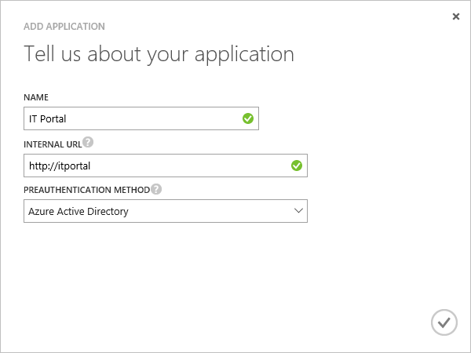
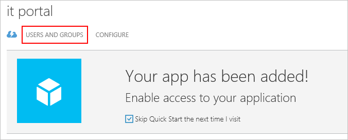
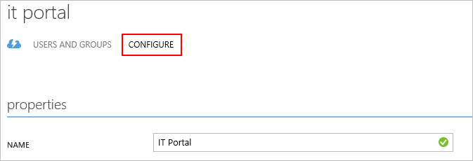

<properties
    pageTitle="Apps publiceren met Azure AD-toepassingsproxy | Microsoft Azure"
    description="Publiceer on-premises toepassingen naar de cloud met Azure AD-toepassingsproxy."
    services="active-directory"
    documentationCenter=""
    authors="kgremban"
    manager="stevenpo"
    editor=""/>

<tags
    ms.service="active-directory"
    ms.workload="identity"
    ms.tgt_pltfrm="na"
    ms.devlang="na"
    ms.topic="get-started-article"
    ms.date="06/01/2016"
    ms.author="kgremban"/>

# Toepassingen publiceren met Azure AD-toepassingsproxy

Nadat u Microsoft Azure Active Directory-toepassingsproxy (AD) hebt ingeschakeld, kunt u on-premises toepassingen publiceren, zodat externe gebruikers er toegang toe hebben van buiten het particuliere netwerk.

Dit artikel beschrijft de stappen voor het publiceren van toepassingen die worden uitgevoerd op uw lokale netwerk en het bieden van beveiligde externe toegang van buiten uw netwerk. Als u geen toepassingsproxy of connectors hebt ingesteld of geïnstalleerd, voert u de stappen in [Enable Application Proxy in the Azure portal](active-directory-application-proxy-enable.md) (Engelstalig) uit voordat u hier verdergaat.

Als u Azure AD-toepassingsproxy voor het eerst gebruikt, raden we u aan om de connector te testen door een website vanuit uw particuliere netwerk te publiceren voordat u begint met het publiceren van toepassingen.

> [AZURE.NOTE] De functie toepassingsproxy is alleen beschikbaar als u een upgrade hebt uitgevoerd naar de Premium- of Basic-editie van Azure Active Directory. Zie [Azure Active Directory editions](active-directory-editions.md) (Engelstalig) voor meer informatie.

## Een app publiceren met de wizard

1. Meld u als beheerder aan in de [klassieke Azure-portal](https://manage.windowsazure.com/).
2. Ga naar Active Directory en selecteer de directory waarin u toepassingsproxy hebt ingeschakeld.

    

3. Klik op de tab **Toepassingen** en klik vervolgens op de knop **Toevoegen** onder aan het scherm

    

4. Selecteer **Een toepassing publiceren die toegankelijk is van buiten uw netwerk**.

    

5. Geef de volgende informatie over de toepassing op:

    - **Naam**: de beschrijvende naam van uw toepassing. Deze naam moet uniek zijn in uw directory.
    - **Interne URL**: het adres dat de connector voor de toepassingsproxy gebruikt om toegang tot de toepassing te verkrijgen vanuit uw particuliere netwerk. U kunt voor het publiceren een specifiek pad opgeven op de back-endserver, terwijl de rest van de server ongepubliceerd blijft. Op deze manier kunt u verschillende sites op dezelfde server publiceren en elke server een eigen naam en toegangsregels geven.
    - **Methode met verificatie vooraf**: hierbij worden gebruikers door de toepassingsproxy geverifieerd voordat ze toegang krijgen tot uw toepassing. Kies een van de opties in de vervolgkeuzelijst.

        - Azure Active Directory: de gebruikers worden omgeleid met de toepassingsproxy zodat zij zich kunnen aanmelden met Azure AD. Hierbij worden hun machtigingen geverifieerd voor de directory en de toepassing.
        - Passthrough: gebruikers hoeven geen verificatie te doorlopen om toegang te krijgen tot de toepassing.

      

6. Schakel het selectievakje onder aan het scherm in om de wizard te voltooien. De toepassing is nu gedefinieerd in Azure AD.

## Gebruikers en groepen toewijzen aan de toepassing

U dient uw gebruikers individueel of in groepen toe te wijzen, zodat zij toegang krijgen tot uw gepubliceerde toepassing. Voor apps waarbij verificatie vooraf is vereist, worden hierbij machtigingen verleend voor het gebruik van de app. Voor apps waarbij geen verificatie vooraf is vereist, hebben gebruikers geen machtigingen nodig maar moeten ze zich wel aanmelden bij de app, zodat deze in hun toepassingslijst wordt weergegeven.

1. Nadat u de wizard App toevoegen hebt voltooid, wordt de pagina Snel starten weergegeven voor uw toepassing. Selecteer **Gebruikers en groepen** om de toegang tot de app te beheren.

    

2. Zoek naar specifieke groepen in uw directory of geef alle gebruikers weer. Klik op het vinkje om de resultaten weer te geven.

    

2. Selecteer elke gebruiker aan wie of groep waaraan u deze app wilt toewijzen en klik op **Toewijzen**. U wordt gevraagd deze actie te bevestigen.

> [AZURE.NOTE] Voor apps met geïntegreerde Windows-verificatie kunt u alleen gebruikers en groepen toewijzen die zijn gesynchroniseerd vanuit uw on-premises Active Directory. Gebruikers die zich aanmelden met een Microsoft-account en gasten kunnen niet worden toegewezen aan apps die zijn gepubliceerd met Azure Active Directory-toepassingsproxy. Zorg ervoor dat gebruikers zich aanmelden met de referenties die horen bij hetzelfde domein als de app die u publiceert.

## Geavanceerde configuratie

Op de pagina Configureren kunt u gepubliceerde apps aanpassen of geavanceerde opties instellen. Op deze pagina kunt u uw app aanpassen door de naam te wijzigen of een logo te uploaden. Ook kunt u toegangsregels beheren zoals de methode voor verificatie vooraf of meervoudige verificatie.

Nadat u toepassingen hebt gepubliceerd met Azure Active Directory-toepassingsproxy, worden ze weergegeven in de lijst Toepassingen in Azure AD en kunt u ze daar beheren.

Als u de services voor toepassingsproxy uitschakelt nadat u toepassingen hebt gepubliceerd, worden de toepassingen niet verwijderd, maar zijn ze niet langer toegankelijk van buiten uw particuliere netwerk.

Wilt u een toepassing bekijken en controleren of deze toegankelijk is, dubbelklik dan op de naam van de toepassing. Als de service voor toepassingsproxy is uitgeschakeld en de toepassing niet beschikbaar is, wordt er boven aan het scherm een waarschuwing weergegeven.

Wilt u een toepassing verwijderen, dan selecteert u de toepassing in de lijst en klikt u op **Verwijderen**.

## Volgende stappen

- [Toepassingen publiceren met uw eigen domeinnaam (Engelstalig artikel)](active-directory-application-proxy-custom-domains.md)
- [Eenmalige aanmelding inschakelen (Engelstalig artikel)](active-directory-application-proxy-sso-using-kcd.md)
- [Voorwaardelijke toegang inschakelen (Engelstalig artikel)](active-directory-application-proxy-conditional-access.md)
- [Working with claims aware applications (Engelstalig)](active-directory-application-proxy-claims-aware-apps.md)

Ga naar het [blog over toepassingsproxy](http://blogs.technet.com/b/applicationproxyblog/) voor nieuws en updates.

<!--HONumber=Jun16_HO2-->

