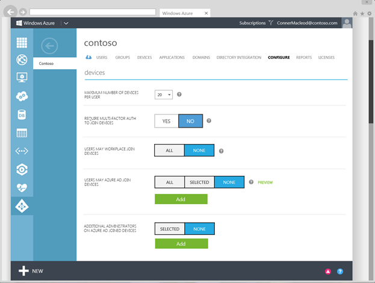

<properties
    pageTitle="Azure AD Join instellen voor gebruikers | Microsoft Azure"
    description="Hier wordt uitgelegd hoe beheerders Azure AD Join kunnen instellen voor on-premises directory- en apparaatregistratie."
    services="active-directory"
    documentationCenter=""
    authors="femila"
    manager="swadhwa"
    editor=""
    tags="azure-classic-portal"/>

<tags
    ms.service="active-directory"
    ms.workload="identity"
    ms.tgt_pltfrm="na"
    ms.devlang="na"
    ms.topic="get-started-article"
    ms.date="09/27/2016"
    ms.author="femila"/>

# Azure AD Join instellen in uw organisatie

Voordat u Azure Active Directory Join (Azure AD Join) instelt, moet u uw on-premises directory van gebruikers synchroniseren met de cloud of handmatig beheerde accounts maken in Azure AD.

Gedetailleerde instructies voor het synchroniseren van uw on-premises gebruikers naar Azure AD zijn te vinden in [Integrating your on-premises identities with Azure Active Directory](active-directory-aadconnect.md) (Engelstalig).

Raadpleeg [Gebruikersaccounts en wachtwoorden](https://msdn.microsoft.com/library/azure/hh967609.aspx) als u handmatig gebruikers wilt maken en beheren in Azure AD.

## Apparaatregistratie instellen
1. Meld u als beheerder aan bij de Azure-portal.
2. Selecteer in het linkerdeelvenster **Active Directory**.
3. Selecteer uw directory op het tabblad **Directory**.
4. Selecteer de tab **Configureren**.
5. Ga naar de sectie **Apparaten**.
6. Stel het volgende in op het tabblad **Apparaten**:  
   * **MAXIMUMAANTAL APPARATEN PER GEBRUIKER**: selecteer het maximumaantal apparaten dat een gebruiker mag hebben in Azure AD.  Als een gebruiker dit quotum bereikt, kan deze persoon geen apparaten meer toevoegen totdat een of meer van de bestaande apparaten zijn verwijderd.
   * **MEERVOUDIGE VERIFICATIE VEREISEN VOOR HET TOEVOEGEN VAN APPARATEN**: hiermee stelt u in of gebruikers een tweede verificatiefactor moeten opgeven om hun apparaat toe te voegen aan Azure AD. Zie [Aan de slag met Azure Multi-Factor Authentication in de cloud](..\multi-factor-authentication\multi-factor-authentication-get-started-cloud.md) voor meer informatie over meervoudige verificatie met Azure.
   * **GEBRUIKERS MOGEN APPARATEN TOEVOEGEN AAN AZURE**: selecteer de gebruikers en groepen die apparaten mogen toevoegen aan Azure AD
   * **EXTRA BEHEERDERS OP AZURE AD MET TOEGEVOEGDE APPARATEN**: met Azure AD Premium of de Enterprise Mobility Suite (EMS) kunt u kiezen welke gebruikers lokale beheerdersrechten ontvangen voor het apparaat. Globale beheerders en eigenaren van de apparaten ontvangen standaard lokale beheerdersrechten.

 

Nadat u Azure AD Join hebt ingesteld voor gebruikers, kunnen ze verbinding maken met Azure AD via hun bedrijfs- of persoonlijke apparaten.

Met de volgende drie scenario's kunt u uw gebruikers in staat stellen Azure AD Join in te stellen:

- Gebruikers voegen rechtstreeks een bedrijfsapparaat toe aan Azure AD.
- Gebruikers voegen via een domein een bedrijfsapparaat toe aan de on-premises Active Directory en breiden het apparaat vervolgens uit naar Azure AD.
- Gebruikers voegen werk- of schoolaccounts toe aan Windows op een persoonlijk apparaat

## Aanvullende informatie
* [Windows 10 for the enterprise: Ways to use devices for work (Engelstalig)](active-directory-azureadjoin-windows10-devices-overview.md)
* [Extending cloud capabilities to Windows 10 devices through Azure Active Directory Join (Engelstalig)](active-directory-azureadjoin-user-upgrade.md)
* [Learn about usage scenarios for Azure AD Join (Engelstalig)](active-directory-azureadjoin-deployment-aadjoindirect.md)
* [Connect domain-joined devices to Azure AD for Windows 10 experiences (Engelstalig)](active-directory-azureadjoin-devices-group-policy.md)
* [Azure AD Join instellen](active-directory-azureadjoin-setup.md)

<!--HONumber=Sep16_HO4-->

