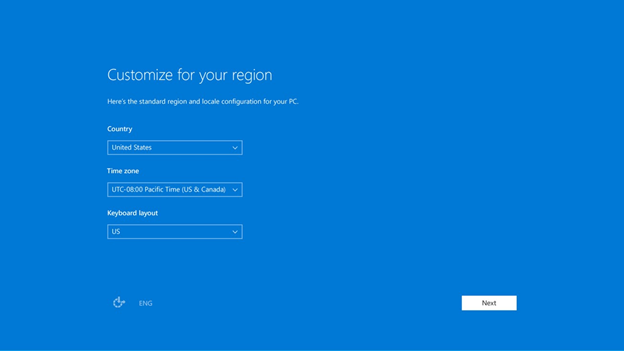
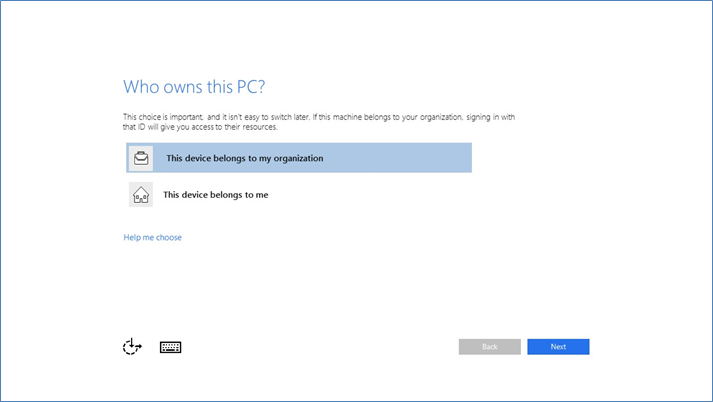
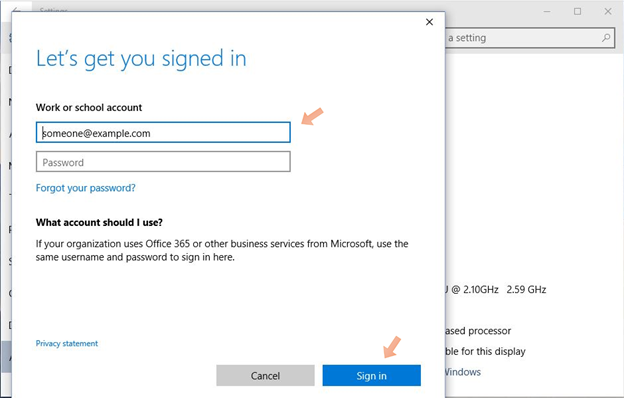

<properties 
    pageTitle="Set up a new device with Azure AD during Setup| Microsoft Azure" 
    description="A topic that explains how users can set up Azure AD Join during their first run experience." 
    services="active-directory" 
    documentationCenter="" 
    authors="femila" 
    manager="stevenpo" 
    editor=""
    tags="azure-classic-portal"/>

<tags 
    ms.service="active-directory" 
    ms.workload="identity" 
    ms.tgt_pltfrm="na" 
    ms.devlang="na" 
    ms.topic="article" 
    ms.date="11/19/2015" 
    ms.author="femila"/>

# Set up a new device with Azure AD during Setup

In Windows 10, end-users can join their device to Azure AD in the first run experience (FRX). This will allow organizations to distribute shrink-wrapped devices to their employees or students, or let them choose their own device (CYOD).
If you install either the Professional or Enterprise SKU for Windows 10, the experience defaults to the setup for company-owned devices.

To join a device to Azure AD
-----------------------------------------------------------------------

1. After the **Getting Ready** stage, you are prompted with the Setup wizard.
2. Start by customizing their region and language, accept the EULA and get online.

 
 
3. Select the network to connect to the internet.
4. Select if it’s a personal device or a company-owned device:
5. Click **this device belongs to my organization**. This starts the Azure AD Join experience. Following is a screen that you see in Windows 10 Professional SKU. 

 

6.  Enter the credentials provided to you by your organization.

 
 
7.  Once you have entered your username, a matching tenant is located in Azure AD. If you are in a federated domain, you will be redirected to your on-premises Secure Token Service (STS) server (for example, AD FS). If you are a user in a non-federated domains, you need to enter your credentials directly on the Azure AD-hosted page. You will also see your organization’s logo and support text if Company Branding was configured.
8.  You will then be prompted for a multi-factor authentication challenge. This is configurable by IT.
9.  Azure AD will then check whether this user/device requires mobile device management (MDM) enrollment. 
10. Windows will then register the device in the organization’s directory in Azure AD and enroll it in MDM.
11. When this is done, if you are a managed user, Windows will wrap up the setup process and take the user to the desktop through the auto-logon.
12. If you are a federated user, you land on the Windows logon screen and have to enter your credentials to log on.

> [AZURE.NOTE] Joining an on-premises Active Directory domain in the Windows out-of-box experience is not supported. Therefore, if you plan to join a PC to a domain, you should select the link “Set up Windows with a local account instead”. You can then join the domain from PC Settings as you’ve done before.

## Additional Information
* [Windows 10 for the enterprise: Ways to use devices for work](active-directory-azureadjoin-windows10-devices-overview.md)
* [Extending cloud capabilities to Windows 10 devices through Azure Active Directory Join](active-directory-azureadjoin-user-upgrade.md)
* [Authenticating identities without passwords through Microsoft Passport](active-directory-azureadjoin-passport.md)
* [Learn about usage scenarios for Azure AD Join](active-directory-azureadjoin-deployment-aadjoindirect.md)
* [Connect domain-joined devices to Azure AD for Windows 10 experiences](active-directory-azureadjoin-devices-group-policy.md)
* [Set up Azure AD Join](active-directory-azureadjoin-setup.md)

