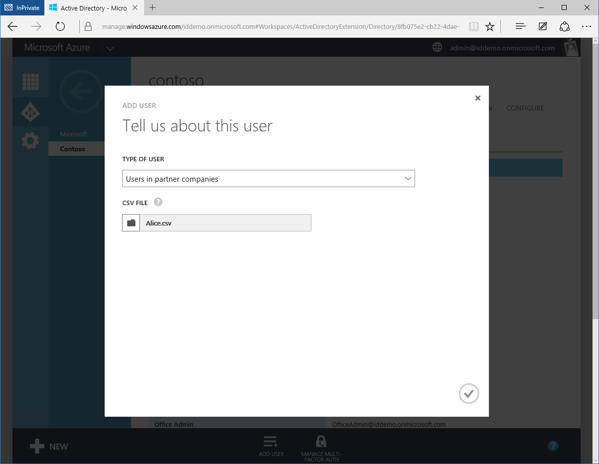
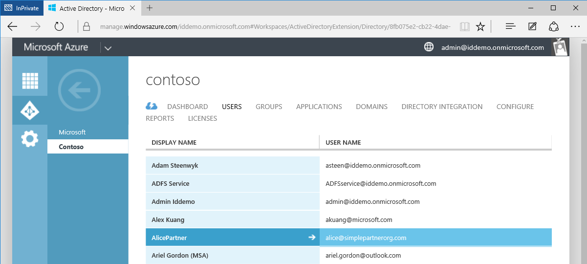
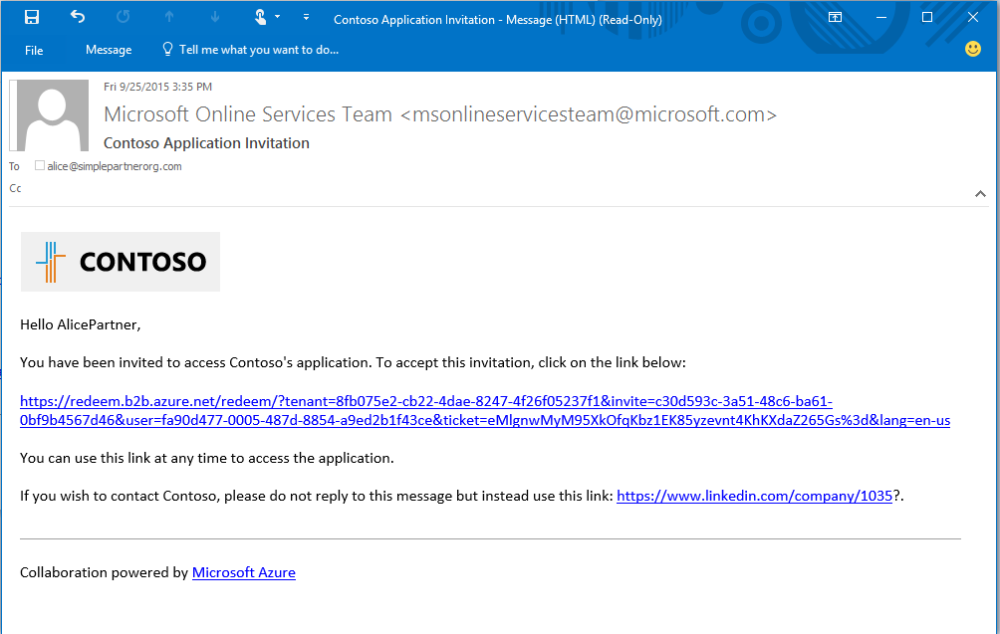
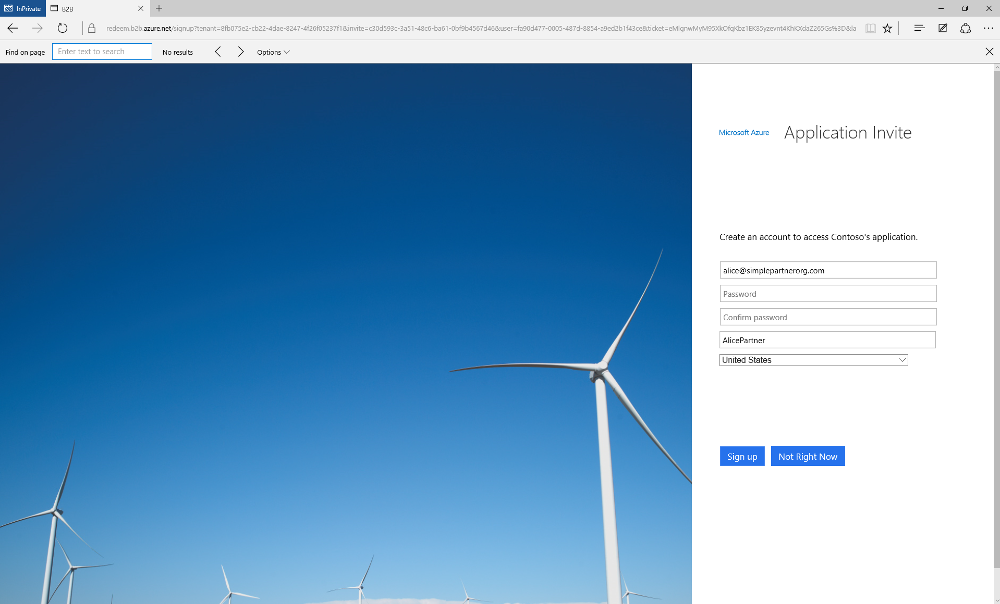
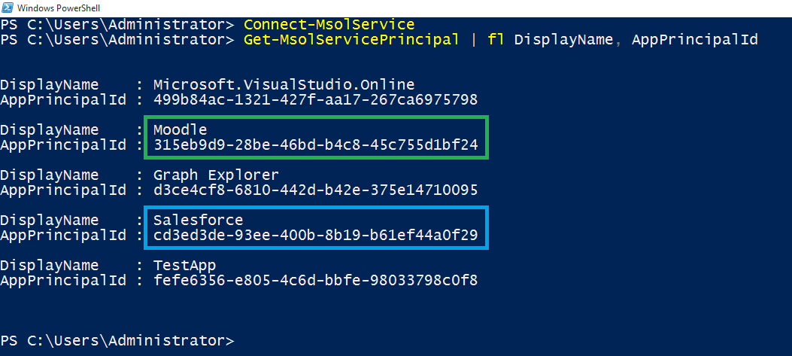
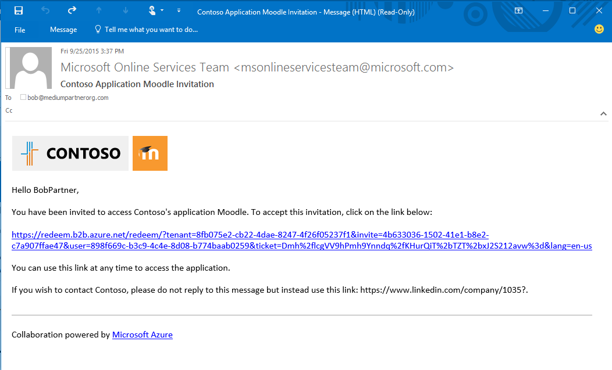
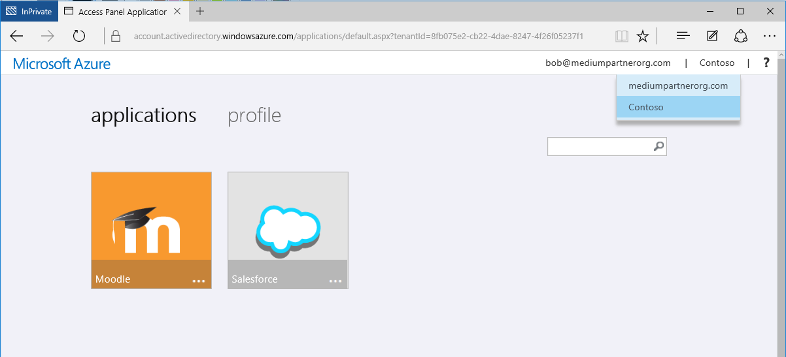
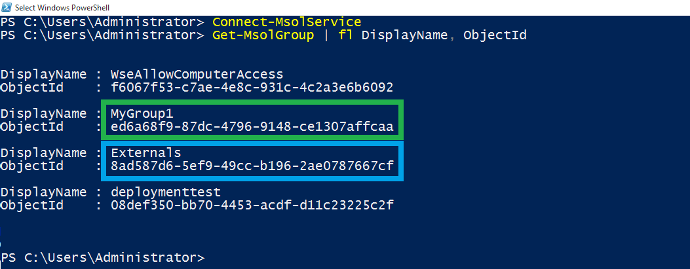
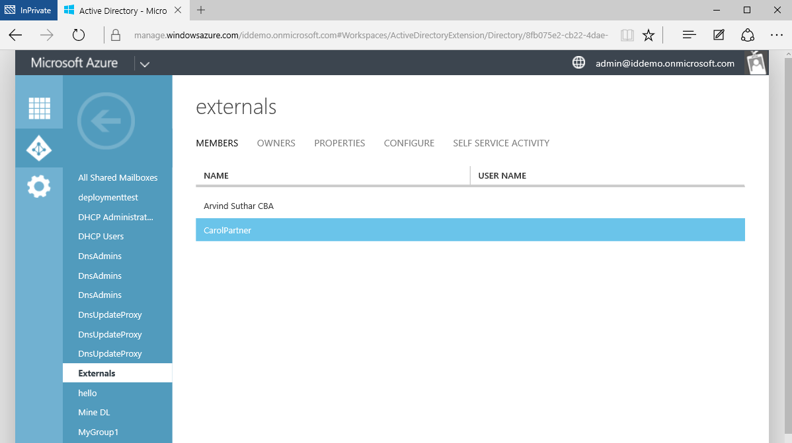

<properties
   pageTitle="Gedetailleerd overzicht van het gebruik van het samenwerkingsvoorbeeld van Azure Active Directory B2B | Microsoft Azure"
   description="Azure Active Directory B2B-samenwerking ondersteunt uw externe bedrijfsrelaties door zakelijke partners selectief toegang te verlenen tot uw zakelijke toepassingen"
   services="active-directory"
   documentationCenter=""
   authors="viv-liu"
   manager="cliffdi"
   editor=""
   tags=""/>

<tags
   ms.service="active-directory"
   ms.devlang="NA"
   ms.topic="get-started-article"
   ms.tgt_pltfrm="NA"
   ms.workload="identity"
   ms.date="05/09/2016"
   ms.author="viviali"/>

# Samenwerkingsvoorbeeld van Azure AD B2B: gedetailleerd overzicht

In dit overzicht wordt getoond hoe u Azure AD B2B-samenwerking kunt gebruiken. Als de IT-beheerder van Contoso willen we toepassingen delen met werknemers van drie partnerbedrijven. Geen van die partnerbedrijven hoeft over Azure AD te beschikken.

- Els van Simpele Partner Org
- Berend van Gemiddelde Partner Org heeft toegang tot een aantal apps nodig
- Carola van Complexe Partner Org heeft toegang tot een aantal apps nodig, evenals lidmaatschap van groepen bij Contoso

Nadat uitnodigingen aan de partnergebruikers zijn gestuurd, kunnen we ze configureren in Azure AD, zodat ze toegang krijgen tot apps en het lidmaatschap van groepen via de Azure-portal. We beginnen met Els toe te voegen.

## Els toevoegen aan de Contoso-directory
1. Maak een CSV-bestand met de koppen die worden weergegeven en vermeld hierin alleen de **Email**, **DisplayName** en **InviteContactUsUrl** van Els. **DisplayName** is de naam die wordt weergegeven in de uitnodiging en ook de naam die wordt weergegeven in de directory Contoso Azure AD. **InviteContactUsUrl** biedt Els een manier om contact op te nemen met Contoso. In het volgende voorbeeld vormt InviteContactUsUrl het LinkedIn-profiel van Contoso. Het is belangrijk om de labels in de eerste rij van het CSV-bestand exact zo te spellen als wordt aangegeven in de [referentie voor de CSV-bestandsindeling](active-directory-b2b-references-csv-file-format.md).  

2. Voeg in de Azure-portal een gebruiker toe aan de Contoso-directory (Active Directory > Contoso > Gebruikers > Gebruiker toevoegen). Selecteer in de vervolgkeuzelijst 'Type gebruiker' de optie 'Gebruikers in partnerbedrijven'. Upload het CSV-bestand. Zorg ervoor dat het CSV-bestand is gesloten voordat u uploadt.  

3. Els wordt nu weergegeven als een externe gebruiker in de directory Contoso Azure AD.  

4. Els ontvangt de volgende e-mail.  

5. Ze klikt op de koppeling en wordt gevraagd de uitnodiging te accepteren en zich aan te melden met haar werkreferenties. Als Els niet is vermeld in de Azure AD-directory, wordt ze gevraagd zich te registreren.  

6. Els wordt doorgestuurd naar het paneel voor apptoegang, dat leeg blijft tot ze toegang heeft gekregen tot apps.  

Deze procedure is de meest eenvoudige vorm van B2B-samenwerking. Als gebruiker in de directory van Contoso Azure AD kan Els toegang krijgen tot toepassingen en groepen via de Azure-portal. Nu gaan we Berend toevoegen, die toegang nodig heeft tot de toepassingen Moodle en Salesforce.

## Berend toevoegen aan de directory van Contoso en hem toegang verlenen tot apps
1. Gebruik Windows PowerShell met de Azure AD-module geïnstalleerd om de toepassings-id's van Moodle en Salesforce te zoeken. De id's kunnen worden opgehaald met de cmdlet: `Get-MsolServicePrincipal | fl DisplayName, AppPrincipalId` Hiermee wordt een lijst weergegeven met alle beschikbare toepassingen in Contoso en hun AppPrincialId's.  

2. Maak een CSV-bestand met de gegevens voor Email en DisplayName, **InviteAppID**, **InviteAppResources** en InviteContactUsUrl van Berend. Vul bij **InviteAppResources** de AppPrincipalId's in voor Moodle en Salesforce. Deze zijn te vinden in PowerShell. Scheid de waarden met een spatie. Vul bij **InviteAppId** dezelfde AppPrincipalId van Moodle in om e-mailberichten en aanmeldingspagina's te voorzien van een Moodle-logo.  

3. Upload het CSV-bestand via de Azure-portal, net zoals dit is gedaan voor Els. Berend is nu een externe gebruiker in de directory Contoso Azure AD.

4. Berend ontvangt de volgende e-mail.  

5. Berend klikt op de koppeling en wordt gevraagd de uitnodiging te accepteren. Nadat hij zich heeft aangemeld, wordt hij naar het toegangspaneel geleid en kan hij Moodle en Salesforce gebruiken.  

Vervolgens voegen we Carola toe. Zij heeft toegang tot toepassingen nodig, evenals lidmaatschap van de groepen in de directory van Contoso.

## Carola toevoegen aan de directory van Contoso, toegang geven tot apps en lidmaatschap geven van een groep

1. Gebruik Windows PowerShell met de Azure AD-module geïnstalleerd om de toepassings- en groeps-id's binnen Contoso te zoeken.
 - Haal de AppPrincipalId op met de cmdlet `Get-MsolServicePrincipal | fl DisplayName, AppPrincipalId`, net als bij Berend
 - ObjectId voor groepen ophalen met de cmdlet `Get-MsolGroup | fl DisplayName, ObjectId`. Hiermee wordt een lijst weergegeven van alle groepen in Contoso en hun ObjectId's. Groeps-id's kunnen ook worden opgehaald als de Object-id op het tabblad Eigenschappen van de groep in de Azure-portal.  

2. Maak een CSV-bestand met de waarden voor Email, DisplayName, InviteAppID, InviteAppResources, **InviteGroupResources** en InviteContactUsUrl van Carola. Bij **InviteGroupResources** worden de ObjectId's ingevuld van de groepen MyGroup1 en Externals, gescheiden door een spatie.  

3. Upload het CSV-bestand via de Azure-portal.

4. Carola is een gebruiker in de directory van Contoso en is ook lid van de groepen MyGroup1 en Externals, zoals te zien is in de Azure-portal.  

5. Carola ontvangt een e-mail met een koppeling waarmee zij de uitnodiging kan accepteren. Nadat zij zich heeft aangemeld, wordt ze omgeleid naar het paneel voor apptoegang, waar ze toegang heeft tot Moodle en Salesforce.  

Op deze eenvoudige manier kunnen gebruikers van partnerbedrijven worden toegevoegd met Azure AD B2B-samenwerking. In dit overzicht hebben we u laten zien hoe de gebruikers Els, Berend en Carola werden toegevoegd aan de directory van Contoso door middel van drie verschillende CSV-bestanden. Dit proces kan eenvoudiger worden gemaakt door de afzonderlijke CSV-bestanden samen te voegen tot één bestand.  

## Verwante artikelen:
Lees ook onze andere artikelen over Azure AD B2B-samenwerking:

- [Wat is Azure AD B2B-samenwerking? (Engelstalig artikel)](active-directory-b2b-what-is-azure-ad-b2b.md)
- [How it works (Engelstalig artikel)](active-directory-b2b-how-it-works.md)
- [Referentie voor de CSV-bestandsindeling (Engelstalig artikel)](active-directory-b2b-references-csv-file-format.md)
- [External user token format (Engelstalig)](active-directory-b2b-references-external-user-token-format.md)
- [External user object attribute changes (Engelstalig)](active-directory-b2b-references-external-user-object-attribute-changes.md)
- [Current preview limitations (Engelstalig)](active-directory-b2b-current-preview-limitations.md)
- [Article Index for Application Management in Azure Active Directory (Engelstalig)](active-directory-apps-index.md)

<!--HONumber=Jun16_HO2-->

