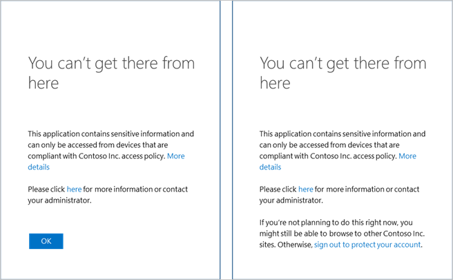
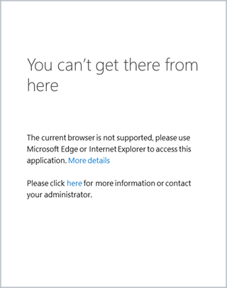

<properties
    pageTitle="Herstel van gebruiker bij het openen van toepassingen die zijn beveiligd met op apparaat gebaseerde voorwaardelijke toegang van Azure AD| Microsoft Azure"
    description="Dit onderwerp helpt u vaststellen of er herstelstappen zijn die u kunt volgen om toegang te krijgen tot bepaalde toepassingen."
    services="active-directory"
    keywords="voorwaardelijke toegang op basis van een apparaat, apparaatregistratie, apparaatregistratie inschakelen, apparaatregistratie en MDM"
    documentationCenter=""
    authors="markusvi"
    manager="femila"
    editor=""/>

<tags
    ms.service="active-directory"
    ms.workload="identity"
    ms.tgt_pltfrm="na"
    ms.devlang="na"
    ms.topic="get-started-article"
    ms.date="08/15/2016"
    ms.author="markvi"/>

# Herstel van gebruiker bij het openen van toepassingen die zijn beveiligd met op apparaat gebaseerde voorwaardelijke toegang van Azure AD

De pagina Toegang geweigerd wordt weergegeven wanneer u een toepassing opent, bijvoorbeeld Office 365 SharePoint Online.  
Wat kunt u doen?

Deze gids helpt u vaststellen of er herstelstappen zijn die u kunt volgen om toegang te krijgen tot bepaalde toepassingen.

Op welk apparaatplatform wordt uw apparaat uitgevoerd?
Het antwoord op deze vraag bepaalt welke sectie u moet raadplegen:
 

-   Windows-apparaat

-   iOS-apparaat (iPhone of iPad)

-   Android-apparaat

## Toegang vanaf een Windows-apparaat

Als het apparaat een Windows 10-, Windows 8.1-, Windows 8.0-, Windows 7-, Windows Server 2016-, Windows Server 2012 R2-, Windows Server 2012- of Windows Server 2008 R2-apparaat is, kiest u de oorzaak die op u van toepassing is, door de pagina te identificeren die werd weergegeven toen u de toepassing probeerde te openen.

### Apparaat is niet geregistreerd

Als uw apparaat niet is geregistreerd bij Azure Active Directory en de toepassing is beveiligd met een beleid op basis van apparaten, wordt mogelijk een pagina met de volgende inhoud weergegeven:

 

Als het apparaat is toegevoegd aan een Active Directory-domein van uw organisatie, kunt u het volgende proberen:

1.  Zorg ervoor dat u bij Windows bent aangemeld met uw werkaccount (Active Directory-account).

2.  Maak via VPN of directe toegang verbinding met uw bedrijfsnetwerk.

3.  Wanneer u verbinding hebt, vergrendelt u uw Windows-sessie door op Windows-toets + L te drukken.

4.  Ontgrendel de Windows-sessie door de referenties voor uw werkaccount in te voeren.

5.  Wacht even en probeer dan opnieuw of u de toepassing kunt openen.

6.  Als dezelfde pagina wordt weergegeven, neem dan contact op met uw beheerder en geef de details op die worden weergegeven wanneer u op de koppeling Meer informatie klikt.

Als uw apparaat niet is verbonden met een domein en Windows 10 op het apparaat wordt uitgevoerd, hebt u twee opties: 

1. Azure AD Join uitvoeren
2. Voeg uw werk- of schoolaccount toe aan Windows. 

Zie [Using Windows 10 devices in your workplace](active-directory-azureadjoin-windows10-devices.md) (Windows 10-apparaten gebruiken op uw werkplek) voor informatie over de verschillen tussen de twee.

Ga als volgt te werk als u Azure AD Join wilt uitvoeren (niet beschikbaar in Windows Phone):

**Windows 10 Jubileumupdate**   

1.  Start de app Instellingen.

2.  Ga naar Accounts en vervolgens naar Werk- of schoolaccount openen.

3.  Klik op Verbinden.

4.  Kies onder aan de pagina de optie Dit apparaat toevoegen aan Azure Active Directory.

5.  Verifieer uzelf bij de organisatie, lever indien nodig MFA-bewijs en voer alle stappen uit.

6.  Meld u af en weer aan met uw werkaccount.

7.  Probeer opnieuw toegang te krijgen tot de toepassing.

**Windows 10-update van november 2015**

1.  Start de app Instellingen.

2.  Ga naar Systeem en vervolgens naar Info.
    
3.  Klik op Lid worden van Azure AD.

4.  Verifieer uzelf bij de organisatie, lever indien nodig MFA-bewijs en voer alle stappen uit.

5.  Meld u af en weer aan met uw werkaccount (Azure AD-account).

6.  Probeer opnieuw toegang te krijgen tot de toepassing.

Ga als volgt te werk om uw werk- of schoolaccount toe te voegen aan Windows:

**Windows 10 Jubileumupdate**   

1.  Start de app Instellingen.

2.  Ga naar Accounts en vervolgens naar Werk- of schoolaccount openen.

3.  Klik op Verbinden.

4.  Verifieer uzelf bij de organisatie, lever indien nodig MFA-bewijs en voer alle stappen uit.

5.  Probeer opnieuw toegang te krijgen tot de toepassing.    

**Windows 10-update van november 2015**
    
1.  Start de app Instellingen.
2.  Ga naar Accounts en vervolgens naar Uw accounts.
3.  Klik op Werk- of schoolaccount toevoegen.
4.  Verifieer uzelf bij de organisatie, lever indien nodig MFA-bewijs en voer alle stappen uit.
5.  Probeer opnieuw toegang te krijgen tot de toepassing.

Als uw apparaat geen lid is van een domein en Windows 8.1 op het apparaat wordt uitgevoerd, kunt u Workplace Join uitvoeren en het apparaat als volgt inschrijven bij Microsoft Intune:

1.  Start Pc-instellingen.

2.  Ga naar Netwerk en vervolgens naar Werkplek.

3.  Klik op Lid worden.

4.  Verifieer uzelf bij de organisatie, lever indien nodig MFA-bewijs en voer alle stappen uit.

5.  Klik op Inschakelen.

6.  Wachten tot het proces is voltooid.

7.  Probeer opnieuw toegang te krijgen tot de toepassing.

## Niet-ondersteunde browser

Als u de toepassing probeert te openen vanuit een van de volgende browsers, wordt er een pagina weergegeven zoals hieronder:

1.  Chrome, Firefox of een andere browser die niet Microsoft Edge of Microsoft Internet Explorer in Windows 10 of Windows Server-2016 is.

2.  Firefox in Windows 8.1, Windows 7, Windows Server 2012 R2, Windows Server 2012 of Windows Server 2008 R2.
 

De enige herstelmogelijkheid is een browser te gebruiken die door uw apparaatplatform wordt ondersteund.

## Toegang vanaf een iOS-apparaat

Binnenkort vindt u hier instructies voor iPhone en iPad.

## Toegang vanaf een Android-apparaat

Binnenkort vindt u hier instructies voor Android-telefoons en -tablets.

## Volgende stappen

[Voorwaardelijke toegang van Azure Active Directory](active-directory-conditional-access.md)

<!--HONumber=ago16_HO4-->

