<properties
   pageTitle="Azure Active Directory-rapportage - preview | Microsoft Azure"
   description="Bevat een lijst met de diverse beschikbare rapporten voor Azure Active Directory-previews"
   services="active-directory"
   documentationCenter=""
   authors="markusvi"
   manager="femila"
   editor=""/>

<tags
   ms.service="active-directory"
   ms.devlang="na"
   ms.topic="get-started-article"
   ms.tgt_pltfrm="na"
   ms.workload="identity"
   ms.date="09/12/2016"
   ms.author="markvi"/>

# Azure Active Directory-rapportage - preview

*Deze documentatie maakt deel uit van de [Azure Active Directory-rapportagegids](active-directory-reporting-guide.md).*

Met rapportage in de Azure Active Directory-preview ziet u alle informatie die u nodig hebt om te bepalen hoe het met uw omgeving gaat. [Wat staat er in het voorbeeld?](active-directory-preview-explainer.md)

Er zijn twee hoofdonderwerpen waarover wordt gerapporteerd:

- **Aanmeldactiviteiten**: informatie over het gebruik van beheerde toepassingen en aanmeldactiviteiten van gebruikers

- **Systeemactiviteiten**: controle-informatie over gebruikers, groepsbeheer, uw beheerde toepassingen en directory-activiteiten

Afhankelijk van het bereik van de gegevens die u zoekt, kunt u de rapporten openen door op **Gebruikers en groepen** of **Bedrijfstoepassingen** te klikken in de lijst met services in [Azure Portal](https://portal.azure.com).

## Aanmeldactiviteiten

### Aanmeldactiviteiten van gebruikers

In de informatie die wordt aangeboden in het rapport over aanmeldactiviteiten van gebruikers, vindt u antwoord op vragen zoals:

- Wat is het aanmeldingspatroon van een gebruiker?
- Hoeveel keer hebben gebruikers zich aangemeld gedurende een week?
- Wat is de status van deze aanmeldingen?

Uw beginpunt voor deze gegevens is de aanmeldingsgrafiek van gebruikers in het gedeelte **Overzicht** onder **Gebruikers en groepen**.

 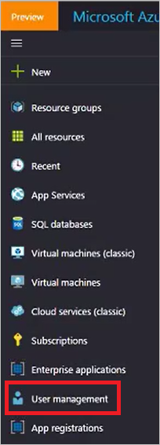

In de aanmeldingsgrafiek van gebruikers ziet u alle aanmeldingen van alle gebruikers gedurende een bepaalde periode. De standaard ingestelde periode is 30 dagen.

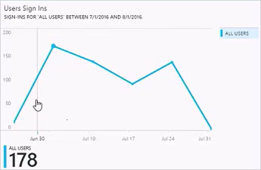

Als u op een dag in de aanmeldingsgrafiek klikt, ziet u een gedetailleerd overzicht van de aanmeldactiviteiten.

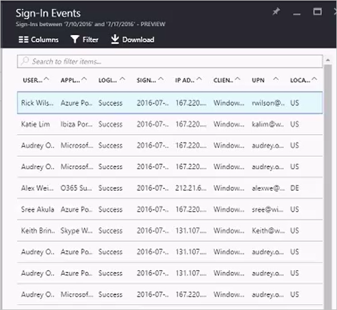

Elke rij in de lijst met aanmeldactiviteiten bevat gedetailleerde informatie over de geselecteerde aanmelding, zoals:

- Wie heeft zich aangemeld?

- Wat was de gerelateerde UPN?

- Welke toepassing was het aanmeldingsdoel?

- Wat is het IP-adres van de persoon die zich heeft aangemeld?

- Wat is de status van de aanmelding?

### Het gebruik van beheerde toepassingen

Met een toepassingsgerichte weergave van uw aanmeldgegevens kunt u antwoord vinden op vragen zoals:

- Wie gebruikt mijn toepassingen?

- Wat zijn de drie meest gebruikte toepassingen in uw organisatie?

- Ik heb onlangs een toepassing geïmplementeerd. Hoe gaat het ermee?

Uw beginpunt voor deze gegevens is het overzicht van de drie populairste toepassingen in uw organisatie volgens het rapport van de laatste 30 dagen. Het overzicht vindt u in het gedeelte **Overzicht** onder **Bedrijfstoepassingen**.

 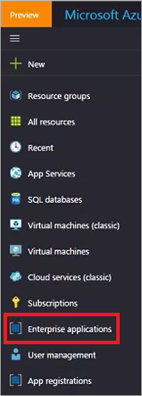

In de grafiek over appgebruik staat een wekelijks overzicht van alle aanmeldingen bij de drie populairste toepassingen gedurende een bepaalde periode. De standaard ingestelde periode is 30 dagen.

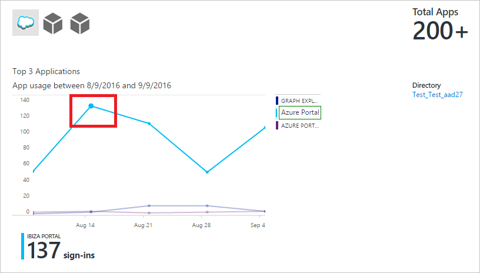

Als u wilt, kunt u de focus instellen op een specifieke toepassing.

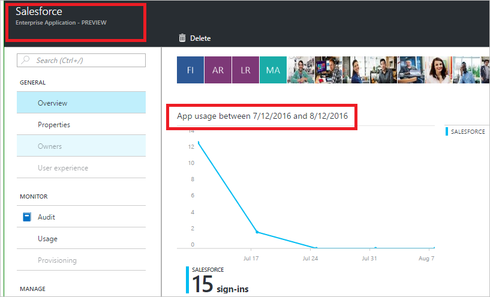

Als u op een dag in de appgebruikgrafiek klikt, ziet u een gedetailleerd overzicht van de aanmeldactiviteiten.

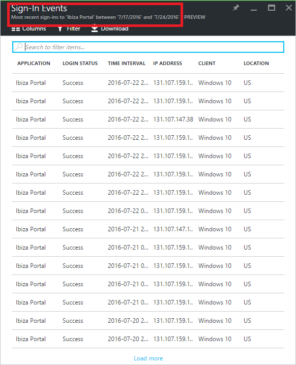

Met de optie **Aanmeldingen** krijgt u een volledig overzicht van alle aanmeldingsgebeurtenissen voor uw toepassingen.

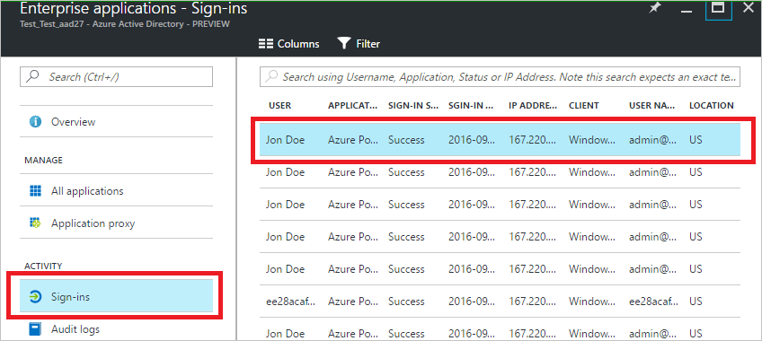

Met de kolomkiezer kunt u kiezen welke gegevensvelden u wilt weergeven.

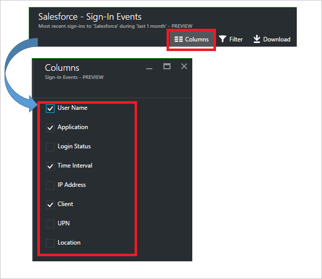

### Aanmeldingen filteren

U kunt de aanmeldingen filteren op een bepaalde periode om de hoeveelheid weergegeven gegevens te beperken.

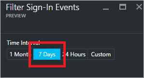

Een andere manier waarop u het aantal aanmeldactiviteiten kunt filteren, is door te zoeken naar specifieke vermeldingen.
Met deze zoekmethode kunt u zoeken naar aanmeldingen van specifieke **gebruikers** of **groepen** en bij specifieke **toepassingen**.

## Systeemactiviteiten

In de controlelogboeken in Azure Active Directory staan records van systeemactiviteiten voor naleving.

Er zijn drie hoofdcategorieën voor controlegerelateerde activiteiten in Azure Portal:

- Gebruikers en groepen   

- Toepassingen

- Directory   

Zie de [lijst met rapporten over controlegebeurtenissen](active-directory-reporting-audit-events.md#list-of-audit-report-events) voor een volledig overzicht van alle rapporten over controleactiviteiten.

Uw beginpunt voor alle controlegegevens is **Controlelogboeken** in het gedeelte **Activiteit** van **Azure Active Directory**.

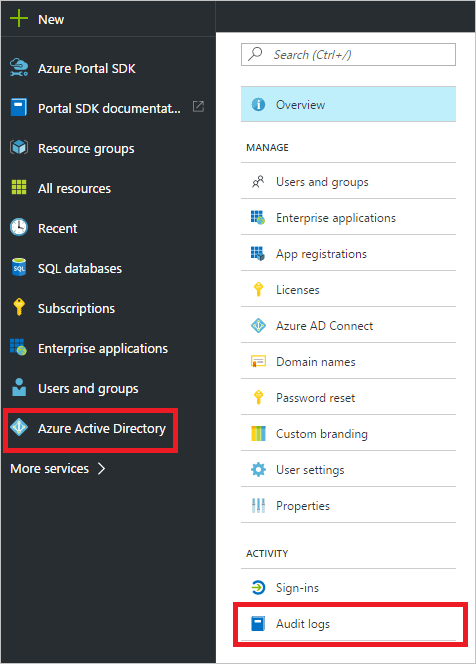

Een controlelogboek heeft een lijstweergave met daarin de actoren (wie), de activiteiten (wat) en de doelen.

Wanneer u op een item in de lijstweergave klikt, krijgt u er meer informatie over te zien.

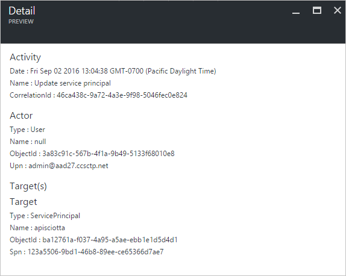

### Controlelogboeken voor gebruikers en groepen

Met de controlerapporten op basis van gebruikers en groepen krijgt u antwoord op vragen zoals:

- Welke soorten updates zijn toegepast op de gebruikers?

- Hoeveel gebruikers zijn gewijzigd?

- Hoeveel wachtwoorden zijn gewijzigd?

- Wat heeft een beheerder in een directory gedaan?

- Welke groepen zijn toegevoegd?

- Zijn er groepen met wijzigingen in het lidmaatschap?

- Zijn de eigenaren van een groep gewijzigd?

- Welke licenties zijn toegewezen aan een groep of een gebruiker?

Als u alleen de controlegegevens wilt bekijken die zijn gerelateerd aan gebruikers en groepen, kunt u een gefilterde weergave openen via **Controlelogboeken** in het gedeelte **Activiteit** van **Gebruikers en groepen**.

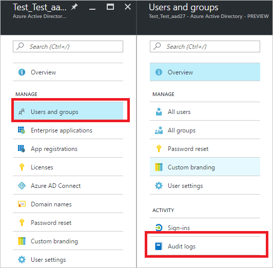

### Controlelogboeken van toepassingen

Met de controlerapporten op basis van toepassingen krijgt u antwoord op vragen zoals:

- Welke toepassingen zijn toegevoegd of bijgewerkt?

- Welke toepassingen zijn verwijderd?

- Is de service-principal van een toepassing gewijzigd?

- Zijn de namen van toepassingen gewijzigd?

- Wie heeft toestemming gegeven voor een toepassing?

Als u alleen de controlegegevens wilt bekijken die zijn gerelateerd aan toepassingen, kunt u een gefilterde weergave openen via **Controlelogboeken** in het gedeelte **Activiteit** van **Bedrijfstoepassingen**.

### Controlelogboeken filteren

U kunt in een controlerapport filteren op een bepaalde periode om de hoeveelheid weergegeven gegevens te beperken.

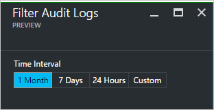

Een andere manier waarop u de vermeldingen in een controlelogboek kunt filteren, is door te zoeken naar specifieke vermeldingen.

## Volgende stappen

Zie de [Azure Active Directory-rapportagegids](active-directory-reporting-guide.md).

<!--HONumber=Sep16_HO3-->

