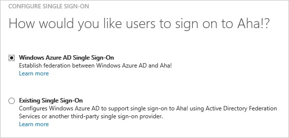
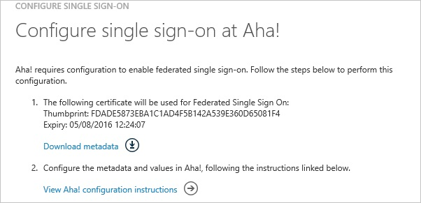
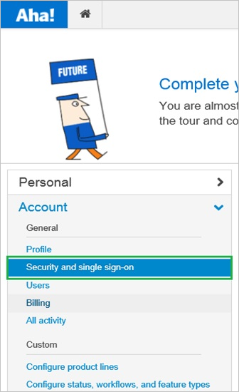
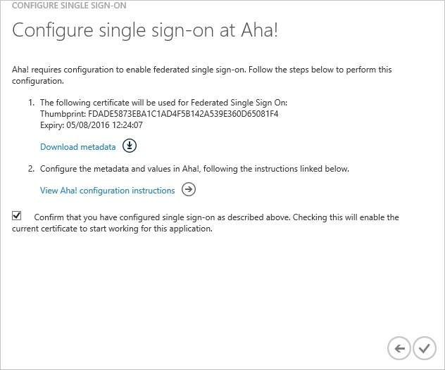

<properties pageTitle="教學課程：Azure Active Directory 與 Aha! 整合 | Microsoft Azure" description="了解如何使用 Aha! 搭配 Azure Active Directory 來啟用單一登入、自動化佈建和更多功能！" services="active-directory" authors="MarkusVi"  documentationCenter="na" manager="stevenpo"/>
<tags ms.service="active-directory" ms.devlang="na" ms.topic="article" ms.tgt_pltfrm="na" ms.workload="identity" ms.date="08/01/2015" ms.author="markvi" />
#教學課程：Azure Active Directory 與 Aha! 整合
>[AZURE.TIP]如需意見反應，請按一下[這裡](http://go.microsoft.com/fwlink/?LinkId=550992)。

本教學課程的目的是要示範 Azure 與 Aha! 的整合。 本教學課程中說明的案例假設您已經具有下列項目：

-   有效的 Azure 訂閱
-   啟用 Aha! 單一登入的訂用帳戶

完成本教學課程之後，您指派給 Aha! 的 Azure AD 使用者就能夠單一登入您 Aha! 公司網站 (服務提供者起始登入) 的應用程式，或是使用[存取面板簡介](https://msdn.microsoft.com/library/dn308586)進行單一登入。

本教學課程中說明的案例由下列建置組塊組成：

1.  啟用 Aha! 的應用程式整合
2.  設定單一登入
3.  設定使用者佈建
4.  指派使用者

##啟用 Aha! 的應用程式整合

本節的目的是概述如何啟用 Aha! 的應用程式整合。

###若要啟用 Aha! 的應用程式整合，請執行下列步驟：

1.  在 Azure 管理入口網站的左方瀏覽窗格中，按一下 [Active Directory]。

    

2.  從 [目錄] 清單中，選取要啟用目錄整合的目錄。

3.  若要開啟應用程式檢視，請在目錄檢視中，按一下頂端功能表中的 [應用程式]。

    ![[應用程式]](./media/active-directory-saas-aha-tutorial/IC700994.png "[應用程式]")

4.  按一下頁面底部的 [新增]。

    

5.  在 [欲執行動作] 對話方塊中，按一下 [從組件庫新增應用程式]。

    

6.  在**搜尋方塊**中，輸入 **Aha!**。

    

7.  在結果窗格中，選取 [Aha!]，然後按一下 [完成] 加入應用程式。

    
##設定單一登入

本節的目的是概述如何依據 SAML 通訊協定來使用同盟，讓使用者能夠以自己的 Azure AD 帳戶在 Aha! 中進行驗證。

###若要設定單一登入，請執行下列步驟：

1.  在 Azure AD 入口網站的 [Aha!] 應用程式整合頁面上，按一下 [設定單一登入] 開啟 [設定單一登入] 對話方塊。

    

2.  在 [要如何讓使用者登入 Aha!] 頁面上，選取 [Microsoft Azure AD 單一登入]，然後按 [下一步]。

    

3.  在 [設定應用程式 URL] 頁面的 [Aha! 登入 URL] 文字方塊中，輸入使用者用來登入 Aha! 應用程式的 URL (例如："**https://company.aha.io/session/new*"))，然後按 [下一步]。

    

4.  在 [設定在 Aha! 單一登入] 頁面上，按一下 [下載中繼資料] 下載您的中繼資料檔，然後將中繼資料檔儲存在您的本機電腦中。

    

5.  在不同的 Web 瀏覽器視窗中，以系統管理員身分登入您的 Aha! 公司網站。

6.  在頂端的功能表中，按一下 [設定]。

    

7.  按一下 [帳戶]。

    

8.  按一下 [安全性和單一登入]。

    

9.  在 [單一登入] 區段中，針對 [識別提供者] 選取 [SAML2.0]。

    

10. 在 [單一登入] 組態頁面上，執行下列步驟：

    

    1.  在 [名稱] 文字方塊中，輸入您的組態名稱。
    2.  針對 [設定使用]，選取 [中繼資料檔]。
    3.  若要上傳您下載的中繼資料檔，請按一下 [瀏覽]。
    4.  按一下 [更新]。

11. 在 Azure AD 入口網站上，選取單一登入組態確認，然後按一下 [完成] 以關閉 [設定單一登入] 對話方塊。

    
##設定使用者佈建

若要讓 Azure AD 使用者能夠登入 Aha!，必須將他們佈建到 Aha!。Aha! 的佈建是自動化工作。沒有您適用的動作項目。
  
第一次嘗試單一登入時，會視需要自動建立使用者。

>[AZURE.NOTE]您可以使用任何其他的 Aha! 使用者帳戶建立工具或 Aha! 提供的 API 來佈建 AAD 使用者帳戶。

##指派使用者

若要測試您的組態，則需指派您所允許使用您應用程式的 Azure AD 使用者，藉此授予其存取組態的權限。

###若要將使用者指派到 Aha!，請執行下列步驟：

1.  在 Azure AD 入口網站中建立測試帳戶。

2.  在 [Aha!] 應用程式整合頁面上，按一下 [指派使用者]。

    

3.  選取測試使用者，按一下 [指派]，然後按一下 [是] 確認指派。

    

如果要測試您的單一登入設定，請開啟存取面板。如需存取面板的詳細資訊，請參閱[存取面板簡介](https://msdn.microsoft.com/library/dn308586)。

<!---HONumber=August15_HO7-->