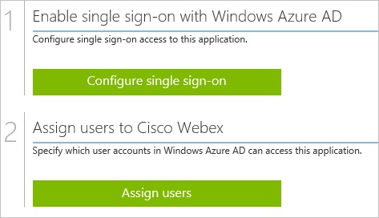
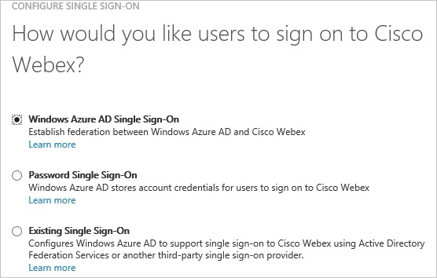
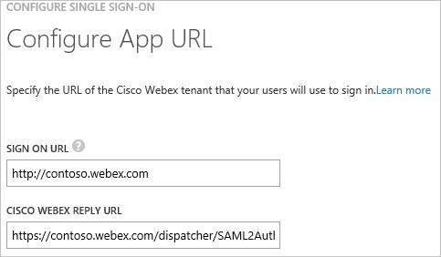
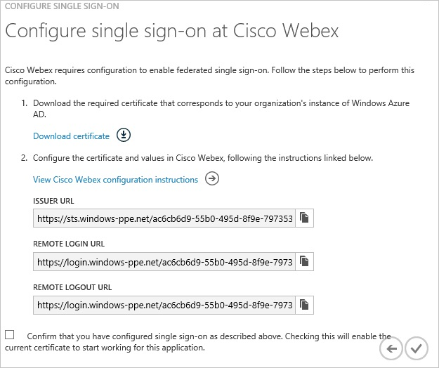
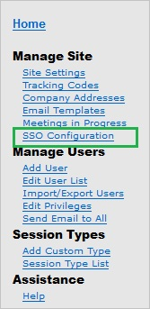
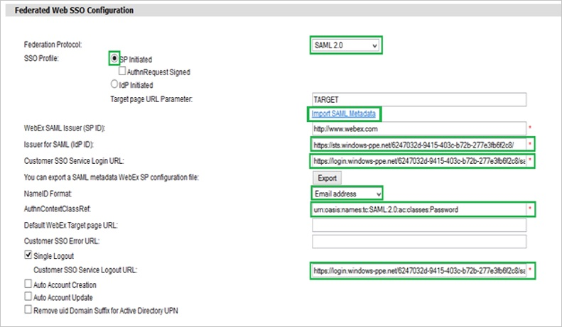
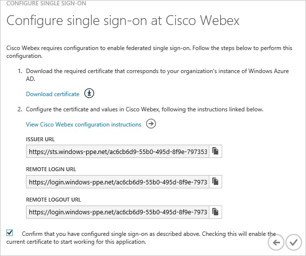
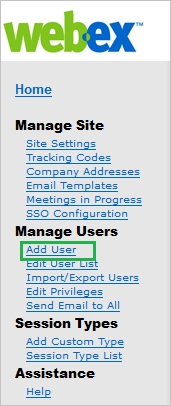
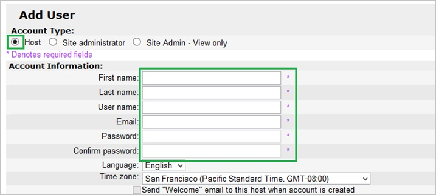

<properties pageTitle="教學課程：Azure Active Directory 與 Cisco Webex 整合 | Microsoft Azure" description="了解如何使用 Cisco Webex 搭配 Azure Active Directory 來啟用單一登入、自動化佈建和更多功能！" services="active-directory" authors="MarkusVi"  documentationCenter="na" manager="stevenpo"/>
<tags ms.service="active-directory" ms.devlang="na" ms.topic="article" ms.tgt_pltfrm="na" ms.workload="identity" ms.date="08/01/2015" ms.author="markvi" />
#教學課程：Azure Active Directory 與 Cisco Webex 整合
>[AZURE.TIP]如需意見反應，請按一下[這裡](http://go.microsoft.com/fwlink/?LinkId=524907)。

本教學課程的目的是要示範 Azure 與 Cisco Webex 的整合。本教學課程中說明的案例假設您已經具有下列項目：

-   有效的 Azure 訂閱
-   Cisco Webex 租用戶

完成本教學課程之後，或是使用[存取面板簡介](https://msdn.microsoft.com/library/dn308586)，您指派給 Cisco Webex 的 Azure AD 使用者就能夠單一登入您 Cisco Webex 公司網站 (服務提供者起始登入) 的應用程式。

本教學課程中說明的案例由下列建置組塊組成：

1.  啟用 Cisco Webex 的應用程式整合
2.  設定單一登入
3.  設定使用者佈建
4.  指派使用者

##啟用 Cisco Webex 的應用程式整合

本節的目的是要說明如何啟用 Cisco Webex 的應用程式整合。

###若要啟用 Cisco Webex 的應用程式整合，請執行下列步驟：

1.  在 Azure 管理入口網站的左方瀏覽窗格中，按一下 [Active Directory]。

    

2.  從 [目錄] 清單中，選取要啟用目錄整合的目錄。

3.  若要開啟應用程式檢視，請在目錄檢視中，按一下頂端功能表中的 [應用程式]。

    ![[應用程式]](./media/active-directory-saas-cisco-webex-tutorial/IC700994.png "[應用程式]")

4.  按一下頁面底部的 [新增]。

    

5.  在 [欲執行動作] 對話方塊中，按一下 [從組件庫新增應用程式]。

    

6.  在**搜尋方塊**中，輸入 **Cisco Webex**。

    

7.  在結果窗格中，選取 [Cisco Webex]，然後按一下 [完成] 以加入應用程式。

    
##設定單一登入

本節的目的是要說明如何依據 SAML 通訊協定來使用同盟，讓使用者能夠用自己的 Azure AD 帳戶在 Cisco Webex 中進行驗證。  
在這個程序中，您必須建立 base-64 編碼的憑證。  
如果您不熟悉這個程序，請參閱[如何將二進位憑證轉換成文字檔](http://youtu.be/PlgrzUZ-Y1o)

###若要設定單一登入，請執行下列步驟：

1.  在 Azure AD 入口網站的 [Cisco Webex] 應用程式整合頁面上，按一下 [設定單一登入] 來開啟 [設定單一登入] 對話方塊。

    

2.  在 [要如何讓使用者登入 Cisco Webex] 頁面上，選取 [Microsoft Azure AD 單一登入]，然後按 [下一步]。

    

3.  在 [設定應用程式 URL] 頁面上，執行下列步驟，然後按 [下一步]。

    

    1.  在 [登入 URL] 文字方塊中，輸入您的 Cisco Webex 租用戶 URL (例如：**http://contoso.webex.com*))。
2.  在 [Cisco Webex 回覆 URL] 文字方塊中，輸入您的 **Cisco Webex AssertionConsumerService URL** (例如：**https://company.webex.com/dispatcher/SAML2AuthService?siteurl=company*))。

4.  於 [在 Cisco Webex 設定單一登入] 頁面上，按 [下載憑證] 以下載您的憑證，然後將憑證檔案儲存在您的電腦中。

    

5.  在不同的網頁瀏覽器視窗中，以系統管理員身分登入您的 Cisco Webex 公司網站。

6.  在頂端的功能表中，按一下 [網站管理]。

    

7.  在 [管理網站] 區段中，按一下 [SSO 組態]。

    

8.  在 [同盟網頁 SSO 組態] 區段中，執行下列步驟：

    

    1.  從 [同盟通訊協定] 清單中選取 [SAML 2.0]。
    2.  從您下載的憑證建立 **Base-64 編碼**檔案。  

        >[AZURE.TIP]如需詳細資訊，請參閱[如何將二進位憑證轉換成文字檔](http://youtu.be/PlgrzUZ-Y1o)

    3.  在記事本中開啟 base-64 編碼的憑證，然後複製其內容。
    4.  按一下 [匯入 SAML 中繼資料]，然後貼上 base-64 編碼的憑證。
    5.  在 Azure 入口網站的 [在 Cisco Webex 設定單一登入] 對話頁面上，複製**簽發者 URL** 值，然後將它貼至 [SAML 的簽發者 (IdP 識別碼)] 文字方塊中。
    6.  在 Azure 入口網站的 [在 Cisco Webex 設定單一登入] 對話頁面上，複製**遠端登入 URL** 值，然後將它貼至 [客戶 SSO 服務登入 URL] 文字方塊中。
    7.  從 [NameID 格式] 清單中選取 [電子郵件地址]。
    8.  在 [AuthnContextClassRef] 文字方塊中，輸入 **urn:oasis:names:tc:SAML:2.0:ac:classes:Password**。
    9.  在 Azure 入口網站的 [在 Cisco Webex 設定單一登入] 對話頁面上，複製**遠端登出 URL** 值，然後將它貼至 [客戶 SSO 服務登出 URL] 文字方塊中。
    10. 按一下 [更新]。

9.  在 Azure 入口網站的 [在 Cisco Webex 設定單一登入] 對話頁面上，選取單一登入組態確認，然後按一下 [完成]。

    
##設定使用者佈建

若要讓 Azure AD 使用者可以登入 Cisco Webex，則必須將他們佈建到 Cisco Webex。Cisco Webex 需以手動方式佈建。

###若要佈建使用者帳戶，請執行下列步驟：

1.  登入您的 **Cisco Webex** 租用戶。

2.  移至 [管理使用者] > [加入使用者]。

    

3.  在 [加入使用者] 區段中，執行下列步驟：

    

    1.  針對 [帳戶類型]，選取 [主機]。
    2.  在下列文字方塊中，輸入現有 Azure AD 使用者的資訊：**名字、姓氏**、**使用者名稱**、**電子郵件**、**密碼**、**確認密碼**。
    3.  按一下 [新增]。

>[AZURE.NOTE]您可以使用任何其他的 Cisco Webex 使用者帳戶建立工具或 Cisco Webex 提供的 API 來佈建 AAD 使用者帳戶。

##指派使用者

若要測試您的組態，則需指派您所允許使用您應用程式的 Azure AD 使用者，藉此授予其存取組態的權限。

###若要將使用者指派給 Cisco Webex，請執行下列步驟：

1.  在 Azure AD 入口網站中建立測試帳戶。

2.  在 [Cisco Webex] 應用程式整合頁面上，按一下 [指派使用者]。

    

3.  選取測試使用者，按一下 [指派]，然後按一下 [是] 確認指派。

    

如果要測試您的單一登入設定，請開啟存取面板。如需存取面板的詳細資訊，請參閱[存取面板簡介](https://msdn.microsoft.com/library/dn308586)。

<!------HONumber=August15_HO7-->