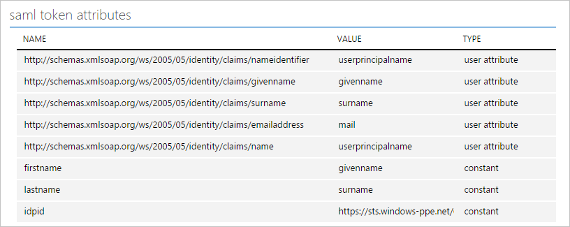
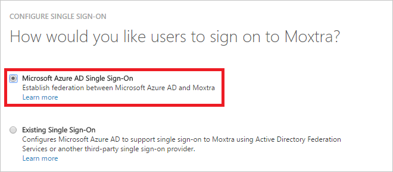
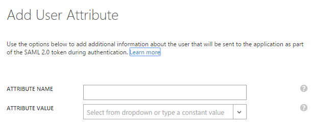

<properties
    pageTitle="Tutorial: Azure Active Directory integration with Moxtra | Microsoft Azure"
    description="Learn how to configure single sign-on between Azure Active Directory and Moxtra."
    services="active-directory"
    documentationCenter=""
    authors="jeevansd"
    manager="prasannas"
    editor=""/>

<tags
    ms.service="active-directory"
    ms.workload="identity"
    ms.tgt_pltfrm="na"
    ms.devlang="na"
    ms.topic="article"
    ms.date="12/01/2015"
    ms.author="jeedes"/>

# Tutorial: Azure Active Directory integration with Moxtra

The objective of this tutorial is to show you how to integrate Moxtra with Azure Active Directory (Azure AD). Integrating Moxtra with Azure AD provides you with the following benefits: 

- You can control in Azure AD who has access to Moxtra 
- You can enable your users to automatically get signed-on to Moxtra (Single Sign-On) with their Azure AD accounts
- You can manage your accounts in one central location - the Azure Active Directory Portal

If you want to know more details about SaaS app integration with Azure AD, see [What is application access and single sign-on with Azure Active Directory](active-directory-appssoaccess-whatis.md).

## Prerequisites 

To configure Azure AD integration with Moxtra, you need the following items:

- An Azure AD subscription
- A Moxtra single-sign on enabled subscription

> [AZURE.NOTE] To test the steps in this tutorial, we do not recommend using a production environment.

To test the steps in this tutorial, you should follow these recommendations:

- You should not use your production environment, unless this is necessary.
- If you don't have an Azure AD trial environment, you can get a one-month trial [here](https://azure.microsoft.com/pricing/free-trial/). 

 
## Scenario Description
The objective of this tutorial is to enable you to test Azure AD single sign-on in a test environment.  
The scenario outlined in this tutorial consists of two main building blocks:

1. Adding Moxtra from the gallery 
2. Configuring and testing Azure AD single sign-on

## Adding Moxtra from the gallery
To configure the integration of Moxtra into Azure AD, you need to add Moxtra from the gallery to your list of managed SaaS apps.

**To add Moxtra from the gallery, perform the following steps:**

1. In the **Azure Management Portal**, on the left navigation pane, click **Active Directory**.   
![Active Directory][1] 

2. From the **Directory** list, select the directory for which you want to enable directory integration.

3. To open the applications view, in the directory view, click **Applications** in the top menu.  
![Applications][2] 
4. Click **Add** at the bottom of the page.  
![Applications][3] 
5. On the **What do you want to do** dialog, click **Add an application from the gallery**.  
![Applications][4] 
6. In the search box, type **Moxtra**.  
 
7. In the results pane, select **Moxtra**, and then click **Complete** to add the application.
  
 

##  Configuring and testing Azure AD single sign-on
The objective of this section is to show you how to configure and test Azure AD single sign-on with Moxtra based on a test user called "Britta Simon".

For single sign-on to work, Azure AD needs to know what the counterpart user in Moxtra to an user in Azure AD is. In other words, a link relationship between an Azure AD user and the related user in Moxtra needs to be established. 
This link relationship is established by assigning the value of the **user name** in Azure AD as the value of the **Username** in Moxtra.
 
To configure and test Azure AD single sign-on with Moxtra, you need to complete the following building blocks:

1. **[Configuring Azure AD Single Sign-On](#configuring-azure-ad-single-single-sign-on)** - to enable your users to use this feature.
2. **[Creating an Azure AD test user](#creating-an-azure-ad-test-user)** - to test Azure AD single sign-on with Britta Simon.
4. **[Creating a Moxtra test user](#creating-a-moxtra-test-user)** - to have a counterpart of Britta Simon in Moxtra that is linked to the Azure AD representation of her.
5. **[Assigning the Azure AD test user](#assigning-the-azure-ad-test-user)** - to enable Britta Simon to use Azure AD single sign-on.
5. **[Testing Single Sign-On](#testing-single-sign-on)** - to verify whether the configuration works.

### Configuring Azure AD Single Sign-On

The objective of this section is to enable Azure AD single sign-on in the Azure AD portal and to configure single sign-on in your Moxtra application. 

Your Moxtra application expects the SAML assertions in a specific format, which requires you to add custom attribute mappings to your saml token attributes configuration. The following screenshot shows an example for this.
     

**To configure Azure AD single sign-on with Moxtra, perform the following steps:**

1. In the Azure AD portal, on the **Moxtra** application integration page, click **Configure single sign-on** to open the **Configure Single Sign-On**  dialog.
   ![Configure Single Sign-On][6]  

2. On the **How would you like users to sign on to Moxtra** page, select **Azure AD Single Sign-On**, and then click **Next**.
     

3. On the **Configure App Settings** dialog page, perform the following steps:.
    

    a. In the **Sign On URL** textbox, type the following URL: **https://www.moxtra.com/service/#login**.

    b. Click **Next**.
 
 
4. On the **Configure single sign-on at Moxtra** page, perform the following steps:
    

    a. Click **Download certificate**, and then save the file on your computer.

    b. Click **Next**.

1. In another browser window, sign on to your Moxtra company site as an administrator.

1. In the toolbar on the left, click **Admin Console > SAML Single Sign-on**, and then **New**.
    

1. On the **SAML** page, perform the following steps:
    

    a. In the **Name** textbox, type a name for your configuration (e.g.: *SAML*). 

    b. In the Azure portal, on the **Configure single sign-on at Moxtra** dialog page, copy the **Entity ID** value, and then paste it into the **IdP Entity ID** textbox. 

    c. In the Azure portal, on the **Configure single sign-on at Moxtra** dialog page, copy the **Remote Login URL** value, and then paste it into the **Login URL** textbox. 

    d. In the **AuthnContextClassRef** textbox, tyoe **urn:oasis:names:tc:SAML:2.0:ac:classes:Password**.

    e. In the Azure portal, on the **Configure single sign-on at Moxtra** dialog page, copy the **Name Identifier Format** value, and then paste it into the **NameID Format** textbox. 

    f. Open your downloaded certificate in Notepad, copy the content, and then paste it into the **Certificate** textbox.    

    g. In the SAML email domain textbox, type your SAML email domain.    
    > [AZURE.NOTE] To see the steps to verify the domain, click the "**i**" below.

    h. Click **Update**.

6. In the Azure AD portal, select the single sign-on configuration confirmation, and then click **Next**. 
  ![Azure AD Single Sign-On][10] 

7. On the **Single sign-on confirmation** page, click **Complete**.  
    ![Azure AD Single Sign-On][11]

1. To add custom attribute mappings to your saml token attributes configuration, in the menu on the top, click **Attributes** to open the **SAML Token Attributes** dialog. 
    

1. For each data row in the table below, perform the following steps:

    | Attribute Name | Attribute Value |
    | ---            | ---             |
    | firstname      | givenname       |
    | lastname       | surname         |
    | idpid          | *\<the **Entity ID** value from the **Configure single sign-on at Moxtra** dialog in the Azure portal \>* |

 
    a. Click add user attribute     

    b. On the **Add User Attribute** dialog, type the attribute name and attribute value shown for that row in the table.     

    c. Click **Complete**.

1. Click **Apply Changes**. 
    

### Creating an Azure AD test user
The objective of this section is to create a test user in the Azure portal called Britta Simon. 
In the Users list, select **Britta Simon**.  ![Create Azure AD User][20] 

**To create a test user in Azure AD, perform the following steps:**

1. In the **Azure Management Portal**, on the left navigation pane, click **Active Directory**.
     

2. From the **Directory** list, select the directory for which you want to enable directory integration.

3. To display the list of users, in the menu on the top, click **Users**.
     
 
4. To open the **Add User** dialog, in the toolbar on the bottom, click **Add User**. 
     

5. On the **Tell us about this user** dialog page, perform the following steps: 
      

    a. As Type Of User, select New user in your organization.

    b. In the User Name **textbox**, type **BrittaSimon**.

    c. Click **Next**.

6.  On the **User Profile** dialog page, perform the following steps: 
    
 
    a. In the **First Name** textbox, type **Britta**.  

    b. In the **Last Name** textbox, type, **Simon**.

    c. In the **Display Name** textbox, type **Britta Simon**.

    d. In the **Role** list, select **User**.
    e. Click **Next**.

7. On the **Get temporary password** dialog page, click **create**.
     
 
8. On the **Get temporary password** dialog page, perform the following steps:
    
  
    a. Write down the value of the **New Password**.

    b. Click **Complete**.   

  
 
### Creating a Moxtra test user

The objective of this section is to create a user called Britta Simon in Moxtra.

**To create a user called Britta Simon in Moxtra, perform the following steps:**

1. Sign-on to your Moxtra company site as an administrator.

1. In the toolbar on the left, click **Admin Console > User Management**, and then **Add User**.
    

1. On the **Add User** dialog, perform the following steps:

    a. In the **First Name** textbox, type **Britta**.

    b. In the **Last Name** textbox, type **Simon**.

    c. In the **Email** textbox, type Britta's email address in the Azure portal.

    d. In the **Division** textbox, type **Dev**.

    e. In the **Department** textbox, type **IT**.

    f. Select **Adminitrator**.

    g. Click **Add**.

### Assigning the Azure AD test user

The objective of this section is to enabling Britta Simon to use Azure single sign-on by granting her access to Moxtra.
  ![Assign User][200]  

**To assign Britta Simon to Moxtra, perform the following steps:**

1. On the Azure portal, to open the applications view, in the directory view, click **Applications** in the top menu.
  ![Assign User][201]  

2. In the applications list, select **Moxtra**.
    

1. In the menu on the top, click **Users**.
  ![Assign User][203]  

1. In the Users list, select **Britta Simon**.

2. In the toolbar on the bottom, click **Assign**.
  ![Assign User][205]

### Testing Single Sign-On

The objective of this section is to test your Azure AD single sign-on configuration using the Access Panel. 
When you click the Moxtra tile in the Access Panel, you should get automatically signed-on to your Moxtra application.

## Additional Resources

* [List of Tutorials on How to Integrate SaaS Apps with Azure Active Directory](active-directory-saas-tutorial-list.md)
* [What is application access and single sign-on with Azure Active Directory?](active-directory-appssoaccess-whatis.md)

<!--Image references-->

[1]: ./media/active-directory-saas-moxtra-tutorial/tutorial_general_01.png
[2]: ./media/active-directory-saas-moxtra-tutorial/tutorial_general_02.png
[3]: ./media/active-directory-saas-moxtra-tutorial/tutorial_general_03.png
[4]: ./media/active-directory-saas-moxtra-tutorial/tutorial_general_04.png

[6]: ./media/active-directory-saas-moxtra-tutorial/tutorial_general_05.png
[10]: ./media/active-directory-saas-moxtra-tutorial/tutorial_general_06.png
[11]: ./media/active-directory-saas-moxtra-tutorial/tutorial_general_07.png
[20]: ./media/active-directory-saas-moxtra-tutorial/tutorial_general_100.png

[200]: ./media/active-directory-saas-moxtra-tutorial/tutorial_general_200.png
[201]: ./media/active-directory-saas-moxtra-tutorial/tutorial_general_201.png
[203]: ./media/active-directory-saas-moxtra-tutorial/tutorial_general_203.png
[204]: ./media/active-directory-saas-moxtra-tutorial/tutorial_general_204.png
[205]: ./media/active-directory-saas-moxtra-tutorial/tutorial_general_205.png

