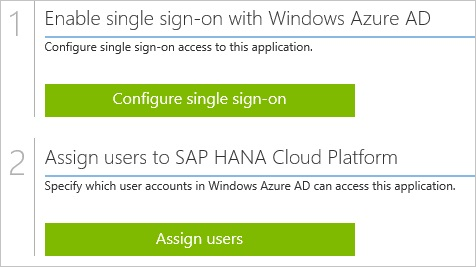
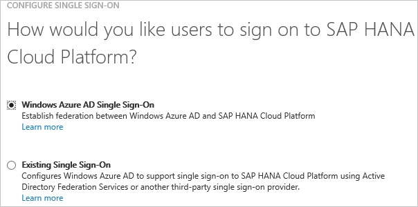
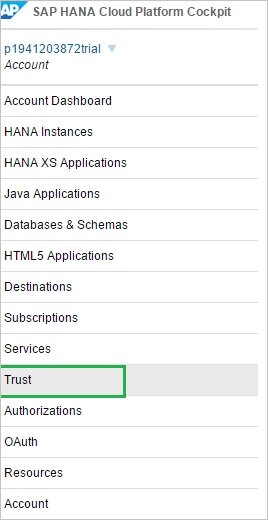
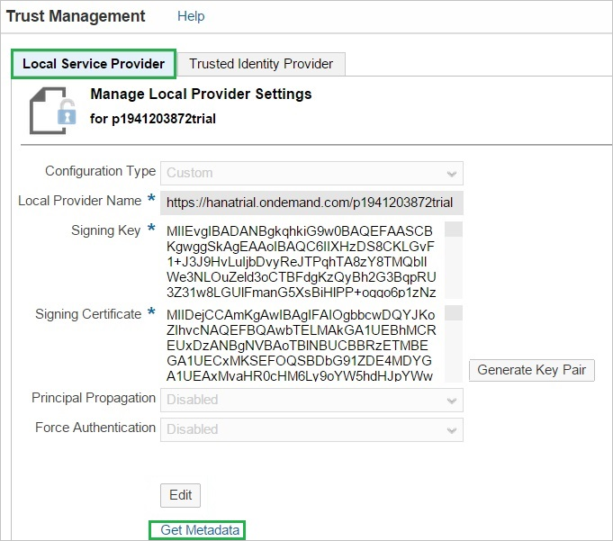
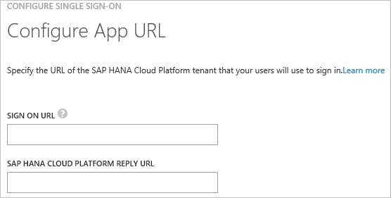
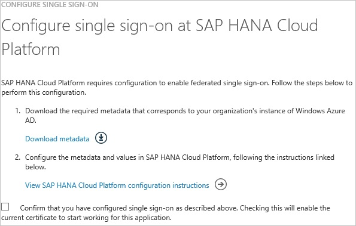
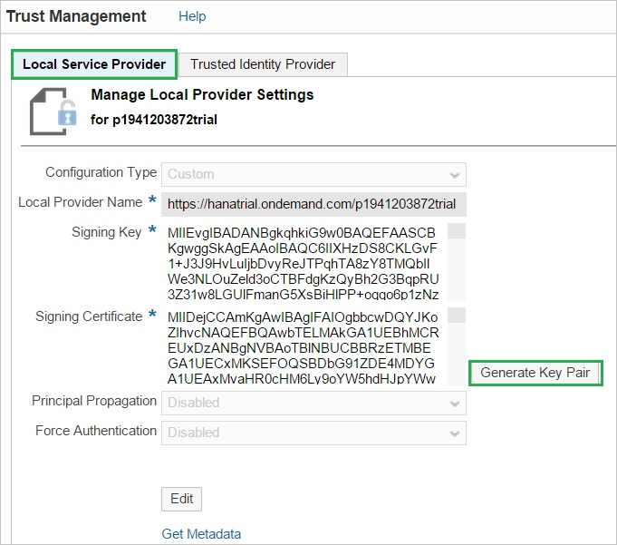
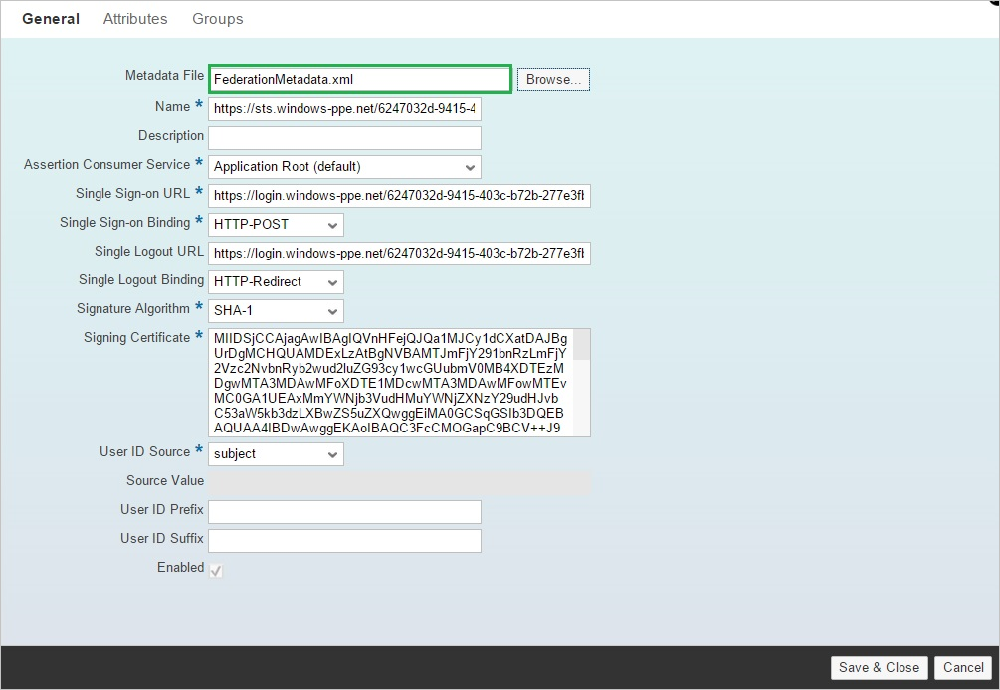
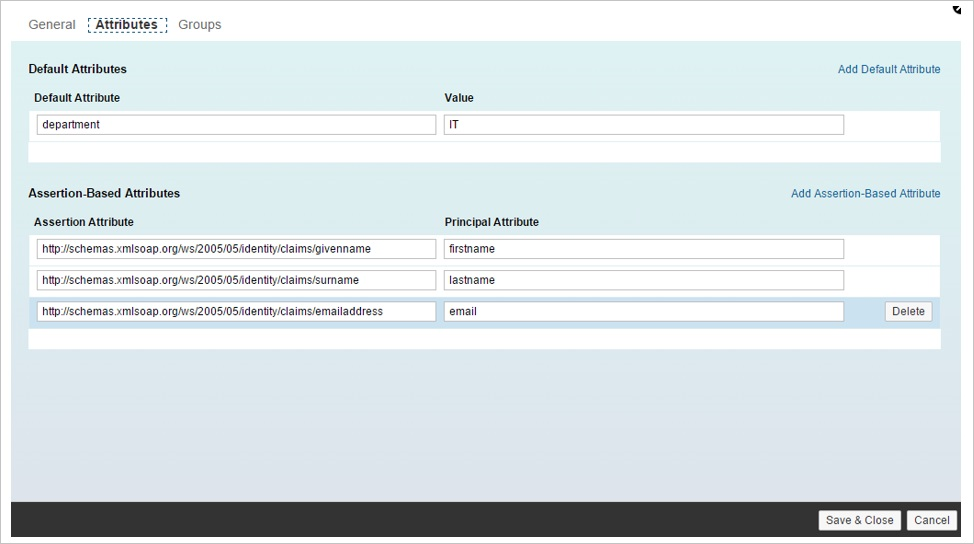
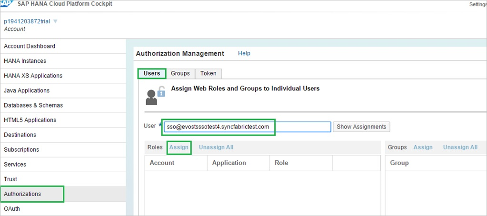

<properties 
    pageTitle="Tutorial: Azure Active Directory integration with SAP HANA Cloud Platform | Microsoft Azure" 
    description="Learn how to use SAP HANA Cloud Platform with Azure Active Directory to enable single sign-on, automated provisioning, and more!" 
    services="active-directory" 
    authors="markusvi"  
    documentationCenter="na" 
    manager="stevenpo"/>
<tags 
    ms.service="active-directory" 
    ms.devlang="na" 
    ms.topic="article" 
    ms.tgt_pltfrm="na" 
    ms.workload="identity" 
    ms.date="10/22/2015" 
    ms.author="markvi" />

#Tutorial: Azure Active Directory integration with SAP HANA Cloud Platform
  
The objective of this tutorial is to show the integration of Azure and SAP HANA Cloud Platform.  
The scenario outlined in this tutorial assumes that you already have the following items:

-   A valid Azure subscription
-   A SAP HANA Cloud Platform account
  
After completing this tutorial, the Azure AD users you have assigned to SAP HANA Cloud Platform will be able to single sign into the application using the [Introduction to the Access Panel](active-directory-saas-access-panel-introduction.md).

>[AZURE.IMPORTANT]You need to deploy your own application or subscribe to an application on your SAP HANA Cloud Platform account to test single sign on. In this tutorial, an application is deployed in the account.
  
The scenario outlined in this tutorial consists of the following building blocks:

1.  Enabling the application integration for SAP HANA Cloud Platform
2.  Configuring single sign-on
3.  Assigning a role to a user
4.  Assigning users

##Enabling the application integration for SAP HANA Cloud Platform
  
The objective of this section is to outline how to enable the application integration for SAP HANA Cloud Platform.

###To enable the application integration for SAP HANA Cloud Platform, perform the following steps:

1.  In the Azure Management Portal, on the left navigation pane, click **Active Directory**.

    

2.  From the **Directory** list, select the directory for which you want to enable directory integration.

3.  To open the applications view, in the directory view, click **Applications** in the top menu.

    

4.  Click **Add** at the bottom of the page.

    

5.  On the **What do you want to do** dialog, click **Add an application from the gallery**.

    

6.  In the **search box**, type **SAP HANA Cloud Platform**.

    

7.  In the results pane, select **SAP HANA Cloud Platform**, and then click **Complete** to add the application.

    
##Configuring single sign-on
  
The objective of this section is to outline how to enable users to authenticate to SAP HANA Cloud Platform with their account in Azure AD using federation based on the SAML protocol.  
As part of this procedure, you are required to upload a base-64 encoded certificate to your SAP HANA Cloud Platform tenant.  
If you are not familiar with this procedure, see [How to convert a binary certificate into a text file](http://youtu.be/PlgrzUZ-Y1o)

###To configure single sign-on, perform the following steps:

1.  In the Azure AD portal, on the **SAP HANA Cloud Platform** application integration page, click **Configure single sign-on** to open the **Configure Single Sign On ** dialog.

    

2.  On the **How would you like users to sign on to SAP HANA Cloud Platform** page, select **Microsoft Azure AD Single Sign-On**, and then click **Next**.

    

3.  In a different web browser window, sign on to the SAP HANA Cloud Platform Cockpit at https://account.\<landscape host\>.ondemand.com/cockpit (e.g.: *https://account.hanatrial.ondemand.com/cockpit*).

4.  Click the **Trust** tab.

    

5.  In trust management section, perform the following steps:

    

    1.  Click the **Local Service Provider** tab.
    2.  To download the SAP HANA Cloud Platform metadata file, click **Get Metadata**.

6.  In the Azure Active Directory portal, on the **Configure App URL** page, perform the following steps, and then click **Next**.

    

    1.  In the **Sign On URL** textbox, type the URL used by your users to sign into your **SAP HANA Cloud Platform** application. This is the account-specific URL of a protected resource in your SAP HANA Cloud Platform application. The URL is based on the following pattern: *https://\<applicationName\>\<accountName\>.\<landscape host\>.ondemand.com/\<path\_to\_protected\_resource\>* (e.g.: *https://xleavep1941203872trial.hanatrial.ondemand.com/xleave*)

        >[AZURE.NOTE]This is the URL in your SAP HANA Cloud Platform application that requires the user to authenticate.

    2.  Open the downloaded SAP HANA Cloud Platform metadata file, and then locate the **ns3:AssertionConsumerService** tag.
    3.  Copy the value of the **Location** attribute, and then paste it into the **SAP HANA Cloud Platform Reply URL** textbox.

7.  On the **Configure single sign-on at SAP HANA Cloud Platform** page, to download your metadata, click **Download metadata**, and then save the file on your computer.

    

8.  On the SAP HANA Cloud Platform Cockpit, in the **Local Service Provider** section, perform the following steps:

    

    1.  Click **Edit**.
    2.  As **Configuration Type**, select **Custom**.
    3.  As **Local Provider Name**, leave the default value.
    4.  To generate a **Signing Key** and a **Signing Certificate** key pair, click **Generate Key Pair**.
    5.  As **Principal Propagation**, select **Disabled**.
    6.  As **Force Authentication**, select **Disabled**.
    7.  Click **Save**.

9.  Click the **Trusted Identity Provider** tab, and then click **Add Trusted Identity Provider**.

    

    >[AZURE.NOTE]To manage the list of trusted identity providers, you need to have chosen the Custom configuration type in the Local Service Provider section. For Default configuration type, you have a non-editable and implicit trust to the SAP ID Service. For None, you don't have any trust settings.

10. Click the **General** tab, and then click **Browse** to upload the downloaded metadata file.

    

    >[AZURE.NOTE] After uploading the metadata file, the values for **Single Sign-on URL**, **Single Logout URL** and **Signing Certificate** are populated automatically.

11. Click the **Attributes** tab.

12. On the **Attributes** tab, perform the following steps:

    

    1.  By clicking **Add Assertion-Based Attribute**, add the following assertion-based attributes:

        |Assertion Attribute| Principal Attribute|
        |-------------------|--------------------|
        |http://schemas.xmlsoap.org/ws/2005/05/identity/claims/givenname|   firstname|--------------------|--------------------|
        |http://schemas.xmlsoap.org/ws/2005/05/identity/claims/surname|        lastname|-----------|
        |http://schemas.xmlsoap.org/ws/2005/05/identity/claims/emailaddress|email|

    >[AZURE.NOTE]The configuration of the Attributes depends on how the application(s) on HCP are developed, i.e. which attribute(s) they expect in the SAML response and under which name (Principal Attribute) they access this attribute in the code.
    >  
    >a.  The **Default Attribute** in the screenshot is just for illustration purposes. It is not required to make the scenario work.  
    >
    >b.  The names and values for **Principal Attribute** shown in the screenshot depend on how the application is developed. It is possible that your application requires different mappings.

13. In the Azure portal, on the **Configure single sign-on at SAP HANA Cloud Platform** dialogue page, select the single sign-on configuration confirmation, and then click **Complete**.

    
  
As an optional step, you can configure assertion-based groups for your Azure Active Directory Identity Provider

>[AZURE.NOTE]Using groups on SAP HANA Cloud Platform allows you to dynamically assign one or more users to one or more roles in your SAP HANA Cloud Platform applications, determined by values of attributes in the SAML 2.0 assertion. For example, if the assertion contains the attribute "*contract=temporary*", you may want all affected users to be added to the group "*TEMPORARY*". The group "*TEMPORARY*" may contain one or more roles from one or more applications deployed in your SAP HANA Cloud Platform account.
>  
>Use assertion-based groups if you want to mass-assign many users to one or more roles of applications in your SAP HANA Cloud Platform account. If you only want to assign a single or small number of users to (a) specific role(s) we recommend assigning them directly in the “**Authorizations**” tab of the SAP HANA Cloud Platform cockpit.

##Assigning a role to a user
  
In order to enable Azure AD users to log into SAP HANA Cloud Platform, you must assign roles in the SAP HANA Cloud Platform to them.

###To assign a role to a user, perform the following steps:

1.  Log in to your **SAP HANA Cloud Platform** cockpit.

2.  Perform the following steps:

    

    1.  Click **Authorization**.
    2.  Click the **Users** tab.
    3.  In the **User** textbox, type the user’s email address.
    4.  Click **Assign** to assign the user to a role.
    5.  Click **Save**.

##Assigning users
  
To test your configuration, you need to grant the Azure AD users you want to allow using your application access to it by assigning them.

###To assign users to SAP HANA Cloud Platform, perform the following steps:

1.  In the Azure AD portal, create a test account.

2.  On the **SAP HANA Cloud Platform** application integration page, click **Assign users**.

    

3.  Select your test user, click **Assign**, and then click **Yes** to confirm your assignment.

    
  
If you want to test your single sign-on settings, open the Access Panel. For more details about the Access Panel, see [Introduction to the Access Panel](active-directory-saas-access-panel-introduction.md).
