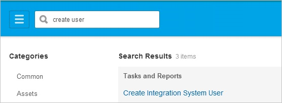
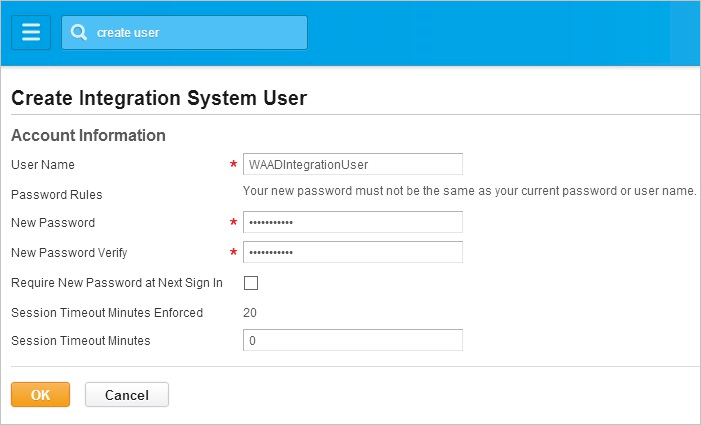
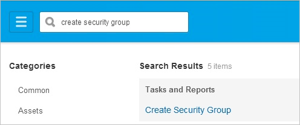
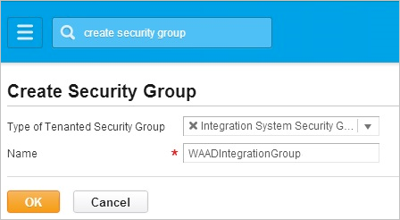
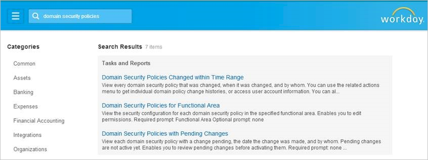
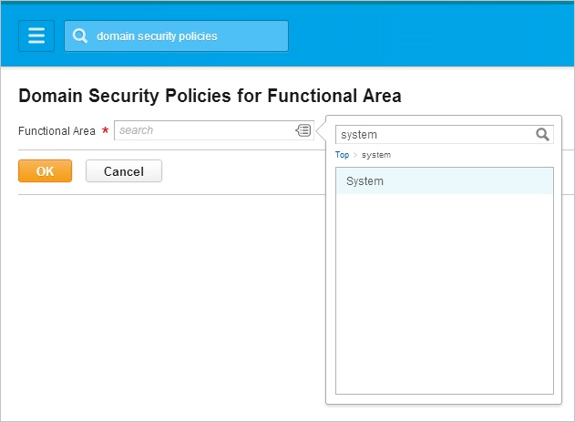
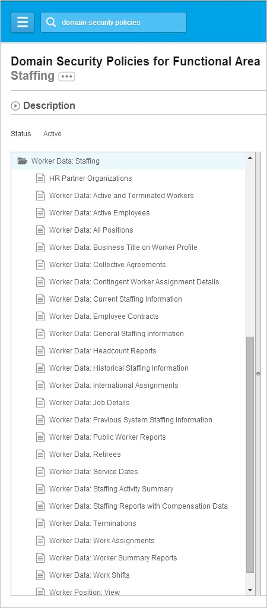
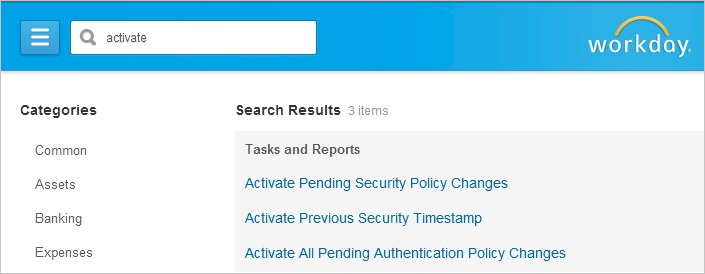
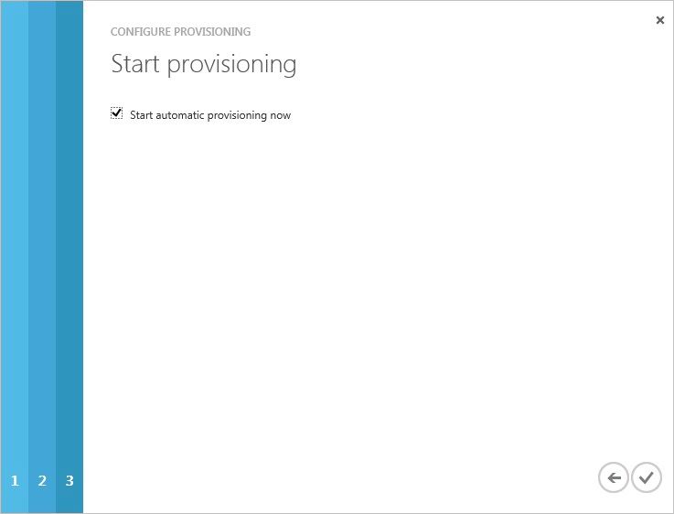

<properties 
  pageTitle="教學課程：針對輸入同步設定 Workday| Microsoft Azure" 
  description="了解如何使用 Workday 做為 Azure Active Directory 身分識別資料的來源。" 
  services="active-directory" 
  authors="MarkusVi"  
  documentationCenter="na" 
  manager="msStevenPo"/>
<tags 
  ms.service="active-directory" 
  ms.devlang="na" 
  ms.topic="article" 
  ms.tgt_pltfrm="na" 
  ms.workload="identity" 
  ms.date="08/01/2015" 
  ms.author="markvi" />

#教學課程：針對輸入同步設定 Workday

>[AZURE.TIP]如需意見反應，請按一下[這裡](http://go.microsoft.com/fwlink/?LinkId=521880)。
  
本教學課程的目的是說明將連絡人從 Workday 匯入 Azure AD 時，在 Workday 和 Azure AD 中需要執行的步驟。

本教學課程中說明的案例假設您已經具有下列項目：

-   有效的 Azure AD Premium 訂用帳戶
-   Workday 中的租用戶
  
本教學課程中說明的案例由下列建置組塊組成：

1. 啟用 Workday 的應用程式整合 

2. 建立整合系統使用者

3. 建立安全性群組

4. 將整合系統使用者指派到安全性群組

5. 設定安全性群組選項

6. 啟用安全性原則變更

7. 在 Azure AD 中設定使用者匯入

##啟用 Workday 的應用程式整合
  
本節的目的是概述如何啟用 Workday 的應用程式整合。

###若要啟用 Workday 的應用程式整合，請執行下列步驟：

1.  在 Azure 管理入口網站的左方瀏覽窗格中，按一下 [Active Directory]。

    

2.  從 [目錄] 清單中，選取要啟用目錄整合的目錄。

3.  若要開啟應用程式檢視，請在目錄檢視中，按一下頂端功能表中的 [應用程式]。

    ![[應用程式]](./media/active-directory-saas-workday-inbound-tutorial/IC700994.png "[應用程式]")

4.  按一下頁面底部的 [新增]。

    

  
5. 在搜尋方塊中，輸入 **Workday**。

    

6. 在結果窗格中，選取 [Workday]，然後按一下 [完成] 以加入應用程式。

    

## 建立整合系統使用者

1. 在 [工作日工作台] 中的搜尋方塊輸入 create user，然後按一下 [建立整合系統使用者]。   

2. 為新的「整合系統使用者」 提供使用者名稱和密碼來完成「建立整合系統使用者」工作。保持 [下次登入時要求新密碼] 選項未核取，因為該使用者會以程式設計的方式登入。 讓 [工作階段逾時分鐘] 保持為預設值 [0]，這會防止使用者的工作階段提早逾時。   
 

## 建立安全性群組

對於本教學課程中所述的案例，您需要建立未受限制的整合系統安全性群組，並將使用者指派至該群組。

1. 在搜尋方塊中輸入 create security group，然後按一下 [建立安全性群組] 連結。   
 

2. 完成「建立安全性群組」工作。從 [租用安全性群組類型] 下拉式清單選取 [整合系統安全性群組—未受限制]，以建立需要明確地加入使用者的安全性群組。   
 

## 將整合系統使用者指派到安全性群組

1. 在搜尋方塊中輸入 edit security group，然後按一下 [編輯全性群組] 連結。   
 
 

2. 依名稱搜尋新的整合安全性群組，並選取該群組。    編輯安全性群組

3. 將新的整合系統使用者指派到安全性群組。   

## 設定安全性群組選項

在此步驟中，您授予新的安全性群組，對受下列網域安全性原則保護之物件進行 **Get** 和 **Put** 作業：

- 外部帳戶佈建

- 人員資料：公用人員報告

- 人員資料：所有職位

- 人員資料：目前人員配置資訊

- 人員資料：人員個人檔案的職稱
 
   

1. 在搜尋方塊中輸入 domain security policies，然後按一下 [功能區域的網域安全性原則]。     
 

2. 搜尋 system 並選取 [系統] 功能區域。按一下 [確定]。   

3. 在 [系統] 功能區域的安全性原則清單中，展開 [安全性管理]，並選取 [外部帳戶佈建] 網域安全性原則。   

4. 按一下 [編輯權限] 按鈕，然後在 [編輯權限] 畫面上，將新的安全性群組加入具有 **Get** 和 **Put** 整合權限的群組清單。   

 

5. 重複上述步驟 1，以返回選取功能區域的畫面，這次改為搜尋 staffing，然後選取 [人員配置] 功能區域，再按一下 [確定]。   
 

6. 在 [人員配置] 功能區域的安全性原則清單中，展開 [人員資料：人員配置]，並對其餘的各安全性原則重複上述步驟 4：

     - 人員資料：公用人員報告

     - 人員資料：所有職位

     - 人員資料：目前人員配置資訊

     - 人員資料：人員個人檔案的職稱

   

## 啟用安全性原則變更

1. 在搜尋方塊中輸入 activate，然後按一下 [啟用擱置的安全性原則變更] 連結。    
 

2. 輸入供稽核用的註解並按一下 [確定] 按鈕，以開始「啟用擱置的安全性原則變更」工作。   
 

3. 在下一個畫面核取標示 [確認] 的核取方塊，然後按一下 [確定] 以完成工作。   

## 在 Azure AD 中設定使用者匯入

本節的主要目的是說明如何設定 Azure AD 以從 Workday 匯入人員。

### 若要在 Azure AD 中設定匯入使用者，請執行下列步驟：

1. 在 [Workday] 應用程式整合頁面上，按一下 [設定使用者匯入] 以開啟 [設定佈建] 對話方塊。

2\. 在 [設定及管理員認證] 頁面上，執行以下步驟，然後按 [下一步]：   
 
     2.1. In the Workday admin user name textbox, type the name of the user you have created in the Creating an integration system user section.

     2.2. In the Workday admin password textbox, type the password of the user you have created in the Creating an integration system user section.

     2.3. In the Workday tenant URL textbox, type the URL or your Workday tenant.

3. 在 [測試連接] 頁面上，按一下 [開始測試] 來確認連接，然後按 [下一步]。     
 

4. 在 [佈建] 選項頁面上，按 [下一步]。   

5. 在 [開始佈建] 對話方塊中，按一下 [完成]。   
 

您現在可以移至 [使用者] 區段，並檢查是否已匯入您的 Workday 使用者。

## 其他資源

* [如何與 Azure Active Directory 整合 SaaS 應用程式的教學課程清單](active-directory-saas-tutorial-list.md)
* [什麼是搭配 Azure Active Directory 的應用程式存取和單一登入？](active-directory-appssoaccess-whatis.md)

<!---HONumber=August15_HO8-->