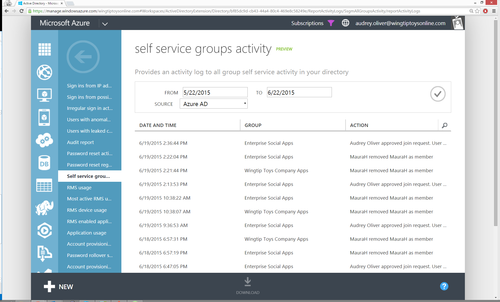
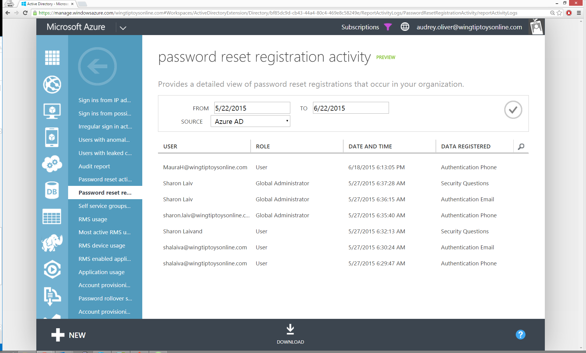

<properties
	pageTitle="檢視存取和使用情況報告"
	description="說明如何檢視存取和使用情況報告來深入了解貴組織之目錄完整性和安全性的主題。"
	services="active-directory"
	documentationCenter=""
	authors="kenhoff"
	manager="TerryLan"
	editor="LisaToft"/>

<tags
	ms.service="active-directory"
	ms.workload="infrastructure-services"
	ms.tgt_pltfrm="na"
	ms.devlang="na"
	ms.topic="article"
	ms.date="06/23/2015"
	ms.author="kenhoff;Justinha"/>

# 檢視存取和使用情況報告

您可以使用 Azure Active Directory 的存取和使用情況報告來了解貴組織的目錄完整性和安全性。利用此資訊，目錄管理員更能夠判斷可能發生安全性風險的位置，以便適當地規劃來減輕這些風險。

在 Azure 管理入口網站中，報告會以下列方式分類：

- 異常報告 – 包含我們發現異常的登入事件。我們的目標在於使您注意這類活動，並讓您能夠判斷事件是否可疑。
- 整合式應用程式報告 – 可供深入了解雲端應用程式在組織中的使用方式。Azure Active Directory 提供與數千個雲端應用程式的整合。
- 錯誤報告 – 指出將帳戶佈建至外部應用程式時可能發生的錯誤。
- 使用者特定報告 – 顯示特定使用者的裝置/登入活動資料。
- 活動記錄檔 – 包含過去 24 小時、過去 7 天或過去 30 天內所有稽核事件的記錄，以及群組活動變更、密碼重設和登錄活動。

> [AZURE.NOTE]
>
- 某些進階的異常和資源使用情況報告僅適用於您啟用 [Azure Active Directory Premium](active-directory-get-started-premium.md) 時。進階報告可協助您改善存取安全性、回應潛在威脅，以及存取裝置存取與應用程式使用情況的分析資料。
- Azure Active Directory Premium 和 Basic 版本適用於使用 Azure Active Directory 全球執行個體的中國客戶。由 21Vianet 在中國提供的 Microsoft Azure 服務目前不支援 Azure Active Directory Premium 和 Basic 版本。如需詳細資訊，請透過 [Azure Active Directory 論壇](http://feedback.azure.com/forums/169401-azure-active-directory)與我們連絡。

## 報表描述

|	報告 |	說明 |
|	------												|	-----																						|
|	從不明來源登入 |	可能表示使用者嘗試在不被追蹤的情況下登入。 |
|	在多次失敗後登入 |	可能表示暴力密碼破解攻擊成功。 |
|	從多個地理區域登入 |	可能表示多個使用者登入相同帳戶。 |
|	從具有可疑活動的 IP 位址登入 |	可能表示使用者嘗試多次入侵後成功登入。 |
|	從可能受感染的裝置登入 |	可能表示使用者嘗試用於登入的裝置可能已受到感染。 |
|	異常的登入活動 |	可能表示違背使用者平常登入習慣的事件。 |
|	具有異常登入活動的使用者 |	指示帳戶可能已受到危害的使用者。 |
|	認證外洩的使用者 |	認證外洩的使用者 |
|	稽核報告 |	目錄中的已稽核事件 |
|	密碼重設活動 |	提供您組織中所執行之密碼重設的詳細檢視。 |
|	密碼重設註冊活動 |	提供您組織中所執行之密碼重設登錄的詳細檢視。 |
|	自助服務群組活動 |	提供活動記錄給您目錄中所有的群組自助活動 |
|	應用程式使用情況 |	針對與您目錄整合的所有 SaaS 應用程式提供使用摘要。 |
|	帳戶佈建活動 |	提供嘗試將帳戶佈建到外部應用程式的歷程記錄。 |
|	密碼變換狀態 |	提供 SaaS 應用程式自動密碼變換狀態的詳細概觀。 |
|	帳戶佈建錯誤 |	指示對使用者的外部應用程式存取造成的影響。 |
|	RMS 使用量 |	提供 Rights Management 使用量的摘要 |
|	最活躍的 RMS 使用者 |	列出已存取受 RMS 保護之檔案的前 1000 名有效使用者 |
|	RMS 裝置使用量 |	列出存取受 RMS 保護的檔案所使用的裝置 |
|	啟用 RMS 的應用程式使用量 |	提供啟用 RMS 之應用程式的使用量 |

## 報表版本

|	報告 |	免費 |	基本 |	高級 |
|	------												|	----	|	-----	|	--------	|
|	從不明來源登入 |	✓ |	✓ |	✓ |
|	在多次失敗後登入 |	✓ |	✓ |	✓ |
|	從多個地理區域登入 |	✓ |	✓ |	✓ |
|	從具有可疑活動的 IP 位址登入 | | |	✓ |
|	從可能受感染的裝置登入 | | |	✓ |
|	異常的登入活動 | | |	✓ |
|	具有異常登入活動的使用者 | | |	✓ |
|	認證外洩的使用者 | | |	✓ |
|	稽核報告 | | |	✓ |
|	密碼重設活動 | | |	✓ |
|	密碼重設註冊活動 | | |	✓ |
|	自助服務群組活動 | | |	✓ |
|	應用程式使用情況 | | |	✓ |
|	帳戶佈建活動 |	✓ |	✓ |	✓ |
|	密碼變換狀態 | | |	✓ |
|	帳戶佈建錯誤 |	✓ |	✓ |	✓ |
|	RMS 使用量 | | |	僅 RMS |
|	最活躍的 RMS 使用者 | | |	僅 RMS |
|	RMS 裝置使用量 | | |	僅 RMS |
|	啟用 RMS 的應用程式使用量 | | |	僅 RMS |

## 報告詳細資料

### 從不明來源登入

| 說明 | 報告位置 |
| :-------------     | :-------        |
| 
此報告指出已成功登入您的目錄，同時被指派 Microsoft 視為匿名 Proxy IP 位址之用戶端 IP 位址的使用者。這些 Proxy 通常由想要隱藏其電腦 IP 位址的使用者使用，而且可能用於惡意意圖 – 駭客有時候會使用這些 Proxy。

 這份報告的結果會顯示使用者從該位址和 Proxy 的 IP 位址成功登入您的目錄的次數。
 | 目錄 > 報告索引標籤 |

]

### 在多次失敗後登入

| 說明 | 報告位置 |
| :-------------     | :-------        |
| 此報告指出在多次連續登入嘗試失敗後成功登入的使用者。可能的原因包括： <ul><li>使用者忘記其密碼</li><li>使用者是暴力密碼破解攻擊的受害者</li></ul>
這份報告的結果會顯示您在登入成功之前的連續登入失敗嘗試次數，以及與第一次登入成功相關聯的時間戳記。

<b>報告設定</b>：您可以設定在顯示於報告之前，必須發生的連續登入失敗嘗試次數下限。當您變更此設定時，請務必注意這些變更將不會套用到目前顯示於現有報表中的任何現有失敗登入。不過會套用到未來所有的登入。只有經過授權的管理員才可以變更此報告。 | 目錄 > 報告索引標籤 |

]

### 從多個地理區域登入

| 說明 | 報告位置 |
| :-------------     | :-------        |
| 
這份報告包含使用者的成功登入活動，而其中有兩次登入似乎來自不同的地區，且使用者不可能在登入間的時間內在這兩個區域之間移動。可能的原因包括：
<ul><li>使用者共用其密碼</li><li>使用者正使用遠端桌面啟動網頁瀏覽器進行登入</li><li>駭客已從不同國家/地區登入使用者的帳戶。</li></ul>
這份報告的結果會顯示成功的登入事件，以及登入間的時間、登入似乎來自的地區和在這些區域之間移動的估計時間。

顯示的移動時間只是估計值，而且可能與兩地間的實際移動時間不同。此外，不會針對鄰近地區之間的登入產生任何事件。
 | 目錄 > 報告索引標籤 |

]

### 從具有可疑活動的 IP 位址登入

| 說明 | 報告位置 |
| :-------------     | :-------        |
| 
此報告包含從已偵測到可疑活動的 IP 位址執行的登入嘗試。可疑活動包含短時間內來自相同 IP 位址的許多失敗登入嘗試，以及其他被視為可疑的活動。這可能表示駭客已嘗試從這個 IP 位址登入。

這份報告的結果會顯示來自已發現可疑活動之 IP 位址的登入嘗試，以及與登入相關聯的時間戳記。
 | 目錄 > 報告索引標籤 |

]

### 異常登入活動

| 說明 | 報告位置 |
| :-------------     | :-------        |
| 
這份報表包含由我們的機器學習演算法識別為「異常」的登入。將登入嘗試標示為異常的原因包括非預期的登入位置、當日時間與位置，或這些原因的組合。這可能表示駭客已嘗試使用此帳戶進行登入。機器學習演算法會將事件歸類為「異常」或「可疑」，其中「可疑」表示安全性缺口的可能性較高。

這份報告的結果將顯示這些登入，以及與每次登入相關聯的分類、位置和時間戳記。

如果我們在 30 天或更少的天數內遇到 10 個或更多異常的登入事件，我們會傳送電子郵件通知給全域管理員。請務必將 aad-alerts-noreply@mail.windowsazure.com 納入安全寄件者清單中。
 | 目錄 > 報告索引標籤 |

### 從可能受感染的裝置登入

| 說明 | 報告位置 |
| :-------------     | :-------        |
| 
使用這份報告可以查看來自可能執行惡意程式碼 (惡意軟體) 的裝置的登入。我們會使登入的 IP 位址與嘗試聯繫惡意程式碼伺服器的 IP 位址相互關聯。

建議：因為此報告假設 IP 位址在兩種情況下與相同的裝置相關聯，所以建議您連絡使用者並掃描使用者的裝置。

如需有關如何定址惡意程式碼感染的詳細資訊，請參閱 [惡意程式碼防護中心](http://go.microsoft.com/fwlink/?linkid=335773)。
 | 目錄 > 報告索引標籤 |

]

### 具有異常登入活動的使用者

| 說明 | 報告位置 |
| :-------------     | :-------        |
| 
使用這份報告可以檢視已被識別有異常登入活動的所有使用者帳戶。這份報告包含所有其他異常活動報告的資料。這份報告的結果會顯示使用者的詳細資料、登入事件為何被識別為異常的原因、日期和時間，以及事件的其他相關資訊。
 | 目錄 > 報告索引標籤 |

]

## 整合式應用程式報告

### 應用程式使用情況：摘要

| 說明 | 報告位置 |
| :-------------     | :-------        |
| 使用這份報告可以查看您的目錄中所有 SaaS 應用程式的使用情況。這份報告是以使用者在 [存取面板] 中點選應用程式的次數為基礎。 | 目錄 > 報告索引標籤 |

]

### 應用程式使用情況：詳細

| 說明 | 報告位置 |
| :-------------     | :-------        |
| 使用這份報告可以查看特定 SaaS 應用程式目前的使用量。這份報告是以使用者在 [存取面板] 中點選應用程式的次數為基礎。 | 目錄 > 報告索引標籤 |

### 應用程式儀表板

| 說明 | 報告位置 |
| :-------------     | :-------        |
| 此報告指出在一段選取的時間間隔內，您組織中的使用者對應用程式進行的累計登入。儀表板頁面上的圖表可協助您識別該應用程式的所有使用趨勢。 | 目錄 > 應用程式 > 儀表板索引標籤 |

## 錯誤報告

### 帳戶佈建錯誤

| 說明 | 報告位置 |
| :-------------     | :-------        |
| 使用這份報告來監控將帳戶從 SaaS 應用程式同步處理至 Azure Active Directory 期間發生的錯誤。 | 目錄 > 報告索引標籤 |

]

## 特定使用者報告

### 裝置

| 說明 | 報告位置 |
| :-------------     | :-------        |
| 使用此報告可查看特定使用者用來存取 Azure Active Directory 的 IP 位址和裝置地理位置。 | 目錄 > 使用者 > <i>使用者</i> > 裝置索引標籤 |

### 活動

| 說明 | 報告位置 |
| :-------------     | :-------        |
| 顯示使用者的登入活動。此報告包含登入的應用程式、使用的裝置、IP 位址和位置等資訊。我們不會收集以 Microsoft 帳戶登入的使用者歷程記錄。 | 目錄 > 使用者 > <i>使用者</i> > 活動索引標籤 |

#### 使用者活動中包含的登入事件報告

只有某些類型的登入事件會出現在「使用者活動」報告中。

| 事件類型 | 已包含？ |
| ----------------------								| ---------		|
| 對[存取面板](http://myapps.microsoft.com/)進行的登入 | 是 |
| 對 [Azure 管理入口網站](https://manage.windowsazure.com/)進行的登入 | 是 |
| 對 [Microsoft Azure 入口網站](http://portal.azure.com/)進行的登入 | 是 |
| 對 [Office 365 入口網站](http://portal.office.com/)進行的登入 | 是 |
| 對原生應用程式進行的登入，例如 Outlook (請參閱底下的例外狀況) | 是 |
| 透過存取面板 (例如 Salesforce) 對同盟/佈建應用程式進行的登入 | 是 |
| 透過存取面板 (例如 Twitter) 對密碼型應用程式進行進行的登入 | 是 |
| 對已新增至目錄的自訂商務應用程式進行的登入 | 否 (敬請期待) |
| 登入已加入目錄的 Azure AD 應用程式 Proxy 應用程式 | 否 (敬請期待) |

> 注意：為了減少此報告中的雜訊量，不會顯示經由 [Microsoft Online Services 登入小幫手](http://community.office365.com/zh-tw/w/sso/534.aspx)對 [Lync/Skype for Business](http://products.office.com/zh-tw/skype-for-business/online-meetings) 原生應用程式進行的登入。

## 活動記錄檔

### 稽核報告

| 說明 | 報告位置 |
| :-------------     | :-------        |
| 顯示過去 24 小時、過去 7 天或過去 30 天內的所有稽核事件記錄。  如需詳細資訊，請參閱 [Azure Active Directory 稽核報告事件](active-directory-reporting-audit-events.md) | 目錄 > 報告索引標籤 |

]

### 群組活動報告

| 說明 | 報告位置 |
| :-------------     | :-------        |
| 顯示您的目錄中自助式管理群組的所有活動。 | 目錄 > 使用者 > <i>使用者</i> > 裝置索引標籤 |

]

### 密碼重設登錄活動報告

| 說明 | 報告位置 |
| :-------------     | :-------        |
| 顯示您的組織中發生的所有密碼重設登錄 | 目錄 > 報告索引標籤 |

]

### 密碼重設活動

| 說明 | 報告位置 |
| :-------------     | :-------        |
| 顯示您的組織中發生的所有密碼重設嘗試 | 目錄 > 報告索引標籤 |

]

## 您懷疑有安全性缺口時的考慮事項

如果您懷疑使用者帳戶可能遭到入侵，或有任何可能導致雲端中您的目錄資料出現安全性缺口的可疑使用者活動，您可能要考慮下列其中一或多個動作：

- 連絡使用者來確認活動
- 重設使用者的密碼
- [啟用多因素驗證](http://go.microsoft.com/fwlink/?linkid=335774)以提供額外的安全性

## 檢視或下載報告

1. 在 Azure 管理入口網站中，按一下 [**Active Directory**]，按一下您組織的目錄名稱，後按一下 [**報告**]。
2. 在 [報告] 頁面上，按一下您要檢視和/或下載的報告。
    >
    > [AZURE.NOTE]

3. 按一下 [間隔] 旁邊的下拉式功能表，然後選取在產生此報告時所應使用的其中一個時間範圍：
    - 過去 24 小時
    - 過去 7 天
    - 過去 30 天
4. 按一下核取記號圖示來執行報告。
	- Azure 管理入口網站最多會顯示 1000 個事件。
5. 如果適用的話，按一下 [**下載**] 可將報告下載為逗號分隔值 (CSV) 格式的壓縮檔，以供離線檢視或封存。
	- 最多 75,000 個事件會包含在下載的檔案中。

## 忽略事件

如果正在檢視任何異常報告，您可能會注意到您可以忽略顯示在相關報告中的各種事件。若要忽略事件，只要將報告中的事件反白，然後按一下 [**忽略**] 即可。[**忽略**] 按鈕將會永久移除報告中反白顯示的事件，而且只能由獲得授權的全域管理員使用。

## 自動電子郵件通知

### 哪些報告會產生電子郵件通知

目前，只有「異常登入活動」報告和「具有異常登入活動的使用者」報告使用電子郵件通知系統。

### 什麼會觸發要傳送的電子郵件通知？

根據預設，Azure Active Directory 設為自動傳送電子郵件通知給所有全域管理員。在下列情況下會針對每份報告傳送電子郵件。

異常登入活動報告：

- 不明來源：10 個事件
- 多次失敗：10 個事件
- 具有可疑活動的 IP 位址：10 個事件
- 受感染的裝置：10 個事件

具有異常登入活動的使用者報告：

- 不明來源：10 個事件
- 多次失敗：10 個事件
- 具有可疑活動的 IP 位址：10 個事件
- 受感染的裝置：5 個事件
- 異常登入報告：15 個事件

如果在 30 天內或自從上次電子郵件傳送後 (若少於 30 天) 符合上述任何條件，就會傳送電子郵件。

異常登入是指我們的機器學習演算法根據未預期的登入位置、當日時間和位置或這些項目的組合，而識別為「異常」的登入。這可能表示駭客已嘗試使用此帳戶進行登入。您可以在上面的表格中找到有關此報告的詳細資訊。

### 誰會收到電子郵件通知？

電子郵件會傳送給所有已獲指派 Active Directory Premium 授權的全域管理員。為了確保能夠送達，我們也會將電子郵件傳送到管理員的備用電子郵件地址。管理員應將 aad-alerts-noreply@mail.windowsazure.com 納入其安全寄件者清單中，以免遺漏電子郵件。

### 這些電子郵件的傳送頻率為何？

傳送電子郵件後，只有在傳送該電子郵件的 30 天內發生 10 個或更多新的異常登入事件時，才會傳送下一封電子郵件。如何存取電子郵件中提到的報告？

當您按一下連結時，您將會重新導向至 Azure 管理入口網站中的報告頁面。若要存取報告，您必須同時是：

- 您的 Azure 訂用帳戶的管理員或共同管理員
- 目錄中的全域管理員，並獲得指派的 Active Directory Premium 授權。如需詳細資訊，請參閱 Azure Active Directory 版本。

### 我可以關閉這些電子郵件嗎？

是，若要關閉 Azure 管理入口網站中異常登入的相關通知，請按一下 [**設定**]，然後選取 [**通知**] 區段之下的 [**已停用**]。

## 後續步驟

- [開始使用 Azure Active Directory Premium](active-directory-get-started-premium.md)
- [在登入和存取面板頁面加上公司商標](active-directory-add-company-branding.md)

<!---HONumber=62-->