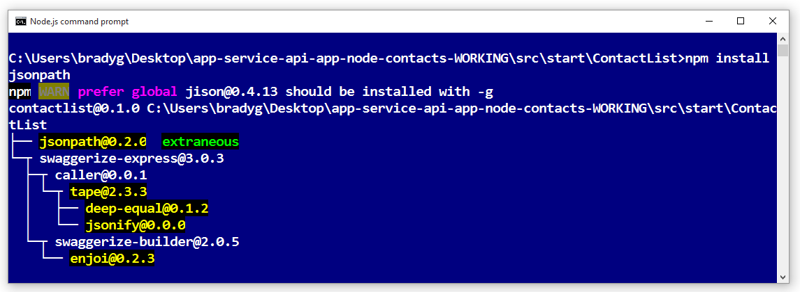
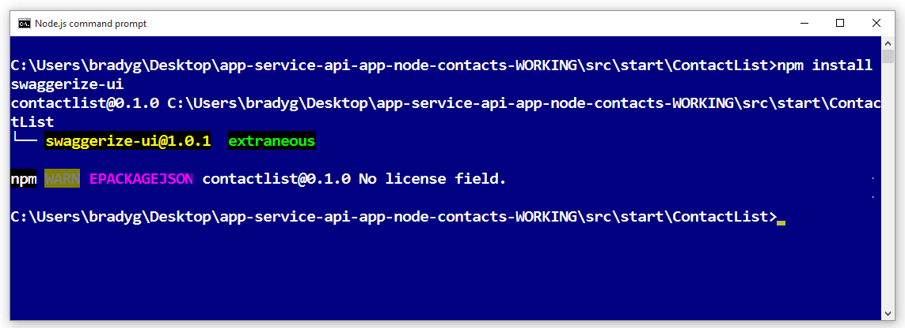
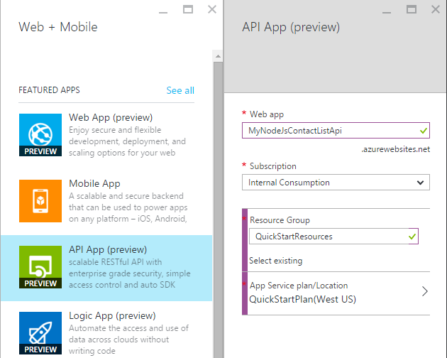
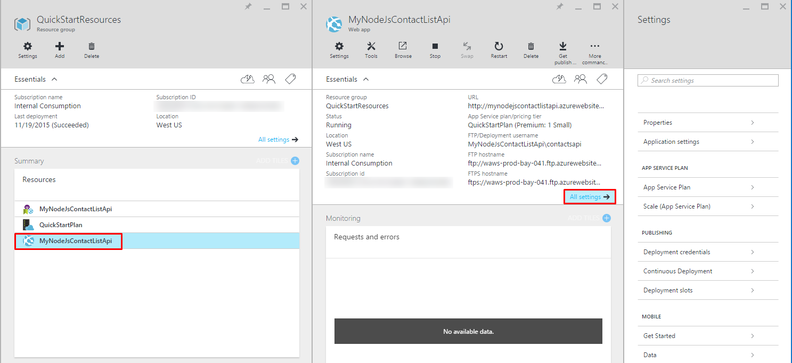

<properties
    pageTitle="Build and deploy a Node.js API app in Azure App Service"
    description="Learn how to create a Node.js API app package and deploy it to Azure App Service."
    services="app-service\api"
    documentationCenter="node"
    authors="bradygaster"
    manager="mohisri",
    editor="tdykstra "/>

<tags
    ms.service="app-service-api"
    ms.workload="web"
    ms.tgt_pltfrm="na"
    ms.devlang="node"
    ms.topic="get-started-article"
    ms.date="11/27/2015"
    ms.author="bradygaster"/>

# Build and deploy a Node.js API app in Azure App Service

[AZURE.INCLUDE [app-service-api-get-started-selector](../../includes/app-service-api-get-started-selector.md)]

## Prerequisites
1. [Node.js](nodejs.org) running on development machine (this sample assumes Node.js version 4.2.2 is installed)
1. [GitHub](https://github.com/) account
1. Microsoft Azure [free trial account](https://azure.microsoft.com/pricing/free-trial/)
1. Git installed on your local development workstation

## Setup Instructions
The commands below should be performed using the Node.js command line. By using the Swaggerize Yo generator, you can scaffold the baseline Node.js code you'll need to service HTTP requests defined in a Swagger JSON file. 
 
1. Install **yo** and the **generator-swaggerize** NPM modules globally.

        npm install -g yo
        npm install -g generator-swaggerize
        
1. Clone the [GitHub repository containing the sample code](https://github.com/Azure-Samples/app-service-api-node-contact-list).

        git clone https://github.com/Azure-Samples/app-service-api-node-contact-list.git
                
1. Execute the command to scaffold the API based on the **api.json** file included with the source code. The **api.json** file is a Swagger file representing the actual API you will scaffold using the "yo swaggerize" command during the next step. 

        yo swaggerize
        
    **Note:** API.json is not the same thing as the *apiapp.json* file from the API Apps preview time frame.

1. Swaggerize will scaffold the handlers and config for the Swagger metadata included in **api.json**. During the scaffolding proces you will be asked a variety of questions, like your GitHub username and email address. This information is used to generate the **package.json** file in your application's folder. Of all the questions asked during the scaffolding process, the most important is that you select **express** when asked, as this sample will make use of the express view engine to generate the Swagger help page later when your API App is running in Azure (or locally).  

    
    
1. Move into the folder containing the scaffolded code (in this case, the *ContactList* subfolder). Then, install the **jsonpath** NPM module. 

        npm install --save jsonpath
        
    You will see the results of the installation in the command-line experience. 

    

1. Install the **swaggerize-ui** NPM module. 

        npm install --save swaggerize-ui
        
    You will see the results of the installation in the command-line experience. 

    

1. Copy the **lib** folder from the **start** folder into the **ContactList** folder created by the scaffolder. 

1. Replace the code in the **handlers/contacts.js** file with the code below. This code uses the JSON data stored in the **lib/contacts.json** file that is served by **lib/contactRepository.js**. The new contats.js code below will respond to HTTP requests to get all of the contacts using this code. 

        'use strict';
        
        var repository = require('../lib/contactRepository');
        
        module.exports = {
            get: function contacts_get(req, res) {
                res.json(repository.all())
            }
        };

1. Replace the code in the **handlers/contacts/{id}.js** file with the code below, which will use **lib/contactRepository.js** to get the contact requested by the HTTP request and return it as a JSON payload. 

        'use strict';

        var repository = require('../../lib/contactRepository');
        
        module.exports = {
            get: function contacts_get(req, res) {
                res.json(repository.get(req.params['id']))
            }    
        };

1. Replace the code in **server.js** with the code below. Note, the changes made to the server.js file are highlighted using comments so you can see the changes being made. 

        'use strict';

        var port = process.env.PORT || 8000; // first change

        var http = require('http');
        var express = require('express');
        var bodyParser = require('body-parser');
        var swaggerize = require('swaggerize-express');
        var swaggerUi = require('swaggerize-ui'); // second change
        var path = require('path');

        var app = express();

        var server = http.createServer(app);

        app.use(bodyParser.json());

        app.use(swaggerize({
            api: path.resolve('./config/api.json'), // third change
            handlers: path.resolve('./handlers'),
            docspath: '/swagger' // fourth change
        }));

        // change four
        app.use('/docs', swaggerUi({
          docs: '/swagger'  
        }));

        server.listen(port, function () { // fifth change
            app.setHost(undefined); // sixth and final change
        });

1. Activate the server using the Node.js command-line executable. 

        node server.js

    Executing this command will launch the Node.js HTTP server and start serving your API. 

1. When you browse to **http://localhost:8000/contacts** you will see the JSON output of the contact list (or be prompted to download it, depending on your browser). 

    

1. When you browse to **http://localhost:8000/contacts/2** you'll see the contact represented by that id value. 

    

1. The Swagger JSON data is served via the **/swagger** endpoint:

    

1. The Swagger UI is served via the **/docs** endpoint. In the Swagger UI you can use the rich HTML client features to test out your API.

    

## Create a new API App in the Azure Portal
In this section you'll walk through the process of creating a new, empty API App in Azure. Then, you'll wire up the app to a Git repository so you can enable continuous delivery of your code changes. 

The GitHub repository from which you cloned the source code is not the same repository you'll be pushing the code into for deployment. The sample GitHub repository contained the "Start" state of the code, and now that you've scaffolded the "end" state of the code you'll need to push that code only into the Git repository associated with your API App. The first step will be to create your API App using the Azure Portal, then you'll 

1. Browse to the [Azure Portal](http://portal.azure.com). 

1. Create a new API App. 

    

1. You can either add your new API App to an existing Resource Group and/or App Service Plan, or you can create a new Resource Group and App Service Plan, as demonstrated in the screenshot below. 

    

1. Once your API App has been created in the portal, browse to the blade containing the settings for your API App, as shown below. 

    

1. Click the **Deployment credentials** navigation item in the Settings menu. Once the blade opens, add a username and password you'll use for publishing your Node.js code to your API App. Then, click the **Save** button on the **Set deployment credentials** blade. 

    

1. Once you've set your deployment credentials, you can create a Git repository that's associated with your App Service. Each time you push code to this repository, Azure App Service will pick up your changes and deploy them directly to your API app instance. To create a Git repository to associate with your site, click the **Continuous Deployment** menu item in the Settings menu blade as shown below. Then, select the **Local Git Repository** option in the **Choose source** blade. Then, click the OK button to create your Git repository.

    

1. Once your Git repository has been created the blade will change and show you your active deployments. Since the repository is new, you should have no active deployments in the list. 

    

1. The last step will be to copy the Git repository URL from the portal. To do this, navigate to the blade for your new API App and look at the **Essentials** section of the blade. You should see the **Git clone URL** in the Essentials section. Next to it is an icon that will copy the URL to your clipboard. Either click this to copy the URL (the button appears when you mouse over the URL), or select the entire URL and copy it to your clipboard.

    

    **Note**: You will need the Git clone URL in the next step so make sure to save it somewhere for the moment.

Now that you have a new API App with a Git repository backing it up, you can push code into the repository and utilize the continuous deployment features of Azure to automatically deploy your changes. 

## Deploy Your API App Code to Azure
Using the built-in continuous delivery features Azure App Service provides, you can simply commit your code to a Git repository associated with your App Service, and Azure will pick up your source code and deploy it to your API App. 

1. Copy the **src/end/ContactList** folder created by the swaggerize scaffolder to your desktop or some other folder, as you'll be creating a new local Git repository for the code that should live outside the main repository you cloned from GitHub containing the getting-started code. 

1. Use the Node.js command line experience to navigate into the new folder. Once there, execute the following command to create a new local Git repository. 

        git init

    This command will create a local Git repository, and you'll be shown a confirmation that your new repository was initialized. 

    

1. Use the Node.js command line experience to execute the following command, which will add a Git remote to your local repository. The remote repository will be the one you just created and associated with your API App running in Azure. 

        git remote add azure YOUR_GIT_CLONE_URL_HERE

    **Note**: You will want to replace the string "YOUR_GIT_CLONE_URL_HERE" above with your own Git clone URL you copied earlier. 

1. Next, execute the two commands below from the Node.js command line experience. 

        git add .
        git commit -m "initial revision"

    Once you've completed these two commands you should see something like the screenshot below in your command line window. 

    

1. To push your code to Azure, which will trigger a deployment to your API App, execute the following command in the Node.js command line. When prompted for a password, use the password you used earlier when creating your Deployment Credential in the Azure portal. 

        git push azure master

1. If you navigate back to the **Continuous Deployment** blade for your API App, you'll see the deployment is occurring. 

    

    Simultaneously, the Node.js command line will reflect the status of your deployment while it is happening. 

    

1. Once the deployment has completed, the **Continous Deployment** blade will reflect the successful deployment of your code changes to your API App. Copy the **URL** in the **Essentials** section of your API App blade. 

    

1. Using a REST API client such as Postman or Fiddler (or your web browser), provide the URL of your contacts API call, which should be the **/contacts** endpoint of your API App. 

    **Note:** The URL will be something like http://myapiapp.azurewebsites.net/contacts

    When you issue a GET request to this endpoint you should see the JSON output of your API App.

    

## Next steps

At this point you've successfully created and deployed your first API App using Node.js. The next tutorial in the API Apps getting started series shows how to [consume API apps from JavaScript clients, using CORS](app-service-api-cors-consume-javascript.md).

To build on this sample, you could add code to the handlers to store your data in a database or on the disk of your API App instance. Now that you have the Continuous Deployment wired up, changing your API App's functionality and extending it is as easy as changing and pushing your code to your Git repository. 
