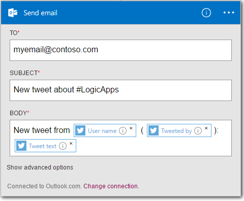

<properties
    pageTitle="Een logische app maken | Microsoft Azure"
    description="Lees hoe u een logische app kunt maken waarmee SaaS-services worden verbonden"
    authors="stepsic-microsoft-com"
    manager="dwrede"
    editor=""
    services="app-service\logic"
    documentationCenter=""/>

<tags
    ms.service="app-service-logic"
    ms.workload="na"
    ms.tgt_pltfrm="na"
    ms.devlang="na"
    ms.topic="get-started-article"
    ms.date="03/16/2016"
    ms.author="stepsic"/>

# Een nieuwe logische app maken waarmee SaaS-services worden verbonden

| Snelzoekgids |
| --------------- |
| [Definitietaal van Logic Apps](https://msdn.microsoft.com/library/azure/mt643789.aspx) |
| [Documentatie voor de connector Logic Apps](../connectors/apis-list.md) |
| [Forum voor Logic Apps](https://social.msdn.microsoft.com/Forums/en-US/home?forum=azurelogicapps) |

In dit onderwerp wordt beschreven hoe u in een paar minuten aan de slag kunt met [App Services Logic Apps](app-service-logic-what-are-logic-apps.md). We doorlopen een werkstroom waarmee u een set Tweets waarin u bent geïnteresseerd, kunt bezorgen in een postvak.

Voor dit scenario hebt u het volgende nodig:

- Een Azure-abonnement
- Een Twitter-account
- Een Office 365-account

## Een nieuwe logische app maken om tweets naar u te e-mailen

1. Selecteer **Marketplace** op het dashboard van de Azure-portal. 
2. Zoek in Alles naar 'logische apps' en selecteer **Logic App (preview)**. U kunt ook **Nieuw**, **Web + Mobile** selecteren en vervolgens **Logic App (preview)** selecteren. 
3. Voer een naam in voor uw logische app, selecteer het App Service-abonnement en selecteer **Maken**.  
    In deze stap gaan we ervan uit dat u een App Service-abonnement hebt en bekend bent met de vereiste eigenschappen. Als niet zo is, begint u met [Uitgebreid overzicht van Azure App Service-abonnementen](azure-web-sites-web-hosting-plans-in-depth-overview.md). 

4. Wanneer de logische app de eerste keer wordt geopend, hebt u een trigger nodig. Zoek naar **twitter** in het zoekvak voor triggers en selecteer dit.

7. Typ nu het trefwoord waarop u wilt zoeken in Twitter. 
    

5. Selecteer het plusteken en kies **Een actie toevoegen** of **Een voorwaarde toevoegen**:  
    
6. Wanneer u **Een actie toevoegen** selecteert, worden alle connectors met de beschikbare acties weergegeven. U kunt nu kiezen welke connector en welke actie u wilt toevoegen aan uw logische app. U kunt bijvoorbeeld **Office 365 - E-mail verzenden** selecteren, en meer Office 365-acties:  
    

7. U moet nu de gewenste parameters invullen voor de e-mail:  

8. Ten slotte selecteert u **Opslaan** om de logische app te publiceren.

## Uw logische app beheren na het maken

Nu is uw logische app actief. Elke keer wanneer de geplande werkstroom wordt uitgevoerd, wordt er gecontroleerd op tweets met de specifieke hashtag. Wanneer er een overeenkomende tweet wordt gevonden, wordt deze in uw Dropbox geplaatst. Ten slotte ziet u hoe u de app kunt uitschakelen of wat de voortgang hiervan is.

1. Klik op **Bladeren** links in het scherm en selecteer **Logische apps**.

2. Klik op de nieuwe logische app die u net hebt gemaakt om de huidige status en algemene informatie te bekijken.

3. Als u de nieuwe logische app wilt bewerken, klikt u op **Triggers en acties**.

5. Als u de app wilt uitschakelen, klikt u op **Uitschakelen** op de opdrachtbalk.

U hebt nu in minder dan 5 minuten een eenvoudige logische app ingesteld die wordt uitgevoerd in de cloud. Zie [Functies van logische apps gebruiken] voor meer informatie over het gebruik van functies van Logic Apps. Zie [Logic App-definities maken](app-service-logic-author-definitions.md) voor meer informatie over de Logic App-definities zelf.

<!-- Shared links -->
[Azure Portal]: https://portal.azure.com
[Functies van logische apps gebruiken]: app-service-logic-create-a-logic-app.md

<!--HONumber=Jun16_HO2-->

