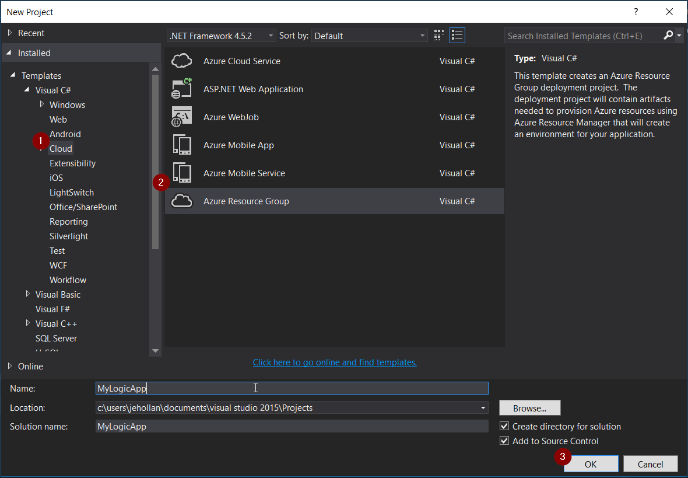

<properties 
	pageTitle="Deploy from Visual Studio" 
	description="Create a project in Visual Studio to manage your Logic app." 
	authors="stepsic-microsoft-com" 
	manager="dwrede" 
	editor="" 
	services="app-service\logic" 
	documentationCenter=""/>

<tags
	ms.service="app-service-logic"
	ms.workload="integration"
	ms.tgt_pltfrm="na"
	ms.devlang="na"
	ms.topic="article"
	ms.date="10/29/2015"
	ms.author="stepsic"/> 
	
# Deploy from Visual Studio

Although the [Azure Portal](https://portal.azure.com) gives you a great way to design and manage your Logic apps, you may also want to deploy your Logic app from Visual Studio instead. There are a couple key capabilities this enables:

- Store your Logic app alongside the other assets in your Solution, so it can contain all aspects of your application
- Keep your Logic app definition checked into source control so that you can use TFS or Git to track revisions to it 

You have to have the Azure SDK 2.7 or later installed in order to follow the steps below. Find [the latest SDK for VS](http://azure.microsoft.com/downloads/) here.

## Create a project

1. Go to the **File** menu and select **New** >  **Project** (or, you can go to **Add** and then select **New project** to add it to an existing solution)
    

2. In the dialog find **Cloud** and then select **Azure Resource Group**. Type a **Name** and then click **OK**.
    

3. You now need to select if you want a **Logic app** or **Logic app + API app**. Selecting **Logic app** requires you to point to existing APIs. If you select **Logic app + API app** then you can also create a new, empty, API app at the same time.
    

4. Once you have selected your **Template** hit **OK**.

Now your Logic app project will be added to your solution. You should see the deployment in the Solution Explorer:

## Configuring your Logic app

Once you have a project you can edit the definition of your Logic app inside Visual Studio. Click on the JSON file in the solution explorer. You will see a placeholder definition that you can fill in with your application's logic.

It's recommended to use **parameters** throughout your definition. This will be useful if you want to deploy to both a development and production environment. In that case, you should put all environment-specific configuration in the `.param` file, and the parameters instead of the actual strings.

Today, Visual Studio does not have a built-in JSON designer, so if you'd like to use a graphical interface (as opposed to writing JSON), you will need to use the Azure Portal. 

If you previously created a Logic app inside the Azure Portal and now want to check it in to source control, there are three ways to accomplish this:
- Go to **Code view** in the portal and copy the definition.
- Use the Logic apps [REST API](https://msdn.microsoft.com/library/azure/dn948510.aspx) to get the definition.
- Use [Azure Resource manager powershell](../powershell-azure-resource-manager.md),  specifically the [`Get-AzureResource` command](https://msdn.microsoft.com/library/dn654579.aspx) to download the definition.

## Deploying your Logic app

Finally, after you have configured your app you can deploy directly from Visual Studio in just a couple steps. 

1. Right-click on the deployment in the Solution Explorer and go to **Deploy** > **New deployment...**
    

2. You will be prompted to sign in to your Azure subscription(s). 

3. Now you need to choose the details of the resource group that you want to deploy the Logic app to. 
    

    Be sure to select the right template and parameters files for the resource group (for example if you are deploying to a production environment you'll want to choose the production parameters file). 
    
4. The status of the deployment will appear in the **Output** window (you may need to choose **Azure Provisioning**. 
    

In the future you can revise your Logic app in source control and use Visual Studio to deploy new versions. Note that if you modify the definition in the Azure Portal directly, the next time you deploy from Visual Studio those changes will be overwritten.

If you do not want to use Visual Studio, but still want to use tooling to deploy your Logic app from source control, you can use the [API](https://msdn.microsoft.com/library/azure/dn948510.aspx) or [Powershell](../powershell-azure-resource-manager.md) directly to automate your deployments.  