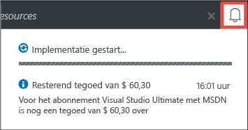
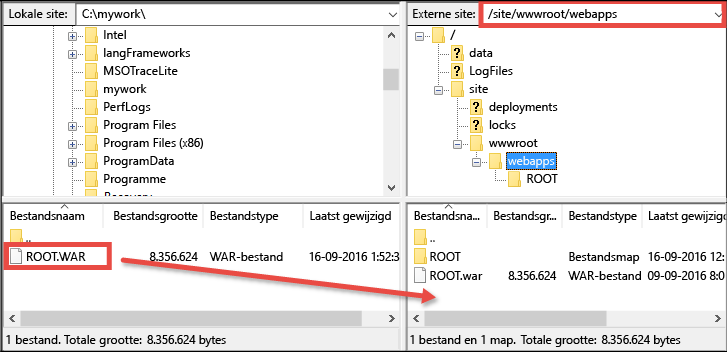

<properties 
    pageTitle="Uw eerste Java-web-app in vijf minuten in Azure implementeren | Microsoft Azure" 
    description="Ontdek hoe eenvoudig het is om web-apps in App Service uit te voeren door een voorbeeld-app te implementeren. Ontwikkel snel uw eigen app en bekijk onmiddellijk de resultaten." 
    services="app-service\web"
    documentationCenter=""
    authors="cephalin"
    manager="wpickett"
    editor=""
/>

<tags
    ms.service="app-service-web"
    ms.workload="web"
    ms.tgt_pltfrm="na"
    ms.devlang="na"
    ms.topic="hero-article"
    ms.date="09/16/2016" 
    ms.author="cephalin"
/>
    
# Uw eerste Java-web-app in vijf minuten in Azure implementeren

Met deze zelfstudie leert u om een eenvoudige Java-web-app te implementeren in [Azure App Service](../app-service/app-service-value-prop-what-is.md).
Met App Service kunt u web-apps, [back-ends voor mobiele apps](/documentation/learning-paths/appservice-mobileapps/) en [API-apps](../app-service-api/app-service-api-apps-why-best-platform.md) maken.

U gaat het volgende doen: 

- Een web-app maken in Azure App Service.
- Een Java-voorbeeld-app implementeren.
- Zien hoe de code live in productie wordt uitgevoerd.

## Vereisten

- U moet beschikken over een FTP-/FTPS-client, zoals [FileZilla](https://filezilla-project.org/).
- Verkrijg een Microsoft Azure-account. Als u geen account hebt, kunt u zich [aanmelden voor een gratis proefversie](/pricing/free-trial/?WT.mc_id=A261C142F) of [uw voordelen als Visual Studio-abonnee activeren](/pricing/member-offers/msdn-benefits-details/?WT.mc_id=A261C142F).

>[AZURE.NOTE] U kunt [App Service proberen](http://go.microsoft.com/fwlink/?LinkId=523751) zonder een Azure-account. U kunt een beginners-app maken en hier een uur mee spelen. U hebt geen creditcard nodig en u doet geen toezeggingen.

## Een web-app maken

1. Meld u met uw Azure-account aan bij de [Azure-portal](https://portal.azure.com).

2. Klik in het menu aan de linkerkant op **Nieuw** > **Web en mobiel** > **Web-app**.

    

3. Gebruik in de blade voor het maken van de app de volgende instellingen voor de nieuwe app:

    - **App-naam**: voer een unieke naam in.
    - **Resourcegroep**: selecteer **Nieuwe maken** en geef de resourcegroep een naam.
    - **App Service-plan/-locatie**: klik hier om te configureren en klik vervolgens op **Nieuwe maken** om de naam, locatie en prijscategorie van het App Service-plan in te stellen. Gebruik gerust de prijscategorie **Gratis**.

    Wanneer u klaar bent, ziet de blade voor het maken van de app er als volgt uit:

    

3. Klik onderaan op **Maken**. U kunt bovenaan op het **melding**spictogram klikken als u de voortgang wilt bekijken.

    

4. Wanneer de implementatie is voltooid, ziet u deze melding. Klik op het bericht als u de blade van uw implementatie wilt openen.

    

5. Klik in de blade **Implementatie is voltooid** op de koppeling **Resource** om de blade van de nieuwe web-app te openen.

    

## Een Java-app implementeren voor uw web-app

U gaat nu een Java-app in Azure implementeren middels FTPS.

5. Schuif in de blade van de web-app omlaag naar **Toepassingsinstellingen** of zoek deze optie en klik erop. 

    

6. Bij **Java-versie** selecteert u **Java 8** en klikt u op **Opslaan**.

    

    Wanneer u de melding **Web-appinstellingen zijn bijgewerkt** ziet, gaat u naar http://*&lt;appnaam>*.azurewebsites.net om de JSP-standaardservlet in actie te zien.

7. Schuif in de blade van de web-app omlaag naar **Referenties voor implementatie** of zoek deze optie en klik erop.

8. Stel uw implementatiereferenties in en klik op **Opslaan**.

7. In de blade van de web-app klikt u op **Overzicht**. Naast **Gebruikersnaam FTP/implementatie** en **FTPS-hostnaam** klikt u op **Kopiëren** om de waarden te kopiëren.

    

    Nu kunt u uw Java-app met FTPS gaan implementeren.

8. In uw FTP-/FTPS-client meldt u zich aan bij de FTP-server van uw Azure-web-app. Gebruik daarvoor de waarden die u tijdens de vorige stap hebt gekopieerd. Gebruik het implementatiewachtwoord dat u eerder hebt gemaakt.

    In de volgende schermafbeelding ziet u hoe aanmelding met FileZilla werkt.

    

    Mogelijk krijgt u beveiligingswaarschuwingen te zien over het niet-herkende SSL-certificaat van Azure. U kunt gewoon doorgaan.

9. Klik op [deze koppeling](https://github.com/Azure-Samples/app-service-web-java-get-started/raw/master/webapps/ROOT.war) om het WAR-bestand naar uw computer te downloaden.

9. Navigeer in uw FTP-/FTPS-client naar **site/wwwroot/webapps** van de externe site. Sleep het gedownloade WAR-bestand van uw computer naar de externe map.

    

    Klik op **OK** om het bestand in Azure te overschrijven.

    >[AZURE.NOTE] In overeenstemming met het standaardgedrag van Tomcat, verwijst de bestandsnaam **ROOT.war** in site/wwwroot/webapps naar de hoofdweb-app (http://*&lt;appnaam>*.azurewebsites.net) en verwijst de bestandsnaam ***&lt;willekeurigenaam>*.war** naar een web-app met een naam (http://*&lt;appnaam>*.azurewebsites.net/*&lt;willekeurigenaam>*).

Dat is alles. Uw Java-app wordt nu live uitgevoerd in Azure. Navigeer in uw browser naar http://*&lt;appname>*.azurewebsites.net om de code in actie te zien. 

## Updates aanbrengen in uw app

Wanneer u een update wilt uitvoeren, uploadt u het nieuwe WAR-bestand naar diezelfde externe map via de FTP-/FTPS-client.

## Volgende stappen

[Maak een Java-web-app op basis van een sjabloon in Azure Marketplace](app-service-web-java-get-started.md#marketplace). U kunt uw eigen volledige aanpasbare Tomcat-container verkrijgen en gebruikmaken van de bekende gebruikersinterface voor beheerders. 

Spoor fouten in de Azure-web-app rechtstreeks op via [IntelliJ](app-service-web-debug-java-web-app-in-intellij.md) of [Eclipse](app-service-web-debug-java-web-app-in-eclipse.md).

Of doe meer met uw eerste web-app. Bijvoorbeeld:

- Probeer [andere manieren om uw code in Azure te implementeren](../app-service-web/web-sites-deploy.md). Als u bijvoorbeeld wilt implementeren vanuit een van uw GitHub-opslagplaatsen, selecteert u in **Implementatieopties** **GitHub** in plaats van **Lokale Git-opslagplaats**.
- Til uw Azure-app naar een hoger niveau. Verifieer uw gebruikers. Schaal de app op basis van vraag. Stel prestatiesignalen in. Dit alles met slechts enkele klikken. Zie [Functionaliteit toevoegen aan uw eerste web-app](app-service-web-get-started-2.md).

<!--HONumber=Sep16_HO4-->

