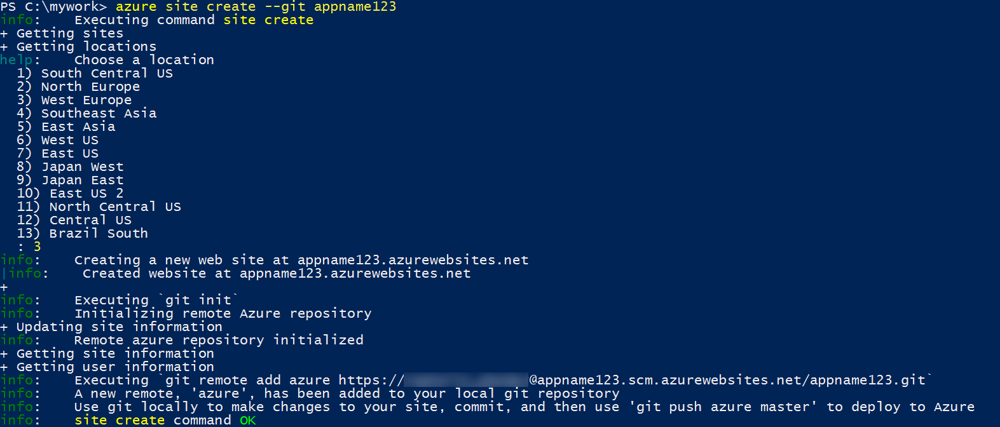
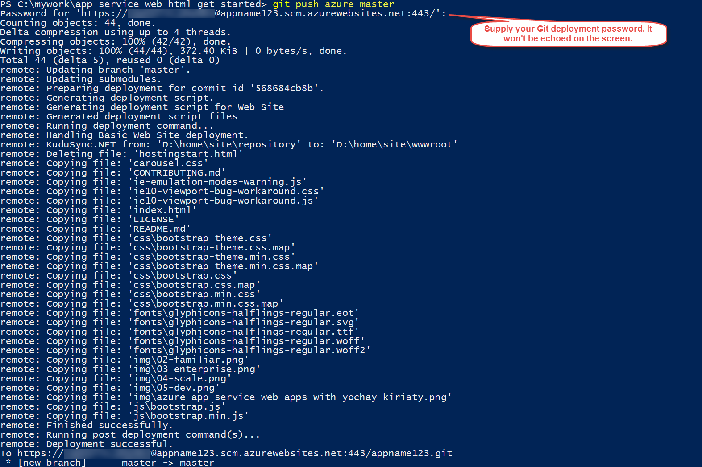
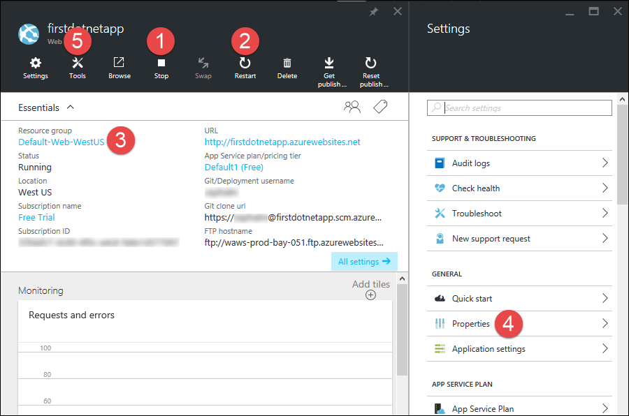

<properties 
    pageTitle="In vijf minuten uw eerste web-app implementeren in Azure" 
    description="Hier ontdekt u hoe eenvoudig het is om web-apps in App Service uit te voeren, door met slechts een paar stappen een voorbeeld-app te implementeren. In nog geen vijf minuten kunt u een app gaan ontwikkelen en onmiddellijk de resultaten bekijken." 
    services="app-service\web"
    documentationCenter=""
    authors="cephalin" 
    manager="wpickett" 
    editor="" 
/>

<tags 
    ms.service="app-service-web" 
    ms.workload="web" 
    ms.tgt_pltfrm="na" 
    ms.devlang="na" 
    ms.topic="hero-article"
    ms.date="05/12/2016" 
    ms.author="cephalin"
/>
    
# In vijf minuten uw eerste web-app implementeren in Azure

[AZURE.INCLUDE [tabs](../../includes/app-service-web-get-started-nav-tabs.md)]

Deze zelfstudie helpt u om uw eerste web-app te implementeren in [Azure App Service](../app-service/app-service-value-prop-what-is.md). Met App Service kunt u web-apps, [back-ends voor mobiele apps](/documentation/learning-paths/appservice-mobileapps/) en [API-apps](../app-service-api/app-service-api-apps-why-best-platform.md) maken.

Met slechts een paar handelingen kunt u het volgende: 

- Een voorbeeld-web-app implementeren (kies tussen ASP.NET, PHP, Node.js, Java of Python).
- Uw app binnen enkele seconden live in werking zien.
- De web-app op dezelfde manier bijwerken als waarop u [Git-doorvoeracties pusht](https://git-scm.com/docs/git-push).

U maakt ook kennis met de [Azure Portal](https://portal.azure.com) en krijgt een overzicht van de functies die daar beschikbaar zijn. 

## Vereisten

- [Installeer Git](http://www.git-scm.com/downloads). 
- [Installeer Azure CLI](../xplat-cli-install.md). 
- Verkrijg een Microsoft Azure-account. Als u geen account hebt, kunt u zich [aanmelden voor een gratis proefversie](/pricing/free-trial/?WT.mc_id=A261C142F) of [uw voordelen als Visual Studio-abonnee activeren](/pricing/member-offers/msdn-benefits-details/?WT.mc_id=A261C142F).

>[AZURE.NOTE] Bekijk een web-app in werking. [Probeer App Service onmiddellijk uit](http://go.microsoft.com/fwlink/?LinkId=523751) en maak een eenvoudige, tijdelijke app, zonder creditcard en zonder verdere verplichtingen.

## Een web-app implementeren

We gaan een web-app implementeren op Azure App Service. 

1. Open een nieuw(e) Windows-opdrachtprompt, PowerShell-venster, Linux-shell of OS X-terminal. Voer `git --version` en `azure --version` uit om te controleren of Git en Azure CLI op uw computer zijn geïnstalleerd. 

    

    Als u de hulpprogramma's niet hebt geïnstalleerd, raadpleeg dan [Vereisten](#Prerequisites) voor downloadkoppelingen.

1. `CD` in een werkmap en ga als volgt te werk om de voorbeeld-app te kopiëren:

        git clone <github_sample_url>

    

    Voor *&lt;github_sample_url>* gebruikt u een van de volgende URL's, afhankelijk van het framework dat u wilt gebruiken: 

    - HTML+CSS+JS: [https://github.com/Azure-Samples/app-service-web-html-get-started.git](https://github.com/Azure-Samples/app-service-web-html-get-started.git)
    - ASP.NET: [https://github.com/Azure-Samples/app-service-web-dotnet-get-started.git](https://github.com/Azure-Samples/app-service-web-dotnet-get-started.git)
    - PHP (CodeIgniter): [https://github.com/Azure-Samples/app-service-web-php-get-started.git](https://github.com/Azure-Samples/app-service-web-php-get-started.git)
    - Node.js (Express): [https://github.com/Azure-Samples/app-service-web-nodejs-get-started.git](https://github.com/Azure-Samples/app-service-web-nodejs-get-started.git) 
    - Java: [https://github.com/Azure-Samples/app-service-web-java-get-started.git](https://github.com/Azure-Samples/app-service-web-java-get-started.git)
    - Python (Django): [https://github.com/Azure-Samples/app-service-web-python-get-started.git](https://github.com/Azure-Samples/app-service-web-python-get-started.git)

2. `CD` naar de opslagplaats van uw voorbeeld-app. Bijvoorbeeld: 

        cd app-service-web-html-get-started

3. Meld u als volgt aan bij Azure:

        azure login
    
    Volg de aanwijzingen in het Help-bericht om door te gaan met de aanmelding.
    
    

4. Gebruik de volgende opdracht om de resource voor de App Service-app in Azure te maken met een unieke app-naam. Geef het nummer van de gewenste regio op wanneer dit wordt gevraagd.

        azure site create --git <app_name>
    
    
    
    >[AZURE.NOTE] Als u nog niet eerder implementatiereferenties voor uw Azure-abonnement hebt ingesteld, wordt u nu gevraagd om deze te maken. Deze referenties (dus niet de referenties van uw Azure-account) worden alleen door App Service gebruikt voor Git-implementaties en FTP-aanmeldingen. 
    
    Uw app is nu gemaakt in Azure. Bovendien is de huidige map voor Git geïnitialiseerd en als Git remote verbonden met de nieuwe App Service-app.
    Als u dit wilt, kunt u bladeren om de URL van de app te bekijken (http://&lt;app_naam>.azurewebsites.net), met de mooi vormgegeven standaard-HTML-pagina, maar in deze zelfstudie gaan we uw eigen code hier neerzetten.

4. We implementeren nu uw voorbeeldcode in de nieuwe App Service-app. Dit doen we op dezelfde manier waarop u code zou pushen met Git:

        git push azure master 

        
    
    Als u een van de taalframeworks hebt gebruikt, ziet u andere uitvoer dan hierboven weergegeven. Dat komt omdat `git push` niet alleen code in Azure plaatst, maar ook implementatietaken in de implementatie-engine activeert. Als u een package.json (Node.js) of requirements.txt (Python) in de hoofdmap van het project (opslagplaats) hebt, of als er een packages.config in uw ASP.NET-project staat, worden de vereiste pakketten met de implementatiescripts voor u hersteld. U kunt ook [de Composer-extensie inschakelen](web-sites-php-mysql-deploy-use-git.md#composer) als u composer.json-bestanden in uw PHP-app automatisch wilt verwerken.

Gefeliciteerd, u hebt uw app geïmplementeerd in Azure App Service. 

## Uw app live in werking zien

Als u uw app in Azure in werking wilt zien, voert u deze opdracht uit vanuit een willekeurige map in de opslagplaats:

    azure site browse

## Updates aanbrengen in uw app

Nu kunt u met Git op elk moment push-acties uitvoeren vanuit het project (opslagplaats) om een actieve site bij te werken. Dit werkt op dezelfde manier als toen u de app voor het eerst in Azure implementeerde. Zo hoeft u telkens wanneer u een nieuwe wijziging wilt pushen die u lokaal hebt getest, alleen de volgende opdrachten uit te voeren vanuit de hoofdmap van het project (opslagplaats):
    
    git add .
    git commit -m "<your_message>"
    git push azure master

## De app weergeven in de Azure Portal

Nu gaan we naar de Azure Portal om te zien wat u hebt gemaakt:

1. Meld u bij de [Azure Portal](https://portal.azure.com) aan met het Microsoft-account waarmee u uw Azure-abonnement hebt afgesloten.

2. Klik in de linkerbalk op **App Services**.

3. Klik op de app die u zojuist hebt gemaakt om de pagina ervan te openen in de portal (een zogenaamde [blade](../azure-portal-overview.md)). Voor uw gemak wordt standaard ook de blade **Instellingen** geopend.

     

De portalblade van uw App Service-app bevat een uitgebreide verzameling instellingen en hulpprogramma's waarmee u de app kunt configureren, bewaken en beveiligen, en problemen met de app kunt oplossen. Neem even de tijd om vertrouwd te raken met deze interface door enkele eenvoudige taken uit te voeren (het nummer van de taak komt overeen met het nummer in de schermafbeelding):

1. de app stoppen
2. de app opnieuw starten
3. op de koppeling **Resourcegroep** klikken om alle resources weer te geven die in de resourcegroep zijn geïmplementeerd
4. op **Instellingen** > **Eigenschappen** klikken om andere informatie over de app weer te geven
5. op **Hulpmiddelen** klikken voor toegang tot nuttige hulpprogramma's voor controle en probleemoplossing  

## Volgende stappen

- Breng uw Azure-app naar een hoger niveau. Beveilig deze met verificatie. Schaal de app op basis van vraag. Stel prestatiewaarschuwingen in. Dit alles met slechts enkele klikken. Zie [Functionaliteit toevoegen aan uw eerste web-app](app-service-web-get-started-2.md).
- Naast Git en Azure CLI zijn er nog andere manieren om web-apps te implementeren in Azure (zie [Een app implementeren in Azure App Service](../app-service-web/web-sites-deploy.md)).
Zoek de meest geschikte ontwikkelings- en implementatiestappen voor uw taalframework door boven in het artikel uw framework te selecteren.

<!--HONumber=Jun16_HO2-->

