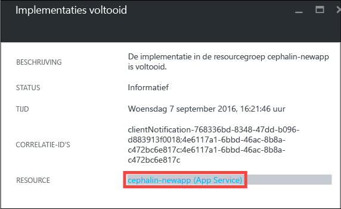
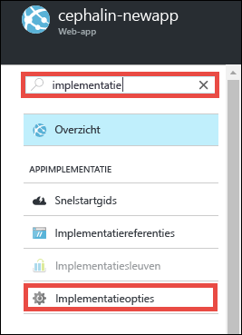
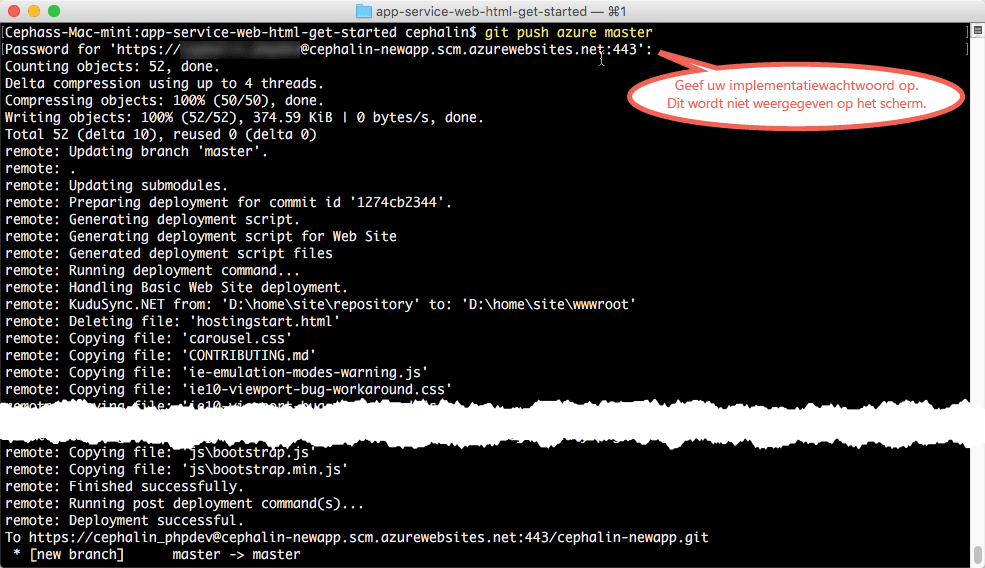

<properties 
    pageTitle="Uw eerste web-app in vijf minuten in Azure implementeren | Microsoft Azure" 
    description="Hier ontdekt u door een voorbeeld-app te implementeren hoe eenvoudig het is om web-apps in App Service uit te voeren. U kunt snel een app gaan ontwikkelen en onmiddellijk de resultaten bekijken." 
    services="app-service\web"
    documentationCenter=""
    authors="cephalin"
    manager="wpickett"
    editor=""
/>

<tags
    ms.service="app-service-web"
    ms.workload="web"
    ms.tgt_pltfrm="na"
    ms.devlang="na"
    ms.topic="hero-article"
    ms.date="09/09/2016" 
    ms.author="cephalin"
/>
    
# In vijf minuten uw eerste web-app implementeren in Azure

Deze zelfstudie helpt u om uw eerste web-app te implementeren in [Azure App Service](../app-service/app-service-value-prop-what-is.md).
Met App Service kunt u web-apps, [back-ends voor mobiele apps](/documentation/learning-paths/appservice-mobileapps/) en [API-apps](../app-service-api/app-service-api-apps-why-best-platform.md) maken.

U gaat het volgende doen: 

- Een web-app maken in Azure App Service.
- Voorbeeldcode implementeren (kies tussen ASP.NET, PHP, Node.js, Java of Python).
- Zien hoe de code live in productie wordt uitgevoerd.
- De web-app op dezelfde manier bijwerken als waarop u [Git-doorvoeracties pusht](https://git-scm.com/docs/git-push).

## Vereisten

- [Installeer Git](http://www.git-scm.com/downloads). Controleer of de installatie is geslaagd door `git --version` uit te voeren vanuit een nieuwe Windows-opdrachtprompt, een PowerShell-venster, Linux-shell of OS X-terminal.
- Verkrijg een Microsoft Azure-account. Als u geen account hebt, kunt u zich [aanmelden voor een gratis proefversie](/pricing/free-trial/?WT.mc_id=A261C142F) of [uw voordelen als Visual Studio-abonnee activeren](/pricing/member-offers/msdn-benefits-details/?WT.mc_id=A261C142F).

>[AZURE.NOTE] U kunt [App Service proberen](http://go.microsoft.com/fwlink/?LinkId=523751) zonder een Azure-account. U kunt een beginnerstoepassing maken en hier een uur mee spelen. U hebt geen creditcard nodig en u doet geen toezeggingen.

## Een webtoepassing maken

1. Meld u met uw Azure-account aan bij de [Azure-portal](https://portal.azure.com).

2. Klik in het menu aan de linkerkant op **Nieuw** > **Web en mobiel** > **Web-app**.

    

3. Gebruik in de blade voor het maken van de app de volgende instellingen voor de nieuwe app:

    - **App-naam**: voer een unieke naam in.
    - **Resourcegroep**: selecteer **Nieuwe maken** en geef de resourcegroep een naam.
    - **App Service-plan/-locatie**: klik hier om te configureren en klik vervolgens op **Nieuwe maken** om als u de naam, locatie en prijscategorie van het App Service-plan wilt instellen. Gebruik gerust de prijscategorie **Gratis**.

    Wanneer u klaar bent, ziet de blade voor het maken van de app er als volgt uit:

    

3. Klik onderaan op **Maken**. U kunt bovenaan op het **melding**spictogram klikken als u de voortgang wilt bekijken.

    

4. Wanneer de implementatie is voltooid, ziet u deze melding. Klik op het bericht als u de blade van uw implementatie wilt openen.

    

5. Klik in de blade **Implementatie is voltooid** op de koppeling **Resource** om de blade van de nieuwe web-app te openen.

    

## Code voor de web-app implementeren

Nu gaat u met Git een stukje code in Azure implementeren.

5. Schuif in de blade van de web-app omlaag naar **Implementatieopties** of zoek deze optie en klik erop. 

    

6. Klik op **Bron kiezen** > **Lokale Git-opslagplaats** > **OK**.

7. Terug in de blade van de web-app klikt u op **Implementatiereferenties**.

8. Stel uw implementatiereferenties in en klik op **Opslaan**.

7. Terug in de blade van de web-app schuift u omlaag naar **Eigenschappen** of zoekt u deze optie en klikt u erop. Klik naast de **Git-URL** op de knop **Kopiëren**.

    

    Nu kunt u uw code met Git gaan implementeren.

1. Schakel in de opdrachtregelterminal naar een werkmap (`CD`) en ga als volgt te werk om de voorbeeld-app te kopiëren:

        git clone <github_sample_url>

    

    Voor *&lt;github_sample_url>* gebruikt u een van de volgende URL's, afhankelijk van het framework dat u wilt gebruiken:

    - HTML+CSS+JS: [https://github.com/Azure-Samples/app-service-web-html-get-started.git](https://github.com/Azure-Samples/app-service-web-html-get-started.git)
    - ASP.NET: [https://github.com/Azure-Samples/app-service-web-dotnet-get-started.git](https://github.com/Azure-Samples/app-service-web-dotnet-get-started.git)
    - PHP (CodeIgniter): [https://github.com/Azure-Samples/app-service-web-php-get-started.git](https://github.com/Azure-Samples/app-service-web-php-get-started.git)
    - Node.js (Express): [https://github.com/Azure-Samples/app-service-web-nodejs-get-started.git](https://github.com/Azure-Samples/app-service-web-nodejs-get-started.git)
    - Java: [https://github.com/Azure-Samples/app-service-web-java-get-started.git](https://github.com/Azure-Samples/app-service-web-java-get-started.git)
    - Python (Django): [https://github.com/Azure-Samples/app-service-web-python-get-started.git](https://github.com/Azure-Samples/app-service-web-python-get-started.git)

2. Schakel naar de opslagplaats van uw voorbeeld-app. Bijvoorbeeld: 

        cd app-service-web-html-get-started

3. Stel de git remote voor uw Azure-app in op de Git-URL die u enkele stappen eerder hebt gekopieerd vanuit de portal.

        git remote add azure <giturlfromportal>

4. Implementeer de voorbeeldcode in de Azure-app op dezelfde manier als waarop u code zou pushen met Git:

        git push azure master

        

    Als u een van de taalframeworks hebt gebruikt, ziet u andere uitvoer. Dat komt omdat `git push` niet alleen code in Azure plaatst, maar ook implementatietaken in de implementatie-engine activeert. Als u package.json- (Node.js) of requirements.txt-bestanden (Python) in de hoofdmap van het project (opslagplaats) hebt, of als er een packages.config-bestand in uw ASP.NET-project staat, worden de vereiste pakketten met de implementatiescripts voor u hersteld. U kunt ook [de Composer-extensie inschakelen](web-sites-php-mysql-deploy-use-git.md#composer) als u composer.json-bestanden in uw PHP-app automatisch wilt verwerken.

Dat is alles. De code wordt nu live uitgevoerd in Azure. Navigeer in uw browser naar http://*&lt;appname>*.azurewebsites.net om de code in actie te zien. 

## Updates aanbrengen in uw app

Nu kunt u met Git op elk moment push-acties uitvoeren vanuit het project (opslagplaats) om een actieve site bij te werken. Dit werkt op dezelfde manier als toen u de code voor het eerst implementeerde. Zo hoeft u telkens wanneer u een nieuwe wijziging wilt pushen die u lokaal hebt getest, alleen de volgende opdrachten uit te voeren vanuit de hoofdmap van het project (opslagplaats):

    git add .
    git commit -m "<your_message>"
    git push azure master

## Volgende stappen

Zoek als volgt de meest geschikte ontwikkel- en implementatiestappen voor uw taalframework:

> [AZURE.SELECTOR]
- [.NET](web-sites-dotnet-get-started.md)
- [PHP](app-service-web-php-get-started.md)
- [Node.js](app-service-web-nodejs-get-started.md)
- [Python](web-sites-python-ptvs-django-mysql.md)
- [Java](web-sites-java-get-started.md)

Of doe meer met uw eerste web-app. Bijvoorbeeld:

- Probeer [andere manieren om uw code in Azure te implementeren](../app-service-web/web-sites-deploy.md). Als u bijvoorbeeld wilt implementeren vanuit een van uw GitHub-opslagplaatsen, selecteert u in **Implementatieopties** **GitHub** in plaats van **Lokale Git-opslagplaats**.
- Breng uw Azure-app naar een hoger niveau. Verifieer uw gebruikers. Schaal de app op basis van vraag. Stel prestatiewaarschuwingen in. Dit alles met slechts enkele klikken. Zie [Functionaliteit toevoegen aan uw eerste web-app](app-service-web-get-started-2.md).

<!--HONumber=sep16_HO2-->

