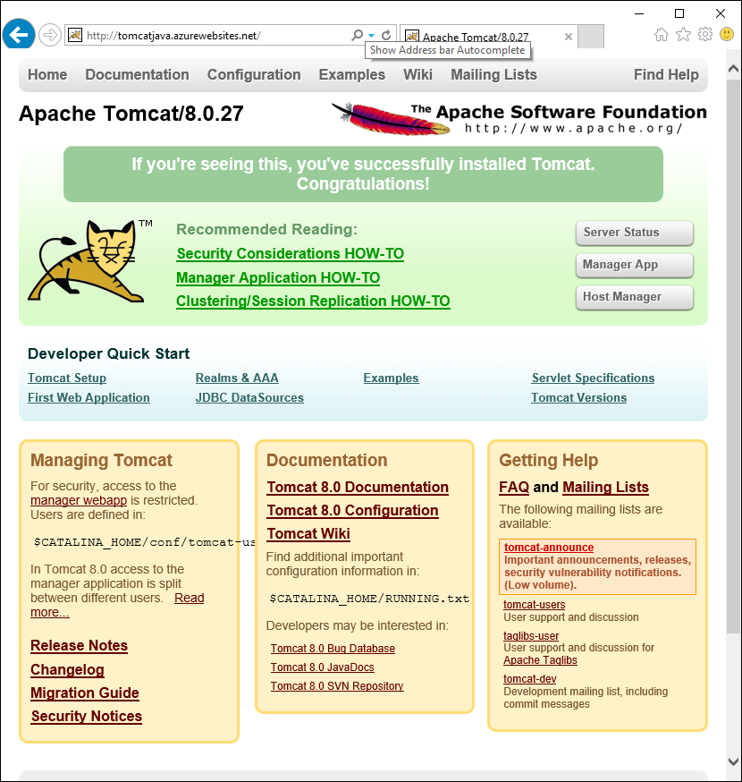
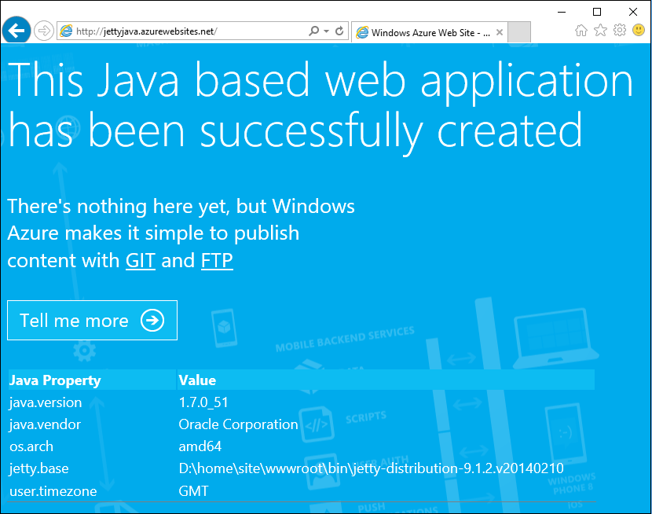

<properties
	pageTitle="在 Azure App Service 中建立 Java Web 應用程式"
	description="本教學課程示範如何將 Java Web 應用程式部署至 Azure App Service。"
	services="app-service\web"
	documentationCenter="java"
	authors="rmcmurray"
	manager="wpickett"
	editor="jimbe"/>
<tags
	ms.service="app-service-web"
	ms.workload="web"
	ms.tgt_pltfrm="na"
	ms.devlang="Java"
	ms.topic="hero-article"
	ms.date="06/03/2015"
	ms.author="robmcm"/>

# 在 Azure App Service 中建立 Java Web 應用程式

本教學課程示範如何在使用 Java 的 Microsoft Azure 上，使用 Azure Marketplace 或 [App Service Web Apps](http://go.microsoft.com/fwlink/?LinkId=529714) 組態 UI，來建立 Web 應用程式。

如果您不打算使用這些技術 (例如，如果您要自訂應用程式容器)，請參閱將[自訂的 Java Web 應用程式上傳至 Azure](web-sites-java-custom-upload.md)。

> [AZURE.NOTE]若要完成此教學課程，您需要 Microsoft Azure 帳戶。如果您沒有這類帳戶，可以<a href="/zh-tw/pricing/member-offers/msdn-benefits-details/?WT.mc_id=A261C142F" target="_blank">啟用自己的 MSDN 訂戶權益</a>或是<a href="/zh-tw/pricing/free-trial/?WT.mc_id=A261C142F" target="_blank">申請免費試用</a>。

如果您想在註冊 Azure 帳戶前開始使用 Azure App Service，請移至[試用 App Service](http://go.microsoft.com/fwlink/?LinkId=523751)，即可在 App Service 中立即建立短期入門 Web 應用程式。不需要信用卡；沒有承諾。

## 使用 Azure Marketplace 建立 Java Web 應用程式

本資訊說明如何使用 Azure Marketplace，為您的 Web 應用程式選取 Java 應用程式容器 (Apache Tomcat 或 Jetty)。

以下顯示從 Azure Marketplace 使用 Tomcat 所建置的 Web 應用程式外觀：

<!--todo:-->

以下顯示從 Azure Marketplace 使用 Jetty 所建置的 Web 應用程式外觀：

<!--todo:-->

1. 登入 [Azure 入口網站](http://go.microsoft.com/fwlink/?LinkId=529715)。
2. 按一下頁面左下方的 [新增]。
3. 按一下 [Web + 行動] 分頁。
4. 按一下 [Web + 行動] 分頁底部的 [Azure Marketplace]。
5. 按一下 [Web]。
6. [Web] 頁面頂端包含一個搜尋文字方塊。在這個文字方塊中，輸入所需的 Java 應用程式伺服器 - 例如 **Apache Tomcat** 或 **Jetty**。
4. 按一下所需的 Java 應用程式伺服器。
5. 按一下 [建立]。
6. 指定 URL 名稱。
6. 選取區域。例如 **West US**。
7. 按一下 [建立]。

幾分鐘內即可建立您的 Web 應用程式。若要檢視 Web 應用程式，可在 Azure 管理入口網站內的 [Web Apps] 分頁中，按一下您最新建立的 Web 應用程式，然後按一下該 Web 應用程式的 URL。

現在，您已建立含有應用程式容器的 Web 應用程式，如需將應用程式上傳至該 Web 應用程式的相關資訊，請參閱**後續步驟**一節。

## 使用 Azure 組態 UI 建立 Java Web 應用程式

本資訊說明如何使用 Azure 組態 UI，為您的 Web 應用程式選取 Java 應用程式容器 (Apache Tomcat 或 Jetty)。

1. 登入 Microsoft Azure 管理入口網站。
2. 按一下頁面左下方的 [新增]。
3. 按一下 [Web + 行動] 分頁。
4. 按一下 [Web + 行動] 分頁底部的 [Azure Marketplace]。
5. 按一下 [Web]。
6. 按一下 [Web 應用程式]。
7. 按一下 [建立]。
8. 指定 URL 名稱。
9. 選取區域。例如 **West US**。
10. 按一下 [建立]。
11. 建立 Web 應用程式後，按一下 [所有設定]。
12. 按一下 [應用程式設定]。
13. 按一下所需的 Java 版本。
14. 如此即會顯示 Web 容器的選項，例如 Tomcat 和 Jetty。選取所需的 [Web 容器]。
15. 按一下 [儲存]。

幾分鐘內，您的 Web 應用程式即會變成 Java 型 Web 應用程式。若要確認它是 Java 型 Web 應用程式，請按一下該 Web 應用程式的 URL。請注意，頁面將提供文字，指出新的 Web 應用程式是 Java 型 Web 應用程式。

現在，您已建立含有應用程式容器的 Web 應用程式，如需將應用程式上傳至該 Web 應用程式的相關資訊，請參閱**後續步驟**一節。

## 後續步驟

此時，在 Azure 上，您會擁有作為 Java Web 應用程式執行的 Java 應用程式伺服器。若要加入您自己的應用程式或網頁，請參閱[將應用程式或網頁新增至 Java Web 應用程式](web-sites-java-add-app.md)。

## 變更的項目
* 如需從網站變更為 App Service 的指南，請參閱：[Azure App Service 及其對現有 Azure 服務的影響](http://go.microsoft.com/fwlink/?LinkId=529714)
* 如需從舊的入口網站變更為新入口網站的指南，請參閱：[巡覽預覽入口網站的參考](http://go.microsoft.com/fwlink/?LinkId=529715)
 

<!---HONumber=62-->