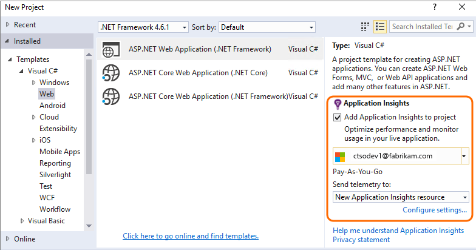
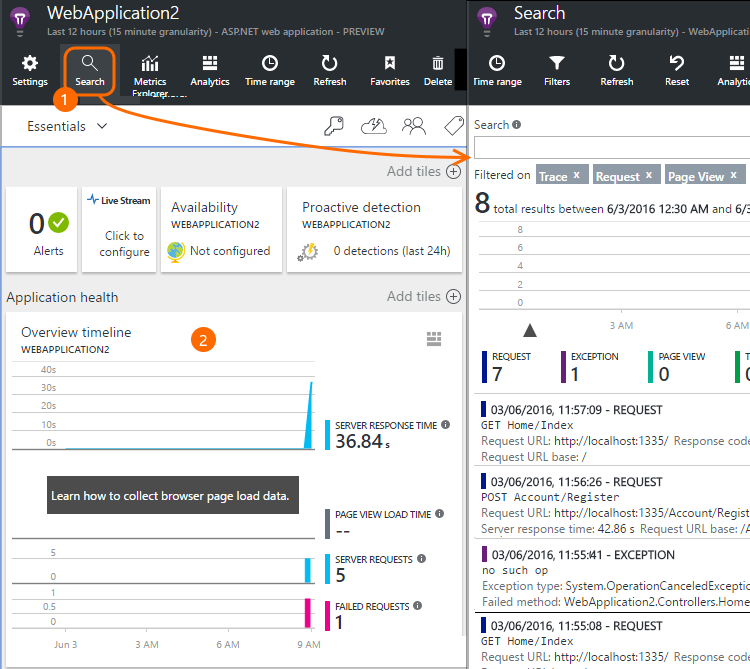

<properties 
    pageTitle="Web-app-analyse voor ASP.NET instellen met Application Insights | Microsoft Azure" 
    description="Configureer prestaties, beschikbaarheid en gebruiksanalyse voor uw ASP.NET-website die on-premises of in Azure wordt gehost." 
    services="application-insights" 
    documentationCenter=".net"
    authors="NumberByColors" 
    manager="douge"/>

<tags 
    ms.service="application-insights" 
    ms.workload="tbd" 
    ms.tgt_pltfrm="ibiza" 
    ms.devlang="na" 
    ms.topic="get-started-article" 
    ms.date="08/09/2016" 
    ms.author="daviste"/>

# Application Insights instellen voor ASP.NET

Met [Visual Studio Application Insights](app-insights-overview.md) wordt uw live-toepassing bewaakt om u te helpen bij het [detecteren en onderzoeken van prestatieproblemen en -uitzonderingen](app-insights-detect-triage-diagnose.md) en om te [ontdekken hoe uw app wordt gebruikt](app-insights-overview-usage.md).  De tool werkt voor apps die worden gehost op uw eigen on-premises IIS-servers of op virtuele machines in de cloud, en voor Azure-webtoepassingen.

## Voordat u begint

U hebt de volgende zaken nodig:

* Visual Studio 2013 update 3 of later. Later is beter.
* Een abonnement op [Microsoft Azure](http://azure.com). Als uw team of organisatie een Azure-abonnement heeft, kan de eigenaar u toevoegen met behulp van uw [Microsoft-account](http://live.com). 

Er zijn ook andere artikelen die u kunt bekijken als u geïnteresseerd bent in:

* [Een web-app instrumenteren tijdens runtime](app-insights-monitor-performance-live-website-now.md)
* [Azure Cloud Services](app-insights-cloudservices.md)

##  1. De Application Insights-SDK toevoegen

### Als het een nieuw project is...

Wanneer u in Visual Studio een nieuw project maakt, controleert u of Application Insights is geselecteerd. 

### ...of als het een bestaand project is

Klik in Solution Explorer met de rechtermuisknop op het project. Klik vervolgens op **Application Insights Telemetry toevoegen** of op **Application Insights configureren**.

* ASP.NET Core-project? - [Volg deze instructies voor het corrigeren van enkele coderegels](https://github.com/Microsoft/ApplicationInsights-aspnetcore/wiki/Getting-Started#add-application-insights-instrumentation-code-to-startupcs). 

##  2. Uw app uitvoeren

Start uw toepassing met F5 en probeer deze uit. Open verschillende pagina’s om telemetrie te genereren.

In Visual Studio ziet u het aantal gebeurtenissen dat is geregistreerd. 

## 3. Uw telemetrie weergeven...

### ...in Visual Studio

Open het Application Insights-venster in Visual Studio: klik op de knop Application Insights of klik met de rechtermuisknop op uw project in Solution Explorer:

Deze weergave toont telemetrie die is gegenereerd in het servergedeelte van uw app. Experimenteer met de filters en klik op een gebeurtenis voor meer details.

[Meer informatie over Application Insights-hulpprogramma's in Visual Studio](app-insights-visual-studio.md).

 
### ...in de portal

Tenzij u *Alleen SDK installeren* hebt gekozen, ziet u de telemetrie ook in de Application Insights-webportal. 

De portal biedt meer grafieken, hulpprogramma's voor analyse en dashboards dan Visual Studio. 

Open uw Application Insights-resource in de [Azure Portal](https://portal.azure.com/).

De portal wordt geopend met een weergave van de telemetrie van uw app:

* De eerste telemetrie wordt weergegeven in [Live Metrics Stream](app-insights-metrics-explorer.md#live-metrics-stream).
* Afzonderlijke gebeurtenissen worden weergegeven in **Zoeken** (1). Het kan een paar minuten duren voordat gegevens worden weergegeven. Klik op een gebeurtenis om de eigenschappen ervan weer te geven. 
* Samengevoegde metrische gegevens worden weergegeven in de grafieken (2). Het kan een paar minuten duren voordat hier gegevens worden weergegeven. Klik op een grafiek om een blade te openen met gedetailleerdere informatie.

[Meer informatie over het gebruik van Application Insights in de Azure Portal](app-insights-dashboards.md).

## 4. Uw app publiceren

Publiceer uw app op de IIS-server of op Azure. Bekijk de livestream met metrische gegevens in [Live Metrics Stream](app-insights-metrics-explorer.md#live-metrics-stream) om te controleren of alles goed werkt.

U kunt de opbouw van uw telemetrie volgen in de Application Insights-portal, waar u metrische gegevens kunt controleren, uw telemetrie kunt zoeken en [dashboards](app-insights-dashboards.md) kunt instellen. U kunt ook de krachtige [querytaal van Analytics](app-insights-analytics.md) gebruiken om het gebruik en de prestaties te analyseren of om specifieke gebeurtenissen te zoeken. 

U kunt uw telemetrie ook blijven analyseren in [Visual Studio](app-insights-visual-studio.md) met hulpprogramma's voor diagnostisch zoeken en [Trends](app-insights-visual-studio-trends.md).

> [AZURE.NOTE] Als uw app zoveel telemetrie verzendt dat de[beperkingslimieten](app-insights-pricing.md#limits-summary) worden benaderd, worden automatisch [steekproeven](app-insights-sampling.md) ingeschakeld. Met steekproeven vermindert u de hoeveelheid telemetrie die vanuit uw app wordt verzonden, maar behoudt u gecorreleerde gegevens voor diagnostische doeleinden.

## Wat doet de opdracht Application Insights toevoegen?

Application Insights verzendt telemetrie van uw app naar de Application Insights-portal (die wordt gehost in Microsoft Azure):

De opdracht doet dus drie dingen:

1. Het NuGet-pakket uit de Application Insights Web-SDK wordt toegevoegd aan uw project. Klik met de rechtermuisknop op het project en kies NuGet-pakketten beheren om het pakket weer te geven in Visual Studio.
2. Er wordt een Application Insights-resource gemaakt in de [Azure Portal](https://portal.azure.com/). Hier ziet u de gegevens. De *instrumentatiesleutel*, die de resource definieert, wordt opgehaald.
3. De instrumentatiesleutel wordt in `ApplicationInsights.config` ingevoegd, zodat de SDK telemetrie naar de portal kan verzenden.

Als u wilt, kunt u deze stappen handmatig uitvoeren voor [ASP.NET 4](app-insights-windows-services.md) of [ASP.NET Core](https://github.com/Microsoft/ApplicationInsights-aspnetcore/wiki/Getting-Started).

### Upgraden naar toekomstige SDK-versies

Als u wilt upgraden naar een [nieuwe release van de SDK](https://github.com/Microsoft/ApplicationInsights-dotnet-server/releases), opent u NuGet-pakketbeheer opnieuw en filtert u op geïnstalleerde pakketten. Selecteer Microsoft.ApplicationInsights.Web en kies Upgraden.

Als u aanpassingen in ApplicationInsights.config hebt aangebracht, slaat u hiervan een kopie op voordat u de upgrade uitvoert. Voeg vervolgens uw wijzigingen samen in de nieuwe versie.

## Volgende stappen

| | 
|---|---
|**[Met Application Insights werken in Visual Studio](app-insights-visual-studio.md)** Foutopsporing met telemetrie, het doorzoeken van diagnostische gegevens, het in detail analyseren van code.|
|**[Werken met de Application Insights-portal](app-insights-dashboards.md)** Dashboards, krachtige hulpprogramma's voor diagnose en analyse, waarschuwingen, een live afhankelijkheidskaart van uw toepassing en exportmogelijkheden voor telemetrie. |
|**[Meer gegevens toevoegen](app-insights-asp-net-more.md)** Bewaak het gebruik, de beschikbaarheid, de afhankelijkheden en de uitzonderingen. Integreer bijgehouden informatie uit frameworks voor logboekregistratie. Schrijf aangepaste telemetrie. | 

<!--HONumber=Sep16_HO3-->

