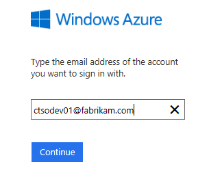
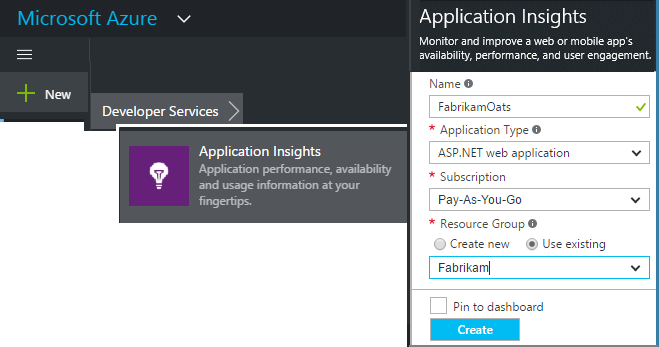
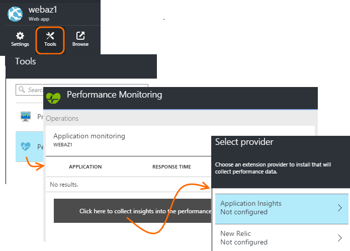
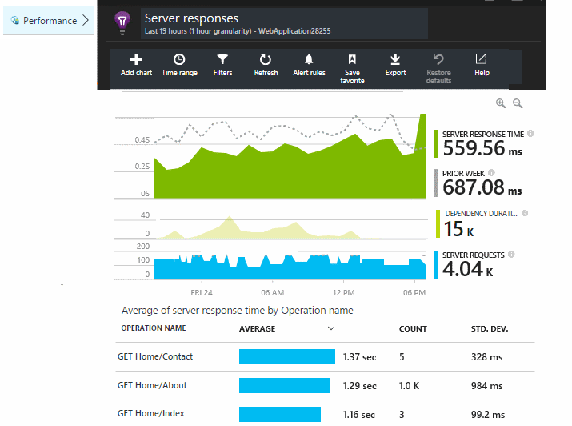
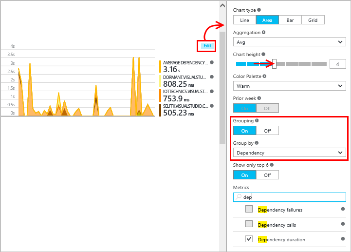
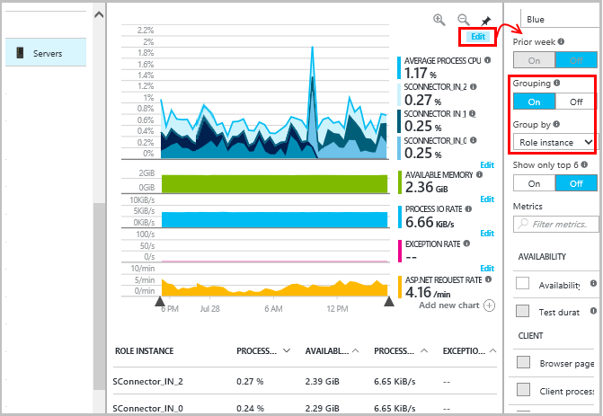
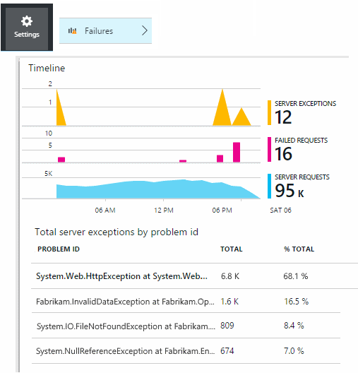
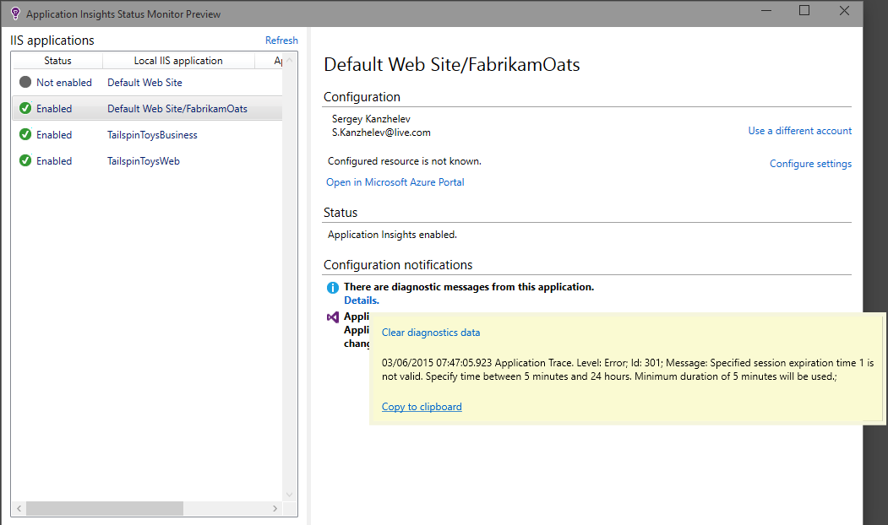

<properties
    pageTitle="Prestatieproblemen analyseren op een actieve IIS-website | Microsoft Azure"
    description="Bewaak de prestaties van een website zonder de website opnieuw te implementeren. Als standalone te gebruiken, maar ook met de Application Insights-SDK voor telemetrie over afhankelijkheid."
    services="application-insights"
    documentationCenter=".net"
    authors="alancameronwills"
    manager="douge"/>

<tags
    ms.service="application-insights"
    ms.workload="tbd"
    ms.tgt_pltfrm="ibiza"
    ms.devlang="na"
    ms.topic="get-started-article"
    ms.date="07/28/2016"
    ms.author="awills"/>

# Web-apps tijdens runtime instrumenteren met Application Insights

*Application Insights verkeert momenteel in de preview-fase.*

U kunt een live web-app instrumenteren met Visual Studio Application Insights, zonder dat u uw code hoeft te wijzigen of opnieuw hoeft te implementeren. Als uw apps worden gehost door een on-premises IIS-server, installeert u Status Monitor; als het Azure web-apps zijn of de apps in een virtuele Azure-machine worden uitgevoerd, kunt u de extensie Application Insights installeren. (Er zijn ook afzonderlijke artikelen over het instrumenteren van [live J2EE-web-apps](app-insights-java-live.md) en [Azure Cloud Services](app-insights-cloudservices.md).)

U kunt kiezen uit drie methoden voor het toepassen van Application Insights voor uw .NET-webtoepassingen:

* **Tijdens het bouwen:** [voeg de Application Insights-SDK][greenbrown] toe aan uw web-app-code. 
* **Tijdens het gebruik:** Instrumenteer uw web-app op de server, zoals hieronder wordt beschreven, zonder deze opnieuw op te bouwen en de code opnieuw te implementeren.
* **Beide:** bouw de SDK in de code van uw web-app in en pas ook de runtime-extensies toe. Zo profiteert u van het beste van beide opties. 

Hier volgt een samenvatting van wat elke manier u biedt:

||Tijdens het bouwen|Tijdens het gebruik|
|---|---|---|
|Aanvragen en uitzonderingen|Ja|Ja|
|[Meer gedetailleerde uitzonderingen](app-insights-asp-net-exceptions.md)||Ja|
|[Diagnostische gegevens over afhankelijkheid](app-insights-asp-net-dependencies.md)|Op .NET 4.6+|Ja|
|[Systeemprestatiemeteritems](app-insights-web-monitor-performance.md#system-performance-counters)||IIS- of Azure-cloudservice, niet Azure-web-app|
|[API voor aangepaste telemetrie][api]|Ja||
|[Integratie traceerlogboeken](app-insights-asp-net-trace-logs.md)|Ja||
|[Paginaweergave en gebruikersgegevens](app-insights-javascript.md)|Ja||
|Opnieuw opbouwen van code is niet nodig|Nee||

## Uw web-app tijdens het gebruik instrumenteren

U hebt een [Microsoft Azure](http://azure.com)-abonnement nodig.

### Als uw app op uw IIS-server wordt gehost

1. Meld u op uw IIS-webserver aan met beheerdersreferenties.
2. Download het [Status Monitor-installatieprogramma](http://go.microsoft.com/fwlink/?LinkId=506648) en voer het uit.
4. Meld u in de installatiewizard aan bij Microsoft Azure.

    

    *Verbindingsfouten? Zie [Probleemoplossing](#troubleshooting).*

5. Kies de geïnstalleerde webtoepassing of de website die u wilt bewaken, en configureer de resource waarin u de resultaten wilt bekijken in de Application Insights-portal.

    

    Normaal gesproken kiest u ervoor een nieuwe resource en [resourcegroep][rolls] te configureren.

    Als u al [webtests][availability] voor uw site hebt ingesteld of [webclientbewaking][client] gebruikt, kunt u ook een bestaande resource gebruiken.

6. Start IIS opnieuw.

    

    Uw webservice wordt enkele ogenblikken onderbroken.

6. U ziet dat ApplicationInsights.config is ingevoegd in de web-apps die u wilt bewaken.

    

   Er zijn ook enkele wijzigingen aan web.config.

#### Wilt u later (opnieuw) configureren?

Nadat u de wizard hebt voltooid, kunt u de agent op elk gewenst moment opnieuw configureren. U kunt dit ook doen als u de agent hebt geïnstalleerd, maar er wat problemen waren met de eerste installatie.

### Als uw app wordt uitgevoerd als Azure-web-app

1. Maak in de [Azure Portal](https://portal.azure.com) een Application Insights-resource met type ASP.NET. Dit is waar uw toepassingstelemetrie wordt opgeslagen, geanalyseerd en weergegeven.

    
     
2. Open de besturingselementblade van uw Azure Web-app, open **Hulpmiddelen > Prestatiebewaking** en voeg de Application Insights-extensie toe.

    

    Selecteer de Application Insights-resource die u zojuist hebt gemaakt.

### Als het een Azure-cloudserviceproject betreft

[Voeg scripts toe aan web- en werkrollen](app-insights-cloudservices.md).

## Prestatietelemetrie weergeven

Meld u aan bij de [Azure Portal](https://portal.azure.com), ga naar Application Insights en open de resource die u hebt gemaakt.

Open de blade Performance om aanvragen, reactietijden, afhankelijkheden en andere gegevens te bekijken.

Klik op een grafiek om een gedetailleerde weergave te openen.

U kunt grafieken [bewerken, rangschikken, opslaan](app-insights-metrics-explorer.md) en grafieken of de hele blade vastmaken aan een [dashboard](app-insights-dashboards.md).

## Afhankelijkheden

De grafiek Dependency Duration laat zien hoelang aanroepen van uw app aan externe onderdelen (zoals databases, REST-API's of Azure-blobopslag) duren.

Als u de grafiek wilt segmenteren op aanroepen naar verschillende afhankelijkheden, bewerkt u de grafiek, schakelt u Groeperen in en groepeert u vervolgens op Afhankelijkheid, Type afhankelijkheid of Prestaties voor afhankelijkheden.

## Prestatiemeteritems 

(Niet voor Azure-web-apps.) Klik op de overzichtsblade op Servers om grafieken van serverprestatiemeters weer te geven, zoals CPU-bezetting en geheugengebruik.

Als u meerdere serverexemplaren hebt, is het een goed idee om de grafieken te bewerken door ze te groeperen op rolinstantie.

U kunt ook [de set prestatiemeteritems wijzigen die door de SDK worden gerapporteerd](app-insights-configuration-with-applicationinsights-config.md#nuget-package-3). 

## Uitzonderingen

U kunt inzoomen op bepaalde uitzonderingen (van de laatste zeven dagen), en stack-traces en contextgegevens ophalen.

## Steekproeven

Als uw toepassing grote hoeveelheden gegevens verzendt en u de Application Insights-SDK voor ASP.NET-versie 2.0.0-beta3 of hoger gebruikt, stuurt de functie voor adaptieve steekproeven mogelijk slechts een percentage van uw telemetrie. [Meer informatie over steekproeven.](app-insights-sampling.md)

## Problemen oplossen

### Verbindingsfouten

Als u gebruik wilt maken van Status Monitor, moet u [een aantal uitgaande poorten](app-insights-ip-addresses.md#outgoing-ports) in de firewall van uw server openen.

### Geen telemetrie?

  * Gebruik uw site om gegevens te genereren.
  * Het kan enkele minuten duren voordat de gegevens aankomen. Wacht daarom even en klik vervolgens op **Refresh**.
  * Open Diagnostic Search (de tegel Search) om afzonderlijke gebeurtenissen te bekijken. Gebeurtenissen zijn vaak zichtbaar in Diagnostic Search voordat er cumulatieve gegevens in de grafieken worden weergegeven.
  * Open Status Monitor en selecteer in het linkerdeelvenster uw toepassing. Controleer in het gedeelte Configuration notifications of er diagnostische meldingen zijn voor de toepassing:

  

  * Controleer of de firewall van uw server uitgaand verkeer op de hierboven vermelde poorten toestaat.
  * Als u op de server een bericht over 'insufficient permissions' (onvoldoende machtigingen) ziet, probeert u het volgende:
    * Selecteer in IIS Manager uw groep met toepassingen, open **Advanced Settings** en noteer de identiteit onder **Proces Model**.
    * Voeg in het configuratiescherm voor computerbeheer deze identiteit toe aan de groep Prestatiemetergebruikers.
  * Als op uw server MMA/SCOM is geïnstalleerd, kan er een conflict optreden met sommige versies. Verwijder zowel SCOM als Status Monitor en installeer de meest recente versies.
  * Zie [Probleemoplossing][qna].

## Systeemvereisten

Ondersteuning van het besturingssysteem voor Application Insights Status Monitor op de server:

- Windows Server 2008
- Windows Server 2008 R2
- Windows Server 2012
- Windows Server 2012 R2

met het nieuwste SP en .NET-framework 4.0 of 4.5

Aan de clientzijde Windows 7, 8 en 8.1, ook met .NET-framework 4.0 of 4.5

Ondersteuning voor IIS is: IIS 7, 7.5, 8, 8.5 (IIS is vereist)

## Automatisering met PowerShell

Met behulp van PowerShell kunt u de bewaking starten en stoppen.

Importeer eerst de module Application Insights:

`Import-Module 'C:\Program Files\Microsoft Application Insights\Status Monitor\PowerShell\Microsoft.Diagnostics.Agent.StatusMonitor.PowerShell.dll'`

Controleer welke apps worden bewaakt:

`Get-ApplicationInsightsMonitoringStatus [-Name appName]`

* `-Name` (Optioneel) De naam van een web-app.
* Geeft de Application Insights-bewakingsstatus voor elke web-app (of de benoemde app) op deze IIS-server.

* Retourneert `ApplicationInsightsApplication` voor elke app:
 * `SdkState==EnabledAfterDeployment`: de app wordt bewaakt en is tijdens de uitvoering geïnstrumenteerd, door het hulpprogramma Status Monitor of door `Start-ApplicationInsightsMonitoring`.
 * `SdkState==Disabled`: de app is niet geïnstrumenteerd voor Application Insights. De app is niet geïnstrumenteerd, of bewaking tijdens de uitvoering is uitgeschakeld met het hulpprogramma Status Monitor of met `Stop-ApplicationInsightsMonitoring`.
 * `SdkState==EnabledByCodeInstrumentation`: de app is geïnstrumenteerd door de SDK toe te voegen aan de broncode. De SDK kan niet worden bijgewerkt of gestopt.
 * `SdkVersion` toont de versie die voor het bewaken van deze app wordt gebruikt.
 * `LatestAvailableSdkVersion`toont de versie die momenteel beschikbaar is in de NuGet-galerie. Als u de app naar deze versie wilt bijwerken, gebruikt u `Update-ApplicationInsightsMonitoring`.

`Start-ApplicationInsightsMonitoring -Name appName -InstrumentationKey 00000000-000-000-000-0000000`

* `-Name` De naam van de app in IIS
* `-InstrumentationKey` De sleutel van de Application Insights-resource waar u de resultaten wilt weergeven.

* Deze cmdlet geldt alleen voor apps die niet al zijn geïnstrumenteerd, dus SdkState==NotInstrumented.

    De cmdlet heeft geen invloed op een app die al is geïnstrumenteerd, hetzij tijdens het bouwen (toen de SDK aan de code werd toegevoegd), hetzij tijdens de uitvoering (met gebruik van deze cmdlet).

    De SDK-versie die voor het instrumenteren van de app is gebruikt, is de versie die het laatst is gedownload naar deze server.

    Voor het downloaden van de meest recente versie gebruikt u Update-ApplicationInsightsVersion.

* Retourneert `ApplicationInsightsApplication` wanneer het is gelukt. Als het mislukt, wordt er een tracering geregistreerd in stderr.

    
          Name                      : Default Web Site/WebApp1
          InstrumentationKey        : 00000000-0000-0000-0000-000000000000
          ProfilerState             : ApplicationInsights
          SdkState                  : EnabledAfterDeployment
          SdkVersion                : 1.2.1
          LatestAvailableSdkVersion : 1.2.3

`Stop-ApplicationInsightsMonitoring [-Name appName | -All]`

* `-Name` De naam van een app in IIS
* `-All` Stopt het bewaken van alle apps op deze IIS-server waarvoor `SdkState==EnabledAfterDeployment`

* Stopt het bewaken van de opgegeven apps en verwijdert instrumentatie. Deze functie werkt alleen voor apps die tijdens de uitvoering zijn geïnstrumenteerd met het hulpprogramma Status Monitor of Start-ApplicationInsightsApplication. (`SdkState==EnabledAfterDeployment`)

* Retourneert ApplicationInsightsApplication.

`Update-ApplicationInsightsMonitoring -Name appName [-InstrumentationKey "0000000-0000-000-000-0000"`]

* `-Name`: de naam van een web-app in IIS.
* `-InstrumentationKey` (Optioneel.) Gebruik deze om de resource te wijzigen waarnaar de telemetrie van de app wordt verzonden.
* Deze cmdlet:
 * Upgradet de benoemde app naar de versie van de SDK die het laatst naar deze computer is gedownload. (Werkt alleen als `SdkState==EnabledAfterDeployment`)
 * Als u een instrumentatiesleutel opgeeft, wordt de vermelde app opnieuw geconfigureerd voor het verzenden van telemetrie naar de resource met die sleutel. (Werkt als `SdkState != Disabled`)

`Update-ApplicationInsightsVersion`

* Downloadt de nieuwste Application Insights-SDK naar de server.

## Azure-sjabloon

Als de web-app in Azure wordt uitgevoerd en u uw resources maakt met een Azure Resource Manager-sjabloon, kunt u Application Insights configureren door dit aan het resource-knooppunt toe te voegen:

    {
      resources: [
        /* Create Application Insights resource */
        {
          "apiVersion": "2015-05-01",
          "type": "microsoft.insights/components",
          "name": "nameOfAIAppResource",
          "location": "centralus",
          "kind": "web",
          "properties": { "ApplicationId": "nameOfAIAppResource" },
          "dependsOn": [
            "[concat('Microsoft.Web/sites/', myWebAppName)]"
          ]
        }
       ]
     } 

* `nameOfAIAppResource` - een naam voor de Application Insights-resource
* `myWebAppName` - de id van de web-app

## Volgende stappen

* [Maak webtests][availability] om ervoor te zorgen dat uw site actief blijft.
* [Zoek naar gebeurtenissen en logboeken][diagnostics] om u te helpen bij het analyseren van problemen.
* [Voeg telemetrie van de webclient toe][usage] om uitzonderingen op de webpaginacode weer te geven en traceringsaanroepen in te voegen.
* [Voeg de Application Insights-SDK toe aan uw webservicecode][greenbrown], zodat u tracerings- en logboekaanroepen kunt invoegen in de servercode.

## Video

#### Prestatiebewaking

[AZURE.VIDEO app-insights-performance-monitoring]

<!--Link references-->

[api]: app-insights-api-custom-events-metrics.md
[availability]: app-insights-monitor-web-app-availability.md
[client]: app-insights-javascript.md
[diagnostics]: app-insights-diagnostic-search.md
[greenbrown]: app-insights-asp-net.md
[qna]: app-insights-troubleshoot-faq.md
[rolls]: app-insights-resources-roles-access-control.md
[usage]: app-insights-web-track-usage.md

<!--HONumber=ago16_HO4-->

