<properties
    pageTitle="De beschikbaarheid en reactiesnelheid van een website bewaken | Microsoft Azure"
    description="Stel webtests in Application Insights in. Ontvang een waarschuwing wanneer een website niet meer beschikbaar is of traag reageert."
    services="application-insights"
    documentationCenter=""
    authors="alancameronwills"
    manager="douge"/>

<tags
    ms.service="application-insights"
    ms.workload="tbd"
    ms.tgt_pltfrm="ibiza"
    ms.devlang="na"
    ms.topic="get-started-article"
    ms.date="05/20/2016"
    ms.author="awills"/>

# De beschikbaarheid en reactiesnelheid van een website bewaken


[AZURE.INCLUDE [app-insights-selector-get-started-dotnet](../../includes/app-insights-selector-get-started-dotnet.md)]

Nadat u uw webtoepassing hebt geïmplementeerd, kunt u webtests instellen om de beschikbaarheid en reactiesnelheid ervan te bewaken. Application Insights verstuurt regelmatig webaanvragen vanaf punten overal ter wereld en waarschuwt u als uw toepassing langzaam of helemaal niet reageert.


U kunt webtests instellen voor alle HTTP- en HTTPS-eindpunten die toegankelijk zijn op het openbare internet.

Er zijn twee soorten webtests:

* [URL-pingtest](#set-up-a-url-ping-test): een eenvoudige test die u in de Azure Portal kunt instellen.
* [Webtest met meerdere stappen](#multi-step-web-tests): deze test kunt u in Visual Studio Ultimate of Visual Studio Enterprise maken en uploaden naar de portal.

Per toepassingsresource kunt u maximaal 10 webtests maken.


## Een URL-pingtest instellen

### <a name="create"></a>1. Een nieuwe resource maken?

Sla deze stap over als u voor deze toepassing al [een Application Insights-resource hebt ingesteld][start] en u de beschikbaarheidsgegevens op dezelfde plaats wilt weergeven.

Meld u aan bij [Microsoft Azure](http://azure.com), ga naar de [Azure Portal](https://portal.azure.com) en maak een nieuwe Application Insights-resource.

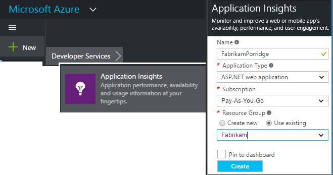

De blade Overzicht van de nieuwe resource wordt geopend. Als u de blade op een ander moment wilt openen, gaat u naar de [Azure Portal](https://portal.azure.com) en klikt u op **Bladeren**.

### <a name="setup"></a>2. Een webtest maken

Ga in uw Application Insights-resource naar de tegel Beschikbaarheid. Klik hierop om voor uw toepassing de blade Webtests te openen. Voeg vervolgens een webtest toe.

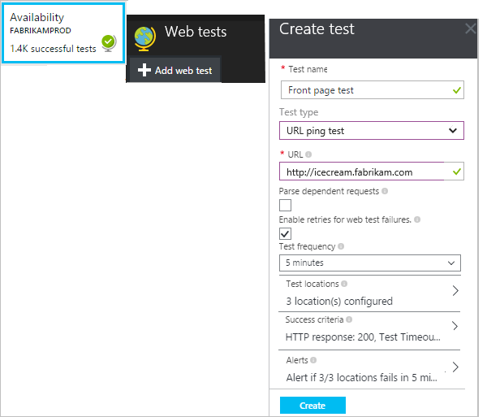

- **De URL** moet vanaf het openbare internet zichtbaar zijn. De URL kan een querytekenreeks bevatten, zodat u bijvoorbeeld kunt oefenen met uw database. Als de URL wordt omgezet in een omleiding, wordt deze gevolgd tot maximaal 10 omleidingen.
- **Afhankelijke aanvragen parseren**: afbeeldingen, scripts, stijlbestanden en andere resources van de pagina worden als onderdeel van de test aangevraagd. Als binnen de time-outperiode van de test niet alle resources kunnen worden gedownload, mislukt de test.
- **Nieuwe pogingen inschakelen**: als de test mislukt, wordt deze na een korte periode opnieuw uitgevoerd. Fouten worden pas gerapporteerd als er drie opeenvolgende pogingen mislukken. Daaropvolgende tests worden vervolgens met de gebruikelijke testfrequentie uitgevoerd. Volgende pogingen worden tijdelijk uitgesteld tot er weer een test slaagt. Deze regel wordt onafhankelijk toegepast op elke testlocatie. (Deze instelling wordt aangeraden. Gemiddeld verdwijnt ongeveer 80% van de fouten na het opnieuw proberen.)
- **Testfrequentie**: stel in hoe vaak de test wordt uitgevoerd vanaf elke testlocatie. Met een frequentie van vijf minuten en vijf testlocaties wordt uw site gemiddeld één keer per minuut getest.
- **Testlocaties** zijn de plaatsen van waaraf onze servers webaanvragen verzenden naar uw URL. Kies meer dan één testlocatie, zodat u problemen met uw website kunt onderscheiden van netwerkproblemen. U kunt maximaal 16 locaties selecteren.

- **Criteria voor succes**:

    **Testtime-out**: verklein deze zodat u waarschuwingen ontvangt in geval van trage reacties. De test wordt als mislukt beschouwd als er binnen deze periode geen reactie van uw site is ontvangen. Als u **Afhankelijke aanvragen parseren** hebt geselecteerd, moeten alle afbeeldingen, stijlbestanden, scripts en andere afhankelijke resources binnen deze periode zijn ontvangen.

    **HTTP-antwoord**: de geretourneerde statuscode die staat voor een geslaagde test. 200 is de code die aangeeft dat er een normale webpagina is geretourneerd.

    **Inhoudsovereenkomst**: een tekenreeks, zoals 'Welkom!' Er wordt getest of dit bij elke reactie het geval is. Het moet een eenvoudige tekenreeks zijn, zonder jokertekens. Als uw pagina-inhoud wordt gewijzigd, moet u deze tekenreeks mogelijk ook bijwerken.


- Standaard ontvangt u een **waarschuwing** als er op drie locaties gedurende vijf minuten fouten worden geregistreerd. Als er slechts op één locatie een fout wordt geregistreerd, kan dat ook aan het netwerk liggen en niet per se aan uw site. U kunt de drempel wijzigen om de testgevoeligheid te verhogen of te verlagen. Ook kunt u wijzigen naar wie de e-mails worden verzonden.

    U kunt een [webhook](../azure-portal/insights-webhooks-alerts.md) instellen die wordt aangeroepen wanneer er een waarschuwing wordt gegenereerd.

#### Meer URL’s testen

Voeg meer tests toe. U kunt bijvoorbeeld uw startpagina testen of controleren of uw database wordt uitgevoerd, door de URL te testen voor een zoekopdracht.


### <a name="monitor"></a>3. Beschikbaarheidsrapporten weergeven

Klik op de blade Beschikbaarheid/webtests na 1-2 minuten op **Vernieuwen**. (Deze blade wordt niet automatisch vernieuwd.)

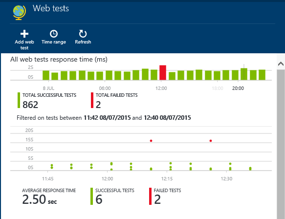

Klik op een balk in de overzichtsgrafiek bovenaan voor een gedetailleerdere weergave van de betreffende periode.

In deze grafieken staan de resultaten van alle webtests die voor deze toepassing zijn uitgevoerd.

#### Onderdelen van uw webpagina

Als onderdeel van de test worden afbeeldingen, opmaakmodellen, scripts en andere statische onderdelen van de webpagina die u wilt testen, aangevraagd.  

De vastgelegde reactietijd geeft aan hoelang het duurt voordat alle onderdelen zijn geladen.

Als er een onderdeel niet wordt geladen, wordt de test gemarkeerd als mislukt.

## <a name="failures"></a>Als u mislukte tests ziet...

Klik op een rode punt.


U kunt ook omlaag scrollen en op een test klikken die voor minder dan 100% is geslaagd.


Hier worden de resultaten van de test weergegeven.

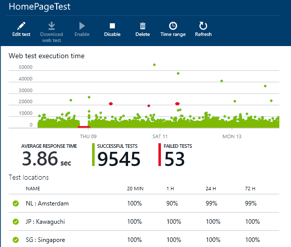

De test wordt vanaf verschillende locaties uitgevoerd. Kies een test met een slagingspercentage van minder dan 100%.

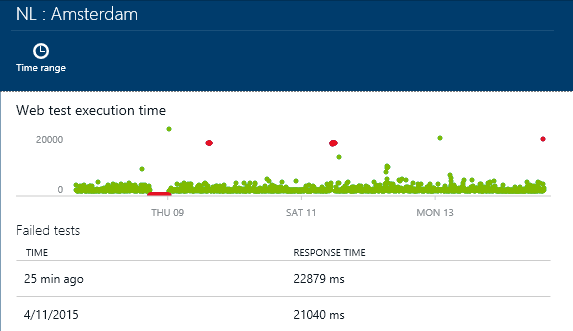


Scroll omlaag naar **Mislukte tests** en kies een resultaat.

Klik op het resultaat om het in de portal te bekijken en na te gaan waarom de test is mislukt.

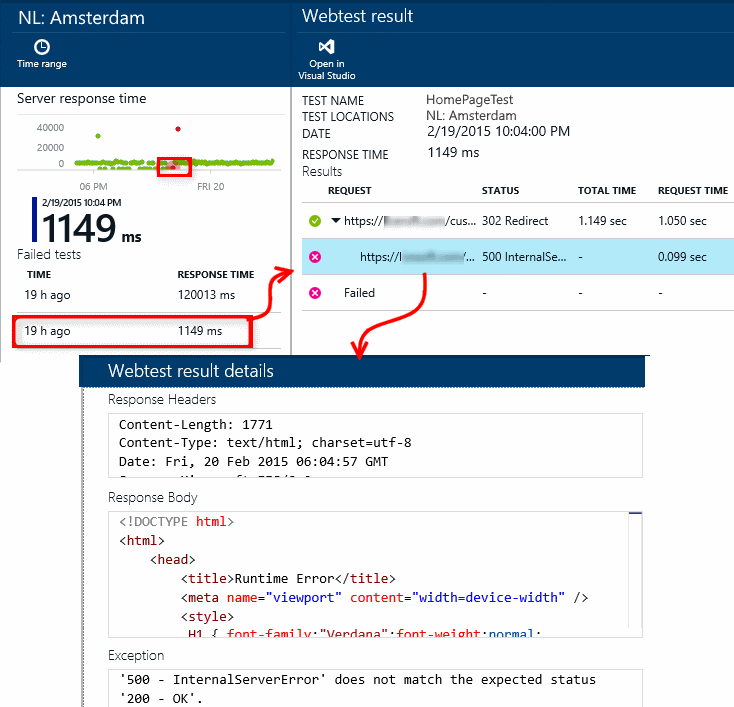


U kunt het resultatenbestand ook downloaden en bekijken in Visual Studio.


*Zien de resultaten er goed uit, maar is de test toch mislukt?* Controleer alle afbeeldingen, scripts, opmaakmodellen en andere bestanden die door de pagina zijn geladen. Als het laden van een van de onderdelen is mislukt, is de test mislukt, zelfs als de hoofd-HTML-pagina correct wordt geladen.


## Webtests met meerdere stappen

U kunt een scenario bewaken dat bestaat uit een reeks URL's. Als u bijvoorbeeld een verkoopwebsite bewaakt, kunt u testen of het toevoegen van items aan de winkelwagen goed werkt.

Als u een test met meerdere stappen wilt maken, neemt u het scenario op met Visual Studio en uploadt u vervolgens de opname naar Application Insights. Application Insights speelt het scenario regelmatig opnieuw af en controleert de reacties.

U kunt in uw tests geen gecodeerde functies gebruiken. De scenariostappen moeten als script worden verwerkt in het .webtest-bestand.

#### 1. Een scenario opnemen

Gebruik Visual Studio Enterprise of Ultimate om een websessie op te nemen. 

1. Maak een project om de webprestaties te testen.

    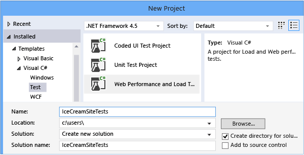

2. Open het bestand .webtest en begin met opnemen.

    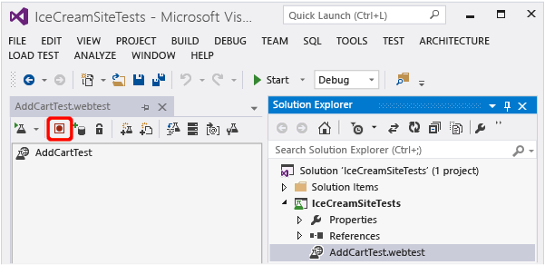

3. Voer de gebruikersacties uit die u in uw test wilt simuleren: open de website, plaats een product in de winkelwagen, enzovoort. Stop vervolgens de test.

    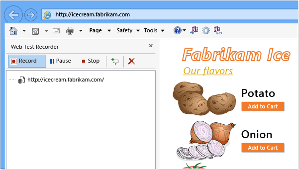

    Zorg ervoor dat het scenario niet te lang duurt. Er geldt een limiet van 100 stappen en 2 minuten.

4. Bewerk de test als volgt:
 - Voeg validaties toe om de ontvangen tekst en reactiecodes te controleren.
 - Verwijder alle overbodige interacties. U kunt ook afhankelijke aanvragen voor afbeeldingen of naar advertentie- of trackingsites verwijderen.

    U kunt alleen het testscript bewerken. U kunt geen aangepaste code toevoegen of andere webtests aanroepen. Voeg geen lussen toe aan de test. U kunt standaardinvoegtoepassingen voor webtest gebruiken.

5. Voer de test uit in Visual Studio om er zeker van te zijn dat deze werkt.

    De webtestrunner opent een webbrowser en herhaalt de acties die u hebt opgenomen. Controleer of de test werkt zoals verwacht.

    


#### 2. De webtest uploaden naar Application Insights

1. Maak in de Application Insights-portal een nieuwe webtest.

    

2. Selecteer de test met meerdere stappen en upload het .webtest-bestand.

    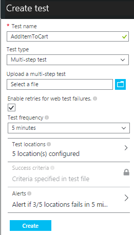

    Stel de testlocaties, frequentie en waarschuwingsparameters op dezelfde manier in als voor pingtests.

Bekijk de testresultaten om mogelijke fouten te ontdekken. Dit doet u op dezelfde manier als voor tests met één URL.

Een veelvoorkomende reden voor het mislukken van een test is dat het uitvoeren ervan te lang duurt. Het uitvoeren van de test mag niet langer dan twee minuten duren.

Alle resources van een pagina (waaronder scripts, opmaakmodellen, afbeeldingen, enzovoort) moeten correct worden geladen, anders mislukt de test.

De webtest moet volledig zijn opgenomen in het .webtest-bestand. U kunt in de test geen gecodeerde functies gebruiken.


### Tijd en willekeurige cijfers invoegen in uw test met meerdere stappen

Stel dat u een hulpprogramma test dat tijdsafhankelijke gegevens ontvangt van een externe feed (bijvoorbeeld een feed met aandelenkoersen). Wanneer u uw webtest opneemt, moet u specifieke tijden gebruiken, maar u stelt deze in als testparameters: StartTime en EndTime.


Wanneer u de test uitvoert, moet EndTime altijd de huidige tijd zijn. StartTime moet een kwartier in het verleden liggen.

Er zijn webtestinvoegtoepassingen waarmee u dit eenvoudig kunt instellen.

1. Voeg een webtestinvoegtoepassing toe voor elke gewenste variabele parameterwaarde. Kies in de werkbalk van de webtest de optie **Webtestinvoegtoepassing toevoegen**.

    

    In dit voorbeeld gebruiken we twee exemplaren van de invoegtoepassing Datum/tijd. Het ene exemplaar is bedoeld voor 'een kwartier geleden' en het andere voor 'nu'.

2. Open de eigenschappen van elke invoegtoepassing. Geef de invoegtoepassing een naam en stel deze zodanig in dat de huidige tijd wordt gebruikt. Stel voor een van de toepassingen Minuten toevoegen in op -15.

    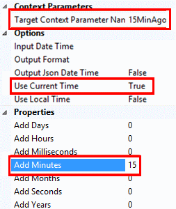

3. Gebruik in de webtestparameters {{plug-in name}} om te verwijzen naar de naam van de invoegtoepassing.

    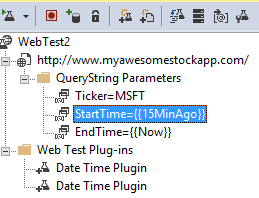

Upload uw test nu naar de portal. Telkens wanneer de test wordt uitgevoerd, worden er dynamische waarden gebruikt.

## Omgaan met aanmelden

Als gebruikers zich bij uw app moeten aanmelden, kunt u op verschillende manieren het aanmelden simuleren om de pagina’s achter het aanmeldingsscherm te testen. Welke aanpak u gebruikt, hangt af van het type beveiliging van de app.

In alle gevallen moet u een account maken voor testdoeleinden. Indien mogelijk beperkt u de machtigingen tot Alleen-lezen.

* Gebruik een eenvoudige gebruikersnaam en een eenvoudig wachtwoord. Neem op de gebruikelijke manier een webtest op. Verwijder eerst de cookies.
* SAML-verificatie. Hiervoor kunt u de SAML-invoegtoepassing gebruiken die beschikbaar is voor webtests.
* Clientgeheim: als uw app een aanmeldingsroute heeft met een clientgeheim, gebruikt u die. De Azure Active Directory biedt een dergelijke optie. 
* Open verificatie (OAuth): bijvoorbeeld in combinatie met aanmelding via uw Microsoft- of Google-account. Veel apps die gebruikmaken van OAuth, bieden ook de optie om een clientgeheim te gebruiken. Controleer dit daarom als eerste. Als tijdens uw test aanmelding met OAuth is vereist, is dit over het algemeen de aanpak:
 * Gebruik een hulpprogramma zoals Fiddler om het verkeer tussen de webbrowser, de verificatiesite en uw app te onderzoeken. 
 * Voer twee of meer aanmeldingen uit via verschillende apparaten en browsers, of met lange periodes ertussen (zodat de tokens verlopen).
 * Vergelijk de verschillende sessies om te bepalen welk token is doorgegeven door de verificatiesite en daarna, na het aanmelden, wordt doorgegeven aan uw appserver. 
 * Neem een webtest op met Visual Studio. 
 * Maak parameters van de tokens. Stel de parameter in wanneer er een token wordt geretourneerd van de verificator en gebruik deze in de query voor de site.
 (Visual Studio probeert om parameters aan te leveren voor de test, maar de tokens worden niet correct in parameters omgezet.)


## <a name="edit"></a> Een test bewerken of uitschakelen

Open een afzonderlijke test om deze te bewerken of uit te schakelen.


Mogelijk wilt u uw webtests uitschakelen wanneer u onderhoud gaat uitvoeren aan uw service.

## Automatisering

* Gebruik [PowerShell-scripts](https://azure.microsoft.com/blog/creating-a-web-test-alert-programmatically-with-application-insights/) om automatisch een webtest in te stellen. 
* Stel een [webhook](../azure-portal/insights-webhooks-alerts.md) in die wordt aangeroepen wanneer er een waarschuwing wordt gegenereerd.

## Vragen? Problemen?

* *Kan ik code aanroepen via mijn webtest?*

    Nee. De stappen van de test moeten zich in het bestand .webtest bevinden. U kunt geen andere webtests aanroepen of lussen gebruiken. Er zijn echter enkele invoegtoepassingen die wellicht handig zijn.

* *Wordt HTTPS ondersteund?*

    Op dit moment worden SSL 3.0 en TLS 1.0 ondersteund.

* *Is er een verschil tussen webtests en beschikbaarheidstests?*

    De twee termen worden door elkaar gebruikt.

* *Ik wil graag beschikbaarheidstests gebruiken voor onze interne server die achter een firewall wordt uitgevoerd.*

    Configureer uw firewall zodanig dat aanvragen van de IP-adressen aan het eind van dit artikel worden toegestaan.

* *Het uploaden van een webtest met meerdere stappen mislukt*

    Er geldt een limiet van 300 kB voor de bestandsgrootte.

    Lussen worden niet ondersteund.

    Verwijzingen naar andere webtests worden niet ondersteund.

    Gegevensbronnen worden niet ondersteund.

    
* *Mijn test met meerdere stappen wordt niet voltooid*

    Er is een limiet van 100 aanvragen per test.

    De test wordt gestopt als het uitvoeren meer dan twee minuten duurt.

* *Hoe voer ik een test uit met clientcertificaten?*

    Dat wordt niet ondersteund.


## <a name="video"></a>Video

> [AZURE.VIDEO monitoring-availability-with-application-insights]

## <a name="next"></a>Volgende stappen

[Diagnostische logboeken zoeken][diagnostic]

[Probleemoplossing][qna]


## IP-adressen van webtests

Als u een firewall moet openen om webtests toe te staan, ziet u hier de huidige lijst met IP-adressen. Deze lijst kan van tijd tot tijd worden gewijzigd.

Open de poorten 80 (http) en 443 (https).

```

213.199.178.54
213.199.178.55
213.199.178.56
213.199.178.61
213.199.178.57
213.199.178.58
213.199.178.59
213.199.178.60
213.199.178.63
213.199.178.64
207.46.98.158
207.46.98.159
207.46.98.160
207.46.98.157
207.46.98.152
207.46.98.153
207.46.98.156
207.46.98.162
207.46.98.171
207.46.98.172
65.55.244.40
65.55.244.17
65.55.244.42
65.55.244.37
65.55.244.15
65.55.244.16
65.55.244.44
65.55.244.18
65.55.244.46
65.55.244.47
207.46.14.60
207.46.14.61
207.46.14.62
207.46.14.55
207.46.14.63
207.46.14.64
207.46.14.51
207.46.14.52
207.46.14.56
207.46.14.65
157.55.14.60
157.55.14.61
157.55.14.62
157.55.14.47
157.55.14.64
157.55.14.65
157.55.14.43
157.55.14.44
157.55.14.49
157.55.14.50
65.54.66.56
65.54.66.57
65.54.66.58
65.54.66.61
207.46.71.54
207.46.71.52
207.46.71.55
207.46.71.38
207.46.71.51
207.46.71.57
207.46.71.58
207.46.71.37
202.89.228.67
202.89.228.68
202.89.228.69
202.89.228.57
65.54.78.49
65.54.78.50
65.54.78.51
65.54.78.54
94.245.82.32
94.245.82.33
94.245.82.37
94.245.82.38
94.245.72.44
94.245.72.45
94.245.72.46
94.245.72.49
207.46.56.57
207.46.56.58
207.46.56.59
207.46.56.67
207.46.56.61
207.46.56.62
207.46.56.63
207.46.56.64
65.55.82.84
65.55.82.85
65.55.82.86
65.55.82.81
65.55.82.87
65.55.82.88
65.55.82.89
65.55.82.90
65.55.82.91
65.55.82.92
94.245.78.40
94.245.78.41
94.245.78.42
94.245.78.45
70.37.147.43
70.37.147.44
70.37.147.45
70.37.147.48
94.245.66.43
94.245.66.44
94.245.66.45
94.245.66.48

```


<!--Link references-->

[azure-availability]: ../insights-create-web-tests.md
[diagnostic]: app-insights-diagnostic-search.md
[qna]: app-insights-troubleshoot-faq.md
[start]: app-insights-overview.md


<!--HONumber=Jun16_HO2-->


