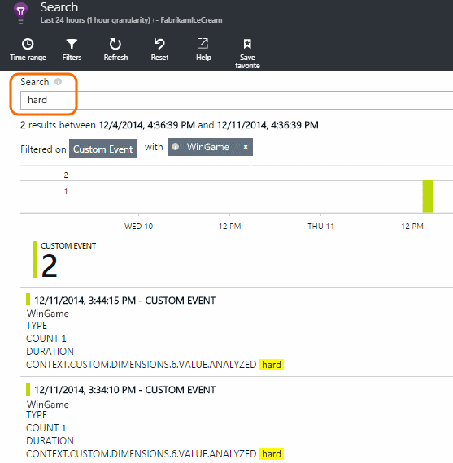

<properties 
	pageTitle="Application Insights 中 ASP.NET 的記錄檔、例外狀況和自訂診斷" 
	description="搜尋由追蹤、NLog 或 Log4Net 產生的要求、例外狀況和記錄檔，藉此診斷 ASP.NET Web 應用程式中的問題。" 
	services="application-insights" 
    documentationCenter=""
	authors="alancameronwills" 
	manager="keboyd"/>

<tags 
	ms.service="application-insights" 
	ms.workload="tbd" 
	ms.tgt_pltfrm="ibiza" 
	ms.devlang="na" 
	ms.topic="article" 
	ms.date="04/02/2015" 
	ms.author="awills"/>
 
# Application Insights 中 ASP.NET 的記錄檔、例外狀況和自訂診斷

[Application Insights][start] 包含一項功能強大[診斷搜尋][diagnostic]工具，可讓您探索和鑽研由應用程式之 Application Insights SDK 傳送的遙測資料。SDK 會自動傳送許多事件，例如使用者頁面檢視。

您也可以撰寫程式碼來傳送自訂事件、例外狀況報告和追蹤。如果您已經使用記錄架構 (例如 log4J、log4net、NLog 或 System.Diagnostics.Trace)，可以擷取這些記錄檔，並將它們包含在搜尋中。這樣會較容易將使用者動作、例外狀況和其他事件與記錄追蹤相互關聯。

## 在您撰寫自訂遙測資料之前

如果您尚未[針對專案安裝 Application Insights][start]，請立即安裝。

執行應用程式時，會傳送一些遙測資料，而這些資料會出現在診斷搜尋中，其中包括由伺服器接收的要求、記錄在用戶端的頁面檢視，以及無法攔截的例外狀況。

開啟 [診斷搜尋] 即可查看 SDK 自動傳送的遙測資料。

詳細資料會因應用程式類型而異。您可以逐一點選所有個別事件，以取得更多詳細資料。

##自訂事件

自訂事件會顯示在[診斷搜尋][diagnostic]和[計量瀏覽器][metrics]中。您可以從裝置、網頁和伺服器應用程式傳送這些事件。這些事件可同時用於診斷及[了解使用模式][track]。

每個自訂事件都有自己的名稱，並帶有可透過數值測量單位篩選的屬性。

用戶端的 JavaScript

    appInsights.trackEvent("WinGame",
         // String properties:
         {Game: currentGame.name, Difficulty: currentGame.difficulty},
         // Numeric measurements:
         {Score: currentGame.score, Opponents: currentGame.opponentCount}
         );

伺服器上的 C#

    // Set up some properties:
    var properties = new Dictionary <string, string> 
       {{"game", currentGame.Name}, {"difficulty", currentGame.Difficulty}};
    var measurements = new Dictionary <string, double>
       {{"Score", currentGame.Score}, {"Opponents", currentGame.OpponentCount}};

    // Send the event:
    telemetry.TrackEvent("WinGame", properties, measurements);

伺服器上的 VB

    ' Set up some properties:
    Dim properties = New Dictionary (Of String, String)
    properties.Add("game", currentGame.Name)
    properties.Add("difficulty", currentGame.Difficulty)

    Dim measurements = New Dictionary (Of String, Double)
    measurements.Add("Score", currentGame.Score)
    measurements.Add("Opponents", currentGame.OpponentCount)

    ' Send the event:
    telemetry.TrackEvent("WinGame", properties, measurements)

### 執行應用程式並檢視結果。

開啟 [診斷搜尋]。

選取 [自訂事件]，然後選取特定的事件名稱。

在屬性值中輸入搜尋詞彙，以多次篩選該資料。

深入探索個別事件，以查看其詳細屬性。

## 頁面檢視

頁面檢視遙測資料是由[在網頁中插入之 JavaScript 程式碼片段][usage]的 trackPageView() 呼叫所傳送的。此資料主要用途是提供您在概觀頁面看到的頁面檢視計數。

通常它在每個 HTML 頁面中只會被呼叫一次，但是您可以插入多個呼叫 (例如，您有單頁應用程式，且想在使用者取得更多資料時記錄新頁面)。

    appInsights.trackPageView(pageSegmentName, "http://fabrikam.com/page.htm"); 

您可在診斷搜尋中附加做為篩選器使用的屬性，這有時相當實用：

    appInsights.trackPageView(pageSegmentName, "http://fabrikam.com/page.htm",
     {Game: currentGame.name, Difficulty: currentGame.difficulty});

## 追蹤遙測

追蹤遙測是專門用以建立診斷記錄檔而插入的程式碼。

例如，您可以插入這類呼叫：

    var telemetry = new Microsoft.ApplicationInsights.TelemetryClient();
    telemetry.TrackTrace("Slow response - database01");

####  為記錄架構安裝配接器

您也可以搜尋由記錄架構 (log4Net、NLog 或 System.Diagnostics.Trace) 產生的記錄檔。

1. 如果您打算使用 log4Net 或 NLog，請將它安裝在您的專案。 
2. 在 [方案總管] 中，以滑鼠右鍵按一下您的專案並選擇 [**管理 NuGet 封裝**]。
3. 選取 [線上] > [全部]，選取 [Include Prerelease]，然後搜尋 "Microsoft.ApplicationInsights"

    

4. 選取適當的套件 - 下列其中一個：
  + Microsoft.ApplicationInsights.TraceListener (擷取 System.Diagnostics.Trace 呼叫)
  + Microsoft.ApplicationInsights.NLogTarget
  + Microsoft.ApplicationInsights.Log4NetAppender

NuGet 封裝會安裝必要的組件，並修改 web.config 或 app.config。

#### 插入診斷記錄呼叫

如果您使用 System.Diagnostics.Trace，典型的呼叫如下：

    System.Diagnostics.Trace.TraceWarning("Slow response - database01");

如果您偏好 log4net 或 NLog：

    logger.Warn("Slow response - database01");

在偵錯模式中執行應用程式或加以部署。

當您選取 [追蹤] 篩選器時，會看到 [診斷搜尋] 中的訊息。

### 例外狀況

Application Insights 中的「取得例外狀況報告」功能非常強大，尤其是您可以切換瀏覽失敗要求和例外狀況，以及讀取例外狀況堆疊。

在某些情況下，您需要[插入數行程式碼][exceptions]，以確定您的例外狀況會自動被截取。

您也可以撰寫明確的程式碼，以傳送例外狀況遙測資料：

JavaScript

    try 
    { ...
    }
    catch (ex)
    {
      appInsights.TrackException(ex, "handler loc",
        {Game: currentGame.Name, 
         State: currentGame.State.ToString()});
    }

C#

    var telemetry = new TelemetryClient();
    ...
    try 
    { ...
    }
    catch (Exception ex)
    {
       // Set up some properties:
       var properties = new Dictionary <string, string> 
         {{"Game", currentGame.Name}};

       var measurements = new Dictionary <string, double>
         {{"Users", currentGame.Users.Count}};

       // Send the exception telemetry:
       telemetry.TrackException(ex, properties, measurements);
    }

VB

    Dim telemetry = New TelemetryClient
    ...
    Try
      ...
    Catch ex as Exception
      ' Set up some properties:
      Dim properties = New Dictionary (Of String, String)
      properties.Add("Game", currentGame.Name)

      Dim measurements = New Dictionary (Of String, Double)
      measurements.Add("Users", currentGame.Users.Count)
  
      ' Send the exception telemetry:
      telemetry.TrackException(ex, properties, measurements)
    End Try

屬性和度量的參數是選擇性，但很適用於篩選和加入額外的資訊。比方說，如果您有一個應用程式可以執行數個遊戲，則您可以找到與特定遊戲相關的所有例外狀況報告。您可以將許多項目加入至每個字典，且項目數量不限。

#### 檢視例外狀況

您會在 [概觀] 刀鋒視窗中看到例外狀況摘要報告，請逐一點選以查看更多詳細資料。例如：

按一下任一例外狀況類型，即可查看特定的項目：

您也可以直接開啟 [診斷搜尋]、篩選例外狀況，以及選擇您想查看的例外狀況類型。

### 報告未處理的例外狀況

無論[狀態監視器][redfield]或 [Application Insights SDK][greenbrown] 是否已檢測這些未處理例外狀況，Application Insights 都可以從裝置、[網頁瀏覽器][usage]，或 Web 伺服器中報告這類例外狀況。

但是，Application Insights 在某些情況下無法執行此動作，因為 .NET Framework 會攔截這些例外狀況。若要確定能看到所有例外狀況，您就必須撰寫一個小型的例外狀況處理常式。最佳程序會因技術而異。如需詳細資訊，請參閱 [ASP.NET 的例外狀況遙測][exceptions]。

### 與組建相互關聯

讀取診斷記錄檔時，因為即時程式碼已部署，所以原始程式碼可能會變更。

因此，將組建資訊 (例如目前版本的 URL) 連同每個例外狀況或追蹤置入屬性中，便是十分有用的做法。

您可以在預設內容中設定資訊，而不必將屬性個別加入至每個例外狀況呼叫。

    // Telemetry initializer class
    public class MyTelemetryInitializer : IContextInitializer
    {
        public void Initialize (TelemetryContext context)
        {
            context.Properties["AppVersion"] = "v2.1";
        }
    }

在應用程式初始設定式例如 Global.asax.cs 中：

    protected void Application_Start()
    {
        // ...
        TelemetryConfiguration.Active.ContextInitializers
        .Add(new MyTelemetryInitializer());
    }

### 伺服器 Web 要求

當您[在 Web 伺服器上安裝狀態監視器][redfield]，或[將 Application Insights 加入您的 Web 專案][greenbrown]時，就會自動傳送要求遙測。要求遙測也會在 [計量瀏覽器] 和 [概觀] 頁面中，將摘要填入要求和回應時間圖表。

如果您想要傳送其他事件，可以使用 TrackRequest() API。

## 問與答

### 我收到「檢測金鑰不能是空白」的錯誤

您可能只安裝記錄配接器 Nuget 封裝，但未安裝 Application Insights。

在 [方案總管] 中，以滑鼠右鍵按一下 `ApplicationInsights.config`，然後選擇 [**更新 Application Insights**]。將會出現對話方塊邀請您登入 Azure，並建立 Application Insights 資源或重複使用現有的資源。這樣應該可以解決。

### 保留多少資料？

每個應用程式每秒最多 500 個事件。事件會保留七天。

## 接續步驟

* [設定可用性和回應性測試][availability]
* [疑難排解][qna]

<!--Link references-->

[availability]: app-insights-monitor-web-app-availability.md
[diagnostic]: app-insights-diagnostic-search.md
[exceptions]: app-insights-web-failures-exceptions.md
[greenbrown]: app-insights-start-monitoring-app-health-usage.md
[metrics]: app-insights-metrics-explorer.md
[qna]: app-insights-troubleshoot-faq.md
[redfield]: app-insights-monitor-performance-live-website-now.md
[start]: app-insights-get-started.md
[track]: app-insights-custom-events-metrics-api.md
[usage]: app-insights-web-track-usage.md

 

<!---HONumber=62-->