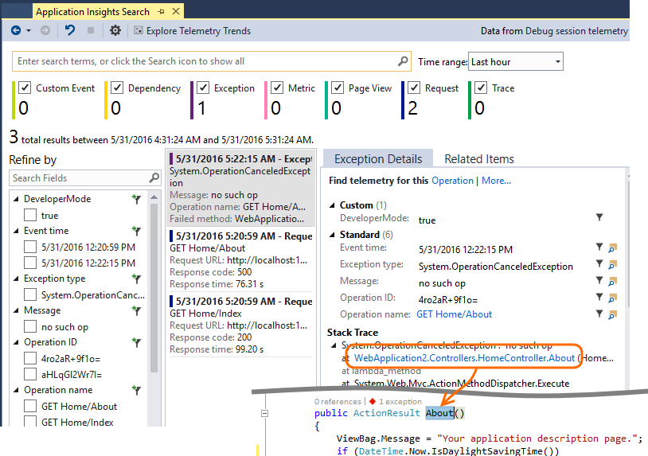

<properties 
    pageTitle="Met Application Insights werken in Visual Studio" 
    description="Analyse van prestaties en diagnostische gegevens tijdens foutopsporing en algemeen gebruik." 
    services="application-insights" 
    documentationCenter=".net"
    authors="alancameronwills" 
    manager="douge"/>

<tags 
    ms.service="application-insights" 
    ms.workload="tbd" 
    ms.tgt_pltfrm="ibiza" 
    ms.devlang="na" 
    ms.topic="get-started-article" 
    ms.date="05/25/2016" 
    ms.author="awills"/>

# Met Application Insights werken in Visual Studio

In Visual Studio (2015 en hoger) kunt u de prestaties analyseren en problemen identificeren tijdens de foutopsporing en algemeen gebruik. Dit gebeurt aan de hand van telemetrie uit [Visual Studio Application Insights](app-insights-overview.md).

Als u [Application Insights nog niet hebt geïnstalleerd in uw app](app-insights-asp-net.md), doet u dat nu.

##  Fouten opsporen voor uw project

Start uw toepassing met F5 en probeer deze uit. Open verschillende pagina’s om telemetrie te genereren.

In Visual Studio ziet u het aantal gebeurtenissen dat is geregistreerd.

Klik op deze knop om diagnostische gegevens te doorzoeken. 

## Diagnostische gegevens doorzoeken

In het zoekvenster worden gebeurtenissen weergegeven die zijn geregistreerd. (Als u zich bij het instellen van Application Insights hebt aangemeld bij Azure, kunt u dezelfde gebeurtenissen ook in de portal doorzoeken.)

U kunt zoeken met vrije tekst gebruiken voor alle velden in de gebeurtenissen. Zoek bijvoorbeeld naar een deel van de URl van een pagina, naar de waarde van een eigenschap, zoals de clientlocatie, of naar specifieke woorden in een traceringslogboek.

Klik op een gebeurtenis om de gedetailleerde eigenschappen ervan weer te geven.

U kunt ook het tabblad Verwante items openen om mislukte aanvragen of uitzonderingen te diagnosticeren.

## Diagnostics Hub

In de Diagnostics Hub (Visual Studio 2015 of hoger) ziet u de Application Insights-servertelemetrie op het moment dat deze wordt gegenereerd. Dit werkt zelfs als u ervoor hebt gekozen om alleen de SDK te installeren, zonder deze te koppelen aan een resource in de Azure Portal.

## Uitzonderingen

Als u [uitzonderingencontrole hebt ingesteld](app-insights-asp-net-exceptions.md), worden de uitzonderingenrapporten weergegeven in het venster Zoeken. 

Klik op een uitzondering voor een stack-trace. Als de code van de app in Visual Studio is geopend, kunt u via de stack-trace doorklikken naar de relevante coderegel.

## Lokale bewaking

(Vanaf Visual Studio 2015 Update 2) Als u de SDK nog niet hebt geconfigureerd voor het verzenden van telemetrie naar de Application Insights-portal (zodat er in ApplicationInsights.config geen instrumentatiesleutel staat), wordt in het venster met diagnostische gegevens telemetrie weergegeven van de meest recente foutopsporingssessie. 

Dit is handig als u al een eerdere versie van uw app hebt gepubliceerd. Zo voorkomt u dat de telemetrie van uw foutopsporingssessies in de Application Insights-portal wordt verward met de telemetrie over de gepubliceerde app.

Ook als u beschikt over [aangepaste telemetrie](app-insights-api-custom-events-metrics.md) waarin u fouten wilt opsporen voordat u deze naar de portal verzendt, komt deze functie van pas.

* *Aanvankelijk heb ik Application Insights volledig geconfigureerd voor het verzenden van telemetrie naar de portal. Maar nu wil ik de telemetrie alleen bekijken in Visual Studio.*

 * De instellingen van het venster Zoeken bevat een optie om lokale diagnostische gegevens te doorzoeken, zelfs als uw app telemetrie verzendt naar de portal.
 * Als u geen telemetrie meer naar de portal wilt verzenden, moet u de regel `<instrumentationkey>...` in ApplicationInsights.config uitcommentariëren. Als u weer telemetrie naar de portal wilt verzenden, verwijdert u het commentaarteken.

## Upgraden naar toekomstige SDK-versies

Als u wilt upgraden naar een [nieuwe release van de SDK](app-insights-release-notes-dotnet.md), opent u NuGet-pakketbeheer opnieuw en filtert u op geïnstalleerde pakketten. Selecteer Microsoft.ApplicationInsights.Web en kies Upgraden.

Als u aanpassingen in ApplicationInsights.config hebt aangebracht, slaat u hiervan een kopie op voordat u de upgrade uitvoert. Voeg vervolgens uw wijzigingen samen in de nieuwe versie.

## Volgende stappen

||
|---|---
|**[Meer gegevens toevoegen](app-insights-asp-net-more.md)** Bewaak het gebruik, de beschikbaarheid, de afhankelijkheden en de uitzonderingen. Integreer bijgehouden informatie uit frameworks voor logboekregistratie. Schrijf aangepaste telemetrie. | 
|**[Werken met de Application Insights-portal](app-insights-dashboards.md)** Dashboards, krachtige hulpprogramma's voor diagnose en analyse, waarschuwingen, een live afhankelijkheidskaart van uw toepassing en exportmogelijkheden voor telemetrie. |

 

<!--HONumber=Jun16_HO2-->

