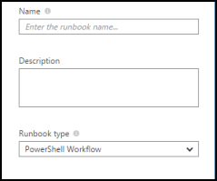
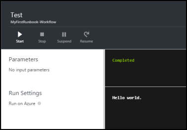
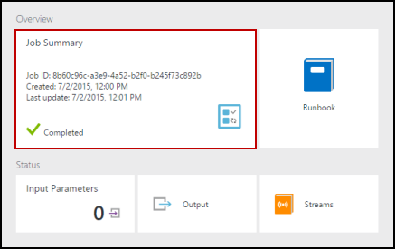

<properties
    pageTitle="Mijn eerste PowerShell Workflow-runbook in Azure Automation | Microsoft Azure"
    description="Zelfstudie die u helpt bij het maken, testen en publiceren van een eenvoudig tekstrunbook met behulp van PowerShell Workflow."
    services="automation"
    documentationCenter=""
    authors="mgoedtel"
    manager="jwhit"
    editor=""
    keywords="powershell-werkstroom, voorbeelden powershell-werkstroom, werkstroom powershell"/>
<tags
    ms.service="automation"
    ms.workload="tbd"
    ms.tgt_pltfrm="na"
    ms.devlang="na"
    ms.topic="get-started-article"
    ms.date="07/19/2016"
    ms.author="magoedte;bwren"/>

# Mijn eerste PowerShell Workflow-runbook

> [AZURE.SELECTOR] - [Grafisch](automation-first-runbook-graphical.md) - [PowerShell](automation-first-runbook-textual-PowerShell.md) - [PowerShell Workflow](automation-first-runbook-textual.md)

In deze zelfstudie wordt stap voor stap het maken van een [PowerShell Workflow-runbook](automation-runbook-types.md#powerShell-workflow-runbooks) in Azure Automation beschreven. We beginnen met een eenvoudig runbook dat we testen en publiceren terwijl we uitleggen hoe u de status van de runbooktaak kunt bijhouden. Vervolgens wijzigen we het runbook zodat Azure-resources daadwerkelijk worden beheerd, in dit geval door een virtuele machine van Azure te starten. Vervolgens maken we het runbook krachtiger door runbookparameters toe te voegen.

## Vereisten

Voor het voltooien van deze zelfstudie hebt u het volgende nodig:

-   Azure-abonnement. Als u nog geen abonnement hebt, kunt u [uw voordelen als MSDN-abonnee activeren](https://azure.microsoft.com/pricing/member-offers/msdn-benefits-details/) of <a href="/pricing/free-account/" target="_blank">[u aanmelden voor een gratis account](https://azure.microsoft.com/free/).
-   [Automation-account](automation-security-overview.md) om het runbook te bevatten en te verifiëren voor Azure-resources.  Dit account moet machtigingen hebben om de virtuele machine te starten en stoppen.
-   Een virtuele machine van Azure. We stoppen en starten deze machine, dus het mag geen productiemachine zijn.

## Stap 1: nieuw runbook maken

We beginnen met het maken van een eenvoudig runbook waarmee de tekst *Hallo wereld* als uitvoer wordt gegeven.

1.  Open uw Automation-account in Azure Portal.  
    Op de Automation-accountpagina vindt u een beknopte weergave van de resources in dit account. U zou al enkele assets moeten hebben. De meeste daarvan zijn de modules die automatisch zijn opgenomen in een nieuw Automation-account. Ook moet u de referentieasset hebben die wordt genoemd in de [vereisten](#prerequisites).
2.  Klik op de tegel **Runbooks** om de lijst met runbooks te openen.<br> 
3.  Maak een nieuw runbook door te klikken op de knop **Een runbook toevoegen** en daarna op **Een nieuw runbook maken**.
4.  Geef het runbook de naam *MyFirstRunbook-Workflow*.
5.  In dit geval gaan we een [PowerShell Workflow-runbook](automation-runbook-types.md#powerShell-workflow-runbooks) maken, dus selecteer **PowerShell Workflow** voor **Runbooktype**.<br> 
6.  Klik op **Maken** om het runbook te maken en de teksteditor te openen.

## Stap 2: code toevoegen aan het runbook

U kunt de code rechtstreeks in het runbook typen of u kunt cmdlets, runbooks en assets selecteren in het besturingselement Bibliotheek en deze laten toevoegen aan het runbook met eventuele gerelateerde parameters. Voor dit overzicht typen we rechtstreeks in het runbook.

1.  Ons runbook is momenteel leeg met alleen het vereiste *werkstroom*-###trefwoord, de naam van ons runbook en de accolades die de volledige werkstroom omsluiten. 

    ```
    Workflow MyFirstRunbook-Workflow
    {
    }
    ```

2.  Typ *Write-Output "Hallo wereld".* tussen de accolades. 
   
    ```
    Workflow MyFirstRunbook-Workflow
    {
      Write-Output "Hello World"
    }
    ```

3.  Klik op **Opslaan** om het runbook op te slaan.<br> 

## Stap 3: het runbook testen

Voordat we het runbook publiceren om het beschikbaar te maken in productie, willen we het testen om er zeker van te zijn dat het goed werkt. Wanneer u een runbook test, voert u de **concept**versie uit en geeft u de uitvoer interactief weer.

1.  Klik op **Testvenster** om het testvenster te openen.<br> 
2.  Klik op **Start** om de test te starten. Dit moet de enige ingeschakelde optie zijn.
3.  Een [runbooktaak](automation-runbook-execution.md) wordt gemaakt en de status ervan wordt weergegeven.  
    In eerste instantie is de taakstatus *In de wachtrij geplaatst*. Hiermee wordt aangegeven dat er wordt gewacht tot in de cloud een runbook-werkrol beschikbaar is. De taakstatus verandert daarna in *Starten* wanneer een werkrol de taak claimt en daarna in *Wordt uitgevoerd* wanneer het runbook daadwerkelijk wordt uitgevoerd.  
4.  Wanneer de runbooktaak is voltooid, wordt de uitvoer ervan weergegeven. In ons geval zouden we *Hallo wereld* moeten zien.<br> 
5.  Sluit het testvenster om terug te gaan naar het papier.

## Stap 4: het runbook publiceren en starten

Het runbook dat we zojuist hebben gemaakt, bevindt zich nog steeds in de modus Concept. We moeten het publiceren voordat we het in productie kunnen uitvoeren. Wanneer u een runbook publiceert, overschrijft u de bestaande gepubliceerde versie met de conceptversie. In ons geval hebben we nog geen gepubliceerde versie omdat we het runbook zojuist hebben gemaakt.

1.  Klik op **Publiceren** om het runbook te publiceren en klik vervolgens op **Ja** wanneer hierom wordt gevraagd.<br> 
2.  Als u naar links schuift om het runbook nu weer te geven in het deelvenster **Runbooks**, wordt de **Ontwerpstatus** **Gepubliceerd** getoond.
3.  Schuif terug naar rechts om het deelvenster voor **MyFirstRunbook-Workflow** weer te geven.  
    Met de opties bovenaan kunnen we het runbook starten, plannen dat het op een bepaald moment in de toekomst start of een [webhook](automation-webhooks.md) maken zodat het kan worden gestart via een HTTP-aanroep.
4.  We willen het runbook starten, dus klikt u op **Starten** en vervolgens op **Ja** wanneer hierom wordt gevraagd.<br> 
5.  Een taakdeelvenster wordt geopend voor de runbooktaak die we zojuist hebben gemaakt. We kunnen dit deelvenster sluiten, maar in dit geval laten we het open zodat we de voortgang van de taak kunnen bekijken.
6.  De taakstatus wordt weergegeven in **Taakoverzicht** en komt overeen met de statuswaarden die we zagen toen we het runbook testten.<br> 
7.  Zodra voor het runbook de status *Voltooid* wordt weergegeven, klikt u op **Uitvoer**. Het deelvenster Uitvoer wordt geopend en we zien onze tekst *Hallo wereld*.<br>   
8.  Sluit het deelvenster Uitvoer.
9.  Klik op **Streams** om het deelvenster Streams voor de runbooktaak te openen. We zouden alleen *Hallo wereld* moeten zien in de uitvoerstroom, maar er kunnen ook andere stromen voor een runbooktaak worden weergegeven, zoals Uitgebreid en Fout als hiernaar wordt geschreven met het runbook.<br> 
10. Sluit het deelvenster Streams en het deelvenster Taak om terug te gaan naar het deelvenster MyFirstRunbook.
11. Klik op **Taken** om het deelvenster Taken voor dit runbook te openen. Hiermee worden alle taken weergegeven die met dit runbook zijn gemaakt. We zouden slechts één weergegeven taak moeten zien, aangezien we de taak slechts eenmaal hebben uitgevoerd.<br> 
12. U kunt op deze taak klikken om hetzelfde taakvenster te openen dat we hebben bekeken toen we het runbook startten. Hiermee kunt u teruggaan in de tijd en de details bekijken van elke taak die voor een bepaald runbook is gemaakt.

## Stap 5: verificatie toevoegen voor het beheren van Azure-resources

We hebben ons runbook getest en gepubliceerd, maar tot nu toe doet het nog niets nuttigs. We willen dat er Azure-resources mee worden beheerd. Dat is echter niet mogelijk, tenzij we het laten verifiëren met de referenties waarnaar wordt verwezen in de [vereisten](#prerequisites). We doen dat met de cmdlet **Add-AzureRMAccount**.

1.  Open de teksteditor door te klikken op **Bewerken** in het deelvenster MyFirstRunbook-Workflow.<br> 
2.  We hebben de regel **Write-Output** niet meer nodig, dus u kunt deze gewoon verwijderen.
3.  Plaats de cursor op een lege regel tussen de accolades.
4.  Typ of kopieer en plak de volgende code waarmee de verificatie wordt uitgevoerd met uw Uitvoeren als-account voor Automation:

    ```
    $Conn = Get-AutomationConnection -Name AzureRunAsConnection 
    Add-AzureRMAccount -ServicePrincipal -Tenant $Conn.TenantID `
    -ApplicationId $Conn.ApplicationID -CertificateThumbprint $Conn.CertificateThumbprint
    ```

5.  Klik op **Testvenster** zodat we het runbook kunnen testen.
6.  Klik op **Start** om de test te starten. Zodra deze is voltooid, ontvangt u uitvoer zoals hieronder afgebeeld, waarin basisinformatie van uw account wordt weergegeven. Hiermee wordt bevestigd dat de referentie geldig is.<br> 

## Stap 6: code toevoegen om een virtuele machine te starten

Nu ons runbook verifieert voor ons Azure-abonnement, kunnen we resources beheren. We voegen een opdracht toe voor het starten van een virtuele machine. U kunt elke virtuele machine in uw Azure-abonnement selecteren en voorlopig hardcoderen we deze naam in de cmdlet.

1.  Typ na *Add-AzureRmAccount* *Start-AzureRmVM -Name 'VMName' -ResourceGroupName 'NameofResourceGroup'* en geef daarbij de naam en de ResourceGroup-naam op van de virtuele machine die moet worden gestart.  

    ```
    workflow MyFirstRunbook-Workflow
    {
      $Conn = Get-AutomationConnection -Name AzureRunAsConnection
      Add-AzureRMAccount -ServicePrincipal -Tenant $Conn.TenantID -ApplicationId $Conn.ApplicationID -CertificateThumbprint $Conn.CertificateThumbprint
      Start-AzureRmVM -Name 'VMName' -ResourceGroupName 'ResourceGroupName'
    }
    ``` 

2.  Sla het runbook op en klik vervolgens op **Testvenster** zodat we het runbook kunnen testen.
3.  Klik op **Start** om de test te starten. Nadat deze is voltooid, controleert u of de virtuele machine is gestart.

## Stap 7: een invoerparameter toevoegen aan het runbook

Met ons runbook wordt momenteel de virtuele machine gestart die we hebben hardgecodeerd in het runbook, maar het zou nuttiger zijn als we de virtuele machine zouden kunnen opgeven wanneer het runbook wordt gestart. We voegen nu invoerparameters aan het runbook toe om deze functionaliteit te bieden.

1.  Voeg parameters voor *VMName* en *ResourceGroupName* toe aan het runbook en gebruik deze variabelen met de cmdlet **Start-AzureRmVM**, zoals in het voorbeeld hieronder. 

    ```
    workflow MyFirstRunbook-Workflow
    {
       Param(
        [string]$VMName,
        [string]$ResourceGroupName
       )  
     $Conn = Get-AutomationConnection -Name AzureRunAsConnection 
     Add-AzureRMAccount -ServicePrincipal -Tenant $Conn.TenantID -ApplicationId $Conn.ApplicationID -CertificateThumbprint $Conn.CertificateThumbprint
     Start-AzureRmVM -Name $VMName -ResourceGroupName $ResourceGroupName
    }
    ```

2.  Sla het runbook op en open het testvenster. U kunt nu waarden opgeven voor de twee invoervariabelen die in de test worden gebruikt.
3.  Sluit het testvenster.
4.  Klik op **Publiceren** om de nieuwe versie van het runbook te publiceren.
5.  Stop de virtuele machine die u in de vorige stap hebt gestart.
6.  Klik op **Starten** om het runbook te starten. Typ waarden voor **VMName** en **ResourceGroupName** voor de virtuele machine die u wilt starten.<br> 

7.  Wanneer het runbook is voltooid, controleert u of de virtuele machine is gestart.

## Volgende stappen

-  Zie [Mijn eerste grafische runbook](automation-first-runbook-graphical.md) om aan de slag te gaan met grafische runbooks
-  Zie [Mijn eerste PowerShell-runbook](automation-first-runbook-textual-powershell.md) om aan de slag te gaan met PowerShell-runbooks
-  Zie [Azure Automation-runbooktypen](automation-runbook-types.md) voor meer informatie over runbooktypen, hun voordelen en beperkingen
-  Zie [Systeemeigen PowerShell-scriptondersteuning in Azure Automation](https://azure.microsoft.com/blog/announcing-powershell-script-support-azure-automation-2/) voor meer informatie over de functie voor PowerShelll-scriptondersteuning


<!--HONumber=ago16_HO4-->


