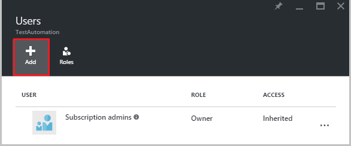
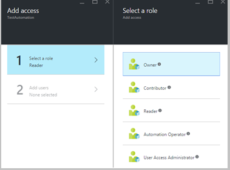
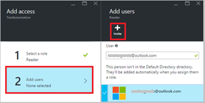
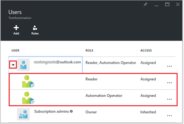
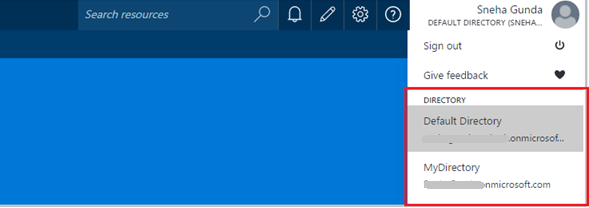
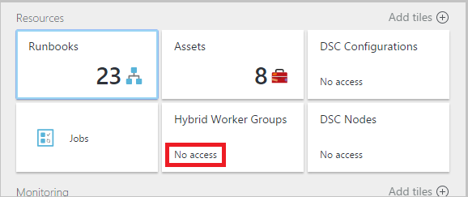
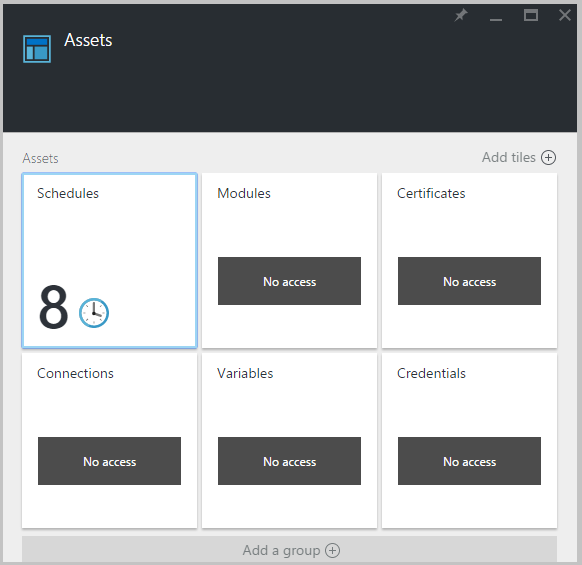
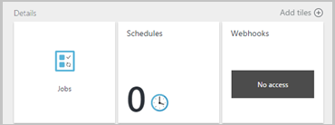

<properties 
   pageTitle="Op rollen gebaseerd toegangsbeheer in Azure Automation | Microsoft Azure"
   description="Met op rollen gebaseerd toegangsbeheer (RBAC) beschikt u over toegangsbeheer voor Azure-resources. In dit artikel wordt beschreven hoe u RBAC instelt in Azure Automation."
   services="automation"
   documentationCenter=""
   authors="mgoedtel"
   manager="jwhit"
   editor="tysonn"
   keywords="automatisering rbac, rolgebaseerde toegangscontrole, azure rbac" />
<tags 
   ms.service="automation"
   ms.devlang="na"
   ms.topic="get-started-article"
   ms.tgt_pltfrm="na"
   ms.workload="infrastructure-services"
   ms.date="06/20/2016"
   ms.author="magoedte;sngun"/>

# Op rollen gebaseerd toegangsbeheer in Azure Automation

## Op rollen gebaseerd toegangsbeheer

Met op rollen gebaseerd toegangsbeheer (RBAC) beschikt u over toegangsbeheer voor Azure-resources. Met [RBAC](../active-directory/role-based-access-control-configure.md) kunt u taken scheiden binnen uw team en alleen de mate van toegang verlenen aan gebruikers, groepen en toepassingen die nodig is om de taken uit te voeren. Op rollen gebaseerde toegang kan worden verleend aan gebruikers via de Azure Portal, Azure-opdrachtregelprogramma's of Azure Management-API's.

## RBAC in Automation-accounts

In Azure Automation wordt toegang verleend door de juiste RBAC-rol toe te wijzen aan gebruikers, groepen en toepassingen bij het Automation-accountbereik. Hieronder vindt u de ingebouwde rollen die worden ondersteund met een Automation-account:  

|**Rol** | **Beschrijving** |
|:--- |:---|
| Eigenaar | De rol van Eigenaar maakt het mogelijk om alle resources en acties binnen een Automation-account te openen, inclusief toegang tot andere gebruikers, groepen en toepassingen om het Automation-account te beheren. |
| Inzender | De rol van Bijdrager maakt het mogelijk om alles te beheren, behalve de toegangsrechten van andere gebruikers te wijzigen naar een Automation-account. |
| Lezer | Met de rol van Lezer kunt u alle resources in een Automation-account bekijken, maar niets wijzigen.|
| Automation-operator | De rol van Automation-operator geeft u de mogelijkheid om bijkomende taken, zoals starten, stoppen, opschorten, hernemen en plannen van taken uit te voeren. Deze rol is handig als u niet wilt dat uw Automation-accountresources zoals referentieassets en runbooks worden weergegeven of gewijzigd, maar u wel wilt toestaan dat leden van uw organisatie deze runbooks uitvoeren. |
| Beheerder van gebruikerstoegang | De beheerdersrol gebruiker toegang kunt u gebruikerstoegang tot Azure Automation-accounts beheren. |

>[AZURE.NOTE] U kunt geen toegangsrechten verlenen aan een specifiek runbook of specifieke runbooks, alleen de resources en acties binnen het Automation-account.  

In dit artikel wordt een stapsgewijze beschrijving gegeven van het instellen van RBAC in Azure Automation. Maar laten we eerst ingaan op de individuele machtigingen verleend aan de Bijdrager, Lezer, Automation-operator en Beheerder van gebruikerstoegang, zodat we dit beter begrijpen alvorens rechten toe te kennen aan het Automation-account.  Anders kan dit leiden tot onverwachte of ongewenste consequenties.     

## Machtigingen voor de rol van Bijdrager

De volgende tabel geeft de acties die kunnen worden uitgevoerd door de rol Bijdrager in Automatisering.

| **Resourcetype** | **Lezen** | **Schrijven** | **Verwijderen** | **Andere acties** |
|:--- |:---|:--- |:---|:--- |
| Azure Automation Account |  |  |  | | 
| Automation Certificate Asset |  |  |  | |
| Automation Connection Asset |  |  |  | | 
| Automation Connection Type Asset |  |  |  | | 
| Automation Credential Asset |  |  |  | |
| Automation Schedule Asset |  |  |  | |
| Automation Variable Asset |  |  |  | |
| Automation Desired State Configuration | | | |  |
| Hybrid Runbook Worker Resource Type |  | |  | | 
| Azure Automation Job |  |  | |  | 
| Automation Job Stream |  | | | | 
| Automation Job Schedule |  |  |  | |
| Automation Module |  |  |  | |
| Azure Automation Runbook |  |  |  |  |
| Automation Runbook Draft |  | | |  |
| Automation Runbook Draft Test Job |  |  | |  | 
| Automation Webhook |  |  |  |  |

## Machtigingen voor de rol van Lezer

De volgende tabel geeft de acties die kunnen worden uitgevoerd door de rol van lezer in Automation.

| **Resourcetype** | **Lezen** | **Schrijven** | **Verwijderen** | **Andere acties** |
|:--- |:---|:--- |:---|:--- |
| Klassiek abonnement beheerder |  | | | 
| Vergrendeling voor beheer |  | | | 
| Machtiging |  | | |
| Provider-bewerkingen |  | | | 
| Nieuwe roltoewijzing |  | | | 
| Roldefinitie ophalen |  | | | 

## Rolmachtigingen Automation-operator

De volgende tabel geeft de specifieke acties die kunnen worden uitgevoerd door de rol van operator in Automation.

| **Resourcetype** | **Lezen** | **Schrijven** | **Verwijderen** | **Andere acties** |
|:--- |:---|:--- |:---|:--- |
| Azure Automation Account |  | | | 
| Automation Certificate Asset | | | |
| Automation Connection Asset | | | |
| Automation Connection Type Asset | | | |
| Automation Credential Asset | | | |
| Automation Schedule Asset |  |  | | |
| Automation Variable Asset | | | |
| Automation Desired State Configuration | | | | |
| Hybrid Runbook Worker Resource Type | | | | | 
| Azure Automation Job |  |  | |  | 
| Automation Job Stream |  | | |  
| Automation Job Schedule |  |  | | |
| Automation Module | | | |
| Azure Automation Runbook |  | | | |
| Automation Runbook Draft | | | |
| Automation Runbook Draft Test Job | | | |  
| Automation Webhook | | | |

Voor meer details geeft [Acties Automation-operator](../active-directory/role-based-access-built-in-roles.md#automation-operator) de acties ondersteund door de rol van Automation-operator op het Automation-account en zijn resources.

## Machtigingen van de rol Beheerder van de Gebruikerstoegang

De volgende tabel geeft de specifieke acties die kunnen worden uitgevoerd door de rol van operator in Automation.

| **Resourcetype** | **Lezen** | **Schrijven** | **Verwijderen** | **Andere acties** |
|:--- |:---|:--- |:---|:--- |
| Azure Automation Account |  | | | |
| Automation Certificate Asset |  | | | |
| Automation Connection Asset |  | | | |
| Automation Connection Type Asset |  | | | |
| Automation Credential Asset |  | | | |
| Automation Schedule Asset |  | | | |
| Automation Variable Asset |  | | | |
| Automation Desired State Configuration | | | | |
| Hybrid Runbook Worker Resource Type |  | | | | 
| Azure Automation Job |  | | | | 
| Automation Job Stream |  | | | | 
| Automation Job Schedule |  | | | |
| Automation Module |  | | | |
| Azure Automation Runbook |  | | | |
| Automation Runbook Draft |  | | | |
| Automation Runbook Draft Test Job |  | | | | 
| Automation Webhook |  | | |

## RBAC configureren voor uw Automation-account met Azure Portal

1.  Meld u aan bij [Azure Portal](https://portal.azure.com/) en open uw Automation-account via de blade Automation-accounts.  

2.  Klik op het besturingselement **Toegang** in de rechterbovenhoek. Hiermee wordt de blade **Gebruikers** geopend, waar u nieuwe gebruikers, groepen en toepassingen kunt toevoegen om uw Automation-account te beheren en bestaande rollen kunt weergeven die kunnen worden geconfigureerd voor het Automation-account.  

      

>[AZURE.NOTE] **Abonnementsbeheerders** bestaat al als de standaardgebruiker. De Active Directory-groep Abonnementsbeheerders bevat de servicebeheerder(s) en medebeheerder(s) voor uw Azure-abonnement. De servicebeheerder is de eigenaar van uw Azure-abonnement en de bijhorende resources en neemt ook de eigenaarsrol over voor de Automation-accounts. Dit betekent dat de toegang wordt **overgenomen** voor **servicebeheerders en medebeheerders** van een abonnement en dat deze wordt **toegewezen** voor alle andere gebruikers. Klik op **Abonnementsbeheerders** om meer details over hun machtigingen weer te geven.  

### Een nieuwe gebruiker toevoegen en een rol toewijzen

1.  Klik op de blade Gebruikers op **Toevoegen** om de blade **Toegang toevoegen** te openen waar u een gebruiker, groep of toepassing kunt toevoegen, en hieraan een rol kunt toewijzen.  

      

2.  Selecteer een rol in de lijst met beschikbare rollen. We kiezen de rol **Lezer**, maar u kunt elke beschikbare ingebouwde rol kiezen die met een Automation-account wordt ondersteund of elke aangepaste rol die u mogelijk hebt gedefinieerd.  

      

3.  Klik op **Gebruikers toevoegen** om de blade **Gebruikers toevoegen** te openen. Als u gebruikers, groepen of toepassingen hebt toegevoegd om uw abonnement te beheren, dan worden die gebruikers weergegeven en kunt u deze selecteren om toegang toe te voegen. Als er geen gebruikers worden weergegeven of als de gebruiker die u wilt toevoegen, niet wordt weergegeven, klikt u op **Uitnodigen** om de blade **Een gast uitnodigen** te openen, waar u een gebruiker met een geldig e-mailadres voor een Microsoft-account kunt uitnodigen, zoals Outlook.com, OneDrive of Xbox Live-id's. Nadat u het e-mailadres van de gebruiker hebt ingevoerd, klikt u op **Selecteren** om de gebruiker toe te voegen en klikt u vervolgens op **OK**. 

      
 
    Nu moet u zien dat de gebruiker is toegevoegd aan de blade **Gebruikers** en dat de rol **Lezer** is toegewezen.  

      

    U kunt ook een rol aan de gebruiker toewijzen via de blade **Rollen**. 

1. Klik op **Rollen** op de blade Gebruikers om de blade **Rollen** te openen. Via deze blade kunt u het volgende bekijken: de naam van de rol, het aantal gebruikers en de groepen die aan die rol zijn toegewezen.

      
   
    >[AZURE.NOTE] Op rollen gebaseerd toegangsbeheer kan alleen worden ingesteld op het niveau van het Automation-account en niet op een resource onder het Automation-account.

    U kunt meer dan één rol toewijzen aan een gebruiker, groep of toepassing. Als we bijvoorbeeld de rol **Automation-operator** samen met de rol **Lezer** toevoegen aan de gebruiker, dan kan deze alle Automation-resources bekijken, en ook de runbooktaken uitvoeren. U kunt de vervolgkeuzelijst uitvouwen om een lijst met rollen weer te geven die aan de gebruiker zijn toegewezen.  

      
 
### Een gebruiker verwijderen

U kunt de toegangsmachtigingen voor een gebruiker verwijderen die het Automation-account niet beheert, of die niet meer voor de organisatie werkt. Hieronder vindt u de stappen voor het verwijderen van een gebruiker: 

1.  Selecteer op de blade **Gebruikers** de roltoewijzing die u wilt verwijderen.

2.  Klik op de knop **Verwijderen** op de blade Toewijzingdetails.

3.  Klik op **Ja** om het verwijderen te bevestigen. 

      

## Gebruiker met toegewezen rol

Wanneer een gebruiker die aan een rol is toegewezen, zich aanmeldt bij zijn/haar Automation-account, ziet deze het account van de eigenaar weergegeven in de lijst met **Standaardmappen**. Als een gebruiker het Automation-account wil bekijken waaraan hij/zij is toegevoegd, moet deze overschakelen van de standaardmap naar de standaardmap van de eigenaar.  

  

### Gebruikerservaring voor de rol Automation-operator

Wanneer een gebruiker, aan wie de rol Automation-operator is toegewezen, het Automation-account bekijkt waaraan hij/zij is toegewezen, kan de gebruiker alleen de lijst met runbooks, runbooktaken en planningen weergeven die in het Automation-account zijn gemaakt, maar niet de bijbehorende definitie. De gebruiker kan de runbooktaak starten, stoppen, onderbreken, hervatten of plannen. De gebruiker heeft geen toegang tot andere Automation-resources, zoals configuraties, Hybrid Worker-groepen of DSC-knooppunten.  

  

Wanneer de gebruiker op het runbook klikt, worden de opdrachten voor het weergeven van de bron of het bewerken van het runbook niet aangeboden, omdat de rol Automation-operator geen toegang tot de opdrachten toestaat.  

  

De gebruiker heeft toegang voor het weergeven en maken van planningen, maar heeft geen toegang tot andere assettypen.  

  

Deze gebruiker heeft ook geen toegang tot de weergave van de webhooks die aan een runbook zijn gekoppeld.

  

## RBAC configureren voor uw Automation-account met Azure PowerShell

Op rollen gebaseerde toegang kan ook worden geconfigureerd voor een Automation-Account met de volgende [Azure PowerShell-cmdlets](../active-directory/role-based-access-control-manage-access-powershell.md).

• Met [Get-AzureRmRoleDefinition](https://msdn.microsoft.com/library/mt603792.aspx) wordt een lijst weergegeven van alle RBAC-rollen die beschikbaar zijn in Azure Active Directory. U kunt deze opdracht samen met de eigenschap **Naam** gebruiken om alle acties die kunnen worden uitgevoerd door een specifieke rol weer te geven.  
    **Voorbeeld:**  
      

• Met [Get-AzureRmRoleAssignment](https://msdn.microsoft.com/library/mt619413.aspx) worden Azure AD RBAC-roltoewijzingen weergegeven bij het opgegeven bereik. Zonder parameters worden met deze opdracht alle roltoewijzingen geretourneerd die onder het abonnement zijn gemaakt. Gebruik de parameter **ExpandPrincipalGroups** om toegangstoewijzingen voor de opgegeven gebruiker weer te geven en voor de groepen waarvan de gebruiker lid is.  
    **Voorbeeld:** gebruik de volgende opdracht om alle gebruikers en de bijbehorende rollen binnen een Automation-account weer te geven.

    Get-AzureRMRoleAssignment -scope “/subscriptions/<SubscriptionID>/resourcegroups/<Resource Group Name>/Providers/Microsoft.Automation/automationAccounts/<Automation Account Name>” 

• [New AzureRmRoleAssignment](https://msdn.microsoft.com/library/mt603580.aspx) om toegang te verlenen aan gebruikers, groepen en toepassingen bij een bepaald bereik.  
    **Voorbeeld:** gebruik de volgende opdracht om een nieuwe rol 'Automation-operator' toe te wijzen voor een gebruiker bij het Automation-accountbereik.

    New-AzureRmRoleAssignment -SignInName <sign-in Id of a user you wish to grant access> -RoleDefinitionName "Automation operator" -Scope “/subscriptions/<SubscriptionID>/resourcegroups/<Resource Group Name>/Providers/Microsoft.Automation/automationAccounts/<Automation Account Name>”  

• Gebruik [Remove-AzureRmRoleAssignment](https://msdn.microsoft.com/library/mt603781.aspx) om toegang van de opgegeven gebruiker, groep of toepassing te verwijderen uit een bepaald bereik.  
    **Voorbeeld:** gebruik de volgende opdracht om een de gebruiker te verwijderen uit de rol van “Automation Operator” in het bereik Automation Account.

    Remove-AzureRmRoleAssignment -SignInName <sign-in Id of a user you wish to remove> -RoleDefinitionName "Automation Operator" -Scope “/subscriptions/<SubscriptionID>/resourcegroups/<Resource Group Name>/Providers/Microsoft.Automation/automationAccounts/<Automation Account Name>”

Vervang in de bovenstaande voorbeelden de **aanmeldnaam**, de **abonnements-id**, de **resourcegroepnaam** en de **Automation-accountnaam** door uw accountgegevens. Kies **Ja** om te bevestigen voordat u verdergaat met het verwijderen van de roltoewijzing voor de gebruiker.   

## Volgende stappen
-  Raadpleeg [RBAC met Azure PowerShell beheren](../active-directory/role-based-access-control-manage-access-powershell.md) voor informatie over verschillende manieren om RBAC voor Azure Automation te configureren.
- Zie [Een runbook starten](automation-starting-a-runbook.md) voor informatie over verschillende manieren om een runbook te starten.
- Raadpleeg [Azure Automation-runbooktypen](automation-runbook-types.md) voor informatie over verschillende typen runbooks

<!--HONumber=ago16_HO4-->

