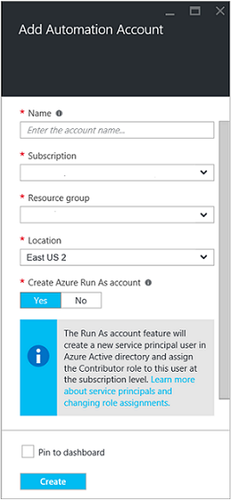
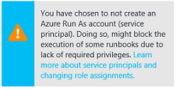
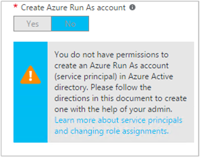

<properties
    pageTitle="Uitvoeren als-account voor Azure configureren | Microsoft Azure"
    description="Zelfstudie die u helpt bij het maken en testen en bij het voorbeeldgebruik van de verificatie van beveiligingsprincipals in Azure Automation."
    services="automation"
    documentationCenter=""
    authors="mgoedtel"
    manager="jwhit"
    editor=""
    keywords="service principal name, setspn, azure authentication"/>
<tags
    ms.service="automation"
    ms.workload="tbd"
    ms.tgt_pltfrm="na"
    ms.devlang="na"
    ms.topic="get-started-article"
    ms.date="06/07/2016"
    ms.author="magoedte"/>

# Runbooks met Uitvoeren als-account voor Azure verifiëren
In dit onderwerp wordt beschreven hoe u een Automation-account via Azure Portal configureert met behulp van de nieuwe functie Uitvoeren als-account (die ook wordt aangeduid als een service-principal) voor toegang tot Azure Resource Manager-resources in uw abonnement met Automation-runbooks.  Als u in Azure Portal een nieuw Automation-account maakt, wordt automatisch een nieuwe service-principal gemaakt, die standaard wordt toegewezen aan de rol Inzender van het op rollen gebaseerde toegangsbeheer (RBAC) in het abonnement.  Dit maakt het proces voor u eenvoudiger zodat u sneller runbooks kunt maken en implementeren, ter ondersteuning van uw automatiseringsbehoeften.      

Met een service-principal kunt u het volgende doen:

* Een gestandaardiseerde manier voor Azure-verificatie bieden bij het beheer van Azure Resource Manager-resources met behulp van runbooks
* Het gebruik van globale runbooks die in functie voor Azure-waarschuwingen zijn geconfigureerd automatiseren


>[AZURE.NOTE] De [waarschuwingsintegratiefunctie](../azure-portal/insights-receive-alert-notifications.md) van Azure met globale Automation-runbooks vereist een Automation-account dat met een service-principal is geconfigureerd. Selecteer een Automation-account waarvoor al een gebruiker voor de service-principal is gedefinieerd of maak een nieuw Automation-account.


We tonen hoe u het Automation-account maakt vanuit Azure Portal en een account bijwerkt met een Uitvoeren als-account met behulp van Azure PowerShell en hoe u met deze service-principal verificaties uitvoert in uw runbooks.  

## Nieuw Automation-account maken vanuit Azure Portal
In deze sectie voert u de volgende stappen uit om vanuit Azure Portal een nieuw Azure Automation-account en service-principal te maken.

>[AZURE.NOTE] De gebruiker die deze stappen uitvoert, *moet* lid zijn van de rol Abonnementsbeheerders.

1. Meld u aan bij Azure Portal als servicebeheerder voor het Azure-abonnement dat u wilt beheren.
2. Selecteer **Automation-accounts**.
3. Klik op de blade Automation-accounts op **Toevoegen**.<br>
4. Typ op de blade **Automation-account toevoegen** in het vak **Naam** een naam voor uw nieuwe Automation-account.
5. Als u meer dan één abonnement hebt, geeft u het abonnement voor het nieuwe account op, evenals een nieuwe of bestaande **resourcegroep** en de **locatie** van een Azure-datacenter.
6. Controleer of de waarde **Ja** is geselecteerd voor de optie **Een Uitvoeren als-account voor Azure maken** en klik op de knop **Maken**.  

    

    >[AZURE.NOTE] Als u de optie **Nee** selecteert omdat u geen Uitvoeren als-account wilt maken, wordt een waarschuwing weergegeven op de blade **Automation-account toevoegen**.  Hoewel het account wordt gemaakt en wordt toegewezen aan de rol **Inzender** in het abonnement, heeft het account geen overeenkomstige verificatie-id in de adreslijstservice van uw abonnementen en daardoor ook geen toegang tot resources in uw abonnement.  Hierdoor kunnen alle runbooks die naar dit account verwijzen, geen taken verifiëren en uitvoeren in Azure Resource Manager-resources.

    

    >[AZURE.NOTE] Wanneer u op de knop **Maken** klikt en er verschijnt een foutbericht met de melding dat toestemming is geweigerd, komt dat omdat uw account geen lid is van de rol Abonnementsbeheerders.  

7. Terwijl in Azure het Automation-account wordt gemaakt, kunt u in het menu onder **Meldingen** de voortgang hiervan volgen.

### Beschikbare resources
Nadat het Automation-account is gemaakt, worden automatisch verschillende resources voor u gemaakt. Deze resources worden toegelicht in de onderstaande tabel.

Resource|Beschrijving 
----|----
AzureAutomationTutorial Runbook|Een voorbeeldrunbook dat laat zien hoe u verifieert met behulp van het Uitvoeren als-account en hoe u de eerste tien Azure-VM's in uw abonnement weergeeft.
AzureRunAsCertificate|Certificaatasset dat wordt gemaakt als u ervoor hebt gekozen om het Uitvoeren als-account te maken tijdens het maken van het Automation-account of met behulp van het onderstaande PowerShell-script voor een bestaande account.  Dit certificaat is één jaar geldig. 
AzureRunAsConnection|Verbindingsasset dat wordt gemaakt als u ervoor hebt gekozen om het Uitvoeren als-account te maken tijdens het maken van het Automation-account of met behulp van het onderstaande PowerShell-script voor een bestaande account.
Modules|15 modules met cmdlets voor Azure, PowerShell en Automation, voor onmiddellijk gebruik in uw runbooks.  

## Automation-account bijwerken met behulp van PowerShell
Met de onderstaande procedure werkt u een bestaand Automation-account bij en maakt u de service-principal met behulp van PowerShell.  Deze procedure is vereist als u wel een account hebt gemaakt, maar geen Uitvoeren als-account.

Voordat u doorgaat, controleert u het volgende:

1. U hebt [Windows Management Framework (WMF) 4.0](https://www.microsoft.com/download/details.aspx?id=40855) gedownload en geïnstalleerd indien u Windows 7 gebruikt.   
    Als u Windows Server 2012 R2, Windows Server 2012, Windows 2008 R2, Windows 8.1 of Windows 7 SP1 gebruikt, is [Windows Management Framework 5.0](https://www.microsoft.com/download/details.aspx?id=50395) beschikbaar voor installatie.
2. Azure PowerShell 1.0. Zie [How to install and configure Azure PowerShell](../powershell-install-configure.md) (Azure PowerShell installeren en configureren) voor meer informatie over deze release en de installatie ervan. 
3. U hebt een Automation-account gemaakt.  In het onderstaande script wordt naar dit account verwezen als de waarde voor de parameters -AutomationAccountName en -ApplicationDisplayName.


Met het PowerShell-script wordt het volgende geconfigureerd:

* Een Azure AD-toepassing die zal worden geverifieerd met het zelfondertekende certificaat, het maken van een service-principalaccount voor deze toepassing in Azure AD en het toewijzen van de rol Inzender (u kunt dit wijzigen in Eigenaar of een andere rol) voor dit account in uw huidige abonnement.  Raadpleeg voor meer informatie het artikel [Op rollen gebaseerd toegangsbeheer in Azure Automation](../automation/automation-role-based-access-control.md).  
* Een Automation-certificaatasset in het opgegeven Automation-account **AzureRunAsCertificate**, dat het certificaat bevat dat in de service-principal wordt gebruikt.
* Een Automation-verbindingsasset in het opgegeven Automation-account **AzureRunAsConnection**, dat de applicationId, tenantId, subscriptionId en de vingerafdruk van het certificaat bevat.  


### Het PowerShell-script uitvoeren

1. Sla het volgende script op uw computer op.  Sla het bestand in dit voorbeeld op met de bestandsnaam **Nieuw AzureServicePrincipal.ps1**.  

    ```
    #Requires -RunAsAdministrator
    Param (
    [Parameter(Mandatory=$true)]
    [String] $ResourceGroup,

    [Parameter(Mandatory=$true)]
    [String] $AutomationAccountName,

    [Parameter(Mandatory=$true)]
    [String] $ApplicationDisplayName,

    [Parameter(Mandatory=$true)]
    [String] $SubscriptionId,

    [Parameter(Mandatory=$true)]
    [String] $CertPlainPassword,

    [Parameter(Mandatory=$false)]
    [int] $NoOfMonthsUntilExpired = 12
    )

    Login-AzureRmAccount
    Import-Module AzureRM.Resources
    Select-AzureRmSubscription -SubscriptionId $SubscriptionId

    $CurrentDate = Get-Date
    $EndDate = $CurrentDate.AddMonths($NoOfMonthsUntilExpired)
    $KeyId = (New-Guid).Guid
    $CertPath = Join-Path $env:TEMP ($ApplicationDisplayName + ".pfx")

    $Cert = New-SelfSignedCertificate -DnsName $ApplicationDisplayName -CertStoreLocation cert:\LocalMachine\My -KeyExportPolicy Exportable -Provider "Microsoft Enhanced RSA and AES Cryptographic Provider"

    $CertPassword = ConvertTo-SecureString $CertPlainPassword -AsPlainText -Force
    Export-PfxCertificate -Cert ("Cert:\localmachine\my\" + $Cert.Thumbprint) -FilePath $CertPath -Password $CertPassword -Force | Write-Verbose

    $PFXCert = New-Object -TypeName System.Security.Cryptography.X509Certificates.X509Certificate -ArgumentList @($CertPath, $CertPlainPassword)
    $KeyValue = [System.Convert]::ToBase64String($PFXCert.GetRawCertData())

    $KeyCredential = New-Object  Microsoft.Azure.Commands.Resources.Models.ActiveDirectory.PSADKeyCredential
    $KeyCredential.StartDate = $CurrentDate
    $KeyCredential.EndDate= $EndDate
    $KeyCredential.KeyId = $KeyId
    $KeyCredential.Type = "AsymmetricX509Cert"
    $KeyCredential.Usage = "Verify"
    $KeyCredential.Value = $KeyValue

    # Use Key credentials
    $Application = New-AzureRmADApplication -DisplayName $ApplicationDisplayName -HomePage ("http://" + $ApplicationDisplayName) -IdentifierUris ("http://" + $KeyId) -KeyCredentials $keyCredential

    New-AzureRMADServicePrincipal -ApplicationId $Application.ApplicationId | Write-Verbose
    Get-AzureRmADServicePrincipal | Where {$_.ApplicationId -eq $Application.ApplicationId} | Write-Verbose

    $NewRole = $null
    $Retries = 0;
    While ($NewRole -eq $null -and $Retries -le 2)
    {
      # Sleep here for a few seconds to allow the service principal application to become active (should only take a couple of seconds normally)
      Sleep 5
      New-AzureRMRoleAssignment -RoleDefinitionName Contributor -ServicePrincipalName $Application.ApplicationId | Write-Verbose -ErrorAction SilentlyContinue
      Sleep 5
      $NewRole = Get-AzureRMRoleAssignment -ServicePrincipalName $Application.ApplicationId -ErrorAction SilentlyContinue
      $Retries++;
    }

    # Get the tenant id for this subscription
    $SubscriptionInfo = Get-AzureRmSubscription -SubscriptionId $SubscriptionId
    $TenantID = $SubscriptionInfo | Select TenantId -First 1

    # Create the automation resources
    New-AzureRmAutomationCertificate -ResourceGroupName $ResourceGroup -AutomationAccountName $AutomationAccountName -Path $CertPath -Name AzureRunAsCertificate -Password $CertPassword -Exportable | write-verbose

    # Create a Automation connection asset named AzureRunAsConnection in the Automation account. This connection uses the service principal.
    $ConnectionAssetName = "AzureRunAsConnection"
    Remove-AzureRmAutomationConnection -ResourceGroupName $ResourceGroup -AutomationAccountName $AutomationAccountName -Name $ConnectionAssetName -Force -ErrorAction SilentlyContinue
    $ConnectionFieldValues = @{"ApplicationId" = $Application.ApplicationId; "TenantId" = $TenantID.TenantId; "CertificateThumbprint" = $Cert.Thumbprint; "SubscriptionId" = $SubscriptionId.SubscriptionId}
    New-AzureRmAutomationConnection -ResourceGroupName $ResourceGroup -AutomationAccountName $AutomationAccountName -Name $ConnectionAssetName -ConnectionTypeName AzureServicePrincipal -ConnectionFieldValues $ConnectionFieldValues
    ```
<br>
2. Start op uw computer **Windows PowerShell** op vanaf het **Start**scherm met verhoogde gebruikersrechten.
3. Navigeer vanuit de opdrachtregel-shell met verhoogde gebruikersrechten van PowerShell naar de map die het script bevat dat in stap 1 is gemaakt en voer het script uit dat de waarden wijzigt voor de parameters *– ResourceGroup*, *- AutomationAccountName*, *- ApplicationDisplayName*, *- SubscriptionId* en *- CertPlainPassword*.<br>

    ```
    .\New-AzureServicePrincipal.ps1 -ResourceGroup <ResourceGroupName> 
     -AutomationAccountName <NameofAutomationAccount> `
     -ApplicationDisplayName <DisplayNameofAutomationAccount> `
     -SubscriptionId <SubscriptionId> `
     -CertPlainPassword "<StrongPassword>"
    ```   
<br>

    >[AZURE.NOTE] Nadat u het script hebt uitgevoerd, wordt u gevraagd zich te verifiëren bij Azure.  U *moet* zich aanmelden met een account dat in het abonnement een servicebeheerder is.  
<br>
4. Nadat het script met succes is uitgevoerd, gaat u verder met de volgende sectie om de nieuwe verwijzingsconfiguratie te testen en te verifiëren.

### Verificatie controleren
We gaan nu een korte test uitvoeren om te bevestigen dat u met succes een verificatie kunt uitvoeren met behulp van de nieuwe service-principal. Als het niet lukt om de verificatie uit te voeren, keert u terug naar stap 1 en bevestigt u elk van de vorige stappen opnieuw.    

1. Open in Azure Portal het Automation-account dat u eerder hebt gemaakt.  
2. Klik op de tegel **Runbooks** om de lijst met runbooks te openen.
3. Maak een nieuw runbook door te klikken op de knop **Een runbook toevoegen**. Klik daarna op de blade **Runbook toevoegen** en selecteer **Een nieuw runbook maken**.
4. Geef het runbook de naam *Testrunbook-SecPrin* en selecteer PowerShell als **Runbooktype**.  Klik op **Maken** om het runbook te maken.
5. Plak op de blade **PowerShell-runbook bewerken** de volgende code op het papier:<br>

    ```
     $Conn = Get-AutomationConnection -Name AzureRunAsConnection 
     Add-AzureRMAccount -ServicePrincipal -Tenant $Conn.TenantID `
     -ApplicationId $Conn.ApplicationID -CertificateThumbprint $Conn.CertificateThumbprint
    ```  
<br>
6. Klik op **Opslaan** om het runbook op te slaan.
7. Klik op **Testvenster** om de blade **Test** te openen.
8. Klik op **Start** om de test te starten.
9. Een [runbooktaak](automation-runbook-execution.md) wordt gemaakt en de status ervan wordt in het deelvenster weergegeven.  
10. In eerste instantie is de taakstatus *In de wachtrij geplaatst*. Hiermee wordt aangegeven dat er wordt gewacht tot in de cloud een runbook-werkrol beschikbaar is. De taakstatus verandert daarna in *Starten* wanneer een werkrol de taak claimt en daarna in *Wordt uitgevoerd* wanneer het runbook daadwerkelijk wordt uitgevoerd.  
11. Wanneer de runbooktaak is voltooid, wordt de uitvoer ervan weergegeven. In ons geval zou de status **Voltooid** moeten zijn.<br> <br>
12. Sluit de blade **Test** om terug te keren naar het papier.
13. Sluit de blade **PowerShell-runbook bewerken**.
14. Sluit de blade **Test-SecPrin-Runbook**.

## Voorbeeldcode voor verificatie bij Resource Manager-resources

U kunt de bijgewerkte voorbeeldcode hieronder, die is overgenomen uit het voorbeeldrunbook AzureAutomationTutorial, gebruiken om de verificatie uit te voeren met behulp van de Uitvoeren als-account voor het beheer van Resource Manager-resources met uw runbooks. 

   ```
   $connectionName = "AzureRunAsConnection"
   $SubId = Get-AutomationVariable -Name 'SubscriptionId'
   try
   {
      # Get the connection "AzureRunAsConnection "
      $servicePrincipalConnection=Get-AutomationConnection -Name $connectionName         

      "Logging in to Azure..."
      Add-AzureRmAccount `
         -ServicePrincipal `
         -TenantId $servicePrincipalConnection.TenantId `
         -ApplicationId $servicePrincipalConnection.ApplicationId `
         -CertificateThumbprint $servicePrincipalConnection.CertificateThumbprint 
      "Setting context to a specific subscription"   
      Set-AzureRmContext -SubscriptionId $SubId          
   }
   catch {
       if (!$servicePrincipalConnection)
       {
           $ErrorMessage = "Connection $connectionName not found."
           throw $ErrorMessage
       } else{
           Write-Error -Message $_.Exception
           throw $_.Exception
       }
   } 
   ```

Het script bevat twee extra regels met code voor de ondersteuning van verwijzingen naar de context van een abonnement, zodat u eenvoudig tussen meerdere abonnementen kunt schakelen. Een variabele met de naam SubscriptionId bevat de id van het abonnement en na de instructie van de cmdlet Add-AzureRmAccount wordt de [cmdlet Set-AzureRmContext](https://msdn.microsoft.com/library/mt619263.aspx) vermeld met de parameterset *-SubscriptionId*. Als de naam van de variabele te algemeen is, wijzigt u de naam van de variabele door er een voorvoegsel aan toe te voegen of door er een andere naamgevingsconventie op toe te passen, zodat u de variabele gemakkelijker kunt identificeren voor uw doeleinden. U kunt ook de parameter -SubscriptionName in plaats van -SubscriptionId gebruiken met een bijbehorende variabeleasset.  

## Volgende stappen
- Zie [Application Objects and Service Principal Objects](../active-directory/active-directory-application-objects.md) (Toepassingsobjecten en service-principalobjecten) voor meer informatie over service-principals.
- Zie [Op rollen gebaseerd toegangsbeheer in Azure Automation](../automation/automation-role-based-access-control.md) voor meer informatie over het op rollen gebaseerd toegangsbeheer in Azure Automation.


<!--HONumber=Jun16_HO2-->


