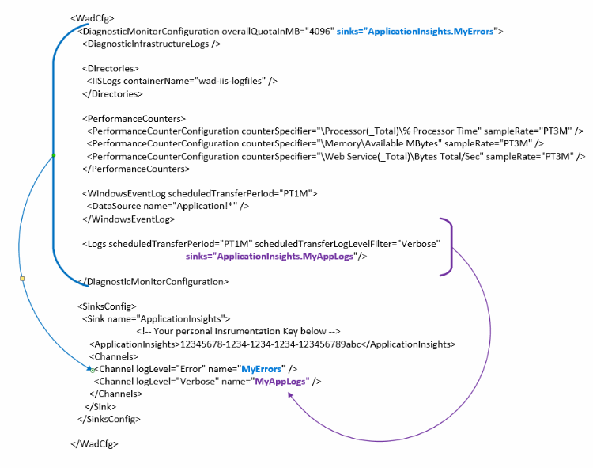

<properties
   pageTitle="Configure Azure Diagnostics to send data to Application Insights | Microsoft Azure"
   description="Update the Azure Diagnostics public configuration to send data to Application Insights."
   services="multiple"
   documentationCenter=".net"
   authors="sbtron"
   manager=""
   editor="" />
<tags
   ms.service="application-insights"
   ms.devlang="na"
   ms.topic="article"
   ms.tgt_pltfrm="na"
   ms.workload="na"
   ms.date="12/15/2015"
   ms.author="saurabh" />

# Configure Azure Diagnostics to send data to Application Insights

Azure diagnostics stores data to Azure Storage tables.  However, you can also pipe all or a subset of the data to Application Insights by configuring “sinks” and “channels” in your configuration when using Azure Diagnostics extension 1.5 or later. 

This article describes how to create the public configuration for the Azure Diagnostics extension so that its configured to send data to Application Insights.

## Configuring Application Insights as a Sink

The Azure diagnostics extension 1.5 introduces the **<SinksConfig>** element in the public configuration. This defines the additional *sink* where the Azure diagnostics data can be sent. You can specify the details of the Application Insights resource where you want to send the Azure diagnostics data as part of this **<SinksConfig>**.
An example **SinksConfig** looks like this -  

    <SinksConfig>
        <Sink name="ApplicationInsights">
          <ApplicationInsights>{Insert InstrumentationKey}</ApplicationInsights>
          <Channels>
            <Channel logLevel="Error" name="MyTopDiagData"  />
            <Channel logLevel="Verbose" name="MyLogData"  />
          </Channels>
        </Sink>
      </SinksConfig> 

For the **Sink** element the *name* attribute specifies a string value that will be used to uniquely refer to the sink.
The **ApplicationInsights** element specifies instrumentation key of the Application insights resource where the Azure diagnostics data will be sent. If you don't have an existing Application Insights resource, see [Create a new Application Insights resource](app-insights-create-new-resource.md) for more information on creating a resource and getting the instrumentation key.

If you are developing a Cloud Service project with Azure SDK 2.8 this instrumentation key is automatically populated in the public configuration based on the **APPINSIGHTS_INSTRUMENTATIONKEY** service configuration setting when packaging the cloud service project. See [Use Application Insights with Azure Diagnostics to troubleshoot Cloud Service issues](cloud-services-dotnet-diagnostics-applicationinsights.md).

The **Channels** element lets you define one or more **Channel** elements for the data that will be sent to the sink. The channel acts like a filter and allows you to select specific log levels that you would want to send to the sink. For example you could collect verbose logs and send them to storage but you could choose to define a channel with a log level of Error and when you send logs through that channel only error logs will be sent to that sink.
For a **Channel** the *name* attribute is used to uniquely refer to that channel. 
The *loglevel* attribute lets you specify the log level that the channel will allow. The available log levels in order of most least information are
 - Verbose
 - Information
 - Warning
 - Error
 - Critical

## Send data to the Application Insights sink
Once the Application Insights sink has been defined you can send data to that sink by adding the *sink* attribute to the elements under the **DiagnosticMonitorConfiguration** node. Adding the *sinks* element to each node specifies that you want data collected from that node and any node under it to be sent to the sink specified. 

For example, if you want to send all the data that is being collected by Azure diagnostics then you can add the *sink* attribute directly to the **DiagnosticMonitorConfiguration** node. Set the value of the *sinks* to the Sink name that was specified in the **SinkConfig**.

    <DiagnosticMonitorConfiguration overallQuotaInMB="4096" sinks="ApplicationInsights">

If you wanted to send only error logs to the Application Insights sink then you can set the *sinks* value to be the Sink name followed by the channel name separated by a period ("."). For example to send only error logs to the Application Insights sink use the MyTopDiagdata channel which was defined in the SinksConfig above.  
 
    <DiagnosticMonitorConfiguration overallQuotaInMB="4096" sinks="ApplicationInsights.MyTopDiagdata">

If you only wanted to send Verbose application logs to Application Insights then you would add the *sinks* attribute to the **Logs** node. 
    
    <Logs scheduledTransferPeriod="PT1M" scheduledTransferLogLevelFilter="Verbose" sinks="ApplicationInsights.MyLogData"/>

You can also include multiple sinks in the configuration at different levels in the hierarchy. In that case the sink specified at the top level of the hierarchy acts as a global setting and the one specified at the individual element element acts like an override to that global setting.    

Here is a complete example of the public configuration file that sends all errors to Application Insights (specified at the **DiagnosticMonitorConfiguration** node) and in addition Verbose level logs for the Application Logs (specified at the **Logs** node). 

    <WadCfg>
      <DiagnosticMonitorConfiguration overallQuotaInMB="4096"
           sinks="ApplicationInsights.MyTopDiagData"> <!-- All info below sent to this channel -->
        <DiagnosticInfrastructureLogs />
        <PerformanceCounters>
          <PerformanceCounterConfiguration counterSpecifier="\Processor(_Total)\% Processor Time" sampleRate="PT3M" sinks="ApplicationInsights.MyLogData/>
          <PerformanceCounterConfiguration counterSpecifier="\Memory\Available MBytes" sampleRate="PT3M" />
          <PerformanceCounterConfiguration counterSpecifier="\Web Service(_Total)\Bytes Total/Sec" sampleRate="PT3M" />
        </PerformanceCounters>
        <WindowsEventLog scheduledTransferPeriod="PT1M">
          <DataSource name="Application!*" />
        </WindowsEventLog>
        <Logs scheduledTransferPeriod="PT1M" scheduledTransferLogLevelFilter="Verbose"
                sinks="ApplicationInsights.MyLogData"/> <!-- This specific info sent to this channel -->
      </DiagnosticMonitorConfiguration>

    <SinksConfig>
        <Sink name="ApplicationInsights">
          <ApplicationInsights>{Insert InstrumentationKey}</ApplicationInsights>
          <Channels>
            <Channel logLevel="Error" name="MyTopDiagData"  />
            <Channel logLevel="Verbose" name="MyLogData"  />
          </Channels>
        </Sink>
      </SinksConfig>
    </WadCfg>

There are some limitations to be aware of with this functionality

- Channels are only meant to work with log type and not performance counters. If you specify a channel with a performance counter element it will be ignored. 
- The log level for a channel cannot exceed the log level for what is being collected by Azure diagnostics. For example: you cannot collect Application Log errors in the Logs element and try to send Verbose logs to the Application Insight sink. The *scheduledTransferLogLevelFilter* attribute must always collect equal or more logs than the logs you are trying to send to a sink. 
- You cannot send any blob data collected by Azure diagnostics extension to Application Insights. For example anything specified under the *Directories* node. For Crash Dumps the actual crash dump will still be sent to blob storage and only a notification that the crash dump was generated will be sent to Application Insights. 

## Next Steps

- Use [PowerShell](cloud-services-diagnostics-powershell.md) to enable the Azure diagnostics extension for your application. 
- Use [Visual Studio](vs-azure-tools-diagnostics-for-cloud-services-and-virtual-machines.md) to enable the Azure diagnostics extension for your application 
