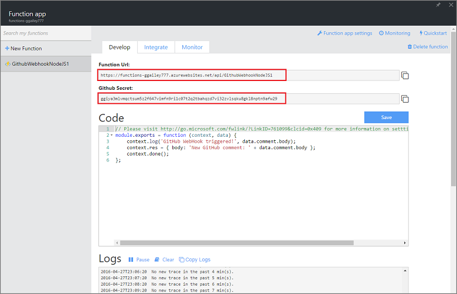

<properties
   pageTitle="Een webhook of API Azure Function maken | Microsoft Azure"
   description="Gebruik Azure Functions voor het maken van een functie die wordt opgeroepen door een WebHook of API-aanroep."
   services="azure-functions"
   documentationCenter="na"
   authors="ggailey777"
   manager="erikre"
   editor=""
   tags=""
   />

<tags
   ms.service="functions"
   ms.devlang="multiple"
   ms.topic="get-started-article"
   ms.tgt_pltfrm="multiple"
   ms.workload="na"
   ms.date="05/07/2016"
   ms.author="glenga"/>
   
# Een webhook of API Azure-functie maken

Azure Functions is een gebeurtenisafhankelijke, compute-on-demand ervaring waarmee u geplande of geactiveerde code-eenheden kunt maken voor implementatie in diverse programmeertalen. Zie [Overzicht van Azure Functions](functions-overview.md) voor meer informatie.

In dit onderwerp wordt beschreven hoe u een nieuwe Node.js-functie maakt die wordt opgeroepen door een GitHub-webhook. De nieuwe functie is gemaakt op basis van een vooraf gedefinieerde sjabloon in de Azure Functions-portal. U kunt ook een korte video bekijken om te zien hoe deze stappen worden uitgevoerd in de portal.

## Video bekijken

In de volgende video laten we zien hoe u de eenvoudige stappen in deze zelfstudie uitvoert 

[AZURE.VIDEO create-a-web-hook-or-api-azure-function]

##Op basis van de sjabloon een functie maken die door een webhook wordt geactiveerd

Een functie-app fungeert als host voor de uitvoering van uw functies in Azure. Voordat u een functie kunt maken, moet u een actief Azure-account hebben. Als u nog geen Azure-account hebt, zijn er [gratis accounts beschikbaar](https://azure.microsoft.com/free/). 

1. Ga naar de [Azure Functions-portal](https://functions.azure.com/signin) en meld u aan met uw Azure-account.

2. Als u een bestaande functie-app hebt die u kunt gebruiken, selecteert u deze in **Uw functie-apps** en klikt u op **Openen**. Als u een nieuwe functie-app wilt maken, typt u een unieke **Naam** voor uw nieuwe functie-app of accepteert u de gegenereerde naam, selecteert u de gewenste **Regio** en klikt u op **Maken + aan de slag**. 

3. Klik in uw functie-app op **+ nieuwe functie** > **GitHub Webhook - node** > **maken**. Hierdoor wordt een functie gemaakt met de standaardnaam die is gebaseerd op de opgegeven sjabloon. 

     

4. Merk in het tabblad **Ontwikkelen** het voorbeeld express.js function in het venster **Code** op. Deze functie ontvangt een GitHub-aanvraag van een probleemopmerking webhook, registreert de probleemtekst en stuurt een antwoord naar de webhook als `New GitHub comment: <Your issue comment text>`.

     

5. Kopieert de **functie-URL** en **GitHub-geheim** waarden. U hebt deze nodig bij het maken van de webhook in GitHub. 

6. Schuif omlaag naar **Uitvoeren**, houd rekening met de vooraf gedefinieerde JSON-instantie van een probleemopmerking in de aanvraagtekst en klik vervolgens op **Uitvoeren**. 
 
    U kunt een nieuwe sjabloongebaseerde functie altijd meteen testen in het tabblad **Ontwikkelen** door verwachte JSON-datatekst in te voeren en te klikken op **Uitvoeren**. In dit geval heeft de sjabloon een vooraf gedefinieerde tekst van een probleemopmerking. 
 
Vervolgens maakt u de werkelijke webhook in uw GitHub-opslagplaats.

##De webhook configureren

1. Navigeer in GitHub naar een opslagplaats waarvan u eigenaar bent; dit omvat alle opslagplaatsen die u hebt geforkt.
 
2. Klik op **Instellingen** > **Webhooks & services** > **Webhook toevoegen**.

       

3. Plak uw functie-URL en geheim in **Nettolading URL** en **Geheim**, klik vervolgens op **Ik wil afzonderlijke gebeurtenissen selecteren**, selecteer **Probleemopmerking** en klik op **Webhook toevoegen**.

     

Op dit moment is de GitHub-webhook geconfigureerd voor het activeren van de functie wanneer een nieuwe probleemopmerking wordt toegevoegd.  
Het is nu tijd om te testen.

##De functie testen

1. Open in uw GitHub-repo het tabblad **Problemen** in een nieuw browservenster en klik op **Nieuw probleem**, typ een titel en klik vervolgens op **Nieuw probleem registreren**. U kunt ook een bestaand probleem openen.

2. Typ een opmerking bij probleem en klik op **Opmerking**. Op dit moment kunt u teruggaan naar uw nieuwe webhook in GitHub en ziet u onder **Recente leveringen** dat een webhookaanvraag is verzonden en dat de antwoordtekst `New GitHub comment: <Your issue comment text>` is.

3. Blader in de Functions-portal omlaag naar de logs en ga na of de functie werd geactiveerd en de waarde `New GitHub comment: <Your issue comment text>` wordt geschreven naar de streaminglogboeken.

##Volgende stappen

Raadpleeg de volgende onderwerpen voor meer informatie over Azure Functions.

+ [Naslaginformatie over Azure Functions voor ontwikkelaars](functions-reference.md)  
Naslaginformatie voor programmeurs over het coderen van functies.
+ [Azure Functions testen](functions-test-a-function.md)  
Beschrijft de verschillende hulpprogramma’s en technieken voor het testen van uw functies.
+ [Azure Functions schalen](functions-scale.md)  
Beschrijft de serviceabonnementen die beschikbaar zijn voor Azure Functions, zoals het serviceabonnement Dynamic, en helpt u bij het kiezen van het juiste abonnement.  

[AZURE.INCLUDE [Getting Started Note](../../includes/functions-get-help.md)]

<!--HONumber=ago16_HO4-->

