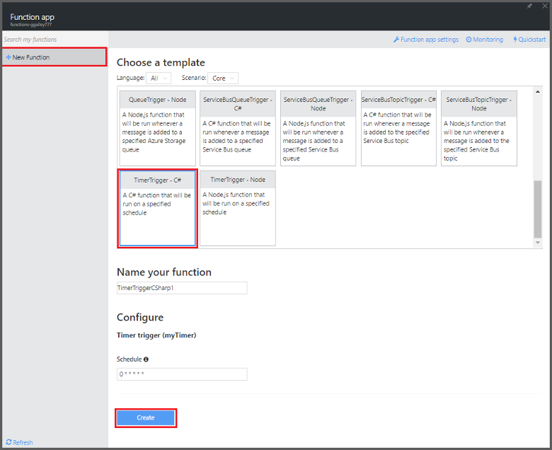
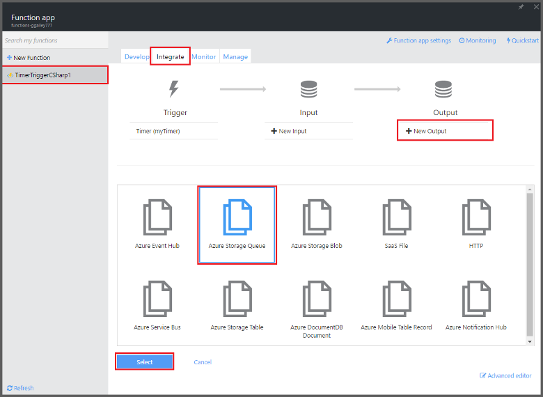
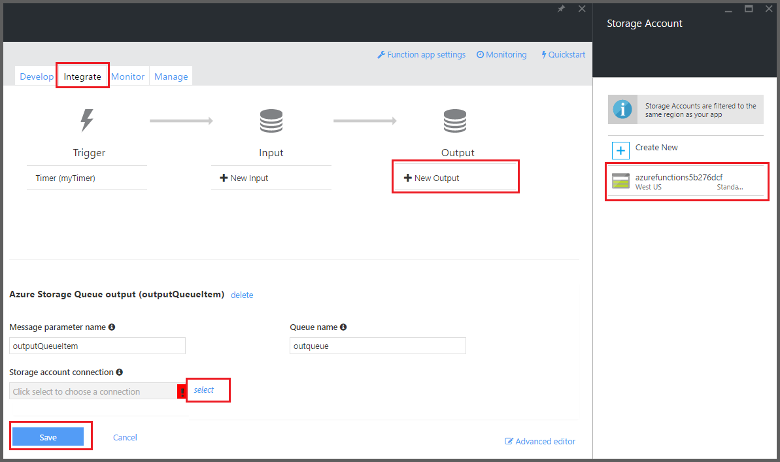

<properties
   pageTitle="Een functie voor gebeurtenisverwerking maken | Microsoft Azure"
   description="Gebruik Azure-functies om een C#-functie te maken die wordt uitgevoerd op basis van een gebeurtenistimer."
   services="azure-functions"
   documentationCenter="na"
   authors="ggailey777"
   manager="erikre"
   editor=""
   tags=""
   />

<tags
   ms.service="functions"
   ms.devlang="multiple"
   ms.topic="get-started-article"
   ms.tgt_pltfrm="multiple"
   ms.workload="na"
   ms.date="06/05/2016"
   ms.author="glenga"/>
   
# Een Azure-functie voor gebeurtenisverwerking maken

Azure Functions is een gebeurtenisafhankelijke, compute-on-demand ervaring waarmee u geplande of geactiveerde code-eenheden kunt maken voor implementatie in diverse programmeertalen. Zie [Overzicht van Azure Functions](functions-overview.md) voor meer informatie.

In dit onderwerp wordt beschreven hoe u een nieuwe functie in C# maakt die wordt uitgevoerd op basis van een gebeurtenistimer om berichten toe te voegen aan een opslagwachtrij. 

## Vereisten 

Voordat u een functie kunt maken, moet u een actief Azure-account hebben. Als u nog geen Azure-account hebt, zijn er [gratis accounts beschikbaar](https://azure.microsoft.com/free/).

## Op basis van de sjabloon een functie maken die door een timer wordt geactiveerd

Een functie-app fungeert als host voor de uitvoering van uw functies in Azure. Voordat u een functie kunt maken, moet u een actief Azure-account hebben. Als u nog geen Azure-account hebt, zijn er [gratis accounts beschikbaar](https://azure.microsoft.com/free/). 

1. Ga naar de [Azure Functions-portal](https://functions.azure.com/signin) en meld u aan met uw Azure-account.

2. Als u een bestaande functie-app hebt die u kunt gebruiken, selecteert u deze in **Uw functie-apps** en klikt u op **Openen**. Als u een nieuwe functie-app wilt maken, typt u een unieke **Naam** voor uw nieuwe functie-app of accepteert u de gegenereerde naam, selecteert u de gewenste **Regio** en klikt u op **Maken + aan de slag**. 

3. Klik in uw functie-app op **+ Nieuwe functie** > **TimerTrigger - C#** > **Maken**. Hierdoor wordt een functie met een standaardnaam gemaakt die volgens de standaardplanning eenmaal per minuut wordt uitgevoerd. 

    

4. Klik in de nieuwe functie op het tabblad **Integreren** > **Nieuwe uitvoer** > **Azure-opslagwachtrij** > **Selecteren**.

    

5. Klik in **Uitvoer Azure-opslagwachtrij** op **selecteren** naast **Storage-accountverbinding**, selecteer het bestaande Storage-account of maak een nieuw en klik vervolgens op **Opslaan**. 

    

6. Ga weer naar het tabblad **Ontwikkelen** en vervang het bestaande C#-script in het venster **Code** door de volgende code:

        using System;
        
        public static void Run(TimerInfo myTimer, out string outputQueueItem, TraceWriter log)
        {
            // Add a new scheduled message to the queue.
            outputQueueItem = $"Ping message added to the queue at: {DateTime.Now}.";
            
            // Also write the message to the logs.
            log.Info(outputQueueItem);
        }

    Deze code voegt een nieuw bericht toe aan de wachtrij met de huidige datum en tijd van de uitvoering van de functie.

7. Klik op **Opslaan** en kijk hoe in het venster **Logboeken** de volgende functie wordt uitgevoerd.

8. (Optioneel) Navigeer naar het opslagaccount en controleer of berichten aan de wachtrij worden toegevoegd.

9. Ga terug naar het tabblad **Integreren** en stel het planningsveld in op `0 0 * * * *`. De functie wordt nu één keer per uur uitgevoerd. 

Dit is een zeer vereenvoudigd voorbeeld van een timertrigger en een binding aan de uitvoer van een opslagwachtrij. Zie [Azure Functions timer trigger](functions-bindings-timer.md) (Azure Functions-timertrigger) en [Azure Functions triggers and bindings for Azure Storage](functions-bindings-storage.md) (Azure Functions-triggers en -bindingen voor Azure Storage) voor meer informatie.

##Volgende stappen

Raadpleeg de volgende onderwerpen voor meer informatie over Azure Functions.

+ [Naslaginformatie over Azure Functions voor ontwikkelaars](functions-reference.md)  
Naslaginformatie voor programmeurs over het coderen van functies en definiëren van triggers en bindingen.
+ [Azure Functions testen](functions-test-a-function.md)  
Beschrijft de verschillende hulpprogramma’s en technieken voor het testen van uw functies.
+ [Azure Functions schalen](functions-scale.md)  
Beschrijft de serviceabonnementen die beschikbaar zijn voor Azure Functions, zoals het serviceabonnement Dynamic, en helpt u bij het kiezen van het juiste abonnement.  

[AZURE.INCLUDE [Getting Started Note](../../includes/functions-get-help.md)]

<!--HONumber=ago16_HO4-->

