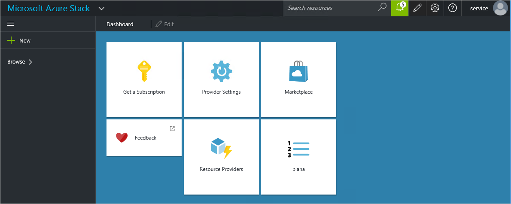
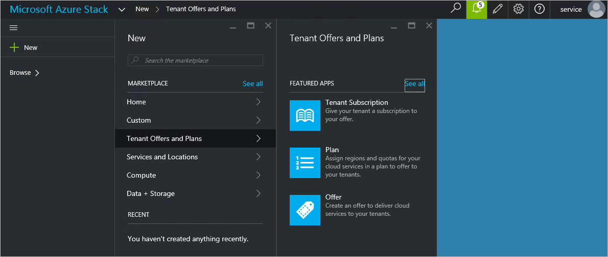
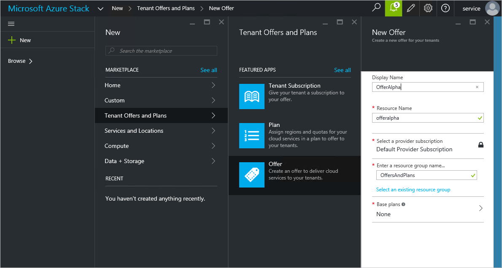
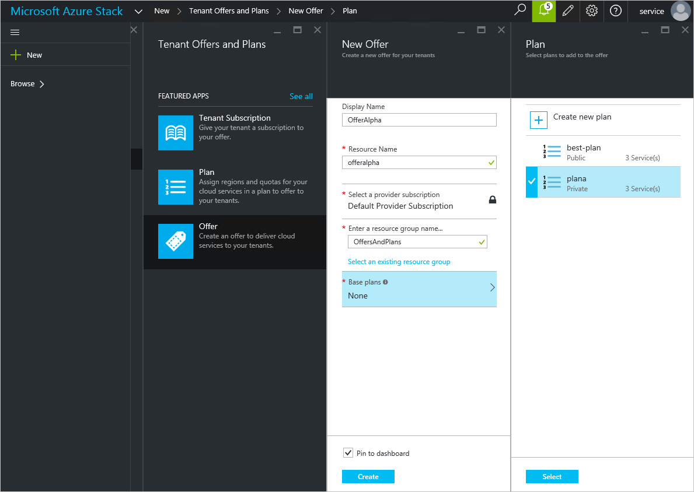
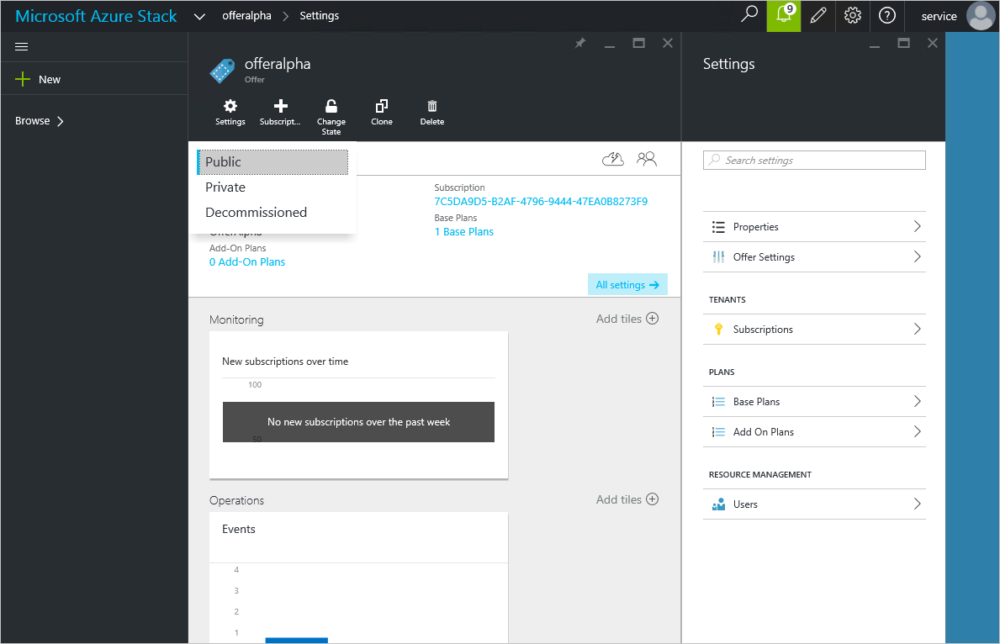

<properties
    pageTitle="Een aanbieding maken in Azure Stack | Microsoft Azure"
    description="Leer hoe u als servicebeheerder een aanbieding voor uw tenants kunt maken in Azure Stack."
    services="azure-stack"
    documentationCenter=""
    authors="ErikjeMS"
    manager="byronr"
    editor=""/>

<tags
    ms.service="azure-stack"
    ms.workload="na"
    ms.tgt_pltfrm="na"
    ms.devlang="na"
    ms.topic="get-started-article"
    ms.date="05/25/2016"
    ms.author="erikje"/>

# Een aanbieding maken in Azure Stack

[Aanbiedingen](azure-stack-key-features.md#services-plans-offers-and-subscriptions) zijn groepen met een of meer plannen die providers aan tenants bieden om te kopen (op te abonneren). In dit voorbeeld maakt u een aanbieding met het [plan dat u hebt gemaakt](azure-stack-create-plan.md) in de laatste stap. Hierdoor krijgen abonnees op de aanbieding de mogelijkheid om virtuele machines in te richten.

1.  [Meld u aan](azure-stack-connect-azure-stack.md#log-in-as-a-service-administrator) als servicebeheerder bij de portal.
    

2.  Klik op **Nieuw**.

3.  Klik op **Aanbiedingen en plannen voor tenants**. Klik vervolgens op **Aanbieding**.
    

4.  Voltooi op de blade **Nieuwe aanbieding** de volgende stappen:

    1.  Vul de velden **Weergavenaam** en **Resourcenaam** in. De weergavenaam is de beschrijvende naam van de aanbieding. Alleen de beheerder kan de resourcenaam zien. Dit is de naam die beheerders gebruiken om met de aanbieding te werken als Azure Resource Manager-resource.

    2.  Selecteer een nieuwe of bestaande **resourcegroep**.

        

5.  Klik op **Basisplannen** en selecteer op de blade **Plan** de plannen die u wilt opnemen in de aanbieding. Klik vervolgens op **Selecteren**. Klik op **Maken** om de aanbieding te maken.

    

6.  Klik op **Status wijzigen** en vervolgens op **Openbaar**.
Plannen en aanbiedingen moeten openbaar worden gemaakt om tenants een volledig overzicht te geven bij het abonneren. Als een plan privé is en de aanbieding is openbaar, kunnen tenants de aanbieding wel zien, maar geen details van het plan bekijken. Plannen en aanbiedingen kunnen een van de volgende statussen hebben:

    -   **Openbaar**: zichtbaar voor tenants.

    -   **Privé**: alleen zichtbaar voor servicebeheerders. Deze optie is handig tijdens het opstellen van het plan of de aanbieding, of als de servicebeheerder elk abonnement wil goedkeuren.

    -   **Uit bedrijf genomen**: gesloten voor nieuwe abonnees. De servicebeheerder kan Uit bedrijf genomen gebruiken om het afsluiten van toekomstige abonnementen te voorkomen, terwijl de huidige abonnementen ongewijzigd blijven.

    

Wijzigingen in het plan of de aanbieding zijn niet meteen zichtbaar voor de tenant. Als u de wijzigingen zichtbaar wilt maken, moet de status van het abonnement InSync zijn. Vervolgens moet de tenant de portal vernieuwen of zich aanmelden/afmelden.

Zelfs nadat er een extra abonnement is gemaakt en deze de status InSync heeft gekregen, moet u zich mogelijk afmelden/aanmelden om het nieuwe abonnement weer te geven in de Abonnementskiezer bij het maken van nieuwe resources/resourcegroepen.

## Volgende stappen

[Abonneren op een aanbieding en vervolgens een virtuele machine inrichten](azure-stack-subscribe-plan-provision-vm.md)

<!--HONumber=Sep16_HO3-->

