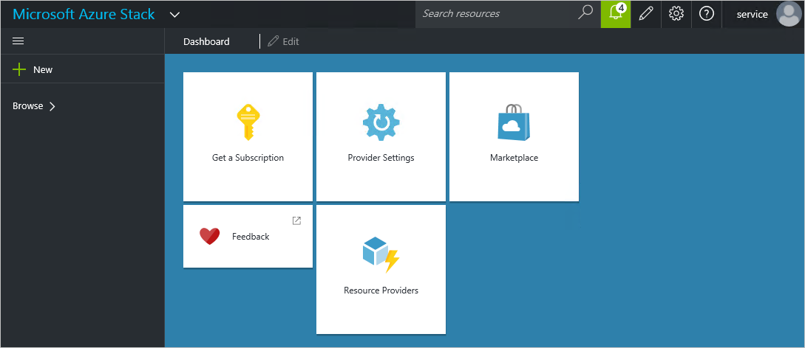
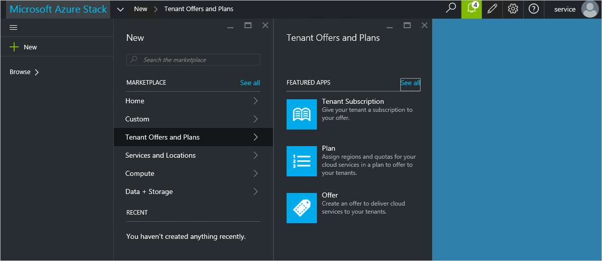
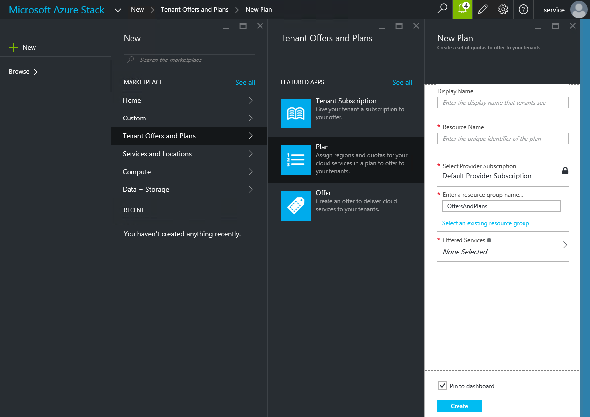
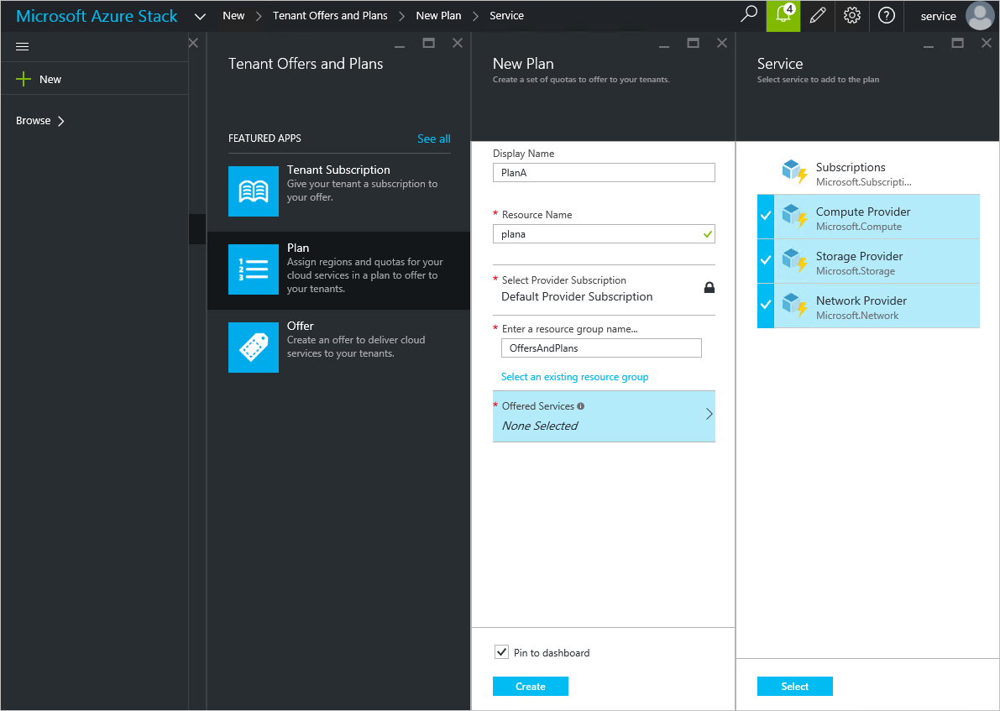
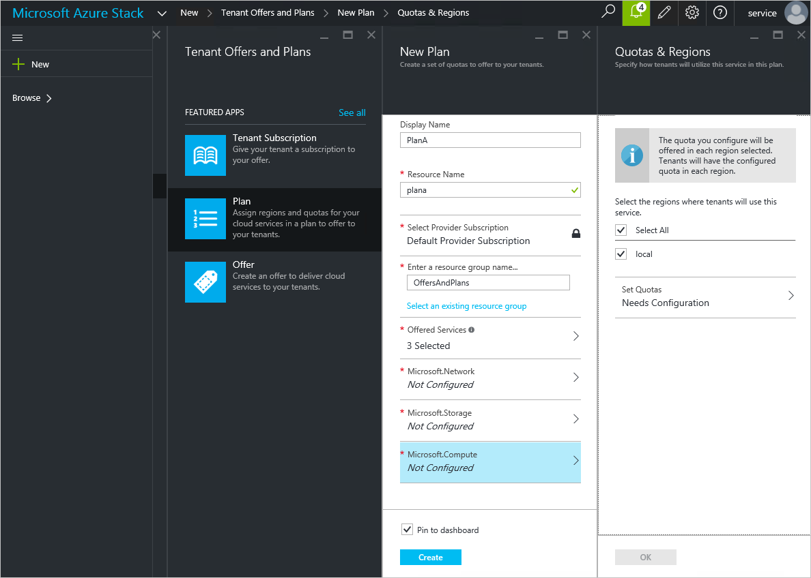
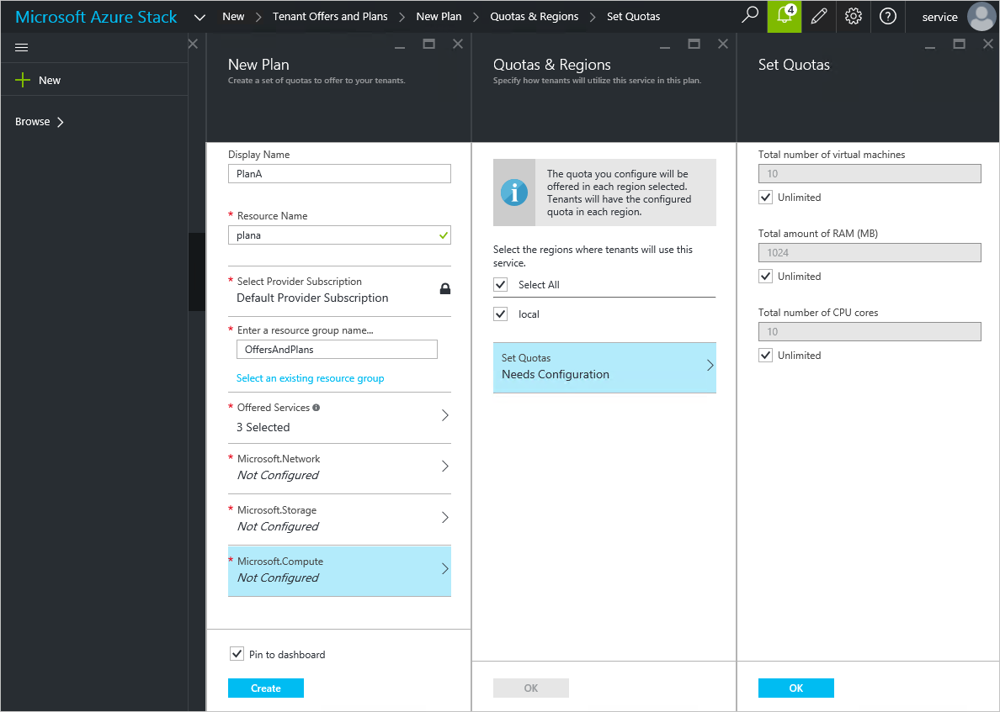
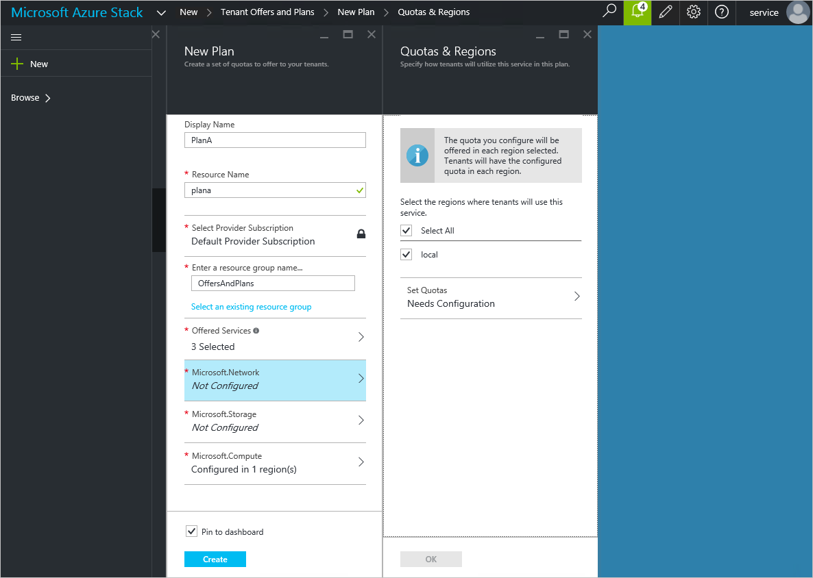
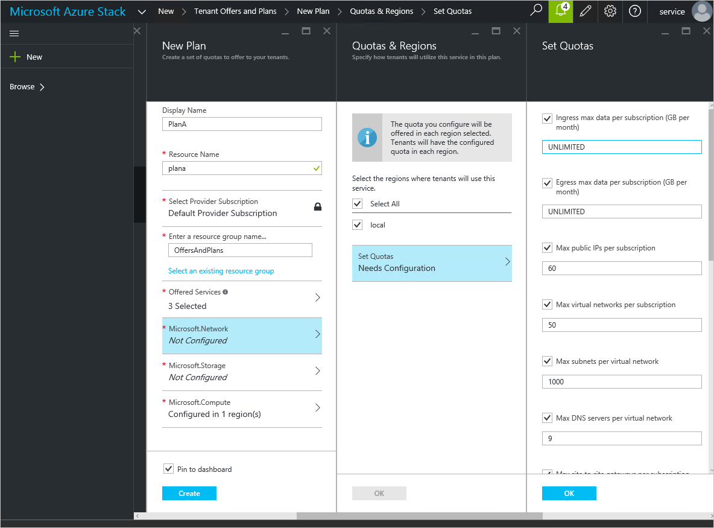
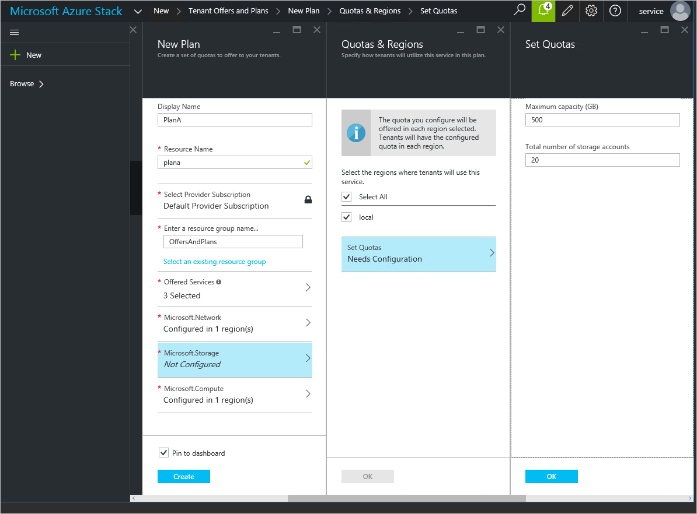
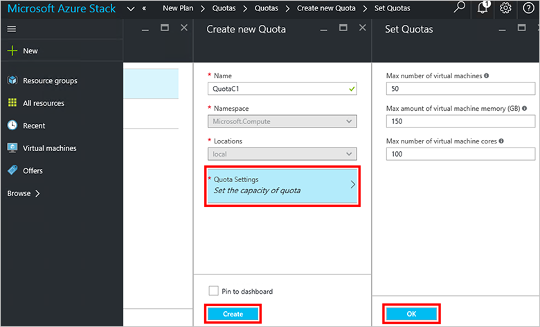

<properties
    pageTitle="Een plan maken in Azure Stack | Microsoft Azure"
    description="Maak als servicebeheerder een plan waarmee abonnees virtuele machines kunnen inrichten."
    services="azure-stack"
    documentationCenter=""
    authors="ErikjeMS"
    manager="byronr"
    editor=""/>

<tags
    ms.service="azure-stack"
    ms.workload="na"
    ms.tgt_pltfrm="na"
    ms.devlang="na"
    ms.topic="get-started-article"
    ms.date="08/15/2016"
    ms.author="erikje"/>

# Een plan maken in Azure Stack

[Plannen](azure-stack-key-features.md#services-plans-offers-and-subscriptions) zijn pakketten van één of meer services. Als provider kunt u plannen maken die u aan uw tenants kunt aanbieden. Tenants abonneren zich op hun beurt op uw aanbiedingen om de plannen en bijbehorende services te gebruiken. In dit voorbeeld maakt u een plan met de resourceproviders Compute, Netwerk en Opslag. Hierdoor krijgen abonnees van dit plan de mogelijkheid om virtuele machines in te richten.

1.  Navigeer in een internetbrowser naar https://portal.azurestack.local.

2.  [Meld u aan](azure-stack-connect-azure-stack.md#log-in-as-a-service-administrator) bij de Azure Stack-portal als servicebeheerder en geef uw aanmeldingsgegevens op (dit is het account dat u hebt gemaakt in stap 5 van het gedeelte [Het PowerShell-script uitvoeren](azure-stack-run-powershell-script.md)). Klik vervolgens op **Aanmelden**.

    Servicebeheerders kunnen aanbiedingen en plannen maken en gebruikers beheren.

3.  Klik op **Nieuw** om een plan en aanbieding te maken waarop tenants zich kunnen abonneren.

    

4.  Klik in de blade Maken op **Aanbiedingen en plannen voor tenants** en klik vervolgens op **Plan**.

    

5.  Vul de velden **Weergavenaam** en **Resourcenaam** in. De Weergavenaam is de beschrijvende naam van het plan. Alleen de beheerder kan de Resourcenaam zien. Dit is de naam die beheerders gebruiken om met het plan te werken als een Azure Resource Manager-resource.

    

6.  Selecteer een **Resourcegroep** of maak een nieuwe als een container voor het plan. Standaard worden alle plannen en aanbiedingen in een resourcegroep met de naam OffersAndPlans geplaatst.

7.  Klik op **Aangeboden services**, gebruik de Shift-toets om alle drie de providers te selecteren (**Compute-provider**, **Opslagprovider** en **Netwerkprovider**) en klik vervolgens op **Selecteren**.

    

8.  Klik op **Microsoft.Compute** en klik vervolgens op **Configuratie vereist**.

    

9.  Accepteer alle standaardinstellingen in de blade **Quota instellen**, klik op **OK** en klik vervolgens opnieuw op **OK**.

    

10. Klik op **Microsoft.Network** en klik vervolgens op **Configuratie vereist**.

    

11. Selecteer alle selectievakjes in de blade **Quota instellen**, klik op **OK** en klik vervolgens opnieuw op **OK**.

    

12. Klik op **Microsoft.Storage** en klik op **Configuratie vereist**. Accepteer vervolgens alle standaardinstellingen in de blade **Quota instellen**, klik op **OK**, klik opnieuw op **OK** en klik vervolgens op **Maken** om het plan te maken.

    

13. Uw plan kan nu worden opgenomen in een aanbieding. Geef meldingen weer door te klikken op de bel rechtsboven.

    

## Volgende stappen

[Een aanbieding maken](azure-stack-create-offer.md)

<!--HONumber=Sep16_HO3-->

