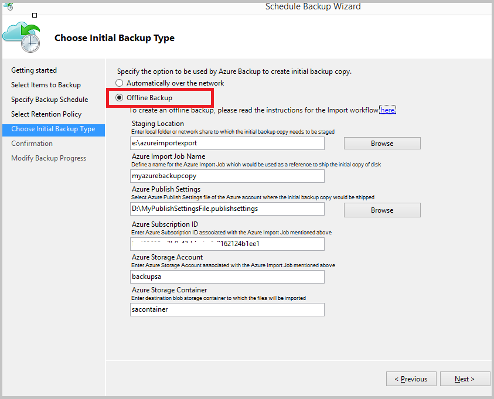
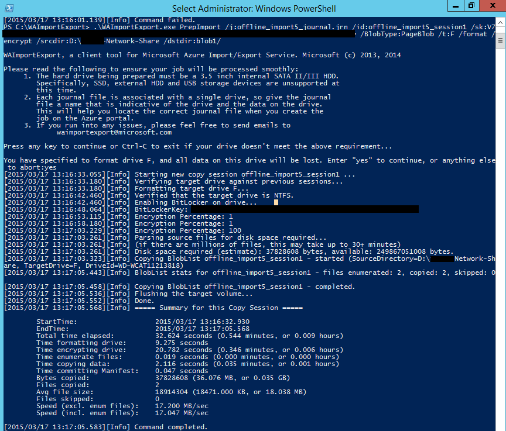
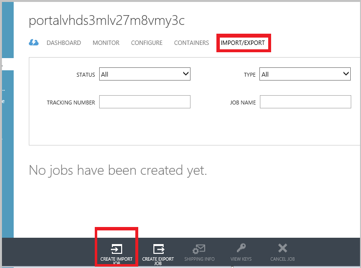
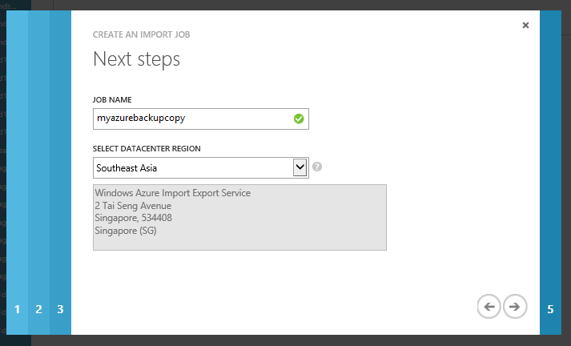

<properties
   pageTitle="Azure Backup - Offline Backup or Initial Seeding using Azure Import/Export Service | Microsoft Azure"
   description="Learn how Azure Backup enables you to send data off the network using Azure Import/Export service. This article explains the offline seeding of the initial backup data by using the Azure Import Export service"
   services="backup"
   documentationCenter=""
   authors="aashishr"
   manager="shreeshd"
   editor=""/>
<tags
   ms.service="backup"
   ms.devlang="na"
   ms.topic="article"
   ms.tgt_pltfrm="na"
   ms.workload="storage-backup-recovery"
   ms.date="11/25/2015"
   ms.author="aashishr"; "jimpark"/>

# Offline Backup workflow in Azure Backup

Azure Backup is deeply integrated with the Azure Import/Export service which enables you to transfer initial backup data quickly. If you have TBs of initial backup data that needs to be transferred over a high latency & low bandwidth network, you can use the Azure Import/Export service to ship the initial backup copy on one or more hard drives to an Azure data center. This article provides an overview of the steps required to complete this workflow.

## Overview

With Azure Backup and Azure Import/Export, it is simple and straightforward to upload the data to Azure offline through disks. Instead of transferring the initial full copy over the network, the backup data is written to a *staging location*. The staging location can be a direct attached storage or a network share. Once the initial copy is completed, using the *Azure Import/Export tool*, this data is written to a SATA drive which is eventually shipped to the Azure data center. Depending on the size of the initial backup, one or more SATA drives may be required to complete this operation. The Azure Import/Export tool accounts for these scenarios. After the backups are written to the disk, they can be shipped to the nearest data center location for uploading to Azure. Azure Backup then copies the backup data to the backup vault and the incremental backups are scheduled.

## Prerequisites

1. It is important to familiarize yourself with the Azure Import export workflow which is listed [here](../storage-import-export-service.md).
2. Before initiating the workflow, ensure that a Azure Backup vault has been created, vault credentials have been downloaded, Azure Backup agent has been installed on either your Windows Server/Windows Client or System Center Data Protection Manager (SCDPM) server and that the machine is registered with the Azure Backup vault.
3. Download the Azure Publish file settings from [here](https://manage.windowsazure.com/publishsettings) on the machine from which you plan to backup our data.
4. Prepare a *staging location* which could be a network share or additional drive on the machine. Ensure that the staging location has enough disk space to hold your initial copy. For example, if you are trying to backup a 500GB file server, ensure that the staging area is at least 500GB (though a lesser amount will be used). The staging area is 'transient storage' and is used temporarily during this workflow.
5. External SATA drive writer and an external 3.5 Inch SATA drive. Only 3.5 inch SATA II/III hard drives are supported for use with the Import/Export service. Hard drives larger than 6TB are not supported. You can attach a SATA II/III disk externally to most computers using a SATA II/III USB Adapter. Check the Azure Import/Export documentation for the latest set of drives which are supported by the service.
6. Enable BitLocker on the machine to which the SATA drive writer is connected.
7. Download the Azure Import/Export tool from [here](http://go.microsoft.com/fwlink/?LinkID=301900&clcid=0x409) to the machine to which the SATA drive writer is connected.

## Workflow
The information provided in this section is for completing the **Offline Backup** workflow so your data can be delivered to an Azure data center and uploaded to Azure storage. If you have questions about the Import service or any aspect of the process, see the [Import service overview](../storage-import-export-service.md) documentation referenced above.

### Initiate Offline Backup

1. As part of scheduling a backup, you will encounter the following screen (in Windows Server, Windows client or SCDPM).

    

    The coresponding screen in SCDPM looks as follows.  
    

    where:

    - **Staging Location** - This refers to the temporary storage location to which the initial backup copy is written. This could be on a network share or on the local machine.
    - **Azure Import Job Name** - As part of completing this workflow, you will need to create an *Import job* in the Azure portal (covered in the later part of the document). Provide an input which you plan to use later in the Azure portal as well.
    - **Azure Publish Settings** - This is an XML file which contains information about your subscription profile. It also contains secure credentials associated to your subscription. The file can be downloaded from [here](https://manage.windowsazure.com/publishsettings). Provide the local path to the publish settings file.
    - **Azure Subscription ID** - Provide the Azure subscription id in which you plan to initiate the Azure Import job. If you have multiple Azure subscriptions, use the ID associated with the Import job.
    - **Azure Storage Account** - Enter the name of the Azure storage account that will be associated with this Import job.
    - **Azure Storage Container** - Enter the name of the destination storage blob where this job’s data will be imported.

2. Complete the workflow and select **Backup Now** in the Azure Backup mmc to initiate the offline backup copy. The initial backup is written to the staging area as part of this step.

    

    The corresponding workflow in SCDPM is enabled by clicking on the **Protection Group** and choosing the **Create recovery point** option. This is followed by choosing the **Online Protection** option.

    

    Once the operation completes, an *.AIBBlob* and *.BaseBlob* file is created in the staging location.

    

### Prepare SATA drive

1. Download the [Microsoft Azure Import/Export Tool](http://go.microsoft.com/fwlink/?linkid=301900&clcid=0x409) to the *copy machine*. Ensure that the staging location (in the previous step) is accessible from the machine in which you plan to run the next set of commands. If required, the copy machine can be the same as the source machine.

2. Unzip the *WAImportExport.zip* file. Run the *WAImportExport* tool  that will format the SATA drive, write the backup data to the SATA drive, and encrypt it. Before running the following command ensure that BitLocker is enabled on the machine.  

    *.\WAImportExport.exe PrepImport /j:<*JournalFile*>.jrn /id: <*SessionId*> /sk:<*StorageAccountKey*> /BlobType:**PageBlob** /t:<*TargetDriveLetter*> /format /encrypt /srcdir:<*staging location*> /dstdir: <*DestinationBlobVirtualDirectory*>/*

| Parameter | Description
|-------------|-------------|
| /j:<*JournalFile*>| The path to the journal file. Each drive must have exactly one journal file. Note that the journal file must not reside on the target drive. The journal file extension is .jrn and is created as part of running this command.|
|/id:<*SessionId*> | The session ID identifies a *copy session*. It is used to ensure accurate recovery of an interrupted copy session. Files that are copied in a copy session are stored in a directory named after the session ID on the target drive.|
| /sk:<*StorageAccountKey*> | The account key for the storage account to which the data will be imported. |
| /BlobType | Specify **PageBlob**, this workflow will succeed only if the PageBlob option is specified. This is not the default option and should be mentioned in this command. |
|/t:<*TargetDriveLetter*> | The drive letter of the target hard drive for the current copy session, without the trailing colon.|
|/format | Specify this parameter when the drive needs to be formatted; otherwise, omit it. Before the tool formats the drive, it will prompt for a confirmation from console. To suppress the confirmation, specify the /silentmode parameter.|
|/encrypt | Specified this parameter when the drive has not yet been encrypted with BitLocker and needs to be encrypted by the tool. If the drive has already been encrypted with BitLocker, then omit this parameter and specify the /bk parameter, providing the existing BitLocker key. If you specify the /format parameter, then you must also specify the /encrypt parameter. |
|/srcdir:<*SourceDirectory*> | The source directory that contains files to be copied to the target drive. The directory path must be an absolute path (not a relative path).|
|/dstdir:<*DestinationBlobVirtualDirectory*> | The path to the destination virtual directory in your Microsoft Azure storage account. Be sure to use valid container names when specifying destination virtual directories or blobs. Keep in mind that container names must be lowercase.|

  > [AZURE.NOTE] A journal file is created in the WAImportExport folder that captures the entire information of the workflow. You will need this file when creating an import job in the Azure portal.

  

### Create Import Job in Azure portal
1. Navigate to your storage account in the [Management Portal](https://manage.windowsazure.com/), and click on **Import/Export** and then on **Create Import Job** in the task pane.

    

2. In Step 1 of the wizard, indicate that you have prepared your drive and that you have the drive journal file available. In Step 2 of the wizard, provide contact information for the person responsible for this import job.
3. In Step 3, upload the drive journal files that you obtained during the previous section.
4. In Step 4, enter a descriptive name for the import job. Note that the name you enter may contain only lowercase letters, numbers, hyphens, and underscores, must start with a letter, and may not contain spaces. You'll use the name you choose to track your jobs while they are in progress and once they are completed.
5. Next, select your data center region from the list. The data center region will indicate the data center and address to which you must ship your package.

    

6. In Step 5, select your return carrier from the list, and enter your carrier account number. Microsoft will use this account to ship your drives back to you once your import job is complete.

7. Ship the disk and enter the tracking number to track the status of the shipment. Once the disk arrives in the datacenter, it is copied to the storage account and the status is updated.

    

### Completing the workflow
Once the initial backup data is available in your storage account, the Azure Backup agent copies the contents of the data from this account to the multi-tenanted backup storage account. In the next schedule backup time, the Azure Backup agent performs the incremental backup over the initial backup copy.

## Next Steps
- For any questions on the Azure Import/Export workflow, please refer to this [article](../storage-import-export-service.md).
- Refer to the Offline Backup section of the Azure Backup [FAQ](backup-azure-backup-faq.md) for any questions about the workflow

