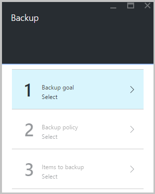
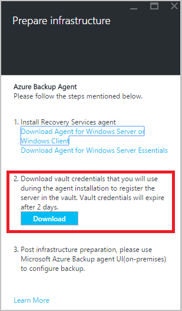

<properties
   pageTitle="Leer hoe u een back-up maakt van bestanden en mappen in Windows naar Azure met Azure Backup aan de hand van het Resource Manager-implementatiemodel | Microsoft Azure"
   description="Leer hoe u een back-up maakt van Windows Server-gegevens door het maken van een kluis, het installeren van de Recovery Services-agent en door een back-p van te maken van uw bestanden en mappen in Azure."
   services="backup"
   documentationCenter=""
   authors="markgalioto"
   manager="cfreeman"
   editor=""
   keywords="hoe een back-up maken; back-up maken"/>

<tags
   ms.service="backup"
   ms.workload="storage-backup-recovery"
   ms.tgt_pltfrm="na"
   ms.devlang="na"
   ms.topic="hero-article"
   ms.date="09/27/2016"
   ms.author="markgal;"/>

# Eerste blik: een back-up maken van bestanden en mappen in Azure Backup met behulp van het Resource Manager-implementatiemodel

In dit artikel wordt uitgelegd hoe u een back-up maakt van bestanden en mappen op uw Windows Server (of Windows-client) in Azure met behulp van de Resource Manager van Azure Backup. Het artikel is bedoeld als handleiding waarmee u stapsgewijs de basis onder de knie krijgt. Als u met Azure Backup wilt leren werken, bent u hier op de goede plek.

Als u meer wilt weten over Azure Backup, lees dan dit [overzicht](backup-introduction-to-azure-backup.md).

Voor het maken van back-ups van bestanden en mappen in Azure moet u de volgende stappen doorlopen:

 Neem een Azure-abonnement (indien u nog geen abonnement hebt). 
 Maak een Recovery Services-kluis. 
 Download de benodigde bestanden. 
 Installeer en registreer de Recovery Services Agent. 
 Maak een back-up van uw bestanden en mappen.

## Stap 1: Neem een abonnement op Azure

Als u nog geen abonnement op Azure hebt, maak dan een [gratis account](https://azure.microsoft.com/free/) aan waarmee u toegang hebt tot alle services van Azure.

## Stap 2: Maak een Recovery Services-kluis

Als u een back-up wilt maken van uw bestanden en mappen, moet u een Recovery Services-kluis maken in de regio waar u de gegevens wilt opslaan. U moet ook bepalen op welke manier u uw opslag wilt repliceren. 

### Een Recovery Services-kluis maken

1. Meld u met uw Azure-abonnement aan bij de [Azure Portal](https://portal.azure.com/) als u dat nog niet hebt gedaan.

2. Klik in het menu Hub op **Bladeren**, typ in de lijst met resources **Recovery Services** en klik vervolgens op **Recovery Services-kluizen**.

      

3. Klik in het menu **Recovery Services-kluizen** op **Toevoegen**.

    

    De blade Recovery Services-kluis wordt geopend en u wordt gevraagd een **naam**, **abonnement**, **resourcegroep** en **locatie** in te voeren.

    

4. Voer bij **Naam** een beschrijvende naam in om de kluis aan te duiden.

5. Klik op **Abonnement** om de lijst met beschikbare  abonnementen te bekijken.

6. Klik op **Resourcegroep** om de lijst met beschikbare resourcegroepen te bekijken of klik op **Nieuw** om een nieuwe resourcegroep te maken.

7. Klik op **Locatie** om de geografische regio voor de kluis te selecteren. Deze keuze bepaalt de geografische regio waar uw back-upgegevens naartoe worden verzonden.

8. Klik op **Create**.

    Als u uw kluis niet in de lijst ziet nadat u deze hebt gemaakt, klik dan op **Vernieuwen**. Wanneer de lijst is vernieuwd, klikt u op de naam van de kluis.

### De redundantie van de opslag bepalen
Als u voor het eerst een Recovery Services-kluis maakt, bepaalt u hoe uw opslag wordt gerepliceerd.

1. Klik op de nieuwe kluis om het dashboard te openen.

2. In de blade **Instellingen**, die automatisch ook wordt geopend wanneer u het dashboard van de kluis opent, klikt u **Back-upinfrastructuur**.

3. In de blade Back-upinfrastructuur klikt u op **Back-upconfiguratie** om het **Opslagreplicatietype** te bekijken.

    

4. Kies het type opslagreplicatie dat geschikt is voor uw kluis.

    

    Uw kluis heeft standaard geografisch redundante opslag. Als Azure uw primaire eindpunt is voor back-upopslag, blijf dan geografisch redundante opslag gebruiken. Als Azure niet uw primaire eindpunt voor back-upopslag is, kies dan lokaal redundante opslag. Hiermee zijn de kosten voor het opslaan van gegevens in Azure lager. U vindt meer informatie over de opties voor [geografisch redundante](../storage/storage-redundancy.md#geo-redundant-storage) en [lokaal redundante ](../storage/storage-redundancy.md#locally-redundant-storage) opslag in dit [overzicht](../storage/storage-redundancy.md).

Wanneer u eenmaal een kluis hebt gemaakt, kunt u uw infrastructuur gaan voorbereiden voor het maken van back-ups van bestanden en mappen. Download hiervoor de Microsoft Azure Recovery Service-agent en de kluisreferenties.

## Stap 3 - Bestanden downloaden

1. Klik op **Instellingen** op het dashboard van de Recovery Services-kluis.

    

2. Klik op **Aan de slag > Back-up** op de blade Instellingen.

    

3. Klik op **Back-updoelstelling** op de blade Back-up.

    

4. Selecteer **On-premises** in het menu Waar wordt uw workload uitgevoerd?

5. Selecteer **Bestanden en mappen** in het menu Waarvan wilt u een back-up maken? en klik op vervolgens op **OK**.

### De Recovery Services-agent downloaden

1. Klik op **Agent voor Windows Server of Windows Client downloaden** in de blade **Infrastructuur voorbereiden**.

    

2. Klik op **Opslaan** in het downloadpop-upvenster. Standaard wordt het bestand **MARSagentinstaller.exe** opgeslagen in de map Downloads.

### Kluisreferenties downloaden

1. Klik op **Download > Opslaan** op de blade Infrastructuur voorbereiden.

    

## Stap 4 - De agent installeren en registreren

>[AZURE.NOTE] Het maken van back-ups via de Azure Portal is binnenkort beschikbaar. Op dit moment kunt u on-premises met de Microsoft Azure Recovery Services Agent back-ups maken van uw bestanden en mappen.

1. Zoek en dubbelklik op **MARSagentinstaller.exe** in de map Downloads (of een andere locatie waar het bestand is opgeslagen).

2. Doorloop de installatiewizard van de Microsoft Azure Recovery Services Agent. Om de wizard volledig door te kunnen lopen, moet u:

    - Een locatie voor de installatie en de cachemap kiezen.
    - De informatie van uw proxyserver invoeren als u een proxyserver gebruikt om verbinding te maken met internet.
    - Uw gebruikersnaam en wachtwoord invoeren als u gebruikmaakt van een geverifieerde proxyserver.
    - De gedownloade kluisreferenties invoeren
    - De wachtwoordzin voor de versleuteling op een veilige locatie opslaan.

    >[AZURE.NOTE] Als u de wachtwoordzin kwijtraakt of vergeet, kan Microsoft u niet helpen om de back-upgegevens te herstellen. Sla het bestand daarom op een veilige locatie op. Het is verplicht om een back-up te herstellen.

De agent wordt nu geïnstalleerd en uw computer wordt geregistreerd bij de kluis. U kunt nu uw back-up configureren en plannen.

## Stap 5: Maak een back-up van uw bestanden en mappen

Als u voor het eerst een back-up maakt, moet u twee belangrijke taken uitvoeren:

- De back-up plannen
- Voor de eerste keer een back-up maken van bestanden en mappen

U dient de Microsoft Azure Recovery Services-agent te gebruiken voor het uitvoeren van de eerste back-up.

### De back-up plannen

1. Open de Microsoft Azure Recovery Services-agent. U vindt deze door te zoeken naar **Microsoft Azure Backup** op uw machine.

    

2. Klik in de Recovery Services-agent op **Back-up plannen**.

    

3. Op de pagina Aan de slag van de wizard Back-up plannen klikt u op **Volgende**.

4. Op de pagina Items selecteren voor back-up klikt u op **Items toevoegen**.

5. Selecteer de bestanden en mappen waarvan u een back-up wilt maken en klik op **OK**.

6. Klik op **Volgende**.

7. Op de pagina **Back-upschema specificeren** voert u het **back-upschema** in en klikt u op **Volgende**.

    U kunt dagelijkse back-ups (maximaal drie keer per dag en wekelijkse back-ups plannen.

    

    >[AZURE.NOTE] Zie het artikel [Uw tape-infrastructuur vervangen met Azure Backup](backup-azure-backup-cloud-as-tape.md) voor meer informatie over hoe u een back-upschema moet invoeren.

8. Op de pagina **Retentiebeleid selecteren** selecteert het de **Retentiebeleid** voor de kopie van de back-up.

    In het retentiebeleid staat hoe lang de back-up zal worden bewaard. In plaats van alleen 'plat beleid' voor alle back-uppunten op te geven kunt u een ander retentiebeleid opgeven op basis van wanneer de back-up plaatsvindt. U kunt het dagelijkse, wekelijkse, maandelijkse en jaarlijkse retentiebeleid aanpassen, zodat het beleid altijd is afgestemd op uw behoeften.

9. Op de pagina Type voor eerste back-up kiezen kiest u het type voor de eerste back-up. Laat de optie **Automatisch via het netwerk** aangevinkt staan en klik vervolgens op **Volgende**.

    U kunt automatisch via het netwerk of offline back-ups maken. In het laatste deel van dit artikel wordt het proces voor automatische back-ups beschreven. Als u liever offline back-ups maakt, lees dan het artikel [Werkstroom voor offline back-up in Azure Backup](backup-azure-backup-import-export.md) voor meer informatie.

10. Lees de informatie op de pagina Bevestiging en klik vervolgens op **Voltooien**.

11. Nadat u de wizard voor het maken van een back-upschema hebt doorlopen, klikt u op **Sluiten**.

### Voor de eerste keer een back-up maken van bestanden en mappen

1. Klik in de Recovery Services-agent op **Nu een back-up maken** om de eerste seeding via het netwerk te voltooien.

    

2. Controleer op de pagina Bevestiging de instellingen die de wizard Nu back-up maken gebruikt om een back-up te maken van de machine. Klik vervolgens op **Back-up maken**.

3. Klik op **Sluiten** om de wizard te sluiten. Als u dit doet voordat het back-upproces is voltooid, blijft de wizard op de achtergrond aanwezig.

Nadat de eerste back-up is voltooid, wordt de status **Taak voltooid** weergegeven in de back-upconsole.

## Vragen?
Als u vragen hebt of als er een functie is die u graag opgenomen ziet worden, [stuur ons dan uw feedback](http://aka.ms/azurebackup_feedback).

## Volgende stappen
- Meer informatie over [back-ups maken van Windows-machines](backup-configure-vault.md).
- Wanneer u eenmaal een back-up hebt gemaakt van uw bestanden en mappen, kunt u [uw kluizen en servers beheren](backup-azure-manage-windows-server.md).
- Als u een back-up moet herstellen, [zet de bestanden dan terug naar een Windows-machine](backup-azure-restore-windows-server.md) aan de hand van dit artikel.

<!--HONumber=Sep16_HO4-->

