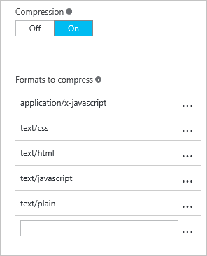

<properties 
    pageTitle="CDN - Improve performance by compressing files" 
    description="You can improve file transfer speed and increases page load performance by compressing your files." 
    services="cdn" 
    documentationCenter=".NET" 
    authors="camsoper" 
    manager="dwrede" 
    editor=""/>

<tags 
    ms.service="cdn" 
    ms.workload="tbd" 
    ms.tgt_pltfrm="na" 
    ms.devlang="na" 
    ms.topic="article" 
    ms.date="12/02/2015" 
    ms.author="casoper"/>

# Improve performance by compressing files

This topic discusses how to improve file transfer speed and increase page load performance by compressing your files.

There are two ways CDN can support compression: 

- You can enable compression on your origin server, in which case the CDN will support compression by default and deliver compressed files to clients. 
- You can enable compression directly on CDN edge servers, in which case the CDN will compress the files and serve it to end users.

## Enabling compression

> [AZURE.NOTE] The Standard and Premium CDN tiers provide the same compression functionality, but the user interface differs.  For more information about the differences between Standard and Premium CDN tiers, see [Azure CDN Overview](cdn-overview.md).

### Standard tier

1. From the CDN profile blade, click the CDN endpoint you wish to manage.
    
    

    The CDN endpoint blade opens.

2. Click the **Configure** button.

    
    
    The CDN Configuration blade opens.
    
3. Turn on **Compression**.
    
    
    
4. Use the default types, or modify the list by removing or adding file types.

5. After making your changes, click the **Save** button.

### Premium tier

1. From the CDN profile blade, click the **Manage** button.

    
    
    The CDN management portal opens.
    
2. Hover over the **HTTP Large** tab, then hover over the **Cache Settings** flyout.  Click on **Compression**.
    
    Compression options are displayed.
    
    
    
3. After modifying the list of file types, click the **Update** button.

## Compression process and rules

1. Requester sends a request for content.
2. An edge server checks whether there is **Accept-Encoding** header.
    1. If included, this header identifies the requested compression method.
    1. If missing, this type of request will be served in an uncompressed format.
3.  The closest edge POP checks the cache status, compression method and if it still has a valid time-to-live.
    1.  Cache Miss:  if the requested version is not cached, the request is forwarded to the origin.
    2.  Cache HIT with same compression method: The edge server will immediately deliver the compressed content to the client.
    3.  Cache HIT with different compression method: The edge server will transcode the asset to the requested compression method. 
    4.  Cache HIT and uncompressed : if the initial request caused the asset to be cached in an uncompressed format, then a check will be performed to see whether the request is eligible for edge server compression (based on the criteria in the definition/requirement section above.)
        1.  If eligible, the edge server will compress the file and serve it to the client.
        2.  If not eligible: the edge server will immediately deliver the uncompressed content to the client. 

## Considerations 

1. For Media Services CDN enabled streaming endpoints, compression is enabled by default for the following content types: application/vnd.ms-sstr+xml, application/dash+xml,application/vnd.apple.mpegurl, application/f4m+xml. You cannot enable/disable compression for the mentioned types using the Azure portal.  
2. Only one file version (compressed or uncompressed) will be cached on the edge server. A request for a different version will result in the content being transcoded by the edge server.  
