<properties
   pageTitle="Azure Data Catalog - aan de slag met Data Catalog | Microsoft Azure"
   description="End-to-end zelfstudie waarin de scenario's en mogelijkheden van Azure Data Catalog worden gepresenteerd."
   documentationCenter=""
   services="data-catalog"
   authors="steelanddata"
   manager=""
   editor=""
   tags=""/>
<tags
   ms.service="data-catalog"
   ms.devlang="NA"
   ms.topic="get-started-article"
   ms.tgt_pltfrm="NA"
   ms.workload="data-catalog"
   ms.date="05/06/2016"
   ms.author="maroche"/>

# Aan de slag met Azure Data Catalog

Dit artikel is een end-to-end zelfstudie waarin de scenario's en mogelijkheden van **Azure Data Catalog** worden gepresenteerd. Als u zich voor de service hebt aangemeld, volgt u deze stappen om een gegevenscatalogus te maken en gegevensbronnen te registeren, annoteren en detecteren.

## Vereisten voor de zelfstudie

Voordat u met deze zelfstudie begint, moet u beschikken over het volgende:

- **Een abonnement op Azure** - als u geen abonnement hebt, kunt u binnen een paar minuten een gratis proefaccount maken. Zie [Gratis proefversie](https://azure.microsoft.com/pricing/free-trial/) voor meer informatie.
- **Azure Active Directory** - Azure Data Catalog gebruikt [Azure Active Directory](https://azure.microsoft.com/services/active-directory/) voor identiteits- en toegangsbeheer.
- **Gegevensbronnen** - Azure Data Catalog bevat mogelijkheden voor het detecteren van gegevensbronnen. In deze zelfstudie wordt de voorbeelddatabase van Adventure Works gebruikt, maar u kunt elke ondersteunde gegevensbron gebruiken als u liever wilt werken met gegevens die vertrouwd en relevant zijn voor uw rol. Zie voor een lijst met ondersteunde gegevensbronnen [Ondersteunde gegevensbronnen](data-catalog-dsr.md).

> [AZURE.NOTE] Raadpleeg voor meer informatie over Azure-abonnementen en Azure Active Directory [Vereisten voor Azure Data Catalog](data-catalog-prerequisites.md).

Laten we beginnen met het installeren van de voorbeelddatabase van Adventure Works.

## Oefening 1: de voorbeelddatabase van Adventure Works installeren

In deze oefening installeert u het voorbeeld van Adventure Works voor SQL Server Database Engine. Dit wordt gebruikt in de volgende oefeningen.

### De Adventure Works 2014 OLTP-database installeren

De database van Adventure Works ondersteunt standaardscenario’s voor het verwerken van online transacties van een fictieve fietsfabrikant (Adventure Works Cycles), met inbegrip van producten, verkoop en inkoop. In deze zelfstudie registreert u informatie over producten in **Azure Data Catalog**.

U installeert de voorbeelddatabase van Adventure Works als volgt.

Voor het installeren van de voorbeelddatabase van Adventure Works kunt u een back-up van AdventureWorks2014 herstellen, die zich bevindt in [Adventure Works 2014 Full Database Backup.zip](https://msftdbprodsamples.codeplex.com/downloads/get/880661) op CodePlex. Een manier om de database te herstellen is het uitvoeren van een T-SQL-script in SQL Server Management Studio.

**De voorbeelddatabase van Adventure Works installeren via een T-SQL-script**

1.  Maak een map met de naam C:\DataCatalog_GetStarted. Als u een andere mapnaam gebruikt, zorg er dan voor dat u het pad in het onderstaande T-SQL-script wijzigt.
2.  Download [Adventure Works 2014 Full Database Backup.zip](https://msftdbprodsamples.codeplex.com/downloads/get/880661).
3.  Pak Adventure Works 2014 Full Database Backup.zip uit in C:\DataCatalog_GetStarted. In het onderstaande script wordt ervan uitgegaan dat het back-upbestand zich bevindt in C:\DataCatalog_GetStarted\Adventure Works 2014 Full Database Backup\AdventureWorks2014.bak.
4.  Klik in **SQL Server Management Studio** op de werkbalk **Standaard** op **Nieuwe query**.
5.  Voer de volgende T-SQL-code uit in het query-venster.

**Voer dit script uit om de database van Adventure Works 2014 te installeren**

    USE [master]
    GO
    -- NOTE: This script is for sample purposes only. The default backup file path for this script is C:\DataCatalog_GetStarted. To run this script, create the default file path or change the file path, and copy AdventureWorks2014.bak into the path.

    -- IMPORTANT: In a production application, restore a SQL database to the data folder for your SQL Server instance.

    RESTORE DATABASE AdventureWorks2014
        -- AdventureWorks2014.bak file location
        FROM disk = 'C:\DataCatalog_GetStarted\Adventure Works 2014 Full Database Backup\AdventureWorks2014.bak'

        -- AdventureWorks2014.mdf database location
        WITH MOVE 'AdventureWorks2014_data' TO 'C:\DataCatalog_GetStarted\AdventureWorks2014.mdf',

        -- AdventureWorks2014.ldf log location
        MOVE 'AdventureWorks2014_Log' TO 'C:\DataCatalog_GetStarted\AdventureWorks2014.ldf'
    ,REPLACE
    GO

Als alternatief voor het uitvoeren van een T-SQL-script kunt u de database herstellen met behulp van SQL Server Management Studio. Zie [Een back-up van een database herstellen (SQL Server Management Studio)](http://msdn.microsoft.com/library/ms177429.aspx).

In deze oefening hebt u de voorbeelddatabase van Adventure Works geïnstalleerd, die wordt gebruikt in de resterende oefeningen. In de volgende oefening leert u hoe u gegevensbronnen van **Azure Data Catalog** kunt registreren vanuit tabellen in de voorbeelddatabase van Adventure Works.

## Oefening 2: Gegevensbronnen registreren

In deze oefening gebruikt u de het hulpprogramma voor registratie van **Azure Data Catalog** om Adventure Works te registreren bij de catalogus. Registratie is het proces waarbij belangrijke structurele metagegevens, zoals namen, typen en locaties, worden geëxtraheerd uit de gegevensbron en bijbehorende assets en worden gekopieerd naar de catalogus. De gegevensbronnen en gegevens blijven waar ze zijn, maar de metagegevens worden door de catalogus gebruikt zodat ze eenvoudiger kunnen worden gedetecteerd en begrepen.

### Zo registreert u een gegevensbron

1.  Ga naar https://azure.microsoft.com/services/data-catalog en klik op **Aan de slag**.
2.  Meld u aan bij de portal van **Azure Data Catalog** en klik op **Gegevens publiceren**.

    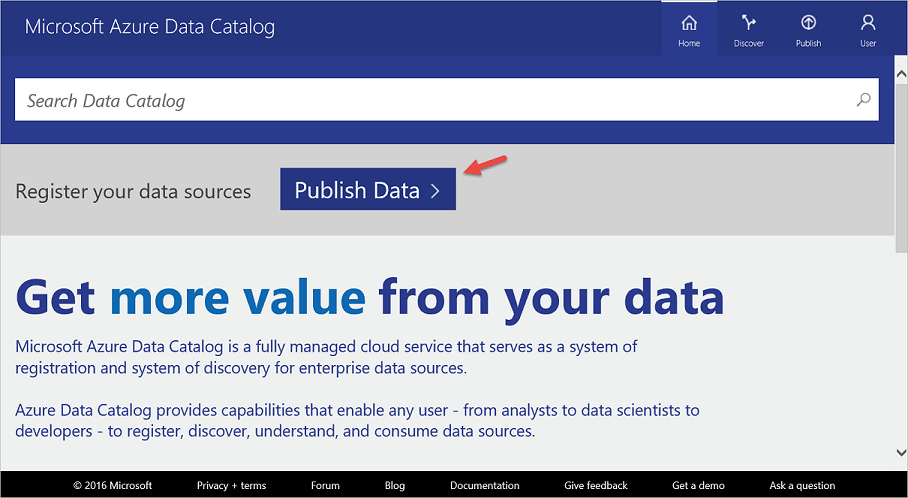

3.  Klik op **Toepassing starten**.

    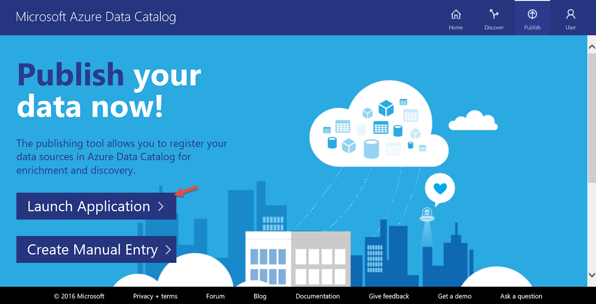

4. Op de **Welkomstpagina** klikt u op **Aanmelden** en voert u uw referenties in.
5. Op de pagina van **Microsoft Azure Data Catalog** dubbelklikt u op **SQL Server** of klikt u op **SQL Server** en **Volgende**.

    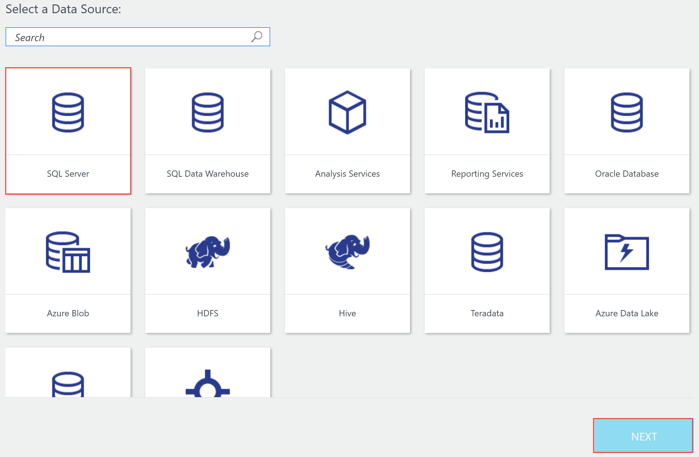

6.  Voer de verbindingseigenschappen van SQL Server in voor AdventureWorks2014 (zie het onderstaande voorbeeld) en klik op **VERBINDING MAKEN**.

    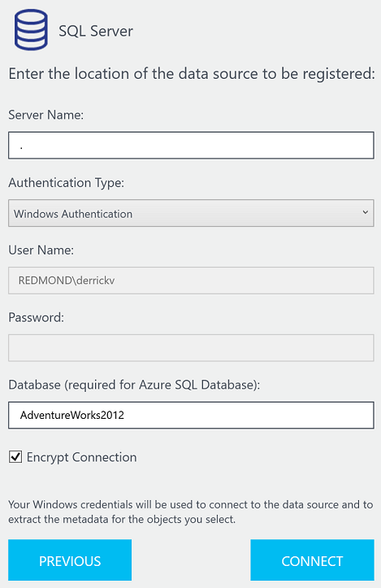

7.  Op de volgende pagina registreert u de metagegevens van uw gegevensbron. In dit voorbeeld registreert u objecten voor **Production/Product** vanuit de naamruimte AdventureWorks Production. Ga als volgt te werk:

    a. In de boomstructuur **Server Hierarchy** klikt u op **Production**.

    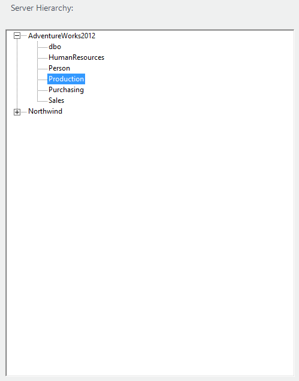

    b. Ctrl+klik op Product, ProductCategory, ProductDescription en ProductPhoto.

    c. Klik op de pijl om de geselecteerde items te verplaatsen (**>**). Hierdoor worden alle geselecteerde Product-objecten verplaatst naar de lijst **Te registreren objecten**.

    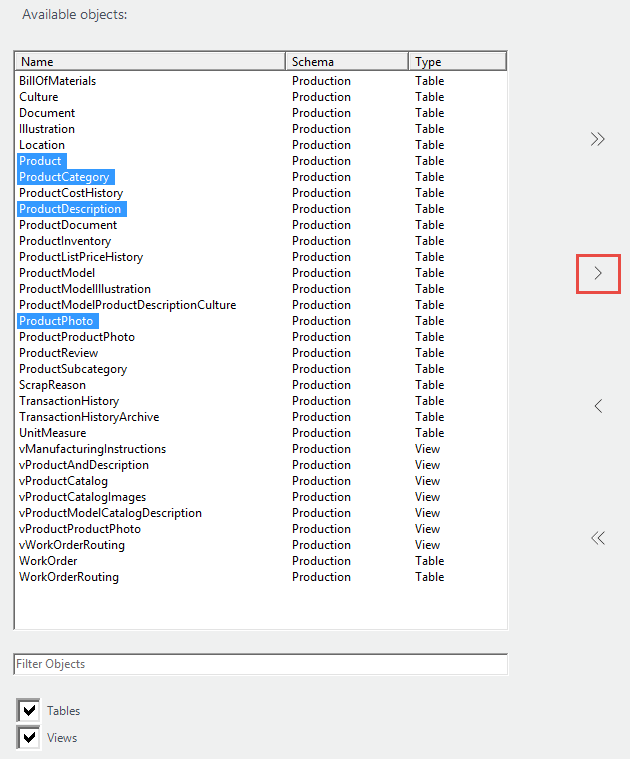

    d. Bij **Tags toevoegen** voert u een beschrijving in en voegt u een foto toe. Hiermee worden de zoektags voor deze gegevensassets toegevoegd. Tags zijn voor gebruikers een uitstekende manier om een geregistreerde gegevensbron te zoeken.

    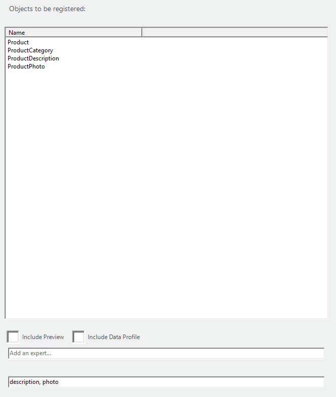

    e.  **Optioneel**: u kunt **Een voorbeeld toevoegen** en **Een expert in gegevensbronnen toevoegen**.

    f.  Klik op **REGISTREREN**. **Azure Data Catalog** registreert uw geselecteerde objecten. In deze oefening worden de geselecteerde objecten van Adventure Works geregistreerd.

    g.  Als u uw geregistreerde gegevensbronobjecten wilt zien, klikt u op **Portal weergeven**. In de portal van **Azure Data Catalog** kunt u gegevensbronobjecten weergeven als **Tegels** of in een **Lijst**.

    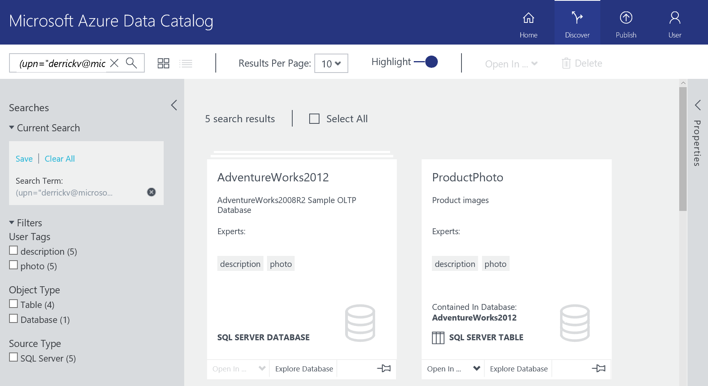

In deze oefening hebt u objecten uit de voorbeelddatabase van Adventure Works geregistreerd, zodat ze eenvoudig kunnen worden gevonden door gebruikers in uw organisatie.
In de volgende oefening leert u hoe u geregistreerde gegevensassets kunt detecteren.

## Oefening 3: Geregistreerde gegevensassets detecteren

In deze oefening gebruikt u de portal van **Azure Data Catalog** voor het detecteren van geregistreerde gegevensassets en het weergeven van de metagegevens. **Azure Data Catalog** bevat meerdere hulpprogramma’s voor het detecteren van gegevensassets, met inbegrip van een zoekfunctie met eenvoudige trefwoorden, interactieve filters en een geavanceerde zoeksyntaxis voor ervaren gebruikers.

### U kunt geregistreerde gegevensassets als volgt detecteren

**Azure Data Catalog** bevat een eenvoudige maar krachtige zoeksyntaxis waarmee u eenvoudig query's kunt opbouwen, zodat gegevens worden geretourneerd die gebruikers nodig hebben. Voor meer informatie over zoeken in **Azure Data Catalog**, zie [Verwijzing naar de zoeksyntaxis van Data Catalog](https://msdn.microsoft.com/library/azure/mt267594.aspx).

**Azure Data Catalog** bevat de volgende zoekopties:

- Zoeken met trefwoorden
- Filteren
- Geavanceerd zoeken

U kunt ook verfijnen welke gegevensassets u wilt weergeven. **Azure Data Catalog** bevat de volgende weergaveopties:

- Eigenschappen weergeven
- Kolommen weergeven
- Voorbeeld weergeven

In dit voorbeeld zoekt u aan de hand van een trefwoord. Voor een zoekopdracht in **Azure Data Catalog** zijn er verschillende query-technieken. In dit voorbeeld gebruiken we een zoekopdracht met **Groeperen**.

**Query-technieken**

|Techniek|Gebruiken|Voorbeeld
|---|---|---
|Bereik van eigenschap definiëren|Alleen gegevensbronnen retourneren waarbij de zoekterm overeenkomt met de opgegeven eigenschap|name:product
|Logische operators|Verbreed of verfijn een zoekopdracht met Booleaanse bewerkingen, zoals wordt beschreven in het gedeelte Booleaanse operators op deze pagina|finance NOT corporate
|Groeperen met haakjes|Gebruik haakjes en groepeer delen van de query voor logische isolatie, met name in combinatie met Booleaanse operators|name:product AND (tags:illustration OR tags:photo)
|Vergelijkingsoperators|Gebruik andere vergelijkingen dan gelijkheid voor eigenschappen die de gegevenstypen numeriek en datum hebben|creationTime:>11/05/14

In dit voorbeeld voert u een zoekopdracht met **Groepering** uit voor gegevensassets waarbij de naam gelijk is aan ‘product’ en de tags gelijk zijn aan ‘illustration’ of tags gelijk zijn aan ‘photo’.

1. Ga naar https://azure.microsoft.com/services/data-catalog, klik op **Aan de slag** en meld u aan bij de portal van **Azure Data Catalog**.
2. In het vak **Zoeken in Data Catalog** voert u een query met **Groepering** in: (**tags:description OR tags:photo**).
3. Klik op het zoekpictogram of druk op Enter. In **Azure Data Catalog** worden gegevensassets weergegeven voor deze zoekopdracht.

    

In deze oefening hebt u de portal van **Azure Data Catalog** gebruikt voor het detecteren en weergeven van gegevensassets van Adventure Works die zijn geregistreerd bij de catalogus.

<a name="annotating"/>
## Oefening 4: Aantekeningen maken bij geregistreerde gegevensbronnen

In deze oefening gebruikt u de portal van **Azure Data Catalog** voor het maken van aantekeningen bij gegevensassets die eerder zijn geregistreerd in de catalogus. De aantekeningen die u opgeeft dienen ter aanvulling en verbetering van de structurele metagegevens die zijn geëxtraheerd uit de gegevensbron tijdens de registratie, en zorgen ervoor dat de gegevensassets veel eenvoudiger te detecteren en te begrijpen zijn. Omdat elke gebruiker van **Data Catalog** zijn of haar eigen aantekeningen kan opgeven, is het voor elke gebruiker met een perspectief op de gegevens gemakkelijk om dit perspectief te delen.

### U kunt als volgt aantekeningen maken bij gegevensassets

1. Ga naar https://azure.microsoft.com/services/data-catalog, klik op **Aan de slag** en meld u aan bij de portal van **Azure Data Catalog**.
2. Klik op **Detecteren**.
3. Kies een of meer **Gegevensassets**. Kies in dit voorbeeld **ProductPhoto** en voer "Productfoto’s voor marketingmateriaal" in.
4. Voer een **Beschrijving** in waarmee anderen de geselecteerde gegevensasset kunnen detecteren en kunnen begrijpen waarom en hoe ze dit kunnen gebruiken. Voer bijvoorbeeld “Productafbeeldingen” in. U kunt ook meer tags toevoegen en kolommen weergeven.
5. Nu kunt u proberen te zoeken en filteren om gegevensassets te detecteren met behulp van de beschrijvende metagegevens die u hebt toegevoegd aan de catalogus.

    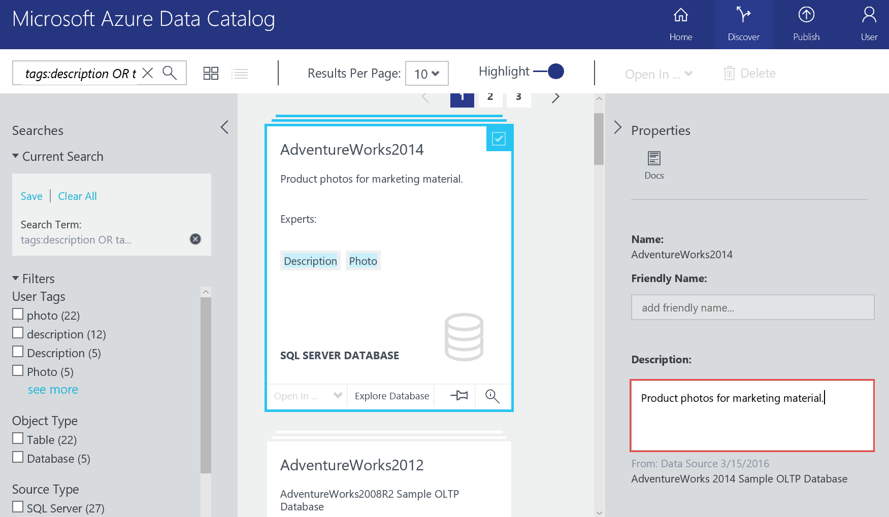

In deze oefening hebt u beschrijvende informatie toegevoegd aan geregistreerde gegevensassets, zodat gebruikers van de catalogus gegevensbronnen kunnen detecteren aan de hand van termen die ze begrijpen.

> [AZURE.NOTE] De Standard-editie van Data Catalog bevat een zakelijke woordenlijst waarmee catalogusbeheerders een centrale zakelijke taxonomie kunnen definiëren. Catalogusgebruikers kunnen vervolgens aantekeningen toevoegen aan gegevensassets met behulp van termen in de woordenlijst. Zie voor meer informatie [De zakelijke woordenlijst instellen voor Governed Tagging](data-catalog-how-to-business-glossary.md)  

## Oefening 5: Crowdsourcing van metagegevens

In deze oefening werkt u samen met een andere gebruiker om metagegevens toe te voegen aan gegevensassets in de catalogus. **Azure Data Catalog** heeft een benadering voor aantekeningen via crowdsourcing, waarbij elke gebruiker tags, beschrijvingen en andere metagegevens kan toevoegen. Elke gebruiker met een perspectief op een gegevensasset en het gebruik ervan kan dit perspectief dus vastleggen en beschikbaar stellen voor andere gebruikers.

> [AZURE.NOTE] Als u geen andere gebruiker hebt om mee samen te werken tijdens deze zelfstudie, maakt u zich dan geen zorgen! Elke gebruiker die toegang heeft tot de gegevenscatalogus kan naar wens zijn of haar eigen perspectief toevoegen. Via deze crowdsourcing-methode voor metagegevens worden de inhoud en de rijke metagegevens van de catalogus op den duur uitgebreid.

### U kunt als volgt metagegevens over gegevensassets crowdsourcen

Vraag een collega om de vorige oefening [Aantekeningen maken bij geregistreerde gegevensbronnen](#annotating) te herhalen. Nadat uw collega's beschrijvingen hebben toegevoegd aan een gegevensasset, zoals ProductPhoto, ziet u meerdere aantekeningen.

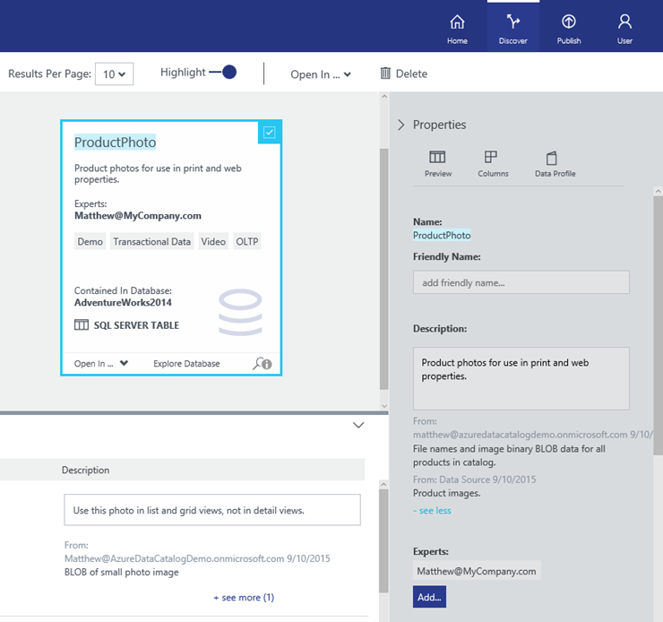

In deze oefening hebt u verkend wat de mogelijkheden zijn van **Azure Data Catalog** voor crowdsourcing van metagegevens, waarbij elke gebruiker van de catalogus aantekeningen kan maken bij de gegevensassets die hij of zij detecteert.

## Oefening 6: Verbinding maken met gegevensbronnen

In deze oefening gebruikt u de portal van **Azure Data Catalog** om verbinding te maken met een gegevensbron met behulp van Microsoft Excel.

> [AZURE.NOTE] Het is belangrijk om te weten dat **Azure Data Catalog** gebruikers geen toegang geeft tot de werkelijke gegevensbron. Het wordt gewoon eenvoudiger voor gebruikers om ze te detecteren en begrijpen. Wanneer gebruikers verbinding maken met een gegevensbron, worden de Windows-referenties van de gebruikers gebruikt of worden ze indien nodig gevraagd om referenties door de gekozen clienttoepassing. Als de gebruiker niet eerder toegang heeft gekregen tot de gegevensbron, moet de gebruiker toegang krijgen voordat hij of zij verbinding kan maken.

### U maakt als volgt verbinding met een gegevensbron vanuit Excel

1. Ga naar https://azure.microsoft.com/services/data-catalog, klik op **Aan de slag** en meld u aan bij de portal van **Azure Data Catalog**.
2. Klik op **Detecteren**.
3. Kies een gegevensasset. Kies in dit voorbeeld ProductCategory.
4. Kies **Openen in** > **Excel**.

    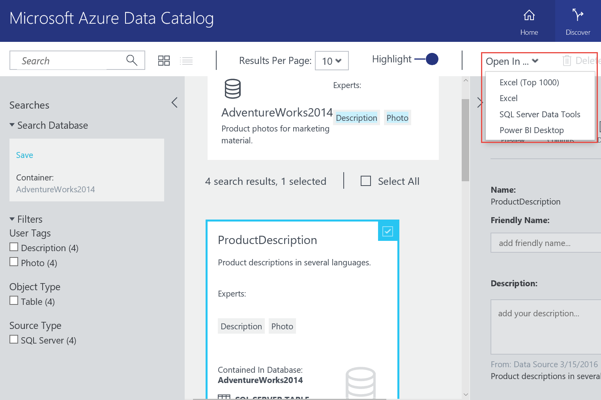

5. Klik in het venster **Beveiligingsbericht Microsoft Excel** op **Inschakelen**.
6. Open het bestand **ProductCategory.odc**.
7. De gegevensbron wordt in Excel geopend.

    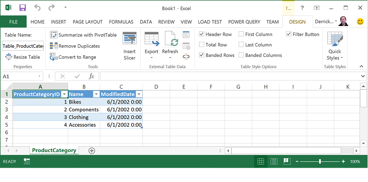

In deze oefening hebt u verbinding gemaakt met gegevensbronnen die zijn gedetecteerd via **Azure Data Catalog**. Via de portal van **Azure Data Catalog** kunnen gebruikers direct verbinding maken via de clienttoepassingen die zijn geïntegreerd in het menu **Openen in...**, en hiermee kunnen gebruikers verbinding maken met behulp van elke toepassing naar keuze. Hierbij wordt gebruikgemaakt van de locatiegegevens van de verbinding in de metagegevens van de asset.

## Oefening 7: metagegevens van de gegevensbron verwijderen

In deze oefening gebruikt u de portal van **Azure Data Catalog** om voorbeeldgegevens te verwijderen uit geregistreerde gegevensassets en om gegevensassets te verwijderen uit de catalogus.

> [AZURE.NOTE] Het standaardgedrag van de catalogus is om elke gebruiker toe te staan een gegevensbron te registreren en om elke gebruiker toe te staan een geregistreerde gegevensasset te verwijderen. De beheermogelijkheden die zijn opgenomen in de **Standard-editie van Azure Data Catalog** bieden aanvullende opties om eigenaar te worden van assets, te beperken wie assets kunnen detecteren en te beperken wie assets kunnen verwijderen.

In **Azure Data Catalog** kunt u een individuele asset of meerdere assets verwijderen.

### U kunt als volgt meerdere gegevensassets verwijderen

1. Ga naar https://azure.microsoft.com/services/data-catalog, klik op **Aan de slag** en meld u aan bij de portal van **Azure Data Catalog**.
2. Klik op **Detecteren**.
3. Kies een of meer gegevensassets.
4. Klik op **Verwijderen**.

In deze oefening hebt u geregistreerde gegevensassets verwijderd uit de catalogus.

## Oefening 8: Geregistreerde gegevensbronnen beheren

In deze oefening gebruikt u de beheermogelijkheden van **Azure Data Catalog** om eigenaar te worden van gegevensassets en te bepalen wat gebruikers kunnen detecteren en hoe ze deze assets beheren.

> [AZURE.NOTE] De beheermogelijkheden die worden beschreven in deze taak zijn alleen beschikbaar in de **Standard-editie van Azure Data Catalog** en niet in de **gratis editie**.
In **Azure Data Catalog** kunt u eigenaar worden van gegevensassets, mede-eigenaars aan gegevensassets toevoegen en de zichtbaarheid van gegevensassets instellen.

### U kunt als volgt eigenaar worden van gegevensassets en zichtbaarheid beperken

1. Ga naar https://azure.microsoft.com/services/data-catalog, klik op **Aan de slag** en meld u aan bij de portal van **Azure Data Catalog**.
2. Klik op **Detecteren**.
3. Kies een of meer gegevensassets.
4. In het venster **Eigenschappen**, in de sectie **Beheer**, klikt u op **Eigenaar worden**.
5. Als u de zichtbaarheid wilt beperken, klikt u op **Eigenaars en deze gebruikers**.

    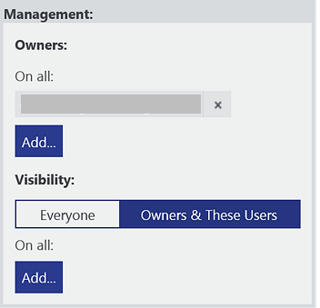

In deze oefening hebt u de beheermogelijkheden van **Azure Data Catalog** verkend en hebt u de zichtbaarheid van geselecteerde gegevensassets beperkt.

## Samenvatting

In deze zelfstudie hebt u essentiële mogelijkheden **Azure Data Catalog** verkend, inclusief het registreren, annoteren, detecteren en beheren van zakelijke gegevensbronnen. Nu u de zelfstudie hebt voltooid, is het tijd om aan de slag te gaan. U kunt vandaag nog beginnen de gegevensbronnen waarop u en uw team vertrouwen te registreren en collega's uit te nodigen om de catalogus te gebruiken.

<!--HONumber=Jun16_HO2-->

