<properties 
    pageTitle="Zelfstudie: een pijplijn maken met de wizard Kopiëren" 
    description="In deze zelfstudie maakt u een Azure Data Factory-pijplijn met een kopieeractiviteit. Hiervoor gebruikt u de wizard Kopiëren die wordt ondersteund door Data Factory." 
    services="data-factory" 
    documentationCenter="" 
    authors="spelluru" 
    manager="jhubbard" 
    editor="monicar"/>

<tags 
    ms.service="data-factory" 
    ms.workload="data-services" 
    ms.tgt_pltfrm="na" **
    ms.devlang="na" 
    ms.topic="get-started-article" 
    ms.date="09/16/2016" 
    ms.author="spelluru"/>

# Zelfstudie: een pijplijn maken met de kopieeractiviteit middels de Data Factory-wizard Kopiëren
> [AZURE.SELECTOR]
- [Overzicht en vereisten](data-factory-copy-data-from-azure-blob-storage-to-sql-database.md)
- [De wizard Kopiëren](data-factory-copy-data-wizard-tutorial.md)
- [Azure Portal](data-factory-copy-activity-tutorial-using-azure-portal.md)
- [Visual Studio](data-factory-copy-activity-tutorial-using-visual-studio.md)
- [PowerShell](data-factory-copy-activity-tutorial-using-powershell.md)
- [REST API](data-factory-copy-activity-tutorial-using-rest-api.md)
- [.NET API](data-factory-copy-activity-tutorial-using-dotnet-api.md)

Met de **wizard Kopiëren** van Azure Data Factory kunt u snel en eenvoudig een pijplijn maken die het scenario voor gegevensopname/-verplaatsing implementeert. Daarom wordt u aangeraden de wizard te gebruiken als een eerste stap bij het maken van een voorbeeldpijplijn voor het scenario waarin gegevensverplaatsing plaatsvindt. Deze zelfstudie laat zien hoe u een Azure-gegevensfactory kunt maken, de wizard Kopiëren kunt starten en een reeks stappen kunt uitvoeren om informatie over uw scenario voor gegevensopname/-verplaatsing op te geven. Nadat u de stappen in de wizard hebt voltooid, maakt de wizard automatisch een pijplijn met een kopieeractiviteit om gegevens te kopiëren uit een Azure Blob-opslag naar Azure SQL-databases. Zie [Activiteiten voor gegevensverplaatsing](data-factory-data-movement-activities.md) voor meer informatie over de kopieeractiviteit. 

> [AZURE.IMPORTANT] Lees het artikel [Overzicht van de zelfstudie en vereisten](data-factory-copy-data-from-azure-blob-storage-to-sql-database.md) voor een overzicht van de zelfstudie en voltooi de **vereiste** stappen voordat u deze zelfstudie volgt.

## Een gegevensfactory maken
In deze stap gebruikt u Azure Portal om een Azure Data Factory met de naam **ADFTutorialDataFactory** te maken.

1.  Meld u aan bij de [Azure-portal](https://portal.azure.com) en klik op **+ Nieuw** in de linkerbovenhoek. Klik op **Intelligence en analytische gegevens** en klik op **Data Factory**. 

    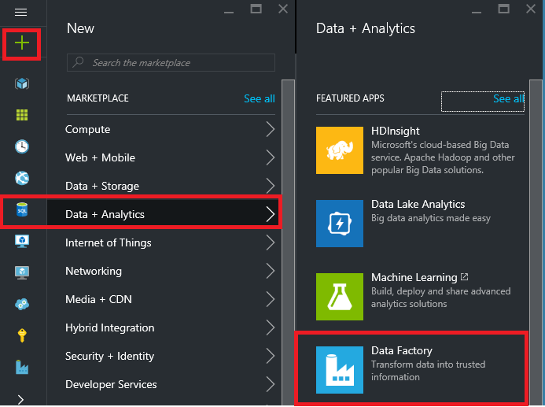

6. In de blade **Nieuwe gegevensfactory**:
    1. Voer **ADFTutorialDataFactory** in als **naam**.
        De naam van de Azure-gegevensfactory moet wereldwijd uniek zijn. Als u de volgende fout ontvang: **De gegevensfactory ADFTutorialDataFactory is niet beschikbaar**, wijzigt u de naam van de gegevensfactory (naar bijvoorbeeld uwnaamADFTutorialDataFactory) en probeert u het opnieuw. Raadpleeg het onderwerp [Data Factory - Naamgevingsregels](data-factory-naming-rules.md) voor meer informatie over naamgevingsregels voor Data Factory-artefacten.  
     
        
    
        > [AZURE.NOTE] De naam van de gegevensfactory wordt in de toekomst mogelijk geregistreerd als DNS-naam en wordt daarmee ook voor iedereen zichtbaar.
2. Selecteer uw Azure-**abonnement**.
3. Voer een van de volgende stappen uit voor de resourcegroep: 1. Selecteer **Bestaande gebruiken** om een bestaande resourcegroep te selecteren.
2. Selecteer **Nieuwe maken** als u een naam voor een resourcegroep wilt typen.

            Some of the steps in this tutorial assume that you use the name: **ADFTutorialResourceGroup** for the resource group. To learn about resource groups, see [Using resource groups to manage your Azure resources](../resource-group-overview.md).
    3. Selecteer een **locatie** voor de gegevensfactory.
    4. Selecteer het selectievakje **Vastmaken aan dashboard** onderaan de blade.  
    5. Klik op **Create**.
    
                  
10. Wanneer het aanmaken is voltooid, ziet u de blade **Gegevensfactory** zoals op de volgende afbeelding wordt weergegeven:

    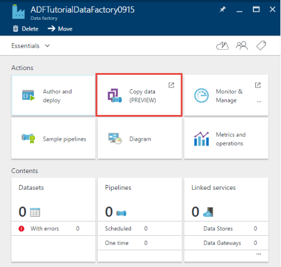

## De wizard Kopiëren starten en gebruiken

1. Op de startpagina van de gegevensfactory klikt u op de tegel **Gegevens kopiëren** om de **wizard Kopiëren** te openen. 

    > [AZURE.NOTE] Als u ziet dat de webbrowser is vastgelopen bij Autoriseren... schakelt u **Cookies van derden en sitegegevens blokkeren** uit, of u laat dit ingeschakeld en u maakt een uitzondering voor **login.microsoftonline.com** en opent u de wizard opnieuw.
2. Op de pagina **Eigenschappen**:
    1. Voer **CopyFromBlobToAzureSql** in als **taaknaam**
    2. Voer de **beschrijving** in (optioneel).
    3. Wijzig de **Startdatum en -tijd** en de **Einddatum en -tijd** zodat de einddatum is ingesteld op vandaag en de startdatum op de datum vijf dagen vóór de huidige dag.  
    3. Klik op **Volgende**.  

    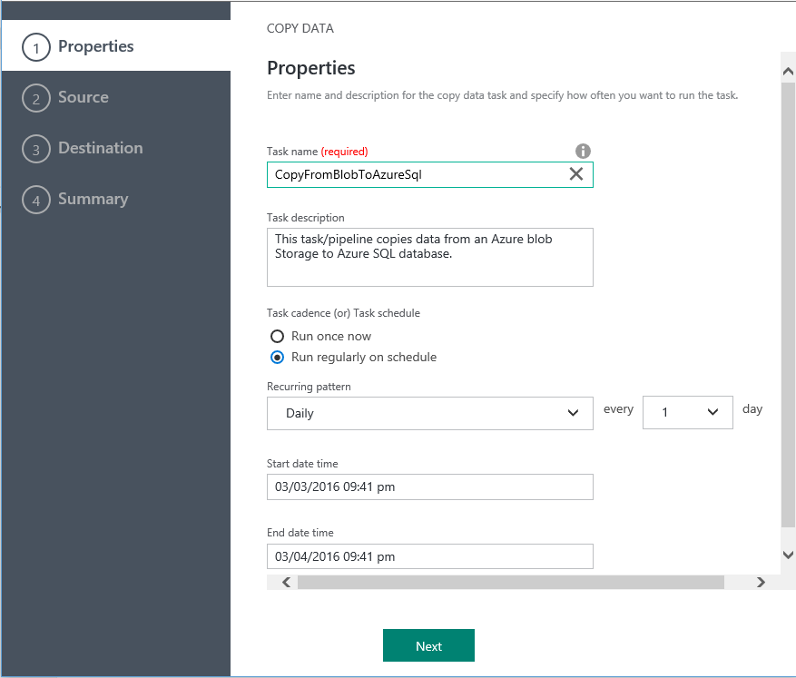 
3. Op de pagina **Brongegevensarchief** klikt u op de tegel **Azure Blob Storage**. U gebruikt deze pagina om het brongegevensarchief op te geven voor de kopieertaak. U kunt een bestaande gekoppelde service van een gegevensarchief gebruiken of een nieuw gegevensarchief opgeven. Als u een bestaande gekoppelde service wilt gebruiken, klikt u op **VAN BESTAANDE GEKOPPELDE SERVICES** en selecteert u de juiste gekoppelde service. 

    
5. Op de pagina **Het Azure Blob Storage-account opgeven**:
    1. Voer **AzureStorageLinkedService** in als **naam van de gekoppelde service**.
    2. Controleer of de optie **Van Azure-abonnementen** is geselecteerd als **accountselectiemethode**.
    3. Selecteer uw Azure-**abonnement**.  
    3. Selecteer een **Azure-opslagaccount** uit de lijst met Azure-opslagaccounts die beschikbaar is voor het abonnement dat u hebt geselecteerd. U kunt er ook voor kiezen om de opslagaccountinstellingen handmatig op te geven. Selecteer daarvoor de optie **Handmatig invoeren** als **accountselectiemethode** en klik vervolgens op **Volgende**. 

    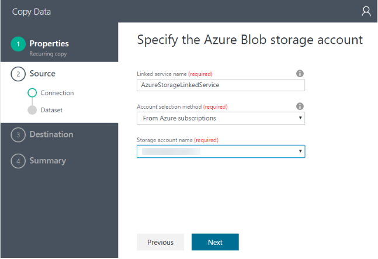
6. Op de pagina **Het invoerbestand of de invoermap kiezen**:
    1. Navigeer naar de map **adftutorial**.
    2. Selecteer **emp.txt** en klik op **Kiezen**
    3. Klik op **Volgende**. 

    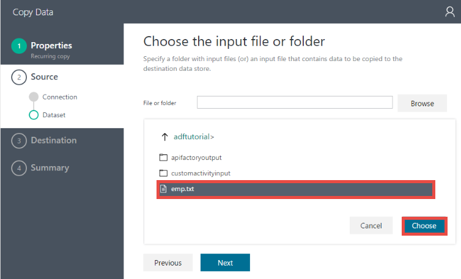
7. Klik op de pagina **Het invoerbestand of de invoermap kiezen** op **Volgende** Selecteer niet **Binaire kopie**. 

    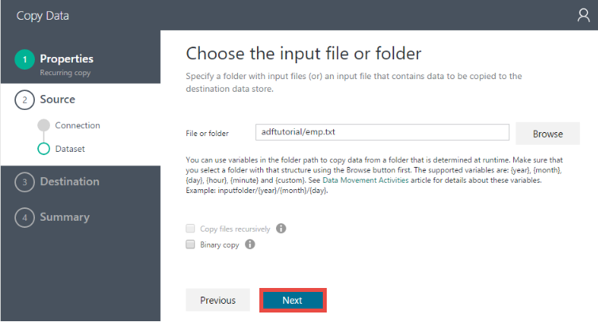 
8. Op de pagina **Bestandsinstellingen** ziet u de scheidingstekens en het schema dat automatisch is gedetecteerd door de wizard tijdens het parseren van het bestand. U kunt de scheidingstekens ook handmatig invoeren zodat de wizard Kopiëren stopt met automatisch detecteren, of als u wilt dat gegevens worden overschreven. Klik op **Volgende** nadat u de scheidingstekens hebt gecontroleerd en een voorbeeld van de gegevens hebt bekeken. 

      
8. Op de pagina Doelgegevensarchief selecteert u **Azure SQL Database** en klikt u op **Volgende**.

    
9. Op de pagina **De Azure SQL Database opgeven**:
    1. Typ **AzureSqlLinkedService** in het veld **Verbindingsnaam**.
    2. Controleer of de optie **Van Azure-abonnementen** is geselecteerd als **Server-/databaseselectiemethode**.
    3. Selecteer uw Azure-**abonnement**.  
    2. Selecteer de **servernaam** en **database**.
    4. Voer de **gebruikersnaam** en het **wachtwoord** in.
    5. Klik op **Volgende**.  

    
9. Op de pagina **Tabeltoewijzing** selecteert u uit de vervolgkeuzelijst **emp** in het veld **Bestemming** en klikt u op de **pijl naar beneden** (optioneel) om het schema en een voorbeeld van de gegevens te bekijken.

    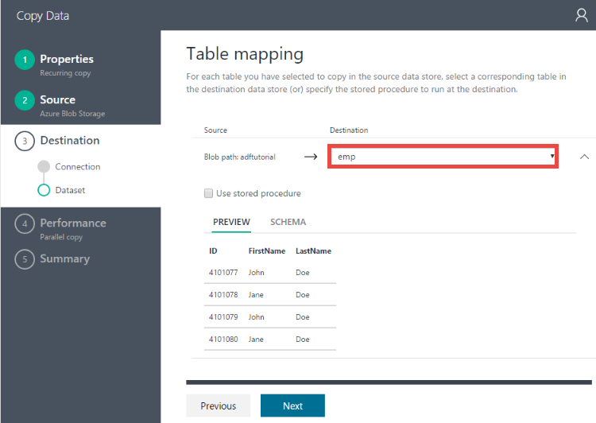 
10. Op de pagina **Schematoewijzing** klikt u op **Volgende**.

    
11. Op de pagina **Prestatie-instellingen** klikt u op **Volgende**. 

    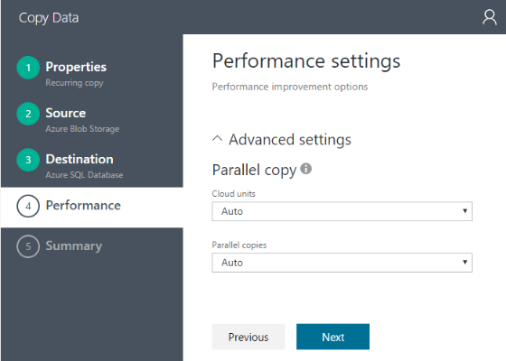
11. Lees de informatie op de pagina **Samenvatting** en klik op **Voltooien**. De wizard maakt twee gekoppelde services, twee gegevenssets (invoer en uitvoer) en één pijplijn in de gegevensfactory (van waaruit u de wizard Kopiëren hebt gestart). 

    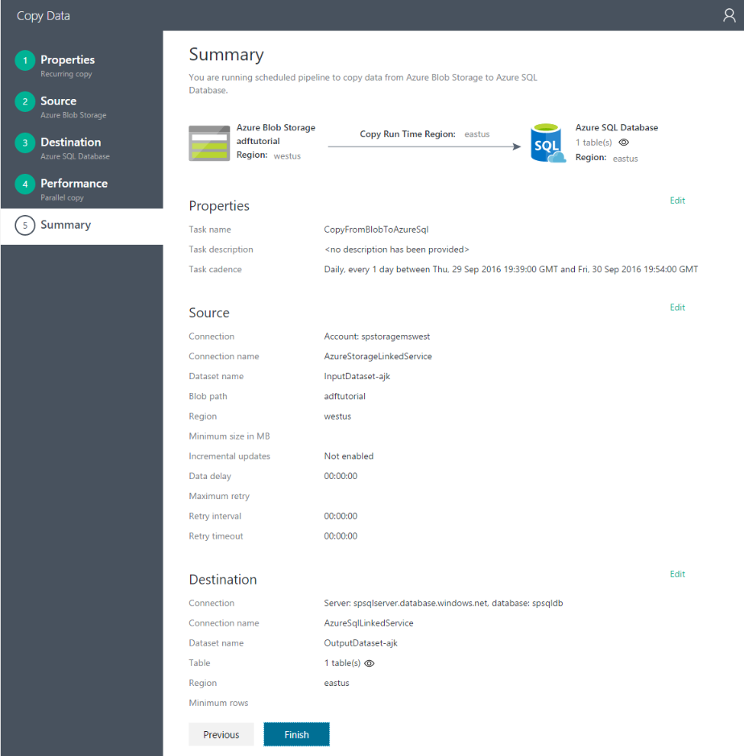

## Monitor starten en toepassing beheren 
12. Op de pagina **Implementatie** klikt u op de koppeling: **Klik hier om de kopieerpijplijn te bewaken**.

    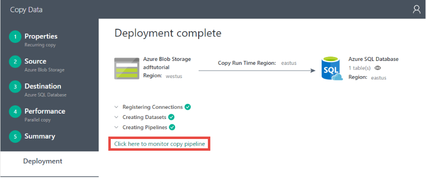  
13. Volg de instructies in [Pijplijnen bewaken en beheren met de app voor bewaking](data-factory-monitor-manage-app.md) voor meer informatie over het bewaken van de pijplijn die u hebt gemaakt. Klik op het pictogram **Vernieuwen** in de lijst met **ACTIVITEITSVENSTERS** om het segment weer te geven. 

    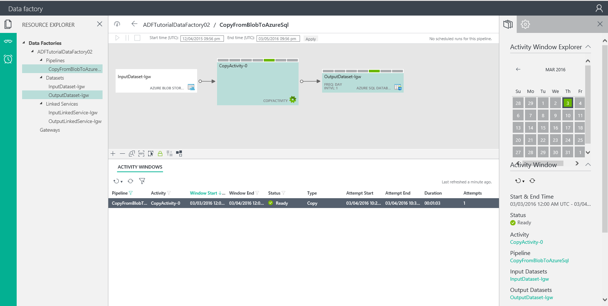 
    
    > [AZURE.NOTE] Klik op de knop **Vernieuwen** in de lijst met **ACTIVITEITSVENSTERS** om de meest recente status te zien. Deze wordt niet automatisch vernieuwd. 

## Zie ook
| Onderwerp | Beschrijving |
| :---- | :---- |
| [Activiteiten voor gegevensverplaatsing](data-factory-data-movement-activities.md) | Dit artikel biedt gedetailleerde informatie over de kopieeractiviteit die u tijdens deze zelfstudie hebt gemaakt. |
| [Plannen en uitvoeren](data-factory-scheduling-and-execution.md) | In dit artikel wordt uitleg gegeven over de plannings- en uitvoeringsaspecten van het Azure Data Factory-toepassingsmodel. |
| [Pijplijnen](data-factory-create-pipelines.md) | Met behulp van dit artikel krijgt u inzicht in de pijplijnen en activiteiten in Azure Data Factory en in de wijze waarop u deze kunt gebruiken om end-to-end gegevensgestuurde werkstromen te maken voor uw scenario of bedrijf. |
| [Gegevenssets](data-factory-create-datasets.md) | Op basis van dit artikel krijgt u inzicht in de gegevenssets in Azure Data Factory.
| [Pijplijnen bewaken en beheren met de app voor bewaking en beheer](data-factory-monitor-manage-app.md) | In dit artikel wordt beschreven hoe u pijplijnen bewaakt en beheert en hoe u fouten hierin oplost met de app voor bewaking en beheer. 

<!--HONumber=Oct16_HO1-->

