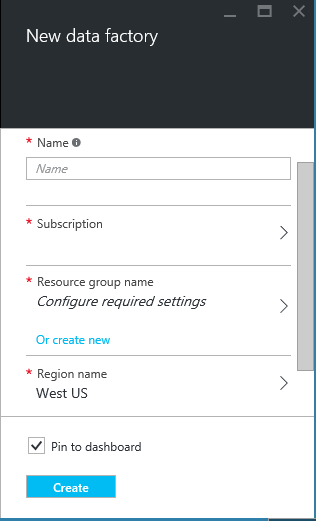
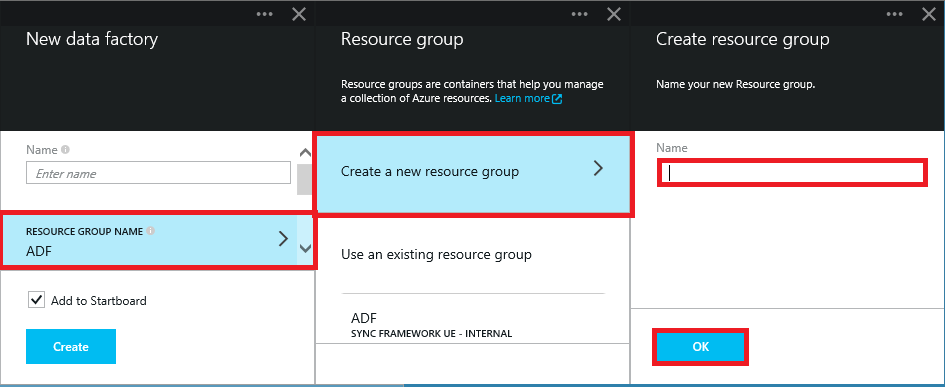
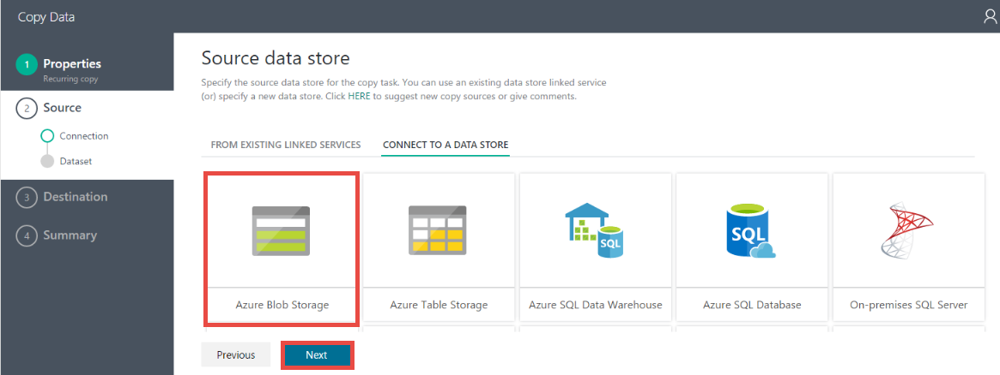
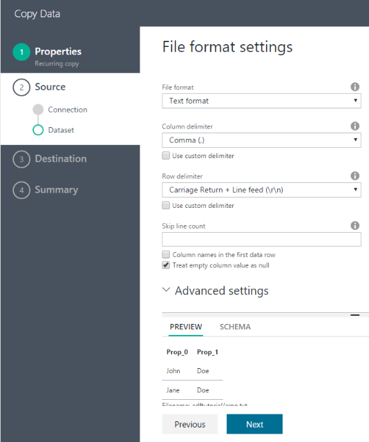

<properties 
    pageTitle="Zelfstudie: een pijplijn maken met de wizard Kopiëren" 
    description="In deze zelfstudie maakt u een Azure Data Factory-pijplijn met een kopieeractiviteit. Hiervoor gebruikt u de wizard Kopiëren die wordt ondersteund door Data Factory." 
    services="data-factory" 
    documentationCenter="" 
    authors="spelluru" 
    manager="jhubbard" 
    editor="monicar"/>

<tags 
    ms.service="data-factory" 
    ms.workload="data-services" 
    ms.tgt_pltfrm="na" 
    ms.devlang="na" 
    ms.topic="get-started-article" 
    ms.date="08/01/2016" 
    ms.author="spelluru"/>

# Zelfstudie: een pijplijn maken met de kopieeractiviteit middels de Data Factory-wizard Kopiëren
> [AZURE.SELECTOR]
- [Overzicht van de zelfstudie](data-factory-copy-data-from-azure-blob-storage-to-sql-database.md)
- [De Data Factory-editor gebruiken](data-factory-copy-activity-tutorial-using-azure-portal.md)
- [PowerShell gebruiken](data-factory-copy-activity-tutorial-using-powershell.md)
- [Visual Studio gebruiken](data-factory-copy-activity-tutorial-using-visual-studio.md)
- [REST API gebruiken](data-factory-copy-activity-tutorial-using-rest-api.md) 
- [De wizard Kopiëren gebruiken](data-factory-copy-data-wizard-tutorial.md)

In deze zelfstudie gebruikt u de Data Factory-wizard Kopiëren om een pijplijn te maken. Dit doet u middels een kopieeractiviteit in een gegevensfactory. Eerst maakt u een gegevensfactory met behulp van Azure Portal. Daarna gebruikt u de wizard Kopiëren om gekoppelde Data Factory-services, gegevenssets en een pijplijn te maken. Dit doet u met een kopieeractiviteit waarmee gegevens uit Azure Blob Storage naar een Azure SQL-database worden gekopieerd. Zie [Activiteiten voor gegevensverplaatsing](data-factory-data-movement-activities.md) voor meer informatie over de kopieeractiviteit. 

> [AZURE.IMPORTANT] Lees het artikel [Overzicht van de zelfstudie](data-factory-copy-data-from-azure-blob-storage-to-sql-database.md) en voltooi de vereiste stappen voordat u deze zelfstudie volgt.

## Een gegevensfactory maken
In deze stap gebruikt u Azure Portal om een Azure Data Factory met de naam **ADFTutorialDataFactory** te maken.

1.  Wanneer u zich hebt aangemeld bij [Azure Portal](https://portal.azure.com) klikt u op **+ NIEUW** in de linkerbovenhoek. Selecteer vervolgens **Gegevensanalyse** in de blade **Maken** en klik op **Gegevensfactory** in de blade **Gegevensanalyse**. 

    

6. In de blade **Nieuwe gegevensfactory**:
    1. Voer **ADFTutorialDataFactory** in als **naam**. 
    
        
    2. Klik op de **RESOURCEGROEPNAAM** en doe het volgende:
        1. Klik op **Een nieuwe resourcegroep maken**.
        2. In de blade **Resourcegroep maken** voert u **ADFTutorialResourceGroup** in als **naam** van de resourcegroep en klikt u op **OK**. 

            

        Voor sommige van de stappen in deze zelfstudie wordt ervan uitgegaan dat u voor de resourcegroep de naam **ADFTutorialResourceGroup** gebruikt. Zie [Resourcegroepen gebruiken om Azure-resources te beheren](../resource-group-overview.md) voor meer informatie.  
7. In de blade **Nieuwe gegevensfactory** controleert u of **Toevoegen aan Startboard** is geselecteerd.
8. Klik op **Maken** op de blade **Nieuwe gegevensfactory**.

    De naam van de Azure-gegevensfactory moet wereldwijd uniek zijn. Als u de volgende fout ontvang: **De gegevensfactory ADFTutorialDataFactory is niet beschikbaar**, wijzigt u de naam van de gegevensfactory (naar bijvoorbeeld uwnaamADFTutorialDataFactory) en probeert u het opnieuw. Raadpleeg het onderwerp [Data Factory - Naamgevingsregels](data-factory-naming-rules.md) voor meer informatie over naamgevingsregels voor Data Factory-artefacten.  
     
    
    
    > [AZURE.NOTE] De naam van de gegevensfactory wordt in de toekomst mogelijk geregistreerd als DNS-naam en wordt daarmee ook voor iedereen zichtbaar.  

9. Klik op de hub **MELDINGEN** aan de linkerzijde en zoek meldingen over het aanmaakproces. Klik op **X** om de blade **MELDINGEN** te sluiten als deze is geopend. 
10. Wanneer het aanmaken is voltooid, ziet u de blade **GEGEVENSFACTORY** zoals op de volgende afbeelding wordt weergegeven.

    

## Pijplijn maken

1. Op de startpagina van de gegevensfactory klikt u op de tegel **Gegevens kopiëren** om de **wizard Kopiëren** te openen. 

    > [AZURE.NOTE] Als u ziet dat de webbrowser is vastgelopen bij Autoriseren... schakelt u **Cookies van derden en sitegegevens blokkeren** uit, of u laat dit ingeschakeld en u maakt een uitzondering voor **login.microsoftonline.com** en opent u de wizard opnieuw.
2. Op de pagina **Eigenschappen**:
    1. Voer **CopyFromBlobToAzureSql** in als **taaknaam**
    2. Voer de **beschrijving** in (optioneel).
    3. Noteer de **startdatum en -tijd** en de **einddatum en -tijd**. Zorg ervoor dat de **einddatum en -tijd** één dag na de **startdatum en -tijd** zijn. 
    3. Klik op **Volgende**.  

     
3. Op de pagina **Brongegevensarchief** klikt u op de tegel **Azure Blob Storage**. U gebruikt deze pagina om het brongegevensarchief op te geven voor de kopieertaak. U kunt een bestaande gekoppelde service van een gegevensarchief gebruiken of een nieuw gegevensarchief opgeven. Als u een bestaande gekoppelde service wilt gebruiken, klikt u op **VAN BESTAANDE GEKOPPELDE SERVICES** en selecteert u de juiste gekoppelde service. 

    
5. Op de pagina **Het Azure Blob Storage-account opgeven**:
    1. Voer **AzureStorageLinkedService** in als **naam van de gekoppelde service**.
    2. Controleer of **Van Azure-abonnementen** is opgegeven als **accountselectiemethode**. 
    3. Selecteer een **Azure-opslagaccount** uit de lijst met Azure-opslagaccounts die beschikbaar is voor het abonnement dat u hebt geselecteerd. U kunt er ook voor kiezen om de opslagaccountinstellingen handmatig op te geven. Selecteer daarvoor de optie **Handmatig invoeren** als **accountselectiemethode** en klik vervolgens op **Volgende**. 

    
6. Op de pagina **Het invoerbestand of de invoermap kiezen**:
    1. Navigeer naar de map **adftutorial**.
    2. Selecteer **emp.txt** en klik op **Kiezen**
    3. Klik op **Volgende**. 

    
7. Op de pagina **Bestandsindelingsinstellingen** selecteert u de **standaardwaarden** en klikt u op **Volgende**.

      
8. Op de pagina Doelgegevensarchief klikt u op de tegel **Azure SQL Database** en klikt u op **Volgende**.
9. Op de pagina **De Azure SQL Database opgeven**:
    1. Voer **AzureSqlLinkedService** in als **naam van de gekoppelde service**. 
    2. Controleer of de **selectiemethode voor server/database** is ingesteld op **Van Azure-abonnementen**.
    3. Selecteer de **servernaam** en **database**.
    4. Voer de **gebruikersnaam** en het **wachtwoord** in.
    5. Klik op **Volgende**.  
9. Op de pagina **Tabeltoewijzing** selecteert u uit de vervolgkeuzelijst **emp** in het veld **Bestemming** en klikt u op de **pijl naar beneden** (optioneel) om het schema en een voorbeeld van de gegevens te bekijken.

     
10. Op de pagina **Schematoewijzing** klikt u op **Volgende**.
11. Lees de informatie op de pagina **Samenvatting** en klik op **Voltooien**. De wizard maakt twee gekoppelde services, twee gegevenssets (invoer en uitvoer) en één pijplijn in de gegevensfactory (van waaruit u de wizard Kopiëren hebt gestart). 
12. Op de pagina **Implementatie is voltooid** klikt u op **Klik hier om de kopieerpijplijn te bewaken**.

      
13. Volg de instructies in [Pijplijnen bewaken en beheren met de app voor bewaking](data-factory-monitor-manage-app.md) voor meer informatie over het bewaken van de pijplijn die u hebt gemaakt.

     
 

## Zie ook
| Onderwerp | Beschrijving |
| :---- | :---- |
| [Activiteiten voor gegevensverplaatsing](data-factory-data-movement-activities.md) | Dit artikel biedt gedetailleerde informatie over de kopieeractiviteit die u tijdens deze zelfstudie hebt gemaakt. |
| [Plannen en uitvoeren](data-factory-scheduling-and-execution.md) | In dit artikel wordt uitleg gegeven over de plannings- en uitvoeringsaspecten van het Azure Data Factory-toepassingsmodel. |
| [Pijplijnen](data-factory-create-pipelines.md) | Met behulp van dit artikel krijgt u inzicht in de pijplijnen en activiteiten in Azure Data Factory en in de wijze waarop u deze kunt gebruiken om end-to-end gegevensgestuurde werkstromen te maken voor uw scenario of bedrijf. |
| [Gegevenssets](data-factory-create-datasets.md) | Op basis van dit artikel krijgt u inzicht in de gegevenssets in Azure Data Factory.
| [Pijplijnen bewaken en beheren met de app voor bewaking en beheer](data-factory-monitor-manage-app.md) | In dit artikel wordt beschreven hoe u pijplijnen bewaakt en beheert en hoe u fouten hierin oplost met de app voor bewaking en beheer. 

<!--HONumber=sep16_HO1-->

