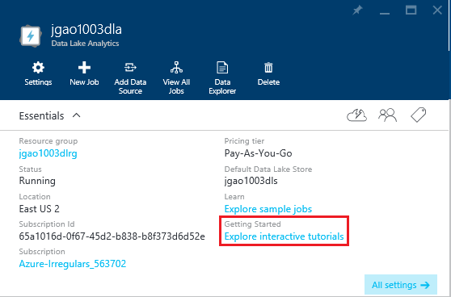

<properties 
   pageTitle="Leer alles over Data Lake Analytics en U-SQL met de interactieve zelfstudies van Azure Portal | Azure" 
   description="Snel aan de slag met het leren van Data Lake Analytics en U-SQL. " 
   services="data-lake-analytics" 
   documentationCenter="" 
   authors="edmacauley" 
   manager="paulettm" 
   editor="cgronlun"/>
 
<tags
   ms.service="data-lake-analytics"
   ms.devlang="na"
   ms.topic="get-started-article"
   ms.tgt_pltfrm="na"
   ms.workload="big-data" 
   ms.date="05/16/2016"
   ms.author="edmaca"/>

# Interactieve zelfstudies voor Azure Data Lake Analytics gebruiken

De Azure Portal biedt een interactieve zelfstudie waarmee u snel aan de slag kunt met Data Lake Analytics. In dit artikel kunt u zien hoe u de zelfstudie voor het analyseren van websitelogboeken voltooit.

>[AZURE.NOTE] Zie [Websitelogboeken analyseren met Data Lake Analytics](data-lake-analytics-analyze-weblogs.md) als u dezelfde zelfstudie wilt doorlopen met Visual Studio.
>We blijven interactieve zelfstudies toevoegen aan de portal.

Zie voor andere zelfstudies:

- [Aan de slag met Data Lake Analytics met Azure Portal](data-lake-analytics-get-started-portal.md)
- [Aan de slag met Data Lake Analytics met Azure PowerShell](data-lake-analytics-get-started-powershell.md)
- [Aan de slag met Data Lake Analytics met .NET SDK](data-lake-analytics-get-started-net-sdk.md)
- [U-SQL-scripts ontwikkelen met Data Lake Tools voor Visual Studio](data-lake-analytics-data-lake-tools-get-started.md) 

**Vereisten**

Voordat u met deze zelfstudie begint, moet u het volgende hebben of hebben gedaan:

- **Een Data Lake Analytics-account**.  Zie [Aan de slag met Azure Data Lake Analytics met Azure Portal](data-lake-analytics-get-started-portal.md).

##Een Data Lake Analytics-account maken 

U moet een Data Lake Analytics-account hebben voordat u taken kunt uitvoeren.

Elk Data Lake Analytics-account is afhankelijk van een [Azure Data Lake Store](../data-lake-store/data-lake-store-overview.md)-account.  Dit account wordt het Data Lake Store-standaardaccount genoemd.  U kunt het Data Lake Store-account van tevoren maken, of wanneer u het Data Lake Analytics-account maakt. In deze zelfstudie gaat u het Data Lake Store-account maken met het Data Lake Analytics-account.

**Een Data Lake Analytics-account maken**

1. Meld u aan bij de [Azure Portal](https://portal.azure.com/signin/index/?Microsoft_Azure_Kona=true&Microsoft_Azure_DataLake=true&hubsExtension_ItemHideKey=AzureDataLake_BigStorage%2cAzureKona_BigCompute).
2. Klik linksboven op **Microsoft Azure** om het Startboard te openen.
3. Klik op de tegel **Marketplace**.  
3. Typ **Azure Data Lake Analytics** in het zoekvak op de blade **Alles** en druk op **Enter**. **Azure Data Lake Analytics** wordt in de lijst weergegeven.
4. Klik op **Azure Data Lake Analytics** in de lijst.
5. Klik op **Maken** onderaan de blade.
6. Typ of selecteer het volgende:

    

    - **Naam**: geef het Analytics-account een naam.
    - **Data Lake Store**: elke Data Lake Analytics-account is afhankelijk van een Data Lake Store-account. Het Data Lake Analytics-account en het afhankelijke Data Lake Store-account moeten zich in hetzelfde Azure-datacenter bevinden. Volg de instructies voor het maken van een nieuw Data Lake Store-account of selecteer een bestaand account.
    - **Abonnement**: kies het Azure-abonnement dat u gebruikt voor het Analytics-account.
    - **Resourcegroep**. Selecteer een bestaande Azure-resourcegroep of maak een nieuwe. Toepassingen bestaan in het algemeen uit meerdere onderdelen, bijvoorbeeld een web-app, database, databaseserver, opslag en services van derden. Met Azure Resource Manager (ARM) kunt u de resources in uw toepassing gebruiken als groep, die we een Azure-resourcegroep noemen. U kunt alle resources voor uw toepassing implementeren, bijwerken, bewaken of verwijderen in een enkele, gecoördineerde bewerking. Voor implementatie gebruikt u een sjabloon. Deze sjabloon kan voor verschillende omgevingen worden gebruikt, zoals testen, faseren en productie. U kunt facturering voor uw organisatie verduidelijken door de samengevoegde kosten voor de hele groep weer te geven. Zie [Overzicht van Azure Resource Manager](resource-group-overview.md) voor meer informatie. 
    - **Locatie**. Selecteer een Azure-datacenter voor het Data Lake Analytics-account. 
7. Selecteer **vastmaken aan Startboard**. Dit is vereist voor het volgen van deze zelfstudie.
8. Klik op **Create**. U gaat naar het Startboard van de portal. Er is een nieuwe tegel toegevoegd aan de startpagina met het label ‘Deploying Azure Data Lake Analytics’. Het duurt enkele minuten om een Data Lake Analytics-account te maken. Wanneer het account is gemaakt, wordt het in een nieuwe blade geopend.

    

##De interactieve zelfstudie Websitelogboeken analyseren uitvoeren

**De interactieve zelfstudie Websitelogboeken analyseren openen**

1. Klik in de portal op **Microsoft Azure** in het menu aan de linkerkant om het Startboard te openen.
2. Klik op de tegel die is gekoppeld aan uw Data Lake Analytics-account.
3. Klik op **Explore interactive tutorials** op de balk **Essentials**.

    

4. Als u er een oranje waarschuwing wordt weergegeven met de tekst "Samples not set up, click …", klikt u op **Copy Sample Data** om de voorbeeldgegevens te kopiëren naar het Data Lake Store-standaardaccount. Voor het uitvoeren van de interactieve zelfstudie zijn de gegevens nodig.
5. Klik op **Website Log Analytics** in de blade **Interactive Tutorials**. De zelfstudie wordt geopend in een nieuwe portalblade.
5. Klik op **1 Introduction** en volg de instructies.

##Zie ook

- [Overzicht van Microsoft Azure Data Lake Analytics](data-lake-analytics-overview.md)
- [Aan de slag met Data Lake Analytics met Azure Portal](data-lake-analytics-get-started-portal.md)
- [Aan de slag met Data Lake Analytics met Azure PowerShell](data-lake-analytics-get-started-powershell.md)
- [U-SQL-scripts ontwikkelen met Data Lake Tools voor Visual Studio](data-lake-analytics-data-lake-tools-get-started.md)
- [Websitelogboeken analyseren met Azure Data Lake Analytics](data-lake-analytics-analyze-weblogs.md)

<!--HONumber=ago16_HO4-->

