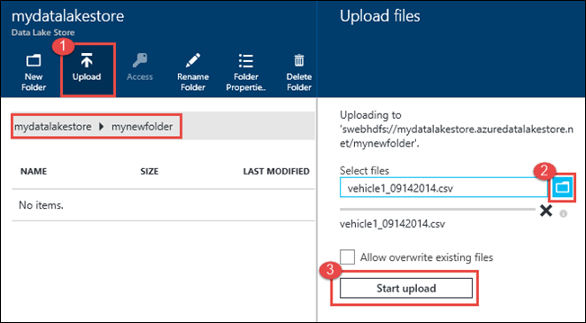
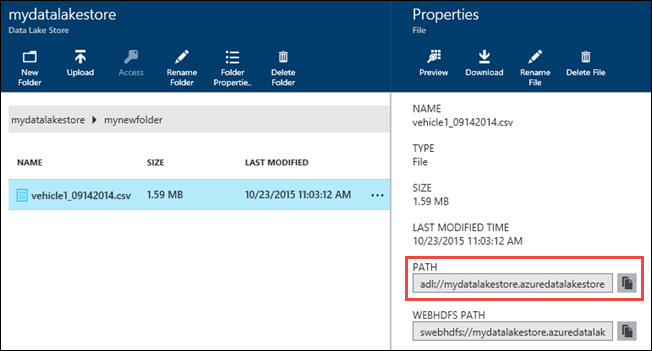

<properties 
   pageTitle="Aan de slag met Data Lake Store | Azure" 
   description="De portal gebruiken om een Data Lake Store-account te maken en basisbewerkingen in Data Lake Store uit te voeren" 
   services="data-lake-store" 
   documentationCenter="" 
   authors="nitinme" 
   manager="jhubbard" 
   editor="cgronlun"/>
 
<tags
   ms.service="data-lake-store"
   ms.devlang="na"
   ms.topic="hero-article"
   ms.tgt_pltfrm="na"
   ms.workload="big-data" 
   ms.date="09/13/2016"
   ms.author="nitinme"/>

# Aan de slag met Azure Data Lake Store met de Azure Portal

> [AZURE.SELECTOR]
- [Portal](data-lake-store-get-started-portal.md)
- [PowerShell](data-lake-store-get-started-powershell.md)
- [.NET SDK](data-lake-store-get-started-net-sdk.md)
- [Java SDK](data-lake-store-get-started-java-sdk.md)
- [REST API](data-lake-store-get-started-rest-api.md)
- [Azure CLI](data-lake-store-get-started-cli.md)
- [Node.js](data-lake-store-manage-use-nodejs.md)

Lees hoe u met de Azure Portal een Azure Data Lake Store-account maakt en basisbewerkingen uitvoert, zoals het maken van mappen, uploaden en downloaden van gegevensbestanden, verwijderen van uw account enzovoort. Zie [Overzicht van Azure Data Lake Store](data-lake-store-overview.md) voor meer informatie over Data Lake Store.

## Vereisten

Voordat u met deze zelfstudie begint, moet u het volgende hebben of hebben gedaan:

- **Een Azure-abonnement**. Zie [Gratis proefversie van Azure ophalen](https://azure.microsoft.com/pricing/free-trial/).

## Leert u snel met video's?

Bekijk dan de volgende video's om aan de slag te gaan met Data Lake Store.

* [Een Data Lake Store-account maken](https://mix.office.com/watch/1k1cycy4l4gen)
* [Gegevens in Data Lake Store beheren met de Gegevensverkenner](https://mix.office.com/watch/icletrxrh6pc)

## Een Azure Data Lake Store-account maken

1. Meld u aan bij de nieuwe [Azure Portal](https://portal.azure.com).

2. Klik op **Nieuw**, klik op **Gegevens en opslag** en klik vervolgens op **Azure Data Lake Store**. Lees de informatie in de blade **Azure Data Lake Store** en klik vervolgens op **Maken** in de linkerbenedenhoek van het blad.

3. In de blade **Nieuwe Data Lake Store** geeft u de waarden op zoals u ze in onderstaande schermafbeelding ziet:

    

    - **Abonnement**. Selecteer het abonnement waarmee u een nieuw Data Lake Store-account wilt maken.
    - **Resourcegroep**. Selecteer een bestaande resourcegroep of klik op **Een resourcegroep maken** om er een te maken. Een resourcegroep is een container met verwante resources voor een toepassing. Zie [Resourcegroepen in Azure](resource-group-overview.md#resource-groups) voor meer informatie.
    - **Locatie**: selecteer een locatie waar u het Data Lake Store-account wilt maken.

4. Selecteer **Vastmaken aan Startboard** als u wilt dat het Data Lake Store-account toegankelijk is vanaf het Startboard.

5. Klik op **Create**. Als u ervoor kiest om het account vast te maken aan het startboard, gaat u terug naar het startboard en ziet u de voortgang van de inrichting van uw Data Lake Store-account. Wanneer het Data Lake Store-account is ingericht, wordt de accountblade weergegeven.

6. Vouw de vervolgkeuzelijst **Essentials** uit om de informatie over uw Data Lake Store-account te bekijken, zoals de resourcegroep waarvan het deel uitmaakt, de locatie enzovoort. Klik op het pictogram **Snel starten** om koppelingen naar andere informatie over Data Lake Store weer te geven.

    

## Mappen maken in Azure Data Lake Store-account

U kunt onder uw Data Lake Store-account mappen maken om gegevens te beheren en op te slaan.

1. Open het Data Lake Store-account dat u zojuist hebt gemaakt. Klik in het linkerdeelvenster op **Bladeren**, klik op **Data Lake Store** en klik vervolgens op de blade Data Lake Store op de accountnaam waaronder u mappen wilt maken. Als u het account hebt vastgemaakt aan het startboard, klikt u op de tegel voor dat account.

2. Klik in de blade van het Data Lake Store-account op **Gegevensverkenner**.

    

3. Klik in de blade van het Data Lake Store-account op **Nieuwe map**, voer een naam in voor de nieuwe map en klik op **OK**.
    
    
    
    De zojuist gemaakte map wordt vermeld in de blade **Gegevensverkenner**. U kunt geneste mappen maken tot elk gewenst niveau.

    

## Gegevens uploaden naar Azure Data Lake Store-account

Als u gegevens uploadt naar een Azure Data Lake Store-account, kunt u dat direct naar het hoofdniveau doen of naar een map die u in het account hebt gemaakt. Volg de stappen in onderstaande schermafbeelding om een bestand vanuit de blade **Gegevensverkenner** te uploaden naar een submap. In deze schermafbeelding is het bestand geüpload naar een submap die wordt weergegeven in de breadcrumbs (in een rood kader gemarkeerd).

Als u nog geen voorbeeldgegevens hebt om te uploaden, kunt u de map **Ambulance Data** uit de [Azure Data Lake Git-opslagplaats](https://github.com/MicrosoftBigData/usql/tree/master/Examples/Samples/Data/AmbulanceData) gebruiken.

## Eigenschappen en acties die beschikbaar zijn voor de opgeslagen gegevens

Klik op het zojuist toegevoegde bestand om de blade **Eigenschappen** te openen. De eigenschappen van het bestand en de acties die u met het bestand kunt uitvoeren, zijn beschikbaar in deze blade. U kunt ook het volledige pad naar het bestand kopiëren in uw Azure Data Lake Store-account. Dit is in onderstaande schermafbeelding met een rood kader gemarkeerd.

* Klik op **Voorbeeld** als u rechtstreeks vanuit de browser een voorbeeld van het bestand wilt bekijken. U kunt ook de indeling van het voorbeeld opgeven. Klik op **Voorbeeld**, klik in de blade **Bestandsvoorbeeld** op **Indeling** en geef in de blade **Indeling bestandsvoorbeeld** opties op als het aantal rijen dat u wilt weergeven, de codering die u wilt gebruiken, het gewenste scheidingsteken, enzovoort.

  

* Klik op **Downloaden** om het bestand naar uw computer te downloaden.

* Klik op **Bestandsnaam wijzigen** als u de naam van het bestand wilt wijzigen.

* Klik op **Bestand verwijderen** als u het bestand wilt verwijderen.

## Uw gegevens beveiligen

U kunt de gegevens die zijn opgeslagen in uw Azure Data Lake Store-account beveiligen met Azure Active Directory en toegangsbeheer (ACL's). Als u wilt weten hoe u dat doet, raadpleeg dan [Gegevens beveiligen in Azure Data Lake Store](data-lake-store-secure-data.md).

## Azure Data Lake Store-account verwijderen

Als u een Azure Data Lake Store-account wilt verwijderen, klikt u in de Data Lake Store-blade op **Verwijderen**. Om de actie te bevestigen, wordt u gevraagd de naam in te voeren van het account dat u wilt verwijderen. Voer de naam in van het account en klik op **Verwijderen**.

## Volgende stappen

- [Gegevens in Data Lake Store beveiligen](data-lake-store-secure-data.md)
- [Azure Data Lake Analytics gebruiken met Data Lake Store](../data-lake-analytics/data-lake-analytics-get-started-portal.md)
- [Azure HDInsight gebruiken met Data Lake Store](data-lake-store-hdinsight-hadoop-use-portal.md)
- [Diagnostische logboeken openen voor Data Lake Store](data-lake-store-diagnostic-logs.md)

<!--HONumber=Sep16_HO3-->

