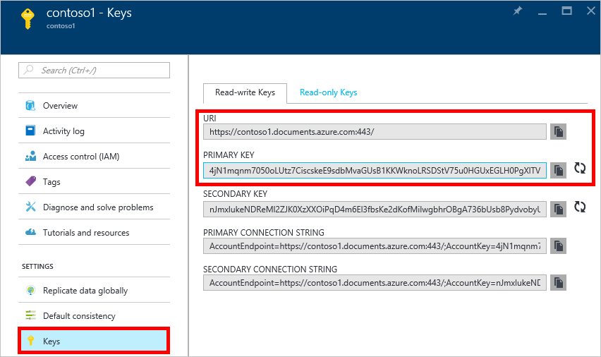

<properties 
	pageTitle="管理 DocumentDB 帳戶 | Azure" 
	description="了解如何管理 DocumentDB 帳戶。" 
	services="documentdb" 
	documentationCenter="" 
	authors="stephbaron" 
	manager="jhubbard" 
	editor="cgronlun"/>

<tags 
	ms.service="documentdb" 
	ms.workload="data-services" 
	ms.tgt_pltfrm="na" 
	ms.devlang="na" 
	ms.topic="article" 
	ms.date="03/23/2015" 
	ms.author="stbaro"/>

#如何管理 DocumentDB 帳戶

了解如何使用金鑰、一致性設定和容量設定，並了解如何刪除帳戶。

## 檢視、複製和重新產生存取金鑰
當您建立 DocumentDB 帳戶時，服務會產生兩個主要存取金鑰，用於存取 DocumentDB 帳戶時的驗證。透過提供這兩個存取金鑰，DocumentDB 讓您可以重新產生金鑰，同時又不需中斷 DocumentDB 帳戶。

在 [Azure 預覽入口網站](https://portal.azure.com/)中，從 [**DocumentDB 帳戶**] 刀鋒視窗存取 [**金鑰**] 部分，即可檢視、複製和重新產生用來存取 DocumentDB 帳戶的存取金鑰。

### 檢視及複製存取金鑰

1.      在 [Azure 預覽入口網站](https://portal.azure.com/)中，存取 DocumentDB 帳戶。

2.      在 [**摘要**] 透鏡中，按一下 [**金鑰**]。

3.      在 [**金鑰**] 分頁中，按一下要複製之金鑰旁的 [**複製**] 按鈕。

  

### 重新產生存取金鑰

您應定期變更 DocumentDB 帳戶的存取金鑰，讓連線更加安全。指派的兩個存取金鑰可讓您在重新產生一個存取金鑰的同時，使用另一個存取金鑰維持 DocumentDB 帳戶連線。

> [AZURE.WARNING] 重新產生存取金鑰會影響任何相依於目前金鑰的應用程式。所有使用存取金鑰來存取 DocumentDB 帳戶的用戶端，都必須更新為使用新的金鑰。

如果您有應用程式或雲端服務正在使用 DocumentDB 帳戶，除非您變換金鑰，否則會在重新產生金鑰後失去連線。下列步驟概述變換金鑰所牽涉的程序。

1.      更新應用程式程式碼中的存取金鑰，以參考 DocumentDB 帳戶的次要存取金鑰。

2.      重新產生 DocumentDB 帳戶的主要存取金鑰。在 [Azure 預覽入口網站](https://portal.azure.com/)中，存取 DocumentDB 帳戶。

3.      在 [摘要] 透鏡中按一下 [**金鑰**]。

4.      在 [**金鑰**] 分頁中按一下 [**重新產生主要金鑰**] 命令，然後按一下 [**確定**] 以確認要產生新的金鑰。

5.      一旦確認新的金鑰可供使用後 (重新產生後約 5 分鐘)，更新應用程式程式碼中的存取金鑰，以參考新的主要存取金鑰。

6.      重新產生次要存取金鑰。

*請注意，新產生的金鑰可能需要經過幾分鐘之後才能用來存取 DocumentDB 帳戶。*

## 管理 DocumentDB 一致性設定：
DocumentDB 支援四個定義完善的使用者可設定資料一致性層級，使開發人員得以在預測範圍內針對一致性、可用性和延遲做出適當取捨。

- **增強式**一致性可保證讀取作業一律傳回上次寫入的值。

- **界限-陳舊**一致性可保證讀取內容並未過時太久。它尤其能保證讀取內容不比上次寫入的版本舊 K 個版本。 

- **工作階段**一致性不僅可保證單純讀取 (先讀取舊資料，接著讀取新資料，然後再讀取舊資料的情況絕對不會發生) 和單純寫入 (依序寫入)，還能保證所讀取的寫入內容不論從哪個用戶端的角度來看都是最新的。

- **最終**一致性可保證讀取作業一律讀取寫入內容的有效子集，且最終會趨於一致。

*請注意，預設是使用工作階段層級一致性佈建 DocumentDB 帳戶。如需有關 DocumentDB 一致性設定的詳細資訊，請參閱[一致性層級](http://go.microsoft.com/fwlink/p/?LinkId=402365)一節。*

### 指定 DocumentDB 帳戶的預設一致性

1.      在 [Azure 預覽入口網站](https://portal.azure.com/)中，存取 DocumentDB 帳戶。

2.      在 [**組態**] 透鏡中，按一下 [**預設一致性**]。

3.      在 [**預設一致性**] 分頁中，選取 DocumentDB 帳戶的預設一致性層級。

4.      按一下 [儲存]。

5.      透過 Azure 預覽入口網站通知中樞可監視作業的進度。

*請注意，整個 DocumentDB 帳戶的預設一致性設定變更可能需要幾分鐘的時間才會生效。*

## 管理 DocumentDB 容量設定：
Microsoft Azure DocumentDB 可讓您在應用程式的生命週期內，隨著應用程式需求的變更彈性地調整。DocumentDB 的調整，可藉由透過 Azure 預覽入口網站增加 DocumentDB 資料庫帳戶的容量來實現。

當您建立資料庫帳戶時，系統會為其佈建資料庫儲存體和預留的輸送量。您可以隨時在 Azure 預覽入口網站中新增或移除容量單位，藉此變更對帳戶佈建的資料庫儲存體和輸送量。

### 新增或移除容量單位

1.      在 [Azure 預覽入口網站](https://portal.azure.com/)中，存取 DocumentDB 帳戶。

2.      在 [**流量**] 透鏡中按一下 [**調整**]。

3.      在 [**調整**] 分頁中，指定 DocumentDB 帳戶的容量單位數目。

4.      按一下 [**儲存**] (請注意，調整作業可能需要幾分鐘的時間才能完成，您可以透過 Azure 預覽入口網站通知中樞監視作業的進度)。

 *請注意，對於每個 DocumentDB 帳戶，DocumentDB 預覽最多支援 5 個容量
單位。*

##  作法：刪除 DocumentDB 帳戶：
若要移除不再使用的 DocumentDB 帳戶，請使用 [**DocumentDB 帳戶**] 分頁的 [**刪除**] 命令。

> [AZURE.WARNING] 在預覽版本中，無法還原已刪除的 DocumentDB 帳戶的內容。刪除 DocumentDB 帳戶將會刪除所有帳戶的資源，包括資料庫、集合、文件和附件。

1.      在 [Azure 預覽入口網站](https://portal.azure.com/)中，存取要刪除的 DocumentDB 帳戶。

2.      在 [**DocumentDB 帳戶**] 分頁中，按一下 [**刪除**] 命令。

3.      在後續的確認分頁中輸入 DocumentDB 帳戶名稱，確認您想要刪除該帳戶。

4.      在確認分頁中按一下 [**刪除**] 按鈕。

## 後續步驟

了解如何[開始使用 DocumentDB 帳戶](http://go.microsoft.com/fwlink/p/?LinkId=402364)。

若要深入了解 DocumentDB，請參閱下列位置上的 Azure DocumentDB 文件：

[azure.com](http://go.microsoft.com/fwlink/?LinkID=402319&clcid=0x409)。

 

<!--HONumber=49--> 